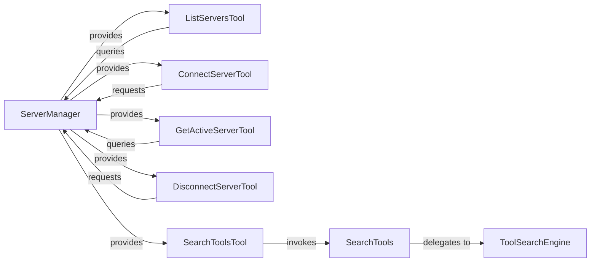

# Tool Server Manager

### Details

The Server Management subsystem is orchestrated by the ServerManager, which serves as the central component for handling MCP server connections and dynamically providing a suite of tools. The ServerManager directly instantiates and offers essential Management Tools such as ListServersTool, ConnectServerTool, GetActiveServerTool, DisconnectServerTool, and SearchToolsTool. These tools enable agents to interact with and manage server states. For dynamic tool discovery, the ToolSearchEngine provides core indexing and semantic search capabilities, which are exposed through the SearchTools adapter. The SearchToolsTool, provided by the ServerManager, allows agents to leverage this search functionality. This architecture emphasizes a clear separation of concerns, with the ServerManager acting as a unified interface for server operations and tool provisioning, while the ToolSearchEngine handles the complexities of tool discovery.

### ServerManager
The central orchestrator for MCP server connections and dynamic tool provision. It manages server sessions, pre-fetches server-specific tools, and directly instantiates core server management tools. This component is crucial for the "Client-Server Architecture" and "Orchestration" patterns, managing the lifecycle and availability of server-centric functionalities.

**Related Classes/Methods**:

- <a href="https://github.com/mcp-use/mcp-use/blob/main/mcp_use/managers/server_manager.py#L11-L124" target="_blank" rel="noopener noreferrer">QName:`mcp_use.managers.server_manager.ServerManager` FileRef: `/home/ubuntu/CodeBoarding/repo/mcp-use/mcp_use/managers/server_manager.py`, Lines:(11:124)</a>

### ToolSearchEngine
Provides the core functionality for indexing and semantically searching tools, including embedding model loading and cosine similarity calculations. It is central to the "Tool-use/Function Calling" pattern, enabling dynamic tool discovery.

**Related Classes/Methods**:

- <a href="https://github.com/mcp-use/mcp-use/blob/main/mcp_use/managers/tools/search_tools.py#L58-L328" target="_blank" rel="noopener noreferrer">QName:`mcp_use.managers.tools.search_tools.ToolSearchEngine` FileRef: `/home/ubuntu/CodeBoarding/repo/mcp-use/mcp_use/managers/tools/search_tools.py`, Lines:(58:328)</a>

### SearchTools
A callable tool that acts as an adapter for the `ToolSearchEngine`, making tool discovery accessible within the agent framework. This component embodies the "Adapter Pattern".

**Related Classes/Methods**:

- <a href="https://github.com/mcp-use/mcp-use/blob/main/mcp_use/managers/tools/search_tools.py#L23-L55" target="_blank" rel="noopener noreferrer">QName:`mcp_use.managers.tools.search_tools.SearchTools` FileRef: `/home/ubuntu/CodeBoarding/repo/mcp-use/mcp_use/managers/tools/search_tools.py`, Lines:(23:55)</a>

### ListServersTool
A concrete management tool provided by `ServerManager` to list all currently connected MCP servers. It encapsulates the logic for interacting with the server registry to retrieve server information.

**Related Classes/Methods**:

- <a href="https://github.com/mcp-use/mcp-use/blob/main/mcp_use/managers/tools/list_servers_tool.py#L17-L54" target="_blank" rel="noopener noreferrer">QName:`mcp_use.managers.tools.list_servers_tool.ListServersTool` FileRef: `/home/ubuntu/CodeBoarding/repo/mcp-use/mcp_use/managers/tools/list_servers_tool.py`, Lines:(17:54)</a>

### ConnectServerTool
A concrete management tool provided by `ServerManager` to initiate a connection to a specified MCP server. This tool provides the functionality to manage server connections directly.

**Related Classes/Methods**:

### GetActiveServerTool
A concrete management tool provided by `ServerManager` for identifying and returning information about the currently active MCP server. This tool provides a focused capability for querying the active server's status.

**Related Classes/Methods**:

- <a href="https://github.com/mcp-use/mcp-use/blob/main/mcp_use/managers/tools/get_active_server.py#L14-L29" target="_blank" rel="noopener noreferrer">QName:`mcp_use.managers.tools.get_active_server.GetActiveServerTool` FileRef: `/home/ubuntu/CodeBoarding/repo/mcp-use/mcp_use/managers/tools/get_active_server.py`, Lines:(14:29)</a>

### DisconnectServerTool
A concrete management tool provided by `ServerManager` for initiating a disconnection from a specified MCP server. This tool provides the functionality to manage server connections directly.

**Related Classes/Methods**:

- <a href="https://github.com/mcp-use/mcp-use/blob/main/mcp_use/managers/tools/disconnect_server.py#L17-L44" target="_blank" rel="noopener noreferrer">QName:`mcp_use.managers.tools.disconnect_server.DisconnectServerTool` FileRef: `/home/ubuntu/CodeBoarding/repo/mcp-use/mcp_use/managers/tools/disconnect_server.py`, Lines:(17:44)</a>

### SearchToolsTool
A concrete management tool provided by `ServerManager` that exposes the `SearchTools` functionality, allowing agents to dynamically search for available tools.

**Related Classes/Methods**:
