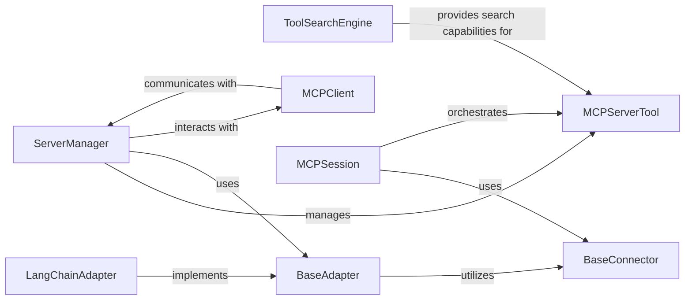

<Info>
This documentation was generated by [CodeBoarding](https://github.com/CodeBoarding/GeneratedOnBoardings) to provide comprehensive architectural insights into the mcp-agent framework.
</Info>

## Details

The Tooling Layer is a critical subsystem within the `mcp_use` project, designed to provide a robust and extensible mechanism for agents to discover, adapt, and execute various tools. It embodies the project's architectural bias towards modularity and extensibility, leveraging patterns like the Adapter Pattern and Service Locator/Registry.

### ServerManager
The central orchestrator for tool servers. It manages the lifecycle of connections to external tool providers, maintaining a registry of active servers and enabling agents to interact with the broader tool ecosystem. It acts as a service locator for available tools and servers.

**Related Classes/Methods**:

- <a href="https://github.com/CodeBoarding/mcp-use/blob/main/mcp_use/managers/server_manager.py#L16-L89" target="_blank" rel="noopener noreferrer">`mcp_use.managers.server_manager.ServerManager` (16:89)</a>

### ToolSearchEngine
Responsible for efficient discovery of available tools. It indexes tools and provides semantic search capabilities, allowing agents to find relevant tools based on natural language queries, crucial for dynamic tool selection in an LLM agent framework.

**Related Classes/Methods**:

- <a href="https://github.com/CodeBoarding/mcp-use/blob/main/mcp_use/managers/tools/search_tools.py#L57-L327" target="_blank" rel="noopener noreferrer">`mcp_use.managers.tools.search_tools.ToolSearchEngine` (57:327)</a>

### BaseAdapter
An abstract base class that defines the common interface for adapting tools from various external frameworks into the MCP framework's internal representation. It ensures consistency in how tools are converted and loaded, supporting the "adaptation" aspect.

**Related Classes/Methods**:

- <a href="https://github.com/CodeBoarding/mcp-use/blob/main/mcp_use/adapters/base.py#L1-L100" target="_blank" rel="noopener noreferrer">`mcp_use.adapters.base.BaseAdapter` (1:100)</a>

### LangChainAdapter
A concrete implementation of BaseAdapter specifically designed to integrate tools from the LangChain framework. It handles the conversion of LangChain tool definitions into a format usable by mcp_use agents.

**Related Classes/Methods**:

- <a href="https://github.com/CodeBoarding/mcp-use/blob/main/mcp_use/adapters/langchain_adapter.py#L1-L100" target="_blank" rel="noopener noreferrer">`mcp_use.adapters.langchain_adapter.LangChainAdapter` (1:100)</a>

### BaseConnector
The abstract base class for all connectors, defining the interface for establishing and managing connections to external tool providers (e.g., HTTP, WebSocket, Sandbox, Stdio). It's essential for the underlying communication with tool sources.

**Related Classes/Methods**:

- <a href="https://github.com/CodeBoarding/mcp-use/blob/main/mcp_use/connectors/base.py#L1-L100" target="_blank" rel="noopener noreferrer">`mcp_use.connectors.base.BaseConnector` (1:100)</a>

### MCPServerTool
The abstract base class for all tools that agents use to interact with the ServerManager and the broader tooling ecosystem. Subclasses (e.g., ConnectServerTool, ListServersTool, SearchToolsTool, UseToolFromServerTool) provide specific functionalities like connecting to servers, listing available tools, or executing tools.

**Related Classes/Methods**:

- <a href="https://github.com/CodeBoarding/mcp-use/blob/main/mcp_use/managers/tools/base_tool.py#L5-L18" target="_blank" rel="noopener noreferrer">`mcp_use.managers.tools.base_tool.MCPServerTool` (5:18)</a>

### MCPSession
Manages the overall session context for an agent, including the lifecycle of tool connections and interactions. It orchestrates the use of connectors and tools within a specific agent's operational scope.

**Related Classes/Methods**:

- <a href="https://github.com/CodeBoarding/mcp-use/blob/main/mcp_use/session.py#L1-L100" target="_blank" rel="noopener noreferrer">`mcp_use.session.MCPSession` (1:100)</a>

### MCPClient
Represents the client-side interface for interacting with the ServerManager. It facilitates communication between the agent's environment and the tool servers, enabling the agent to send requests and receive responses from tools.

**Related Classes/Methods**:

- <a href="https://github.com/CodeBoarding/mcp-use/blob/main/mcp_use/client.py#L1-L100" target="_blank" rel="noopener noreferrer">`mcp_use.client.MCPClient` (1:100)</a>

### [FAQ](https://github.com/CodeBoarding/GeneratedOnBoardings/tree/main?tab=readme-ov-file#faq)
