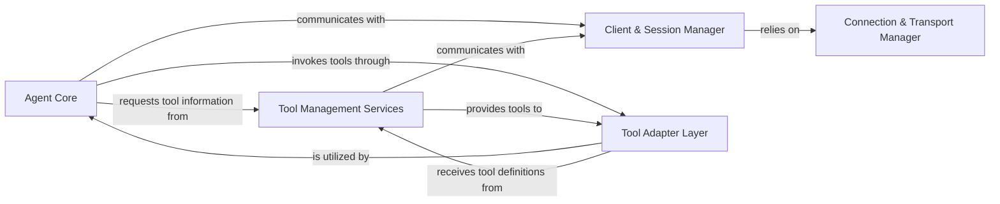

<Info>
This documentation was generated by [CodeBoarding](https://github.com/CodeBoarding/GeneratedOnBoardings) to provide comprehensive architectural insights into the mcp-agent framework.
</Info>

## Details

One paragraph explaining the functionality which is represented by this graph. What the main flow is and what is its purpose.

### Agent Core [[Expand]](./Agent_Core)
The central orchestration component responsible for managing the lifecycle and execution of AI agents. It drives the decision-making process, interacts with tools, and coordinates overall agent behavior, embodying the core intelligence and control flow.

**Related Classes/Methods**:

- <a href="https://github.com/CodeBoarding/mcp-use/blob/main/mcp_use/agents/mcpagent.py" target="_blank" rel="noopener noreferrer">`mcp_use.agents.mcpagent`</a>

### Client & Session Manager [[Expand]](./Client_Session_Manager)
Manages the client-side interface for interacting with the MCP server. It handles the establishment, maintenance, and termination of communication sessions, ensuring a persistent and reliable connection for agent operations.

**Related Classes/Methods**:

- <a href="https://github.com/CodeBoarding/mcp-use/blob/main/mcp_use/client.py" target="_blank" rel="noopener noreferrer">`mcp_use.client`</a>
- <a href="https://github.com/CodeBoarding/mcp-use/blob/main/mcp_use/session.py" target="_blank" rel="noopener noreferrer">`mcp_use.session`</a>

### Tool Adapter Layer [[Expand]](./Tool_Adapter_Layer)
Provides a standardized abstraction layer for integrating diverse external tools and primitives. It adapts various tool frameworks (e.g., LangChain) into a consistent interface that the Agent Core can utilize, promoting extensibility and tool interoperability.

**Related Classes/Methods**:

- <a href="https://github.com/CodeBoarding/mcp-use/blob/main/mcp_use/adapters.py" target="_blank" rel="noopener noreferrer">`mcp_use.adapters`</a>
- <a href="https://github.com/CodeBoarding/mcp-use/blob/main/mcp_use/adapters/base.py" target="_blank" rel="noopener noreferrer">`mcp_use.adapters.base`</a>
- <a href="https://github.com/CodeBoarding/mcp-use/blob/main/mcp_use/adapters/langchain_adapter.py" target="_blank" rel="noopener noreferrer">`mcp_use.adapters.langchain_adapter`</a>

### Tool Management Services [[Expand]](./Tool_Management_Services)
Facilitates the discovery, listing, and dynamic usage of available tools, primarily those exposed by the MCP server. This component interacts with the server to query for tools and manage their invocation by the agent, acting as a registry and dispatcher for server-side tools.

**Related Classes/Methods**:

- <a href="https://github.com/CodeBoarding/mcp-use/blob/main/mcp_use/managers/tools.py" target="_blank" rel="noopener noreferrer">`mcp_use.managers.tools`</a>
- `mcp_use.managers.server_manager`

### Connection & Transport Manager [[Expand]](./Connection_Transport_Manager)
Handles the underlying network communication and transport protocols. It provides the mechanisms for establishing and managing low-level connections (e.g., WebSockets, Sandbox environments) to the MCP server or other external services, abstracting network complexities.

**Related Classes/Methods**:

- <a href="https://github.com/CodeBoarding/mcp-use/blob/main/mcp_use/connectors.py" target="_blank" rel="noopener noreferrer">`mcp_use.connectors`</a>
- <a href="https://github.com/CodeBoarding/mcp-use/blob/main/mcp_use/connectors/base.py" target="_blank" rel="noopener noreferrer">`mcp_use.connectors.base`</a>
- <a href="https://github.com/CodeBoarding/mcp-use/blob/main/mcp_use/connectors/http.py" target="_blank" rel="noopener noreferrer">`mcp_use.connectors.http`</a>
- <a href="https://github.com/CodeBoarding/mcp-use/blob/main/mcp_use/connectors/sandbox.py" target="_blank" rel="noopener noreferrer">`mcp_use.connectors.sandbox`</a>
- <a href="https://github.com/CodeBoarding/mcp-use/blob/main/mcp_use/connectors/stdio.py" target="_blank" rel="noopener noreferrer">`mcp_use.connectors.stdio`</a>
- <a href="https://github.com/CodeBoarding/mcp-use/blob/main/mcp_use/connectors/websocket.py" target="_blank" rel="noopener noreferrer">`mcp_use.connectors.websocket`</a>
