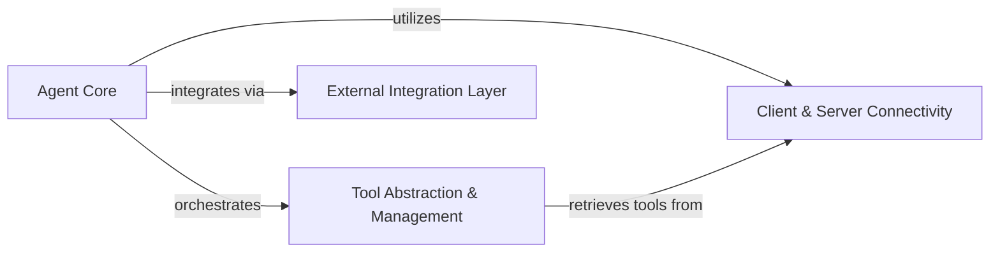

<Info>
This documentation was generated by [CodeBoarding](https://github.com/CodeBoarding/GeneratedOnBoardings) to provide comprehensive architectural insights into the mcp-agent framework.
</Info>

### Details

mcp-use is a Python library designed for building and orchestrating AI agents, primarily focusing on interaction with MCP servers. Its architecture is centered around the Agent Core, which serves as the central decision-making and execution unit. This core interacts with the Client & Server Connectivity component to manage connections and sessions with various MCP servers. The Tool Abstraction & Management component provides the agent with a unified way to discover and utilize tools exposed by these connected servers, relying on the connectivity layer to retrieve them. Furthermore, an External Integration Layer allows `mcp-use` to seamlessly adapt and integrate with other AI frameworks like LangChain, ensuring broad interoperability for agent development.

### Agent Core [[Expand]](./Agent_Core)
The central intelligence and orchestration unit, responsible for the agent's decision-making, lifecycle management, and overall execution flow. It leverages other components to interact with the external environment.

**Related Classes/Methods**:

- <a href="https://github.com/mcp-use/mcp-use/blob/main/mcp_use/agents/mcpagent.py#L1-L1" target="_blank" rel="noopener noreferrer">`mcp_use.agents.mcpagent.MCPAgent` (1:1)</a>

### Client & Server Connectivity [[Expand]](./Client_Server_Connectivity)
Manages all aspects of establishing, maintaining, and terminating connections with various MCP servers (e.g., WebSocket, Sandbox). It provides the foundational communication layer and handles session management.

**Related Classes/Methods**:

- <a href="https://github.com/mcp-use/mcp-use/blob/main/mcp_use/client.py#L1-L1" target="_blank" rel="noopener noreferrer">`mcp_use.client.MCPClient` (1:1)</a>
- <a href="https://github.com/mcp-use/mcp-use/blob/main/mcp_use/session.py#L1-L1" target="_blank" rel="noopener noreferrer">`mcp_use.session.MCPSession` (1:1)</a>
- <a href="https://github.com/mcp-use/mcp-use/blob/main/mcp_use/connectors/base.py#L1-L1" target="_blank" rel="noopener noreferrer">`mcp_use.connectors.base.BaseConnector` (1:1)</a>
- <a href="https://github.com/mcp-use/mcp-use/blob/main/mcp_use/connectors/sandbox.py#L1-L1" target="_blank" rel="noopener noreferrer">`mcp_use.connectors.sandbox.SandboxConnector` (1:1)</a>
- <a href="https://github.com/mcp-use/mcp-use/blob/main/mcp_use/connectors/websocket.py#L1-L1" target="_blank" rel="noopener noreferrer">`mcp_use.connectors.websocket.WebSocketConnector` (1:1)</a>
- <a href="https://github.com/mcp-use/mcp-use/blob/main/mcp_use/task_managers/base.py#L1-L1" target="_blank" rel="noopener noreferrer">`mcp_use.task_managers.base.ConnectionManager` (1:1)</a>

### Tool Abstraction & Management [[Expand]](./Tool_Abstraction_Management)
Provides a unified interface for agents to discover, list, search, and execute tools exposed by connected MCP servers. It abstracts the complexities of tool interaction and lifecycle.

**Related Classes/Methods**:

- <a href="https://github.com/mcp-use/mcp-use/blob/main/mcp_use/managers/tools/disconnect_server.py#L15-L42" target="_blank" rel="noopener noreferrer">`mcp_use.managers.tools.disconnect_server.DisconnectServerTool` (15:42)</a>
- <a href="https://github.com/mcp-use/mcp-use/blob/main/mcp_use/managers/tools/get_active_server.py#L13-L28" target="_blank" rel="noopener noreferrer">`mcp_use.managers.tools.get_active_server.GetActiveServerTool` (13:28)</a>
- <a href="https://github.com/mcp-use/mcp-use/blob/main/mcp_use/managers/tools/list_servers_tool.py#L15-L51" target="_blank" rel="noopener noreferrer">`mcp_use.managers.tools.list_servers_tool.ListServersTool` (15:51)</a>
- <a href="https://github.com/mcp-use/mcp-use/blob/main/mcp_use/managers/tools/search_tools.py#L22-L54" target="_blank" rel="noopener noreferrer">`mcp_use.managers.tools.search_tools.SearchToolsTool` (22:54)</a>
- <a href="https://github.com/mcp-use/mcp-use/blob/main/mcp_use/managers/tools/tool_search_engine.py#L1-L1" target="_blank" rel="noopener noreferrer">`mcp_use.managers.tools.ToolSearchEngine` (1:1)</a>
- <a href="https://github.com/mcp-use/mcp-use/blob/main/mcp_use/managers/tools/use_tool.py#L21-L153" target="_blank" rel="noopener noreferrer">`mcp_use.managers.tools.use_tool.UseToolFromServerTool` (21:153)</a>

### External Integration Layer
Acts as an adapter, enabling `mcp-use` to seamlessly integrate with and leverage functionalities from external AI frameworks (e.g., LangChain) or other systems by translating interfaces and data structures.

**Related Classes/Methods**:

- <a href="https://github.com/mcp-use/mcp-use/blob/main/mcp_use/adapters/base.py#L1-L1" target="_blank" rel="noopener noreferrer">`mcp_use.adapters.base.BaseAdapter` (1:1)</a>
- <a href="https://github.com/mcp-use/mcp-use/blob/main/mcp_use/adapters/langchain_adapter.py#L1-L1" target="_blank" rel="noopener noreferrer">`mcp_use.adapters.langchain_adapter.LangChainAdapter` (1:1)</a>
