<Info>

```mermaid
graph LR
    Agent_Orchestration_Core["Agent Orchestration Core"]
    MCP_Client_Session_Manager["MCP Client & Session Manager"]
    MCP_Connectors["MCP Connectors"]
    Tool_Server_Manager["Tool & Server Manager"]
    Tool_Adapters["Tool Adapters"]
    LLM_Integration_Layer["LLM Integration Layer"]
    Configuration_Manager["Configuration Manager"]
    Agent_Orchestration_Core -- "requests_session_info" --> MCP_Client_Session_Manager
    Agent_Orchestration_Core -- "queries_available_tools" --> Tool_Server_Manager
    Agent_Orchestration_Core -- "receives_adapted_tools" --> Tool_Adapters
    Agent_Orchestration_Core -- "sends_prompts_for_execution" --> LLM_Integration_Layer
    Agent_Orchestration_Core -- "receives_execution_results" --> LLM_Integration_Layer
    MCP_Client_Session_Manager -- "establishes_connections" --> MCP_Connectors
    MCP_Client_Session_Manager -- "executes_tool_calls" --> MCP_Connectors
    MCP_Client_Session_Manager -- "receives_connection_configs" --> Configuration_Manager
    MCP_Connectors -- "provides_raw_tool_data" --> Tool_Server_Manager
    Tool_Server_Manager -- "requests_tool_definitions" --> MCP_Connectors
    Tool_Server_Manager -- "provides_raw_tool_definitions" --> Tool_Adapters
    Tool_Adapters -- "supplies_executable_tools" --> LLM_Integration_Layer
    LLM_Integration_Layer -- "invokes_adapted_tools" --> Tool_Adapters
    LLM_Integration_Layer -- "requests_tool_execution" --> MCP_Client_Session_Manager
    click Agent_Orchestration_Core href "/codeboarding/Agent_Orchestration_Core.md" "Details"
    click MCP_Client_Session_Manager href "/codeboarding/MCP_Client_Session_Manager.md" "Details"
    click MCP_Connectors href "/codeboarding/MCP_Connectors.md" "Details"
    click Tool_Server_Manager href "/codeboarding/Tool_Server_Manager.md" "Details"
    click Tool_Adapters href "/codeboarding/Tool_Adapters.md" "Details"
    click LLM_Integration_Layer href "/codeboarding/LLM_Integration_Layer.md" "Details"
```

This documentation was generated by [CodeBoarding](https://github.com/CodeBoarding/GeneratedOnBoardings) to provide comprehensive architectural insights into the mcp-agent framework.
</Info>

### Details

The `mcp-use` project implements an intelligent agent architecture designed for interacting with Multi-Cloud Platform (MCP) environments. At its core, the `Agent Orchestration Core` drives the decision-making process, leveraging an `LLM Integration Layer` built on LangChain for prompt execution and response generation. This core agent dynamically discovers and utilizes tools managed by the `Tool & Server Manager`, which in turn retrieves raw tool data from `MCP Connectors`. `Tool Adapters` play a crucial role in standardizing these raw tool definitions into a format consumable by the agent. All interactions with MCP environments, including tool execution and session management, are mediated by the `MCP Client & Session Manager`, which relies on `MCP Connectors` for low-level communication and receives its operational parameters from the `Configuration Manager`. This modular design ensures robust, scalable, and maintainable interactions with diverse MCP services.

### Agent Orchestration Core
The central intelligence, embodied by the MCP Agent (`mcpagent.py`), orchestrating LLM reasoning, conversation flow, tool selection, and response generation. It leverages the LLM Integration Layer for agent execution.

**Related Classes/Methods**:

- <a href="https://github.com/mcp-use/mcp-use/blob/main/mcp_use/agents/mcpagent.py#L1-L1" target="_blank" rel="noopener noreferrer">QName:`mcp_use/agents/mcpagent.py` FileRef: `/home/ubuntu/CodeBoarding/repo/mcp-use/mcp_use/agents/mcpagent.py`</a>
- <a href="https://github.com/mcp-use/mcp-use/blob/main/mcp_use/agents/prompts/system_prompt_builder.py#L1-L1" target="_blank" rel="noopener noreferrer">QName:`mcp_use/agents/prompts/system_prompt_builder.py` FileRef: `/home/ubuntu/CodeBoarding/repo/mcp-use/mcp_use/agents/prompts/system_prompt_builder.py`</a>

### MCP Client & Session Manager
Manages the lifecycle of connections and communication sessions with various MCP environments, acting as an intermediary for tool execution requests.

**Related Classes/Methods**:

- <a href="https://github.com/mcp-use/mcp-use/blob/main/mcp_use/session.py#L1-L1" target="_blank" rel="noopener noreferrer">QName:`mcp_use/session.py` FileRef: `/home/ubuntu/CodeBoarding/repo/mcp-use/mcp_use/session.py`</a>

### MCP Connectors
Provides concrete implementations for various communication protocols (e.g., WebSocket, Sandbox) to interact with MCP, handling the low-level communication.

**Related Classes/Methods**:

- <a href="https://github.com/mcp-use/mcp-use/blob/main/mcp_use/connectors/base.py#L1-L1" target="_blank" rel="noopener noreferrer">QName:`mcp_use/connectors/base.py` FileRef: `/home/ubuntu/CodeBoarding/repo/mcp-use/mcp_use/connectors/base.py`</a>
- <a href="https://github.com/mcp-use/mcp-use/blob/main/mcp_use/connectors/websocket.py#L1-L1" target="_blank" rel="noopener noreferrer">QName:`mcp_use/connectors/websocket.py` FileRef: `/home/ubuntu/CodeBoarding/repo/mcp-use/mcp_use/connectors/websocket.py`</a>
- <a href="https://github.com/mcp-use/mcp-use/blob/main/mcp_use/connectors/sandbox.py#L1-L1" target="_blank" rel="noopener noreferrer">QName:`mcp_use/connectors/sandbox.py` FileRef: `/home/ubuntu/CodeBoarding/repo/mcp-use/mcp_use/connectors/sandbox.py`</a>

### Tool & Server Manager
Manages the discovery, registration, and search of available tools across connected MCP servers.

**Related Classes/Methods**:

- <a href="https://github.com/mcp-use/mcp-use/blob/main/mcp_use/managers/server_manager.py#L1-L1" target="_blank" rel="noopener noreferrer">QName:`mcp_use/managers/server_manager.py` FileRef: `/home/ubuntu/CodeBoarding/repo/mcp-use/mcp_use/managers/server_manager.py`</a>
- <a href="https://github.com/mcp-use/mcp-use/blob/main/mcp_use/managers/tools/search_tools.py#L1-L1" target="_blank" rel="noopener noreferrer">QName:`mcp_use/managers/tools/search_tools.py` FileRef: `/home/ubuntu/CodeBoarding/repo/mcp-use/mcp_use/managers/tools/search_tools.py`</a>

### Tool Adapters
Receives raw tool definitions (e.g., from `Tool & Server Manager`) and standardizes them into a format consumable by the `Agent Orchestration Core` and `LLM Integration Layer`.

**Related Classes/Methods**:

- <a href="https://github.com/mcp-use/mcp-use/blob/main/mcp_use/adapters/langchain_adapter.py#L1-L1" target="_blank" rel="noopener noreferrer">QName:`mcp_use/adapters/langchain_adapter.py` FileRef: `/home/ubuntu/CodeBoarding/repo/mcp-use/mcp_use/adapters/langchain_adapter.py`</a>

### LLM Integration Layer
Encapsulates the underlying LangChain components, providing the framework and execution capabilities for the `Agent Orchestration Core` to build and run the LLM agent.

**Related Classes/Methods**:

- <a href="https://github.com/mcp-use/mcp-use/blob/main/mcp_use/agents/mcpagent.py#L1-L1" target="_blank" rel="noopener noreferrer">QName:`mcp_use/agents/mcpagent.py` FileRef: `/home/ubuntu/CodeBoarding/repo/mcp-use/mcp_use/agents/mcpagent.py`</a>

### Configuration Manager
Handles loading, parsing, and interpreting project-specific configurations, providing them to other components.

**Related Classes/Methods**:

- <a href="https://github.com/mcp-use/mcp-use/blob/main/mcp_use/config.py#L1-L1" target="_blank" rel="noopener noreferrer">QName:`mcp_use/config.py` FileRef: `/home/ubuntu/CodeBoarding/repo/mcp-use/mcp_use/config.py`</a>
