<Info>

```mermaid
graph LR
    Agent_Core_Orchestration["Agent Core & Orchestration"]
    Client_Session_Management["Client & Session Management"]
    Communication_Connectors["Communication Connectors"]
    Connection_Management["Connection Management"]
    LLM_Integration_Adapters["LLM Integration & Adapters"]
    Resource_Tool_Management["Resource & Tool Management"]
    Agent_Core_Orchestration -- "interacts with" --> LLM_Integration_Adapters
    Agent_Core_Orchestration -- "queries" --> Resource_Tool_Management
    Client_Session_Management -- "initiates and manages" --> Agent_Core_Orchestration
    Client_Session_Management -- "utilizes" --> Communication_Connectors
    Client_Session_Management -- "interacts with" --> Resource_Tool_Management
    Communication_Connectors -- "provides communication mechanisms for" --> Client_Session_Management
    Communication_Connectors -- "managed and orchestrated by" --> Connection_Management
    Connection_Management -- "manages and orchestrates" --> Communication_Connectors
    LLM_Integration_Adapters -- "used by" --> Agent_Core_Orchestration
    Resource_Tool_Management -- "provides information to" --> Agent_Core_Orchestration
    Resource_Tool_Management -- "interacts with" --> Client_Session_Management
    click Agent_Core_Orchestration href "/codeboarding/Agent_Core_Orchestration.md" "Details"
    click Client_Session_Management href "/codeboarding/Client_Session_Management.md" "Details"
    click Communication_Connectors href "/codeboarding/Communication_Connectors.md" "Details"
    click Connection_Management href "/codeboarding/Connection_Management.md" "Details"
    click LLM_Integration_Adapters href "/codeboarding/LLM_Integration_Adapters.md" "Details"
    click Resource_Tool_Management href "/codeboarding/Resource_Tool_Management.md" "Details"
```

This documentation was generated by [CodeBoarding](https://github.com/CodeBoarding/GeneratedOnBoardings) to provide comprehensive architectural insights into the mcp-agent framework.
</Info>

## Details

The `mcp-use` project functions as an LLM Agent Framework, enabling the creation, orchestration, and interaction of AI agents with various tools and services. At its core, it allows users to define agents that leverage large language models, integrate external tools (like LangChain), and communicate with diverse backend services (MCP servers) through a flexible, asynchronous communication layer. The framework manages the lifecycle of agent sessions, handles dynamic prompt generation, and provides mechanisms for discovering and utilizing available resources, all while abstracting away the complexities of underlying communication protocols and LLM integrations.

### Agent Core & Orchestration [[Expand]](./Agent_Core_Orchestration)
This is the central intelligence of the framework, responsible for orchestrating the LLM agent's behavior. It manages conversation flow, constructs dynamic prompts based on available tools and context, and decides on the next actions to be taken by the agent.

**Related Classes/Methods**:

- <a href="https://github.com/CodeBoarding/mcp-use/blob/main/mcp_use/agents/mcpagent.py#L1-L1" target="_blank" rel="noopener noreferrer">`mcp_use.agents.mcpagent.MCPAgent` (1:1)</a>
- <a href="https://github.com/CodeBoarding/mcp-use/blob/main/mcp_use/agents/prompts/system_prompt_builder.py#L1-L1" target="_blank" rel="noopener noreferrer">`mcp_use.agents.prompts.system_prompt_builder.SystemPromptBuilder` (1:1)</a>

### Client & Session Management [[Expand]](./Client_Session_Management)
Provides the primary interface for users to interact with the MCP framework. It manages the creation, lifecycle, and termination of individual MCP sessions, acting as the entry point for agent interactions and providing context to the core agent logic.

**Related Classes/Methods**:

- <a href="https://github.com/CodeBoarding/mcp-use/blob/main/mcp_use/client.py#L1-L1" target="_blank" rel="noopener noreferrer">`mcp_use.client.MCPClient` (1:1)</a>
- <a href="https://github.com/CodeBoarding/mcp-use/blob/main/mcp_use/session.py#L1-L1" target="_blank" rel="noopener noreferrer">`mcp_use.session.MCPSession` (1:1)</a>

### Communication Connectors [[Expand]](./Communication_Connectors)
Defines and implements abstract interfaces for various communication protocols (e.g., WebSocket, HTTP, Sandbox, Stdio) used to interact with MCP servers and execute tools securely. It provides the concrete means of data exchange between the client and the server.

**Related Classes/Methods**:

- <a href="https://github.com/CodeBoarding/mcp-use/blob/main/mcp_use/connectors/base.py#L1-L1" target="_blank" rel="noopener noreferrer">`mcp_use.connectors.base.BaseConnector` (1:1)</a>
- <a href="https://github.com/CodeBoarding/mcp-use/blob/main/mcp_use/connectors/websocket.py#L1-L1" target="_blank" rel="noopener noreferrer">`mcp_use.connectors.websocket.WebSocketConnector` (1:1)</a>
- <a href="https://github.com/CodeBoarding/mcp-use/blob/main/mcp_use/connectors/sandbox.py#L1-L1" target="_blank" rel="noopener noreferrer">`mcp_use.connectors.sandbox.SandboxConnector` (1:1)</a>
- <a href="https://github.com/CodeBoarding/mcp-use/blob/main/mcp_use/connectors/http.py#L1-L1" target="_blank" rel="noopener noreferrer">`mcp_use.connectors.http.HttpConnector` (1:1)</a>
- <a href="https://github.com/CodeBoarding/mcp-use/blob/main/mcp_use/connectors/stdio.py#L1-L1" target="_blank" rel="noopener noreferrer">`mcp_use.connectors.stdio.StdioConnector` (1:1)</a>

### Connection Management [[Expand]](./Connection_Management)
Manages the asynchronous tasks and lifecycle of establishing, maintaining, and closing connections with MCP servers across different communication protocols. It ensures robust and persistent communication channels for the framework.

**Related Classes/Methods**:

- <a href="https://github.com/CodeBoarding/mcp-use/blob/main/mcp_use/task_managers/base.py#L1-L1" target="_blank" rel="noopener noreferrer">`mcp_use.task_managers.base.ConnectionManager` (1:1)</a>
- <a href="https://github.com/CodeBoarding/mcp-use/blob/main/mcp_use/task_managers/websocket.py#L1-L1" target="_blank" rel="noopener noreferrer">`mcp_use.task_managers.websocket.WebSocketConnectionManager` (1:1)</a>
- <a href="https://github.com/CodeBoarding/mcp-use/blob/main/mcp_use/task_managers/sse.py#L1-L1" target="_blank" rel="noopener noreferrer">`mcp_use.task_managers.sse.SseConnectionManager` (1:1)</a>
- <a href="https://github.com/CodeBoarding/mcp-use/blob/main/mcp_use/task_managers/stdio.py#L1-L1" target="_blank" rel="noopener noreferrer">`mcp_use.task_managers.stdio.StdioConnectionManager` (1:1)</a>
- <a href="https://github.com/CodeBoarding/mcp-use/blob/main/mcp_use/task_managers/streamable_http.py#L1-L1" target="_blank" rel="noopener noreferrer">`mcp_use.task_managers.streamable_http.StreamableHttpConnectionManager` (1:1)</a>

### LLM Integration & Adapters [[Expand]](./LLM_Integration_Adapters)
Provides an abstract and concrete mechanism for integrating various external LLM frameworks (e.g., LangChain) and their components (tools, resources, prompts) into the MCP's internal representation. This ensures compatibility and extensibility with different LLM providers.

**Related Classes/Methods**:

- <a href="https://github.com/CodeBoarding/mcp-use/blob/main/mcp_use/adapters/base.py#L1-L1" target="_blank" rel="noopener noreferrer">`mcp_use.adapters.base.BaseAdapter` (1:1)</a>
- <a href="https://github.com/CodeBoarding/mcp-use/blob/main/mcp_use/adapters/langchain_adapter.py#L1-L1" target="_blank" rel="noopener noreferrer">`mcp_use.adapters.langchain_adapter.LangChainAdapter` (1:1)</a>

### Resource & Tool Management [[Expand]](./Resource_Tool_Management)
Manages the registration, discovery, and lifecycle of MCP servers and the tools they expose. This component enables the agent to find, list, and utilize available functionalities provided by various servers.

**Related Classes/Methods**:

- <a href="https://github.com/CodeBoarding/mcp-use/blob/main/mcp_use/managers/server_manager.py#L16-L89" target="_blank" rel="noopener noreferrer">`mcp_use.managers.server_manager.ServerManager` (16:89)</a>
- <a href="https://github.com/CodeBoarding/mcp-use/blob/main/mcp_use/managers/tools/search_tools.py#L57-L327" target="_blank" rel="noopener noreferrer">`mcp_use.managers.tools.search_tools.ToolSearchEngine` (57:327)</a>
- <a href="https://github.com/CodeBoarding/mcp-use/blob/main/mcp_use/managers/tools/base_tool.py#L5-L18" target="_blank" rel="noopener noreferrer">`mcp_use.managers.tools.base_tool.MCPServerTool` (5:18)</a>

### [FAQ](https://github.com/CodeBoarding/GeneratedOnBoardings/tree/main?tab=readme-ov-file#faq)
