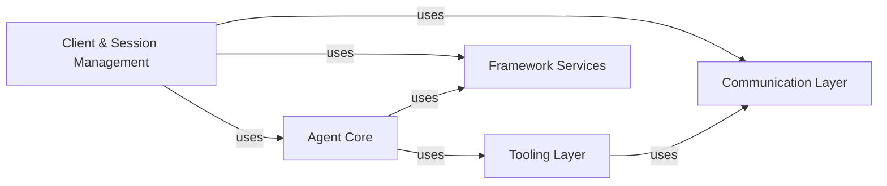

<Info>
This documentation was generated by [CodeBoarding](https://github.com/CodeBoarding/GeneratedOnBoardings) to provide comprehensive architectural insights into the mcp-agent framework.
</Info>

## Details

The `mcp-use` project provides a modular and extensible framework for building and interacting with LLM agents. Users initiate interactions through the Client & Session Management component, which establishes and maintains connections to MCP servers via the Communication Layer. Once a session is active, the Agent Core takes over, orchestrating LLM interactions, managing conversation flow, and deciding when to leverage external capabilities. The Tooling Layer supports the Agent Core by providing mechanisms to discover, adapt, and execute various tools, often communicating with tool servers through the Communication Layer. Throughout this process, the Framework Services component provides essential cross-cutting functionalities such as configuration management, telemetry collection, and logging, ensuring the framework operates efficiently and provides valuable insights.

### Client & Session Management [[Expand]](./Client_Session_Management)
Serves as the primary entry point for users, managing the creation, lifecycle, and closure of multiple sessions with MCP servers. It orchestrates the establishment and termination of connections, providing the core interface for user interaction with the framework.

**Related Classes/Methods**:

- <a href="https://github.com/CodeBoarding/mcp-use/blob/main/mcp_use/client.py" target="_blank" rel="noopener noreferrer">`mcp_use.client.MCPClient`</a>
- <a href="https://github.com/CodeBoarding/mcp-use/blob/main/mcp_use/session.py" target="_blank" rel="noopener noreferrer">`mcp_use.session.MCPSession`</a>

### Agent Core
The central intelligence unit of the framework, responsible for orchestrating LLM interactions. It manages conversational history, generates system messages based on available tools, and makes decisions on when and how to utilize tools to fulfill user requests.

**Related Classes/Methods**:

- <a href="https://github.com/CodeBoarding/mcp-use/blob/main/mcp_use/agents/mcpagent.py" target="_blank" rel="noopener noreferrer">`mcp_use.agents.mcpagent.MCPAgent`</a>
- <a href="https://github.com/CodeBoarding/mcp-use/blob/main/mcp_use/agents/prompts.py" target="_blank" rel="noopener noreferrer">`mcp_use.agents.prompts`</a>

### Communication Layer [[Expand]](./Communication_Layer)
Provides a standardized, abstract interface (`BaseConnector`) for all communication protocols (e.g., WebSocket, Sandbox, HTTP, StdIO). It handles the low-level details of sending and receiving data and manages asynchronous operations and persistent connections to ensure non-blocking I/O.

**Related Classes/Methods**:

- <a href="https://github.com/CodeBoarding/mcp-use/blob/main/mcp_use/connectors/base.py" target="_blank" rel="noopener noreferrer">`mcp_use.connectors.base.BaseConnector`</a>
- <a href="https://github.com/CodeBoarding/mcp-use/blob/main/mcp_use/connectors/websocket.py" target="_blank" rel="noopener noreferrer">`mcp_use.connectors.websocket.WebSocketConnector`</a>
- <a href="https://github.com/CodeBoarding/mcp-use/blob/main/mcp_use/connectors/sandbox.py" target="_blank" rel="noopener noreferrer">`mcp_use.connectors.sandbox.SandboxConnector`</a>
- <a href="https://github.com/CodeBoarding/mcp-use/blob/main/mcp_use/connectors/http.py" target="_blank" rel="noopener noreferrer">`mcp_use.connectors.http.HttpConnector`</a>
- <a href="https://github.com/CodeBoarding/mcp-use/blob/main/mcp_use/connectors/stdio.py" target="_blank" rel="noopener noreferrer">`mcp_use.connectors.stdio.StdioConnector`</a>
- <a href="https://github.com/CodeBoarding/mcp-use/blob/main/mcp_use/task_managers/base.py" target="_blank" rel="noopener noreferrer">`mcp_use.task_managers.base.ConnectionManager`</a>
- <a href="https://github.com/CodeBoarding/mcp-use/blob/main/mcp_use/task_managers/websocket.py" target="_blank" rel="noopener noreferrer">`mcp_use.task_managers.websocket.WebSocketConnectionManager`</a>
- <a href="https://github.com/CodeBoarding/mcp-use/blob/main/mcp_use/task_managers/stdio.py" target="_blank" rel="noopener noreferrer">`mcp_use.task_managers.stdio.StdioConnectionManager`</a>
- <a href="https://github.com/CodeBoarding/mcp-use/blob/main/mcp_use/task_managers/sse.py" target="_blank" rel="noopener noreferrer">`mcp_use.task_managers.sse.SseConnectionManager`</a>
- <a href="https://github.com/CodeBoarding/mcp-use/blob/main/mcp_use/task_managers/streamable_http.py" target="_blank" rel="noopener noreferrer">`mcp_use.task_managers.streamable_http.StreamableHttpConnectionManager`</a>

### Tooling Layer [[Expand]](./Tooling_Layer)
Oversees the registration, discovery, adaptation, and execution of various tools available to the agent. It includes a `ToolSearchEngine` for efficient tool discovery and `Tool Adapters` to convert tools between the MCP framework's internal representation and external frameworks like LangChain.

**Related Classes/Methods**:

- <a href="https://github.com/CodeBoarding/mcp-use/blob/main/mcp_use/managers/tools.py" target="_blank" rel="noopener noreferrer">`mcp_use.managers.tools`</a>
- <a href="https://github.com/CodeBoarding/mcp-use/blob/main/mcp_use/managers/tools/search_tools.py#L57-L327" target="_blank" rel="noopener noreferrer">`mcp_use.managers.tools.search_tools.ToolSearchEngine` (57:327)</a>
- <a href="https://github.com/CodeBoarding/mcp-use/blob/main/mcp_use/managers/server_manager.py#L16-L89" target="_blank" rel="noopener noreferrer">`mcp_use.managers.server_manager.ServerManager` (16:89)</a>
- <a href="https://github.com/CodeBoarding/mcp-use/blob/main/mcp_use/adapters/base.py" target="_blank" rel="noopener noreferrer">`mcp_use.adapters.base.BaseAdapter`</a>
- <a href="https://github.com/CodeBoarding/mcp-use/blob/main/mcp_use/adapters/langchain_adapter.py" target="_blank" rel="noopener noreferrer">`mcp_use.adapters.langchain_adapter.LangChainAdapter`</a>

### Framework Services [[Expand]](./Framework_Services)
Provides essential cross-cutting functionalities for the entire framework. This includes loading and managing application-wide configuration settings, collecting anonymous usage data and agent execution metrics via the `Telemetry System`, and offering a centralized `Logging System` for operational insights and debugging.

**Related Classes/Methods**:

- <a href="https://github.com/CodeBoarding/mcp-use/blob/main/mcp_use/config.py" target="_blank" rel="noopener noreferrer">`mcp_use.config`</a>
- <a href="https://github.com/CodeBoarding/mcp-use/blob/main/mcp_use/utils.py" target="_blank" rel="noopener noreferrer">`mcp_use.utils`</a>
- <a href="https://github.com/CodeBoarding/mcp-use/blob/main/mcp_use/telemetry/telemetry.py#L55-L305" target="_blank" rel="noopener noreferrer">`mcp_use.telemetry.telemetry.Telemetry` (55:305)</a>
- <a href="https://github.com/CodeBoarding/mcp-use/blob/main/mcp_use/telemetry/events.py#L5-L18" target="_blank" rel="noopener noreferrer">`mcp_use.telemetry.events.BaseTelemetryEvent` (5:18)</a>
- <a href="https://github.com/CodeBoarding/mcp-use/blob/main/mcp_use/logging.py" target="_blank" rel="noopener noreferrer">`mcp_use.logging`</a>

### [FAQ](https://github.com/CodeBoarding/GeneratedOnBoardings/tree/main?tab=readme-ov-file#faq)
