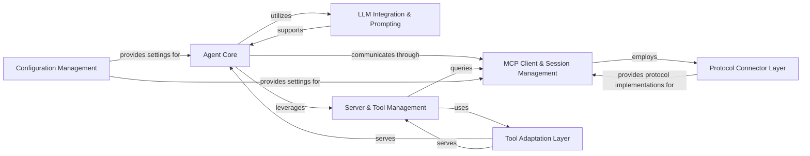

<Info>
This documentation was generated by [CodeBoarding](https://github.com/CodeBoarding/GeneratedOnBoardings) to provide comprehensive architectural insights into the mcp-agent framework.
</Info>

### Details

The `mcp-use` project serves as an AI agent framework, designed to orchestrate complex interactions with Large Language Models (LLMs) and external tools. Its core functionality revolves around an `Agent Core` that manages conversational flow and tool utilization. This core integrates with an `LLM Integration & Prompting` component for dynamic prompt generation and LLM communication. Communication with backend services and external tools is facilitated by the `MCP Client & Session Management` layer, which leverages a `Protocol Connector Layer` for various communication protocols. `Server & Tool Management` handles the discovery and organization of available tools, while a `Tool Adaptation Layer` ensures compatibility between generic MCP tool definitions and specific AI frameworks. Finally, `Configuration Management` provides essential system-wide settings, ensuring the framework operates with correct parameters.

### Agent Core
The central intelligence unit orchestrating AI agent behavior, conversation flow, and tool coordination.

**Related Classes/Methods**:

- <a href="https://github.com/mcp-use/mcp-use/blob/main/mcp_use/agents#L1-L1" target="_blank" rel="noopener noreferrer">QName:`mcp_use.agents` FileRef: `/home/ubuntu/CodeBoarding/repo/mcp-use/mcp_use/agents`</a>

### LLM Integration & Prompting
Manages interactions with Large Language Models, including dynamic prompt construction and response handling.

**Related Classes/Methods**:

- <a href="https://github.com/mcp-use/mcp-use/blob/main/mcp_use/agents/prompts#L1-L1" target="_blank" rel="noopener noreferrer">QName:`mcp_use.agents.prompts` FileRef: `/home/ubuntu/CodeBoarding/repo/mcp-use/mcp_use/agents/prompts`</a>

### MCP Client & Session Management
Handles the establishment, maintenance, and termination of connections and sessions with MCP backend servers, including low-level I/O.

**Related Classes/Methods**:

- <a href="https://github.com/mcp-use/mcp-use/blob/main/mcp_use/client.py#L28-L59" target="_blank" rel="noopener noreferrer">QName:`mcp_use.client` FileRef: `/home/ubuntu/CodeBoarding/repo/mcp-use/mcp_use/client.py`, Lines:(28:59)</a>
- <a href="https://github.com/mcp-use/mcp-use/blob/main/mcp_use/session.py#L20-L33" target="_blank" rel="noopener noreferrer">QName:`mcp_use.session` FileRef: `/home/ubuntu/CodeBoarding/repo/mcp-use/mcp_use/session.py`, Lines:(20:33)</a>
- <a href="https://github.com/mcp-use/mcp-use/blob/main/mcp_use/task_managers#L1-L1" target="_blank" rel="noopener noreferrer">QName:`mcp_use.task_managers` FileRef: `/home/ubuntu/CodeBoarding/repo/mcp-use/mcp_use/task_managers`</a>

### Protocol Connector Layer
Provides a standardized abstraction for various communication protocols (e.g., HTTP, WebSocket, Stdio, Sandbox).

**Related Classes/Methods**:

- <a href="https://github.com/mcp-use/mcp-use/blob/main/mcp_use/connectors#L1-L1" target="_blank" rel="noopener noreferrer">QName:`mcp_use.connectors` FileRef: `/home/ubuntu/CodeBoarding/repo/mcp-use/mcp_use/connectors`</a>

### Server & Tool Management
Responsible for discovering, organizing, and providing access to tools exposed by connected servers.

**Related Classes/Methods**:

- <a href="https://github.com/mcp-use/mcp-use/blob/main/mcp_use/managers/server_manager.py#L17-L28" target="_blank" rel="noopener noreferrer">QName:`mcp_use.managers.server_manager` FileRef: `/home/ubuntu/CodeBoarding/repo/mcp-use/mcp_use/managers/server_manager.py`, Lines:(17:28)</a>
- <a href="https://github.com/mcp-use/mcp-use/blob/main/mcp_use/managers/tools#L1-L1" target="_blank" rel="noopener noreferrer">QName:`mcp_use.managers.tools` FileRef: `/home/ubuntu/CodeBoarding/repo/mcp-use/mcp_use/managers/tools`</a>

### Tool Adaptation Layer
Acts as a bridge, converting generic MCP tool definitions into formats consumable by specific AI frameworks.

**Related Classes/Methods**:

- <a href="https://github.com/mcp-use/mcp-use/blob/main/mcp_use/adapters#L1-L1" target="_blank" rel="noopener noreferrer">QName:`mcp_use.adapters` FileRef: `/home/ubuntu/CodeBoarding/repo/mcp-use/mcp_use/adapters`</a>

### Configuration Management
Handles the loading, parsing, and validation of configuration files for system-wide parameters.

**Related Classes/Methods**:

- <a href="https://github.com/mcp-use/mcp-use/blob/main/mcp_use/config/__init__.py#L1-L1" target="_blank" rel="noopener noreferrer">QName:`mcp_use.config` FileRef: `/home/ubuntu/CodeBoarding/repo/mcp-use/mcp_use/config/__init__.py`</a>
