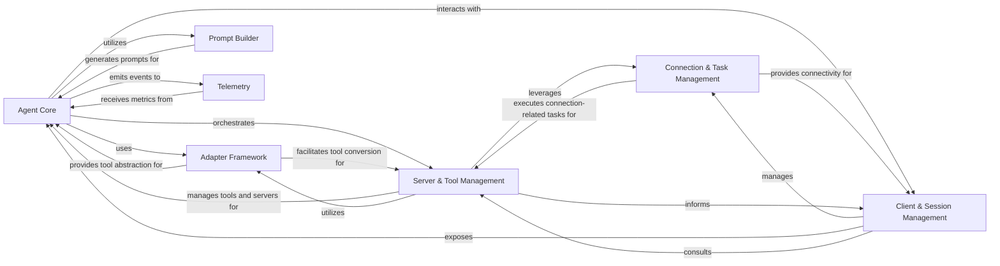

<Info>
This documentation was generated by [CodeBoarding](https://github.com/CodeBoarding/GeneratedOnBoardings) to provide comprehensive architectural insights into the mcp-agent framework.
</Info>

## Details

The `mcp-use` project is an AI Agent Framework/Library designed to enable agents to interact with various external environments and utilize diverse tools.

### Agent Core [[Expand]](./Agent_Core)
The central intelligence unit, embodied by `MCPAgent`, responsible for orchestrating interactions, processing inputs, generating responses, and utilizing available tools. It manages the agent's internal state, history, and integrates with LLMs.

**Related Classes/Methods**:

- <a href="https://github.com/CodeBoarding/mcp-use/blob/main/mcp_use/agents/mcpagent.py#L1-L1" target="_blank" rel="noopener noreferrer">`mcp_use.agents.mcpagent.MCPAgent` (1:1)</a>

### Client & Session Management
Manages the lifecycle of user interactions and individual `MCPSession` instances. `MCPClient` provides the primary interface for users to create, configure, and close sessions, while `MCPSession` represents a single, active connection or interaction session with an external environment or server, handling the establishment, maintenance, and termination of connections.

**Related Classes/Methods**:

- <a href="https://github.com/CodeBoarding/mcp-use/blob/main/mcp_use/client.py#L1-L1" target="_blank" rel="noopener noreferrer">`mcp_use.client.MCPClient` (1:1)</a>
- <a href="https://github.com/CodeBoarding/mcp-use/blob/main/mcp_use/session.py#L1-L1" target="_blank" rel="noopener noreferrer">`mcp_use.session.MCPSession` (1:1)</a>

### Connection & Task Management
Handles the low-level details of establishing, maintaining, and managing asynchronous tasks for persistent connections to various external environments (e.g., WebSocket servers, sandboxed environments, HTTP endpoints, standard I/O). `BaseConnector` defines the interface for specific communication protocols, while `ConnectionManager` subclasses manage the connection lifecycle.

**Related Classes/Methods**:

- <a href="https://github.com/CodeBoarding/mcp-use/blob/main/mcp_use/connectors/base.py#L1-L1" target="_blank" rel="noopener noreferrer">`mcp_use.connectors.base.BaseConnector` (1:1)</a>
- <a href="https://github.com/CodeBoarding/mcp-use/blob/main/mcp_use/connectors/websocket.py#L1-L1" target="_blank" rel="noopener noreferrer">`mcp_use.connectors.websocket` (1:1)</a>
- <a href="https://github.com/CodeBoarding/mcp-use/blob/main/mcp_use/connectors/sandbox.py#L1-L1" target="_blank" rel="noopener noreferrer">`mcp_use.connectors.sandbox` (1:1)</a>
- <a href="https://github.com/CodeBoarding/mcp-use/blob/main/mcp_use/connectors/http.py#L1-L1" target="_blank" rel="noopener noreferrer">`mcp_use.connectors.http` (1:1)</a>
- <a href="https://github.com/CodeBoarding/mcp-use/blob/main/mcp_use/connectors/stdio.py#L1-L1" target="_blank" rel="noopener noreferrer">`mcp_use.connectors.stdio` (1:1)</a>
- <a href="https://github.com/CodeBoarding/mcp-use/blob/main/mcp_use/task_managers/base.py#L1-L1" target="_blank" rel="noopener noreferrer">`mcp_use.task_managers.base` (1:1)</a>
- <a href="https://github.com/CodeBoarding/mcp-use/blob/main/mcp_use/task_managers/websocket.py#L1-L1" target="_blank" rel="noopener noreferrer">`mcp_use.task_managers.websocket` (1:1)</a>
- <a href="https://github.com/CodeBoarding/mcp-use/blob/main/mcp_use/task_managers/sse.py#L1-L1" target="_blank" rel="noopener noreferrer">`mcp_use.task_managers.sse` (1:1)</a>
- <a href="https://github.com/CodeBoarding/mcp-use/blob/main/mcp_use/task_managers/stdio.py#L1-L1" target="_blank" rel="noopener noreferrer">`mcp_use.task_managers.stdio` (1:1)</a>
- <a href="https://github.com/CodeBoarding/mcp-use/blob/main/mcp_use/task_managers/streamable_http.py#L1-L1" target="_blank" rel="noopener noreferrer">`mcp_use.task_managers.streamable_http` (1:1)</a>

### Adapter Framework [[Expand]](./Adapter_Framework)
Provides an abstraction layer for integrating with different AI frameworks (e.g., LangChain). It defines the `BaseAdapter` interface for converting and managing tools, resources, and prompts from external systems into a format usable by the `MCPAgent`. `LangChainAdapter` is a concrete implementation.

**Related Classes/Methods**:

- <a href="https://github.com/CodeBoarding/mcp-use/blob/main/mcp_use/adapters/base.py#L1-L1" target="_blank" rel="noopener noreferrer">`mcp_use.adapters.base.BaseAdapter` (1:1)</a>
- <a href="https://github.com/CodeBoarding/mcp-use/blob/main/mcp_use/adapters/langchain_adapter.py#L1-L1" target="_blank" rel="noopener noreferrer">`mcp_use.adapters.langchain_adapter.LangChainAdapter` (1:1)</a>

### Server & Tool Management [[Expand]](./Server_Tool_Management)
Manages the registration, activation, and disconnection of multiple external servers or environments, and facilitates the discovery, indexing, and execution of tools available across these connected servers. It includes a `ToolSearchEngine` for finding tools and base classes (`MCPServerTool`) for various server-related tools.

**Related Classes/Methods**:

- <a href="https://github.com/CodeBoarding/mcp-use/blob/main/mcp_use/managers/server_manager.py#L1-L1" target="_blank" rel="noopener noreferrer">`mcp_use.managers.server_manager` (1:1)</a>
- <a href="https://github.com/CodeBoarding/mcp-use/blob/main/mcp_use/managers/tools/search_tools.py#L57-L327" target="_blank" rel="noopener noreferrer">`mcp_use.managers.tools.search_tools.ToolSearchEngine` (57:327)</a>
- <a href="https://github.com/CodeBoarding/mcp-use/blob/main/mcp_use/managers/tools/base_tool.py#L5-L18" target="_blank" rel="noopener noreferrer">`mcp_use.managers.tools.base_tool.MCPServerTool` (5:18)</a>
- <a href="https://github.com/CodeBoarding/mcp-use/blob/main/mcp_use/managers/tools/use_tool.py#L1-L1" target="_blank" rel="noopener noreferrer">`mcp_use.managers.tools.use_tool` (1:1)</a>

### Prompt Builder [[Expand]](./Prompt_Builder)
Constructs and formats system messages and prompts for the LLM, incorporating tool descriptions and other contextual information to guide the agent's reasoning.

**Related Classes/Methods**:

- <a href="https://github.com/CodeBoarding/mcp-use/blob/main/mcp_use/agents/prompts/system_prompt_builder.py#L1-L1" target="_blank" rel="noopener noreferrer">`mcp_use.agents.prompts.system_prompt_builder` (1:1)</a>

### Telemetry [[Expand]](./Telemetry)
Collects and tracks usage data and agent execution metrics for observability and analytics purposes, providing insights into the framework's performance and behavior.

**Related Classes/Methods**:

- <a href="https://github.com/CodeBoarding/mcp-use/blob/main/mcp_use/telemetry/telemetry.py#L1-L1" target="_blank" rel="noopener noreferrer">`mcp_use.telemetry.telemetry` (1:1)</a>

### [FAQ](https://github.com/CodeBoarding/GeneratedOnBoardings/tree/main?tab=readme-ov-file#faq)
