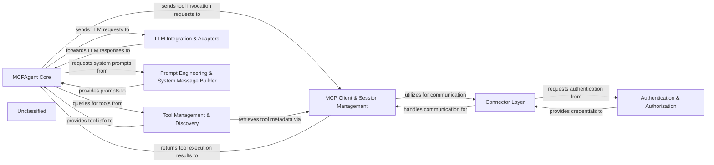

# overview

### Details

The MCP system is designed around a central `MCPAgent Core` that orchestrates interactions with external MCP servers and tools. It leverages `LLM Integration & Adapters` for reasoning and `Prompt Engineering & System Message Builder` for dynamic prompt generation. The `MCP Client & Session Management` component handles connections to MCP servers, relying on the `Connector Layer` for various communication protocols and `Authentication & Authorization` for secure access. `Tool Management & Discovery` provides the MCPAgent with access to available tools, which are then invoked through the `MCP Client & Session Management`. This modular design ensures clear separation of concerns, facilitating maintainability and scalability, and is optimized for clear data flow visualization in diagrams.

### MCPAgent Core
The central intelligence and orchestration unit. It interprets user requests, plans actions, interacts with tools, and formulates responses, leveraging LLMs for reasoning.

**Related Classes/Methods**:

- <a href="https://github.com/mcp-use/mcp-use/blob/main/mcp_use/agents/mcpagent.py#L48-L1107" target="_blank" rel="noopener noreferrer">QName:`MCPAgent` FileRef: `/home/ubuntu/CodeBoarding/repo/mcp-use/mcp_use/agents/mcpagent.py`, Lines:(48:1107)</a>

### MCP Client & Session Management
Manages the lifecycle of connections (sessions) to various MCP servers, acting as the primary interface for the MCPAgent to external services.

**Related Classes/Methods**:

- <a href="https://github.com/mcp-use/mcp-use/blob/main/mcp_use/client.py#L21-L326" target="_blank" rel="noopener noreferrer">QName:`MCPClient` FileRef: `/home/ubuntu/CodeBoarding/repo/mcp-use/mcp_use/client.py`, Lines:(21:326)</a>
- QName:`Session` FileRef: `/home/ubuntu/CodeBoarding/repo/mcp-use/mcp_use/session.py`

### Tool Management & Discovery
Responsible for identifying, indexing, and providing access to tools available across connected MCP servers, enabling dynamic utilization by the MCPAgent.

**Related Classes/Methods**:

- QName:`ServerManager` FileRef: `/home/ubuntu/CodeBoarding/repo/mcp-use/mcp_use/managers/server_manager.py`
- <a href="https://github.com/mcp-use/mcp-use/blob/main/mcp_use/managers/tools/search_tools.py#L229-L286" target="_blank" rel="noopener noreferrer">QName:`search_tools` FileRef: `/home/ubuntu/CodeBoarding/repo/mcp-use/mcp_use/managers/tools/search_tools.py`, Lines:(229:286)</a>
- QName:`Tool` FileRef: `/home/ubuntu/CodeBoarding/repo/mcp-use/mcp_use/managers/tools/base_tool.py`

### LLM Integration & Adapters
Facilitates seamless integration of MCP's internal representations with external LLM frameworks (e.g., LangChain), ensuring compatibility and schema translation.

**Related Classes/Methods**:

- <a href="https://github.com/mcp-use/mcp-use/blob/main/mcp_use/adapters/langchain_adapter.py#L29-L268" target="_blank" rel="noopener noreferrer">QName:`LangChainAdapter` FileRef: `/home/ubuntu/CodeBoarding/repo/mcp-use/mcp_use/adapters/langchain_adapter.py`, Lines:(29:268)</a>

### Connector Layer
Provides a standardized, protocol-agnostic mechanism for the MCP Client to communicate with diverse external MCP servers and tools.

**Related Classes/Methods**:

- <a href="https://github.com/mcp-use/mcp-use/blob/main/mcp_use/connectors/base.py#L37-L453" target="_blank" rel="noopener noreferrer">QName:`BaseConnector` FileRef: `/home/ubuntu/CodeBoarding/repo/mcp-use/mcp_use/connectors/base.py`, Lines:(37:453)</a>
- <a href="https://github.com/mcp-use/mcp-use/blob/main/mcp_use/connectors/websocket.py#L22-L257" target="_blank" rel="noopener noreferrer">QName:`WebSocketConnector` FileRef: `/home/ubuntu/CodeBoarding/repo/mcp-use/mcp_use/connectors/websocket.py`, Lines:(22:257)</a>
- <a href="https://github.com/mcp-use/mcp-use/blob/main/mcp_use/connectors/http.py#L24-L301" target="_blank" rel="noopener noreferrer">QName:`HTTPConnector` FileRef: `/home/ubuntu/CodeBoarding/repo/mcp-use/mcp_use/connectors/http.py`, Lines:(24:301)</a>

### Authentication & Authorization
Manages secure access to MCP servers and resources through OAuth, handling token management and client registration.

**Related Classes/Methods**:

- <a href="https://github.com/mcp-use/mcp-use/blob/main/mcp_use/auth/oauth.py#L51-L66" target="_blank" rel="noopener noreferrer">QName:`OAuthClient` FileRef: `/home/ubuntu/CodeBoarding/repo/mcp-use/mcp_use/auth/oauth.py`, Lines:(51:66)</a>

### Prompt Engineering & System Message Builder
Dynamically constructs system messages and prompts for the MCPAgent, incorporating tool descriptions and contextual information for effective LLM interaction.

**Related Classes/Methods**:

- QName:`SystemPromptBuilder` FileRef: `/home/ubuntu/CodeBoarding/repo/mcp-use/mcp_use/agents/prompts/system_prompt_builder.py`

### Unclassified
Component for all unclassified files and utility functions (Utility functions/External Libraries/Dependencies)

**Related Classes/Methods**: _None_
