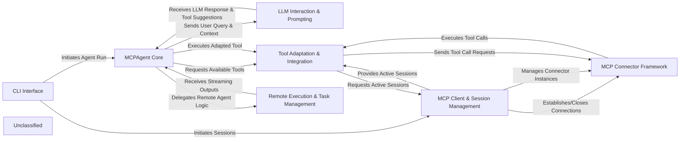

# overview

### Details

The MCP Agent system is designed around a central `MCPAgent Core` that orchestrates interactions between users, Large Language Models (LLMs), and various external tools. The `CLI Interface` serves as the primary entry point for users, initiating agent runs and managing sessions. The `MCPAgent Core` leverages `LLM Interaction & Prompting` to formulate effective prompts and interpret LLM responses, driving the agent's decision-making. For tool execution, the `MCPAgent Core` interacts with `Tool Adaptation & Integration`, which is responsible for converting MCP-defined tools into a format usable by the LLM framework and managing tool discovery. `Tool Adaptation & Integration` then communicates with `MCP Client & Session Management` to handle active connections to MCP servers. The `MCP Client & Session Management` relies on the `MCP Connector Framework` to establish and manage diverse communication protocols (e.g., HTTP, WebSocket) with external services. Finally, `Remote Execution & Task Management` handles the execution of agent logic in remote environments and manages streaming outputs, ensuring the agent can operate across distributed systems. This modular design ensures clear separation of concerns, facilitating maintainability and extensibility.

### CLI Interface
Provides the command-line interface for users to interact with the MCP Agent, initiating agent runs and managing sessions.

**Related Classes/Methods**:

- <a href="https://github.com/mcp-use/mcp-use/blob/main/mcp_use/cli.py#L542-L577" target="_blank" rel="noopener noreferrer">QName:`mcp_use.cli.main` FileRef: `mcp_use/cli.py`, Lines:(542:577)</a>

### MCPAgent Core
The central intelligent agent orchestrating the entire workflow. It processes user queries, manages chat history, interacts with LLMs for reasoning, and delegates tool execution. This component embodies the agent's decision-making and control flow.

**Related Classes/Methods**:

- <a href="https://github.com/mcp-use/mcp-use/blob/main/mcp_use/agents/mcpagent.py#L48-L1107" target="_blank" rel="noopener noreferrer">QName:`mcp_use.agents.mcpagent.MCPAgent` FileRef: `mcp_use/agents/mcpagent.py`, Lines:(48:1107)</a>

### LLM Interaction & Prompting
Responsible for constructing and formatting system messages and tool descriptions for the LLM. It ensures the agent provides the necessary context to the LLM for effective reasoning and tool selection.

**Related Classes/Methods**:

- <a href="https://github.com/mcp-use/mcp-use/blob/main/mcp_use/agents/prompts/system_prompt_builder.py#L59-L103" target="_blank" rel="noopener noreferrer">QName:`mcp_use.agents.prompts.system_prompt_builder.create_system_message` FileRef: `mcp_use/agents/prompts/system_prompt_builder.py`, Lines:(59:103)</a>
- <a href="https://github.com/mcp-use/mcp-use/blob/main/mcp_use/agents/prompts/templates.py#L3-L3" target="_blank" rel="noopener noreferrer">QName:`mcp_use.agents.prompts.templates.DEFAULT_SYSTEM_PROMPT_TEMPLATE` FileRef: `mcp_use/agents/prompts/templates.py`</a>

### MCP Client & Session Management
Manages the lifecycle of connections (sessions) to various MCP servers. It handles the creation, maintenance, and closing of these sessions, enabling the agent to interact with multiple external tool providers.

**Related Classes/Methods**:

- <a href="https://github.com/mcp-use/mcp-use/blob/main/mcp_use/client.py#L21-L326" target="_blank" rel="noopener noreferrer">QName:`mcp_use.client.MCPClient` FileRef: `mcp_use/client.py`, Lines:(21:326)</a>
- <a href="https://github.com/mcp-use/mcp-use/blob/main/mcp_use/session.py#L36-L36" target="_blank" rel="noopener noreferrer">QName:`mcp_use.session.Session` FileRef: `mcp_use/session.py`</a>

### MCP Connector Framework
Provides a standardized, pluggable interface for the agent to communicate with different types of MCP servers (e.g., sandbox, HTTP, WebSocket). It abstracts away the underlying communication protocols and handles authentication, allowing for flexible integration of various tool environments.

**Related Classes/Methods**:

- <a href="https://github.com/mcp-use/mcp-use/blob/main/mcp_use/connectors/base.py#L37-L453" target="_blank" rel="noopener noreferrer">QName:`mcp_use.connectors.base.BaseConnector` FileRef: `mcp_use/connectors/base.py`, Lines:(37:453)</a>
- <a href="https://github.com/mcp-use/mcp-use/blob/main/mcp_use/connectors/sandbox.py#L35-L302" target="_blank" rel="noopener noreferrer">QName:`mcp_use.connectors.sandbox.SandboxConnector` FileRef: `mcp_use/connectors/sandbox.py`, Lines:(35:302)</a>
- <a href="https://github.com/mcp-use/mcp-use/blob/main/mcp_use/connectors/http.py#L24-L301" target="_blank" rel="noopener noreferrer">QName:`mcp_use.connectors.http.HTTPConnector` FileRef: `mcp_use/connectors/http.py`, Lines:(24:301)</a>
- <a href="https://github.com/mcp-use/mcp-use/blob/main/mcp_use/connectors/websocket.py#L22-L257" target="_blank" rel="noopener noreferrer">QName:`mcp_use.connectors.websocket.WebSocketConnector` FileRef: `mcp_use/connectors/websocket.py`, Lines:(22:257)</a>
- <a href="https://github.com/mcp-use/mcp-use/blob/main/mcp_use/connectors/stdio.py#L18-L101" target="_blank" rel="noopener noreferrer">QName:`mcp_use.connectors.stdio.StdioConnector` FileRef: `mcp_use/connectors/stdio.py`, Lines:(18:101)</a>
- QName:`mcp_use.auth.oauth.OAuthAuthenticator` FileRef: `mcp_use/auth/oauth.py`
- QName:`mcp_use.auth.bearer.BearerAuthenticator` FileRef: `mcp_use/auth/bearer.py`

### Tool Adaptation & Integration
Adapts MCP-defined tools, resources, and prompts into a format compatible with external LLM frameworks (e.g., LangChain). This component is crucial for seamlessly integrating MCP tools into the agent's reasoning and execution pipeline, including functionalities for server management and tool discovery.

**Related Classes/Methods**:

- <a href="https://github.com/mcp-use/mcp-use/blob/main/mcp_use/adapters/base.py#L20-L190" target="_blank" rel="noopener noreferrer">QName:`mcp_use.adapters.base.BaseAdapter` FileRef: `mcp_use/adapters/base.py`, Lines:(20:190)</a>
- <a href="https://github.com/mcp-use/mcp-use/blob/main/mcp_use/adapters/langchain_adapter.py#L29-L268" target="_blank" rel="noopener noreferrer">QName:`mcp_use.adapters.langchain_adapter.LangChainAdapter` FileRef: `mcp_use/adapters/langchain_adapter.py`, Lines:(29:268)</a>
- <a href="https://github.com/mcp-use/mcp-use/blob/main/mcp_use/managers/server_manager.py#L11-L124" target="_blank" rel="noopener noreferrer">QName:`mcp_use.managers.server_manager.ServerManager` FileRef: `mcp_use/managers/server_manager.py`, Lines:(11:124)</a>
- <a href="https://github.com/mcp-use/mcp-use/blob/main/mcp_use/managers/tools/search_tools.py#L23-L55" target="_blank" rel="noopener noreferrer">QName:`mcp_use.managers.tools.search_tools.SearchTools` FileRef: `mcp_use/managers/tools/search_tools.py`, Lines:(23:55)</a>

### Remote Execution & Task Management
Facilitates the execution of agent logic in remote environments and manages asynchronous task streams (e.g., SSE, WebSocket). It handles serialization/deserialization of data for remote calls and manages the lifecycle of streaming outputs.

**Related Classes/Methods**:

- <a href="https://github.com/mcp-use/mcp-use/blob/main/mcp_use/agents/remote.py#L34-L327" target="_blank" rel="noopener noreferrer">QName:`mcp_use.agents.remote.RemoteAgent` FileRef: `mcp_use/agents/remote.py`, Lines:(34:327)</a>
- QName:`mcp_use.task_managers.base.BaseTaskManager` FileRef: `mcp_use/task_managers/base.py`
- QName:`mcp_use.task_managers.sse.SseTaskManager` FileRef: `mcp_use/task_managers/sse.py`
- QName:`mcp_use.task_managers.stdio.StdioTaskManager` FileRef: `mcp_use/task_managers/stdio.py`
- QName:`mcp_use.task_managers.streamable_http.StreamableHttpTaskManager` FileRef: `mcp_use/task_managers/streamable_http.py`
- QName:`mcp_use.task_managers.websocket.WebSocketTaskManager` FileRef: `mcp_use/task_managers/websocket.py`

### Unclassified
Component for all unclassified files and utility functions (Utility functions/External Libraries/Dependencies)

**Related Classes/Methods**: _None_
