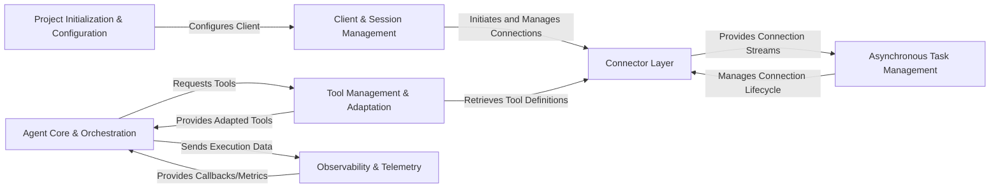

# overview

### Details

The `mcp-use` project is architected as a modular agent-based system for interacting with MCP servers. It begins with `Project Initialization & Configuration`, which sets up the environment and configures the `Client & Session Management` component. This client then establishes and manages connections through a flexible `Connector Layer`, which abstracts various MCP server implementations. Asynchronous operations, such as processing event streams and managing connection lifecycles, are handled by `Asynchronous Task Management`. The core intelligence resides in `Agent Core & Orchestration`, responsible for LLM interactions and coordinating external tools. `Tool Management & Adaptation` discovers, adapts, and provides these tools to the agent, often retrieving definitions via the `Connector Layer`. Throughout the system's operation, `Observability & Telemetry` monitors execution, collects metrics, and provides feedback, ensuring a robust and traceable agent experience.

### Project Initialization & Configuration
Manages the project lifecycle, including command-line interactions, project setup, and loading environmental and connector configurations.

**Related Classes/Methods**:

- <a href="https://github.com/mcp-use/mcp-use/blob/main/mcp_use/cli.py#L1-L1" target="_blank" rel="noopener noreferrer">QName:`mcp_use.cli` FileRef: `/home/ubuntu/CodeBoarding/repo/mcp-use/mcp_use/cli.py`</a>
- <a href="https://github.com/mcp-use/mcp-use/blob/main/mcp_use/config.py#L1-L1" target="_blank" rel="noopener noreferrer">QName:`mcp_use.config` FileRef: `/home/ubuntu/CodeBoarding/repo/mcp-use/mcp_use/config.py`</a>

### Client & Session Management
Oversees the establishment, maintenance, and termination of client connections to MCP servers, managing the overall user session.

**Related Classes/Methods**:

- <a href="https://github.com/mcp-use/mcp-use/blob/main/mcp_use/client.py#L1-L1" target="_blank" rel="noopener noreferrer">QName:`mcp_use.client` FileRef: `/home/ubuntu/CodeBoarding/repo/mcp-use/mcp_use/client.py`</a>
- <a href="https://github.com/mcp-use/mcp-use/blob/main/mcp_use/session.py#L1-L1" target="_blank" rel="noopener noreferrer">QName:`mcp_use.session` FileRef: `/home/ubuntu/CodeBoarding/repo/mcp-use/mcp_use/session.py`</a>

### Connector Layer
An abstract and concrete layer defining how the system interacts with different MCP server implementations (e.g., Sandbox, WebSocket, HTTP, Stdio).

**Related Classes/Methods**:

- <a href="https://github.com/mcp-use/mcp-use/blob/main/mcp_use/connectors/base.py#L1-L1" target="_blank" rel="noopener noreferrer">QName:`mcp_use.connectors.base` FileRef: `/home/ubuntu/CodeBoarding/repo/mcp-use/mcp_use/connectors/base.py`</a>
- <a href="https://github.com/mcp-use/mcp-use/blob/main/mcp_use/connectors/sandbox.py#L1-L1" target="_blank" rel="noopener noreferrer">QName:`mcp_use.connectors.sandbox` FileRef: `/home/ubuntu/CodeBoarding/repo/mcp-use/mcp_use/connectors/sandbox.py`</a>
- <a href="https://github.com/mcp-use/mcp-use/blob/main/mcp_use/connectors/websocket.py#L1-L1" target="_blank" rel="noopener noreferrer">QName:`mcp_use.connectors.websocket` FileRef: `/home/ubuntu/CodeBoarding/repo/mcp-use/mcp_use/connectors/websocket.py`</a>
- <a href="https://github.com/mcp-use/mcp-use/blob/main/mcp_use/connectors/http.py#L1-L1" target="_blank" rel="noopener noreferrer">QName:`mcp_use.connectors.http` FileRef: `/home/ubuntu/CodeBoarding/repo/mcp-use/mcp_use/connectors/http.py`</a>
- <a href="https://github.com/mcp-use/mcp-use/blob/main/mcp_use/connectors/stdio.py#L1-L1" target="_blank" rel="noopener noreferrer">QName:`mcp_use.connectors.stdio` FileRef: `/home/ubuntu/CodeBoarding/repo/mcp-use/mcp_use/connectors/stdio.py`</a>

### Agent Core & Orchestration
The central component responsible for LLM interaction, reasoning, dynamic prompt construction, and coordinating the utilization of external tools.

**Related Classes/Methods**:

- <a href="https://github.com/mcp-use/mcp-use/blob/main/mcp_use/agents/base.py#L1-L1" target="_blank" rel="noopener noreferrer">QName:`mcp_use.agents.base` FileRef: `/home/ubuntu/CodeBoarding/repo/mcp-use/mcp_use/agents/base.py`</a>
- <a href="https://github.com/mcp-use/mcp-use/blob/main/mcp_use/agents/mcpagent.py#L1-L1" target="_blank" rel="noopener noreferrer">QName:`mcp_use.agents.mcpagent` FileRef: `/home/ubuntu/CodeBoarding/repo/mcp-use/mcp_use/agents/mcpagent.py`</a>
- <a href="https://github.com/mcp-use/mcp-use/blob/main/mcp_use/agents/prompts/system_prompt_builder.py#L1-L1" target="_blank" rel="noopener noreferrer">QName:`mcp_use.agents.prompts.system_prompt_builder` FileRef: `/home/ubuntu/CodeBoarding/repo/mcp-use/mcp_use/agents/prompts/system_prompt_builder.py`</a>
- <a href="https://github.com/mcp-use/mcp-use/blob/main/mcp_use/agents/prompts/templates.py#L1-L1" target="_blank" rel="noopener noreferrer">QName:`mcp_use.agents.prompts.templates` FileRef: `/home/ubuntu/CodeBoarding/repo/mcp-use/mcp_use/agents/prompts/templates.py`</a>

### Tool Management & Adaptation
Discovers, indexes, and provides access to various tools (server-managed, search-enabled) and translates MCP-defined tools into formats compatible with external frameworks like LangChain.

**Related Classes/Methods**:

- <a href="https://github.com/mcp-use/mcp-use/blob/main/mcp_use/managers/server_manager.py#L1-L1" target="_blank" rel="noopener noreferrer">QName:`mcp_use.managers.server_manager` FileRef: `/home/ubuntu/CodeBoarding/repo/mcp-use/mcp_use/managers/server_manager.py`</a>
- <a href="https://github.com/mcp-use/mcp-use/blob/main/mcp_use/managers/tools/base_tool.py#L1-L1" target="_blank" rel="noopener noreferrer">QName:`mcp_use.managers.tools.base_tool` FileRef: `/home/ubuntu/CodeBoarding/repo/mcp-use/mcp_use/managers/tools/base_tool.py`</a>
- <a href="https://github.com/mcp-use/mcp-use/blob/main/mcp_use/adapters/base.py#L1-L1" target="_blank" rel="noopener noreferrer">QName:`mcp_use.adapters.base` FileRef: `/home/ubuntu/CodeBoarding/repo/mcp-use/mcp_use/adapters/base.py`</a>
- <a href="https://github.com/mcp-use/mcp-use/blob/main/mcp_use/adapters/langchain_adapter.py#L1-L1" target="_blank" rel="noopener noreferrer">QName:`mcp_use.adapters.langchain_adapter` FileRef: `/home/ubuntu/CodeBoarding/repo/mcp-use/mcp_use/adapters/langchain_adapter.py`</a>

### Asynchronous Task Management
Manages background tasks, particularly those related to maintaining persistent connections, processing event streams from connectors, and handling asynchronous operations.

**Related Classes/Methods**:

- <a href="https://github.com/mcp-use/mcp-use/blob/main/mcp_use/task_managers/base.py#L1-L1" target="_blank" rel="noopener noreferrer">QName:`mcp_use.task_managers.base` FileRef: `/home/ubuntu/CodeBoarding/repo/mcp-use/mcp_use/task_managers/base.py`</a>
- <a href="https://github.com/mcp-use/mcp-use/blob/main/mcp_use/task_managers/stdio.py#L1-L1" target="_blank" rel="noopener noreferrer">QName:`mcp_use.task_managers.stdio` FileRef: `/home/ubuntu/CodeBoarding/repo/mcp-use/mcp_use/task_managers/stdio.py`</a>
- <a href="https://github.com/mcp-use/mcp-use/blob/main/mcp_use/task_managers/websocket.py#L1-L1" target="_blank" rel="noopener noreferrer">QName:`mcp_use.task_managers.websocket` FileRef: `/home/ubuntu/CodeBoarding/repo/mcp-use/mcp_use/task_managers/websocket.py`</a>
- <a href="https://github.com/mcp-use/mcp-use/blob/main/mcp_use/task_managers/sse.py#L1-L1" target="_blank" rel="noopener noreferrer">QName:`mcp_use.task_managers.sse` FileRef: `/home/ubuntu/CodeBoarding/repo/mcp-use/mcp_use/task_managers/sse.py`</a>
- <a href="https://github.com/mcp-use/mcp-use/blob/main/mcp_use/task_managers/streamable_http.py#L1-L1" target="_blank" rel="noopener noreferrer">QName:`mcp_use.task_managers.streamable_http` FileRef: `/home/ubuntu/CodeBoarding/repo/mcp-use/mcp_use/task_managers/streamable_http.py`</a>

### Observability & Telemetry
Provides mechanisms for monitoring agent execution, collecting performance metrics, and managing callbacks for external integrations and debugging.

**Related Classes/Methods**:

- <a href="https://github.com/mcp-use/mcp-use/blob/main/mcp_use/telemetry/telemetry.py#L1-L1" target="_blank" rel="noopener noreferrer">QName:`mcp_use.telemetry.telemetry` FileRef: `/home/ubuntu/CodeBoarding/repo/mcp-use/mcp_use/telemetry/telemetry.py`</a>
- <a href="https://github.com/mcp-use/mcp-use/blob/main/mcp_use/telemetry/events.py#L1-L1" target="_blank" rel="noopener noreferrer">QName:`mcp_use.telemetry.events` FileRef: `/home/ubuntu/CodeBoarding/repo/mcp-use/mcp_use/telemetry/events.py`</a>
- <a href="https://github.com/mcp-use/mcp-use/blob/main/mcp_use/observability/callbacks_manager.py#L1-L1" target="_blank" rel="noopener noreferrer">QName:`mcp_use.observability.callbacks_manager` FileRef: `/home/ubuntu/CodeBoarding/repo/mcp-use/mcp_use/observability/callbacks_manager.py`</a>
- <a href="https://github.com/mcp-use/mcp-use/blob/main/mcp_use/observability/laminar.py#L1-L1" target="_blank" rel="noopener noreferrer">QName:`mcp_use.observability.laminar` FileRef: `/home/ubuntu/CodeBoarding/repo/mcp-use/mcp_use/observability/laminar.py`</a>
- <a href="https://github.com/mcp-use/mcp-use/blob/main/mcp_use/observability/langfuse.py#L1-L1" target="_blank" rel="noopener noreferrer">QName:`mcp_use.observability.langfuse` FileRef: `/home/ubuntu/CodeBoarding/repo/mcp-use/mcp_use/observability/langfuse.py`</a>
