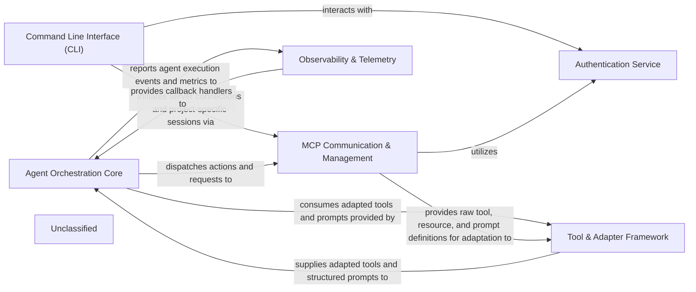

# overview

### Details

The `mcp-use` project is structured around a core `Agent Orchestration Core` that leverages external tools and services to interact with the Model Context Protocol (MCP). The `Command Line Interface (CLI)` serves as the primary entry point, allowing users to initiate and manage MCP projects. It interacts with the `MCP Communication & Management` component to establish and maintain connections with MCP servers, which in turn relies on the `Authentication Service` for secure access.

The `Agent Orchestration Core` is responsible for the intelligent orchestration of tasks, utilizing `Tool & Adapter Framework` to convert MCP-specific tools and resources into a format consumable by the agent (e.g., LangChain). This framework acts as an abstraction layer, ensuring interoperability. During its operation, the `Agent Orchestration Core` reports execution events and metrics to the `Observability & Telemetry` component, which provides insights into agent performance and behavior. Conversely, `Observability & Telemetry` also provides callback handlers to the `Agent Orchestration Core` for real-time event observation. The `MCP Communication & Management` component not only handles session management but also provides the raw tool, resource, and prompt definitions that the `Tool & Adapter Framework` then adapts for the agent's use. This architecture ensures a clear separation of concerns, enabling modular development and maintainability, while facilitating a robust and observable agent-server interaction.

### Agent Orchestration Core
The central intelligence unit, orchestrating LLM interactions, managing conversational state, and executing tools. It also handles dynamic prompt construction and remote execution.

**Related Classes/Methods**:

- QName:`mcp_use.agents.mcpagent.MCPAgent` FileRef: `mcp_use/agents/mcpagent.py`
- QName:`mcp_use.agents.base.BaseAgent` FileRef: `mcp_use/agents/base.py`
- QName:`mcp_use.agents.prompts.system_prompt_builder.create_system_message` FileRef: `mcp_use/agents/prompts/system_prompt_builder.py`
- QName:`mcp_use.agents.remote.RemoteAgent` FileRef: `mcp_use/agents/remote.py`

### MCP Communication & Management
Manages the establishment, maintenance, and termination of client sessions and connections to various MCP servers. It provides abstract and concrete implementations for different server types and handles server/tool discovery and management.

**Related Classes/Methods**:

- QName:`mcp_use.session.MCPSession` FileRef: `mcp_use/session.py`
- QName:`mcp_use.client.MCPClient` FileRef: `mcp_use/client.py`
- QName:`mcp_use.connectors.base.BaseConnector` FileRef: `mcp_use/connectors/base.py`
- QName:`mcp_use.managers.server_manager.ServerManager` FileRef: `mcp_use/managers/server_manager.py`
- QName:`mcp_use.task_managers.base.BaseTaskManager` FileRef: `mcp_use/task_managers/base.py`

### Tool & Adapter Framework
Provides an abstraction layer for adapting MCP-specific tools, resources, and prompts into a format usable by external frameworks (e.g., LangChain), ensuring interoperability.

**Related Classes/Methods**:

- QName:`mcp_use.adapters.base.BaseAdapter` FileRef: `mcp_use/adapters/base.py`
- QName:`mcp_use.adapters.langchain_adapter.LangChainAdapter` FileRef: `mcp_use/adapters/langchain_adapter.py`
- QName:`mcp_use.managers.tools.base_tool.BaseTool` FileRef: `mcp_use/managers/tools/base_tool.py`

### Authentication Service
Handles user authentication and authorization, primarily using OAuth, and manages bearer tokens for secure communication with MCP servers.

**Related Classes/Methods**:

- QName:`mcp_use.auth.oauth.OAuth` FileRef: `mcp_use/auth/oauth.py`
- QName:`mcp_use.auth.bearer.BearerAuth` FileRef: `mcp_use/auth/bearer.py`

### Command Line Interface (CLI)
Manages command-line interface operations for project setup, server configuration, and general utility commands, serving as the primary entry point for user interaction.

**Related Classes/Methods**:

- QName:`mcp_use.cli` FileRef: `mcp_use/cli.py`

### Observability & Telemetry
Provides mechanisms for collecting telemetry data, managing callbacks for observing agent events, and integrating with observability platforms.

**Related Classes/Methods**:

- QName:`mcp_use.telemetry.telemetry.Telemetry` FileRef: `mcp_use/telemetry/telemetry.py`
- QName:`mcp_use.observability.callbacks_manager.ObservabilityManager` FileRef: `mcp_use/observability/callbacks_manager.py`

### Unclassified
Component for all unclassified files and utility functions (Utility functions/External Libraries/Dependencies)

**Related Classes/Methods**: _None_
