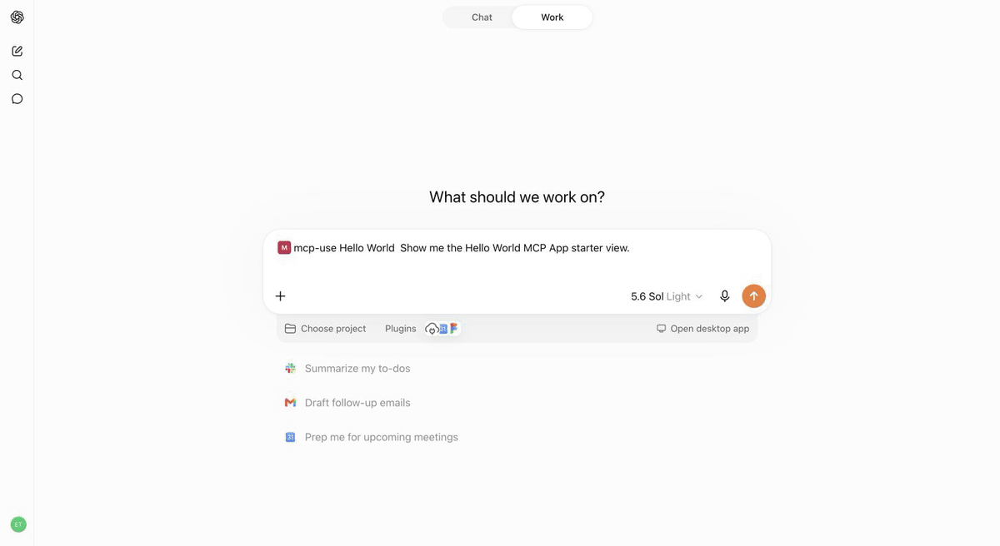
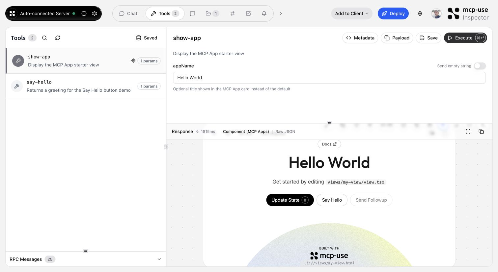
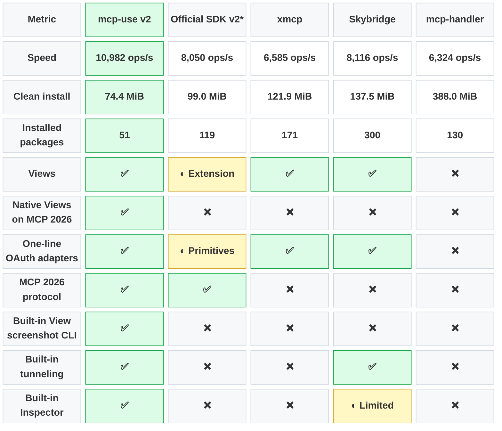

<div align="center">
  <a href="https://mcp-use.com">
    <picture>
      <source media="(prefers-color-scheme: dark)" srcset="./static/logo_white.svg">
      <source media="(prefers-color-scheme: light)" srcset="./static/logo_black.svg">
      
    </picture>
  </a>

  <h1>Build MCP servers and apps that run anywhere.</h1>

  <p>
    The TypeScript framework for building, testing, and shipping MCP on the official v2 SDK:
    typed tools, interactive apps, a built-in Inspector, and stateless HTTP.
  </p>

  <p>
    <a href="https://mcp-use.com/docs/typescript/getting-started/quickstart"><strong>Documentation</strong></a>
    · <a href="https://inspector.mcp-use.com/inspector"><strong>Inspector</strong></a>
    · <a href="#examples"><strong>Examples</strong></a>
    · <a href="https://manufact.com"><strong>Deploy</strong></a>
  </p>

  <p>
    <a href="#start-with-code"><strong>Start with code</strong></a>
    · <a href="#start-with-your-agent"><strong>Start with your agent</strong></a>
  </p>

  <p>
    <a href="https://www.npmjs.com/package/mcp-use">
      
    </a>
    <a href="https://github.com/mcp-use/mcp-use/blob/main/LICENSE">
      
    </a>
    <a href="https://discord.gg/XkNkSkMz3V">
      
    </a>
  </p>
</div>

> [!NOTE]
> **mcp-use v2 for TypeScript is in beta.** The examples below intentionally use the npm `beta` tag and require Node.js **22.22.2 or newer**. Python and the stable TypeScript v1 packages remain available through the [ecosystem links](#ecosystem).

## Choose how you build

Start from the terminal or give the same job to your coding agent. Both paths produce a typed MCP server with an interactive app, local Inspector, verification loop, and production deployment.

### Start with code

```bash
npx -y create-mcp-use-app@beta
```

Follow the prompts, change into the generated project, and run `npm run dev`. Your MCP endpoint is then available at [`http://localhost:3000/mcp`](http://localhost:3000/mcp), with the Inspector at [`http://localhost:3000/mcp/inspector`](http://localhost:3000/mcp/inspector).

[Read the TypeScript quickstart →](https://mcp-use.com/docs/typescript/getting-started/quickstart)

### Start with your agent

Paste this into Claude Code, Codex, Cursor, or any coding agent. **[Read the prompt →](https://mcp-use.com/prompt.md)**

```text
Build an MCP server following https://mcp-use.com/prompt.md
```

The public prompt owns the complete build, verification, and deployment workflow, so people and agents always inspect and follow the same instructions.

## Why mcp-use v2

- **Scale like ordinary HTTP.** The v2 transport is stateless per request, so MCP traffic can use normal round-robin routing without protocol-level sticky sessions or shared session storage.
- **Keep tools and views typed together.** Exported tool references connect Zod input/output schemas to `useToolContext()` and `useCallTool()` in React.
- **Build interactive MCP Apps.** Return structured results that compatible clients such as ChatGPT and Claude can render as responsive application views.
- **Give humans and agents the same feedback loop.** Develop with hot reload, inspect visually, invoke tools from the terminal, capture view screenshots, and deploy from the same CLI.
- **Stand on the official SDK.** mcp-use v2 is built on the [official Model Context Protocol TypeScript SDK](https://github.com/modelcontextprotocol/typescript-sdk).

## Quickstart: a typed MCP App

The scaffold gives you the server, TypeScript configuration, development scripts, Inspector, and a React view pipeline. Start it once and the MCP endpoint also serves a client-ready landing page with its connection URL and setup instructions.

Replace its `index.ts` with a view-bound tool like this:

```typescript
import { MCPServer } from "mcp-use";
import { z } from "zod";

const server = new MCPServer({
  name: "weather-app",
  title: "Weather App",
  version: "1.0.0",
});

const weatherInput = z.object({
  city: z.string().describe("City to look up"),
});

const weatherOutput = z.object({
  city: z.string(),
  temperature: z.number(),
  conditions: z.string(),
});

export const getWeather = server.tool(
  {
    name: "get-weather",
    title: "Get weather",
    description: "Get the current weather for a city",
    inputSchema: weatherInput,
    outputSchema: weatherOutput,
    view: { name: "weather-card" },
    annotations: {
      readOnlyHint: true,
      destructiveHint: false,
      openWorldHint: true,
    },
  },
  async ({ city }) => {
    const weather = {
      city,
      temperature: 22,
      conditions: "Sunny",
    };

    return {
      content: [
        {
          type: "text",
          text: `Weather in ${city}: ${weather.conditions}, ${weather.temperature}°C`,
        },
      ],
      structuredContent: weather,
    };
  },
);

export default server;
```

Assign statically declared tools to exported constants. The generated `mcp-env.d.ts` uses those `ToolRef` values to type the view and reject calls to tools that are not exported.

[Explore MCP server tools →](https://mcp-use.com/docs/typescript/server/tools)

## From tool to interactive app

Create `views/weather-card/view.tsx`. The directory name matches `view.name` on the tool:

```tsx
import { useCallTool, useToolContext } from "mcp-use/react";

export default function WeatherCard() {
  const view = useToolContext<"get-weather">();
  const refresh = useCallTool("get-weather");

  if (view.status === "pending") return <p>Checking the weather…</p>;
  if (view.status === "error") return <p>{view.error.message}</p>;

  const weather =
    refresh.data?.structuredContent ?? view.toolOutput;

  return (
    <main style={{ padding: 24 }}>
      <h2>{weather.city}</h2>
      <p>
        {weather.temperature}°C · {weather.conditions}
      </p>
      <button
        disabled={refresh.isPending}
        onClick={() => void refresh.callTool({ city: weather.city })}
      >
        {refresh.isPending ? "Refreshing…" : "Refresh"}
      </button>
      {refresh.error && <p>{refresh.error.message}</p>}
    </main>
  );
}
```

The model reads the concise `content` result. The view reads the typed `structuredContent` through `useToolContext()`, and `useCallTool()` can invoke exported server tools without duplicating their input or output types. Run the tool and interact with the view in the Inspector before testing it in an MCP client.

<p align="center">
  
  <br />
  <sub>The same MCP App running inside ChatGPT.</sub>
</p>

[Build your first MCP App →](https://mcp-use.com/docs/typescript/mcp-apps/quickstart)

## Build, inspect, deploy

| Stage | Human workflow | Agent-friendly workflow |
| --- | --- | --- |
| **Build** | `npm run typecheck` and `npm run build` | The same commands return explicit exit codes and compiler errors |
| **Inspect** | Open `http://localhost:3000/mcp/inspector` | Connect with `mcp-use client`, list tools, and invoke them from the terminal |
| **Verify views** | Run tools and inspect the rendered app | Capture a PNG with `mcp-use screenshot` and inspect the image |
| **Deploy** | Run `npm run deploy` | Use `mcp-use deploy --yes` and wait for a confirmed live state |

The Inspector discovers your tools, validates their inputs, and renders MCP App responses beside the request.

<p align="center">
  
  <br />
  <sub>Invoke a tool and inspect its interactive view without leaving the development loop.</sub>
</p>

```bash
# Terminal verification against a running local server
npm install --save-dev @mcp-use/client@beta
npx mcp-use client connect local http://localhost:3000/mcp
npx mcp-use client local tools list
npx mcp-use client local tools call get-weather city=Tokyo
npx mcp-use screenshot \
  --server local \
  --tool get-weather \
  city=Tokyo \
  --output weather-card.png
```

Deploy to [Manufact Cloud](https://manufact.com) for managed builds, preview deployments, analytics, evals, observability, and logs:

```bash
npm run deploy
```

Prefer to run it yourself? Follow the [self-hosting guide →](https://mcpuse-codex-v1-v2-docs-split.mintlify.site/v2/typescript/server/deployment/runtime-patterns).

## How mcp-use compares

mcp-use v2 keeps the official TypeScript SDK v2 as its protocol foundation, then adds a full-stack runtime designed to improve the developer and coding-agent experience.

**How does mcp-use build on the official TypeScript SDK?**

mcp-use uses the official `@modelcontextprotocol/core`, `server`, and `client` packages for protocol compatibility. On top, it adds one typed server API, generated tool-to-view contracts, deterministic CLI feedback, scaffolding, Inspector, screenshot verification, deployment adapters, and workflows that agents can execute end to end.

**What does mcp-use add for MCP Apps?**

The official SDK does not include a native, end-to-end MCP Apps workflow in its server package; Apps are added through the separate `@modelcontextprotocol/ext-apps` extension and custom resource, metadata, build, and type wiring. mcp-use makes Views a first-class server feature: bind a `view` directly to an exported tool, share its schemas with React hooks, build it with the server, preview it in the Inspector, and verify it with the built-in screenshot tool.

**What about performance?**

mcp-use adds custom stateless request handling and optimized response paths on top of the official SDK. Those framework-level improvements measured **10,982 median operations per second**, compared with **8,050** for the equivalent official SDK v2 fixture: about **36% higher throughput** in our benchmark.

**How does it compare with other TypeScript MCP frameworks?**

mcp-use v2 had the smallest equivalent development stack tested: **74.4 MiB** across **51 installed packages**. That is 57% fewer packages than the equivalent official SDK stack and 83% fewer than Skybridge.

Green cells mark the category leader. ✅ means the full capability is built into the framework, ◐ means related primitives or a limited capability set is included, and ❌ means it requires an external implementation. Compared here: the [official TypeScript SDK v2](https://github.com/modelcontextprotocol/typescript-sdk), [xmcp](https://github.com/basementstudio/xmcp), [Skybridge](https://github.com/alpic-ai/skybridge), and [mcp-handler](https://github.com/vercel/mcp-handler).



<sub>* The Official SDK comparison includes `@modelcontextprotocol/ext-apps`, Vite, and zod, plus their required React, TypeScript, and SDK dependencies, so the size figures compare MCP Apps-capable development stacks across approaches.</sub>

Speed uses the benchmark's median operations per second; mcp-use leads this selected comparison and the frameworks with native Views. Clean install measures fresh `node_modules` on disk. Installed packages counts the dependency paths reported by `npm ls --all --parseable` for the same clean installs. The stacks are `mcp-use + zod`; official v2 server and Node packages + Apps extension and its required SDK peer + React, Vite, TypeScript, and zod; `xmcp + zod`; `Skybridge + zod`; and `mcp-handler` + Next.js, its SDK peer, React, TypeScript, and zod.

“Views” means native framework support for MCP Apps; the official SDK's partial result requires its separate Apps extension plus application-specific resource, metadata, build, and type wiring. “Native Views on MCP 2026” requires both a native View abstraction and support for the MCP 2026 protocol generation. “One-line OAuth adapters” means provider-specific helpers that plug into the framework with one configuration call; identity-provider setup is still required. The official SDK's partial result provides generic bearer middleware, metadata helpers, and verifier interfaces, but no provider adapter. “Built-in View screenshot CLI” means the framework itself can invoke a View-backed tool and save the rendered result as an image; Skybridge delegates screenshots to external Chrome DevTools MCP. “Built-in tunneling” means the framework's development command can expose its local MCP endpoint directly. “Built-in Inspector” means the framework ships its own full protocol UI for tools, resources, prompts, Views, sampling, elicitation, and notifications; Skybridge's limited result covers tools and Views through its DevTools, not the full protocol surface.

**Lower is better.** Black is mcp-use v2; gray represents the migration baseline and other fixtures.

```mermaid
---
config:
  themeVariables:
    xyChart:
      backgroundColor: "#ffffff"
      titleColor: "#0c0c0c"
      xAxisLabelColor: "#0c0c0c"
      xAxisTitleColor: "#0c0c0c"
      xAxisTickColor: "#0c0c0c"
      xAxisLineColor: "#0c0c0c"
      yAxisLabelColor: "#0c0c0c"
      yAxisTitleColor: "#0c0c0c"
      yAxisTickColor: "#0c0c0c"
      yAxisLineColor: "#0c0c0c"
      plotColorPalette: "#0c0c0c, #d4d4d8"
---
xychart
  title "Clean production install in MiB"
  x-axis ["mcp-use v2", "xmcp", "Skybridge", "mcp-use v1"]
  y-axis "MiB on disk" 0 --> 450
  bar [74.4, 0, 0, 0]
  bar [0, 121.9, 137.5, 404.6]
```



**Does mcp-use lock deployment to Manufact Cloud?**

No. Manufact Cloud is the managed path for deployment, analytics, evals, observability, and logs. To run the same stateless server on your own infrastructure, follow the [self-hosting guide →](https://mcpuse-codex-v1-v2-docs-split.mintlify.site/v2/typescript/server/deployment/runtime-patterns).

**[Read the detailed benchmark report →](./benchmark.md)** for the exact fixture versions, methodology, result tables, Mermaid charts, and claim boundaries.

## Examples

Remix a complete MCP App, inspect the source, or deploy it as a starting point:

| Preview | App | What it demonstrates |
| --- | --- | --- |
|  | [Chart Builder](https://github.com/mcp-use/mcp-chart-builder) | Structured data rendered as interactive charts · [Open demo](https://yellow-shadow-21833.run.mcp-use.com/mcp) |
|  | [Diagram Builder](https://github.com/mcp-use/mcp-diagram-builder) | Create and edit diagrams through MCP tools · [Open demo](https://lucky-darkness-402ph.run.mcp-use.com/mcp) |
|  | [Maps Explorer](https://github.com/mcp-use/mcp-maps-explorer) | Search, detail tools, and an interactive map view · [Open demo](https://super-night-ttde2.run.mcp-use.com/mcp) |

[Browse all TypeScript examples →](./libraries/typescript/packages/server/examples)

## Ecosystem

| Package | Use it for |
| --- | --- |
| [`mcp-use`](https://www.npmjs.com/package/mcp-use) | TypeScript v2 server framework, React views, and CLI |
| [`@mcp-use/client`](https://www.npmjs.com/package/@mcp-use/client) | Connect to MCP servers from Node.js, browsers, React, and sandboxes |
| [`@mcp-use/agent`](https://www.npmjs.com/package/@mcp-use/agent) | Build model-powered agents on top of MCP clients |
| [`@mcp-use/inspector`](https://www.npmjs.com/package/@mcp-use/inspector) | Inspect and debug MCP servers and apps |
| [`create-mcp-use-app`](https://www.npmjs.com/package/create-mcp-use-app) | Scaffold servers and interactive apps |
| [`mcp-use` for Python](https://pypi.org/project/mcp-use/) | Build Python MCP servers, clients, and agents |

- [TypeScript documentation](https://mcp-use.com/docs/typescript)
- [Python documentation](https://mcp-use.com/docs/python)
- [Inspector documentation](https://mcp-use.com/docs/inspector/index)
- [Agent documentation](https://mcp-use.com/docs/typescript/agent/index)
- [Client documentation](https://mcp-use.com/docs/typescript/client/index)

## Protocol conformance

<div align="center">
  <a href="https://github.com/mcp-use/mcp-use/actions/workflows/conformance.yml">
    
  </a>
  <a href="https://github.com/mcp-use/mcp-use/actions/workflows/conformance.yml">
    
  </a>
  <a href="https://github.com/mcp-use/mcp-use/actions/workflows/conformance.yml">
    
  </a>
  <a href="https://github.com/mcp-use/mcp-use/actions/workflows/conformance.yml">
    
  </a>
</div>

## Security and community

- [Security policy](./SECURITY.md)
- [Contribution guide](./CONTRIBUTING.md)
- [GitHub issues](https://github.com/mcp-use/mcp-use/issues)
- [Discord community](https://discord.gg/XkNkSkMz3V)
- [Manufact](https://manufact.com)
- [MIT license](./LICENSE)

## Contributors

Built by [Pietro](https://github.com/pietrozullo), [Luigi](https://github.com/pederzh), [Enrico](https://github.com/tonxxd), and the mcp-use community.

<a href="https://github.com/mcp-use/mcp-use/graphs/contributors">
  
</a>
