# mcp-use SDK v2 benchmarks

This report compares the published `mcp-use@2.0.0-beta.61` package with
mcp-use v1, the official TypeScript SDK, and representative MCP frameworks.
It was recorded on July 27, 2026 using Node.js 24.15.0.

> [!NOTE]
> These are controlled localhost results, not a promise about every application
> or production environment. Compare the scoped medians and methodology, not a
> single absolute number.

## Results at a glance

Compared with mcp-use v1, v2 measured:

- **27% higher median throughput:** 8,615.0 → 10,982.2 operations per second
- **55% lower cold-launch time:** 151.603 → 68.145 ms
- **82% smaller clean install:** 404.6 → 74.4 MiB
- **84% fewer installed packages:** 365 → 57
- **70% smaller npm tarball:** 1,155 → 346 KiB
- **36% smaller equivalent MCP App build:** 1.289 → 0.828 MB

## Throughput

**Higher is better.** Black is mcp-use v2; gray represents the other fixtures.

```mermaid
---
config:
  themeVariables:
    xyChart:
      backgroundColor: "#ffffff"
      titleColor: "#0c0c0c"
      xAxisLabelColor: "#0c0c0c"
      xAxisTitleColor: "#0c0c0c"
      xAxisTickColor: "#0c0c0c"
      xAxisLineColor: "#0c0c0c"
      yAxisLabelColor: "#0c0c0c"
      yAxisTitleColor: "#0c0c0c"
      yAxisTickColor: "#0c0c0c"
      yAxisLineColor: "#0c0c0c"
      plotColorPalette: "#0c0c0c, #d4d4d8"
---
xychart
  title "Median operations per second"
  x-axis ["mcp-use v2", "Official v2", "mcp-use v1", "Skybridge", "xmcp", "mcp-handler", "tmcp", "rmcp"]
  y-axis "operations per second" 0 --> 30000
  bar [10982, 0, 0, 0, 0, 0, 0, 0]
  bar [0, 8050, 8615, 8116, 6585, 6324, 18425, 26459]
```



mcp-use v2 delivered **10,982.2 median operations per second**, 27.5% above
mcp-use v1 and 36.4% above the equivalent official TypeScript SDK v2 fixture.

It was the fastest modern Node and native MCP Apps implementation tested. It
was not the fastest implementation in the broader mixed-language and
mixed-protocol field: compiled Rust `rmcp` and the older-protocol `tmcp`
fixture led raw throughput.

| Framework | Version | Protocol | Median ops/s | p95 | p99 | Stability |
| --- | --- | --- | ---: | ---: | ---: | ---: |
| rmcp (Rust) | 2.2.0 | 2025-11-25 | 26,458.7 | 1 ms | 2 ms | 100 |
| tmcp | 1.19.4 | 2025-06-18 | 18,424.5 | 2 ms | 3 ms | 100 |
| **mcp-use v2** | **2.0.0-beta.61** | **2026-07-28** | **10,982.2** | **4 ms** | **6 ms** | **100** |
| mcp-use v1 | 1.34.5 | 2025-11-25 | 8,615.0 | 4 ms | 6 ms | 100 |
| Skybridge | 1.2.6 | 2025-11-25 | 8,116.4 | 4 ms | 6 ms | 100 |
| Official SDK v2 | 2.0.0-beta.5 | 2026-07-28 | 8,049.8 | 5 ms | 7 ms | 100 |
| Official SDK v1 | 1.29.0 | 2025-11-25 | 6,914.1 | 5 ms | 7 ms | 100 |
| xmcp | 0.6.13 | 2025-11-25 | 6,585.1 | 6 ms | 8 ms | 100 |
| mcp-handler | 1.1.0 | 2025-11-25 | 6,324.4 | 6 ms | 9 ms | 100 |

## Cold launch

**Lower is better.** Each result is the median of 100 recorded process starts
after 10 warmups, with launch order rotated across all targets.

```mermaid
---
config:
  themeVariables:
    xyChart:
      backgroundColor: "#ffffff"
      titleColor: "#0c0c0c"
      xAxisLabelColor: "#0c0c0c"
      xAxisTitleColor: "#0c0c0c"
      xAxisTickColor: "#0c0c0c"
      xAxisLineColor: "#0c0c0c"
      yAxisLabelColor: "#0c0c0c"
      yAxisTitleColor: "#0c0c0c"
      yAxisTickColor: "#0c0c0c"
      yAxisLineColor: "#0c0c0c"
      plotColorPalette: "#0c0c0c, #d4d4d8"
---
xychart
  title "Median cold launch in milliseconds"
  x-axis ["mcp-use v2", "Official v2", "mcp-use v1", "Skybridge", "xmcp", "mcp-handler", "tmcp", "rmcp"]
  y-axis "milliseconds" 0 --> 180
  bar [68.145, 0, 0, 0, 0, 0, 0, 0]
  bar [0, 67.839, 151.603, 168.260, 68.814, 158.498, 77.740, 3.400]
```



| Framework | Median | Interquartile range |
| --- | ---: | ---: |
| rmcp (Rust) | 3.400 ms | 3.329–3.488 ms |
| Official SDK v2 | 67.839 ms | 66.881–69.522 ms |
| **mcp-use v2** | **68.145 ms** | **67.049–69.306 ms** |
| xmcp | 68.814 ms | 67.894–70.376 ms |
| tmcp | 77.740 ms | 76.678–79.388 ms |
| Official SDK v1 | 108.039 ms | 106.498–110.417 ms |
| mcp-use v1 | 151.603 ms | 149.258–154.942 ms |
| mcp-handler | 158.498 ms | 155.539–162.677 ms |
| Skybridge | 168.260 ms | 166.513–171.449 ms |

The mcp-use v2 and official SDK v2 distributions overlap. Their 0.306 ms
median difference is measurement noise, not a meaningful product advantage.

## Install footprint

**Lower is better.** This comparison is intentionally limited to the
full-stack frameworks tested with a native MCP Apps build workflow. Low-level
libraries with a narrower scope are not equivalent install targets.

```mermaid
---
config:
  themeVariables:
    xyChart:
      backgroundColor: "#ffffff"
      titleColor: "#0c0c0c"
      xAxisLabelColor: "#0c0c0c"
      xAxisTitleColor: "#0c0c0c"
      xAxisTickColor: "#0c0c0c"
      xAxisLineColor: "#0c0c0c"
      yAxisLabelColor: "#0c0c0c"
      yAxisTitleColor: "#0c0c0c"
      yAxisTickColor: "#0c0c0c"
      yAxisLineColor: "#0c0c0c"
      plotColorPalette: "#0c0c0c, #d4d4d8"
---
xychart
  title "Clean production install in MiB"
  x-axis ["mcp-use v2", "xmcp", "Skybridge", "mcp-use v1"]
  y-axis "MiB on disk" 0 --> 450
  bar [74.4, 0, 0, 0]
  bar [0, 121.9, 137.5, 404.6]
```



| Framework | Direct install set | Disk | Installed packages |
| --- | --- | ---: | ---: |
| **mcp-use v2** | `mcp-use + zod` | **74.4 MiB** | **57** |
| xmcp | `xmcp + zod` | 121.9 MiB | 171 |
| Skybridge | `skybridge + zod` | 137.5 MiB | 300 |
| mcp-use v1 baseline | `mcp-use + zod` | 404.6 MiB | 365 |

mcp-use v2 had the smallest clean install among the tested full-stack native
MCP Apps frameworks. The mcp-use v1 row is a migration baseline, not a native
Apps peer.

## Package and MCP App build size

The published `mcp-use` v2 npm tarball measured **346 KiB compressed**, 70.0%
smaller than v1's 1,155 KiB tarball.

For the application build, both versions used the same React launch card, CSS,
and one echo tool.

```mermaid
---
config:
  themeVariables:
    xyChart:
      backgroundColor: "#ffffff"
      titleColor: "#0c0c0c"
      xAxisLabelColor: "#0c0c0c"
      xAxisTitleColor: "#0c0c0c"
      xAxisTickColor: "#0c0c0c"
      xAxisLineColor: "#0c0c0c"
      yAxisLabelColor: "#0c0c0c"
      yAxisTitleColor: "#0c0c0c"
      yAxisTickColor: "#0c0c0c"
      yAxisLineColor: "#0c0c0c"
      plotColorPalette: "#0c0c0c, #d4d4d8"
---
xychart
  title "Equivalent MCP App production build"
  x-axis ["mcp-use v2", "mcp-use v1"]
  y-axis "megabytes" 0 --> 1.4
  bar [0.828, 0]
  bar [0, 1.289]
```



| Version | Raw build | gzip archive | Files |
| --- | ---: | ---: | ---: |
| **mcp-use v2** | **0.828 MB** | **214 KiB** | **4** |
| mcp-use v1 | 1.289 MB | 351 KiB | 12 |

v2 was 35.8% smaller raw and 39.1% smaller after gzip. We do not present a
cross-framework build-size leaderboard because the other projects emit
different server and UI artifact boundaries.

## How this relates to the official SDK

mcp-use builds on the official `@modelcontextprotocol/core`, `server`, and
`client` packages for protocol compatibility. It adds a typed server API,
custom stateless request and response paths, generated tool-to-View contracts,
scaffolding, Inspector integration, verification, and deployment workflows.

The official server package is the low-level protocol baseline in this report.
MCP Apps are available through the separate `@modelcontextprotocol/ext-apps`
extension and application-specific resource, metadata, build, and type wiring.
mcp-use makes Views a native framework feature and carries their contracts from
the tool definition through React and the Inspector.

The 36.4% throughput result against the official SDK v2 fixture applies only
to this controlled workload. It shows that the integrated framework layer did
not add request overhead here; it is not a universal performance guarantee.

## Methodology

### Load workload

- Published packages were tested instead of local source builds.
- The load generator was MCP Drill at source commit
  `284244af63efb109959ccf3cecea0000bad3bfe3`.
- Every server exposed the same `benchmark_echo` tool.
- The operation mix was one `tools/list` call for every nine `tools/call`
  operations.
- Each run used a 3-second preflight, 5 virtual users for 5 seconds, then a
  15-second ramp to 50 virtual users.
- Three rounds rotated target order. Every target received a fresh framework
  process and fresh MCP Drill control and worker containers.
- Reported throughput and latency values are medians across the three accepted
  rounds.
- All nine targets received MCP Drill's stability score of 100.

### Launch workload

- Every target received 10 warmup launches and 100 recorded launches.
- Target order rotated on every round.
- Timing started before process creation and stopped when the TCP listener
  accepted a connection.
- Each process was terminated before the next sample.

### Install and build measurements

- Clean install size is the on-disk dependency tree after installing the direct
  package set shown in the table.
- Tarball size is the compressed size reported from the published npm package.
- The v1 and v2 App builds use equivalent source content and production build
  settings.

## Reproduce or inspect the evidence

The complete snapshot is committed with this report:

- [Accepted load runs](./benchmarks/v2-beta-2026-07-27/data/benchmark-load-2026-07-27.jsonl):
  three position-rotated rounds and the calculated medians.
- [Cold-launch samples](./benchmarks/v2-beta-2026-07-27/data/benchmark-launch-2026-07-27.json):
  median, quartiles, minimum, and maximum for every target.
- [Size evidence](./benchmarks/v2-beta-2026-07-27/data/evidence.json):
  install, tarball, application build, and feature-scope measurements.
- [Harness and rejected runs](./benchmarks/v2-beta-2026-07-27):
  exact fixtures, lockfiles, runner, workload configuration, and incomplete
  runs excluded from the charts.

Run the exact snapshot:

```bash
cd benchmarks/v2-beta-2026-07-27
MCP_USE_VERSION=2.0.0-beta.61 \
MCP_USE_V1=1.34.5 \
./scripts/refresh-benchmark.sh full
```

The full run requires Node.js 24, npm, pnpm, Rust/Cargo, Docker, and Git. A
shorter smoke run is available with `./scripts/refresh-benchmark.sh quick`.

## Limits and claim boundaries

- Absolute localhost results move with machine load, scheduler behavior, and
  thermal conditions.
- The broad throughput field spans languages and protocol generations.
- Install comparisons are meaningful only when the tested package scope is
  equivalent.
- Production builds are compared only between mcp-use v1 and v2 because the
  other frameworks emit different artifact boundaries.
- Rejected controller-capacity runs remain in the repository for auditability
  and are excluded from every result above.
- There is no composite “overall score.”

Use the scoped result: **fastest modern Node and native MCP Apps
implementation in this nine-framework test**. Do not shorten it to “fastest
MCP framework.”
