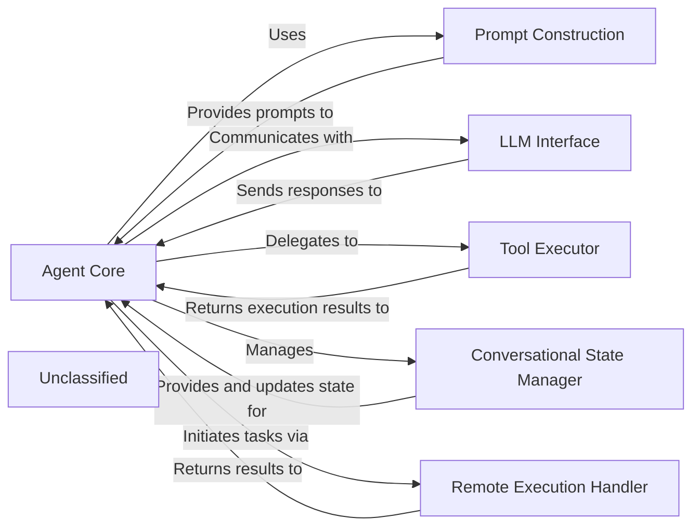
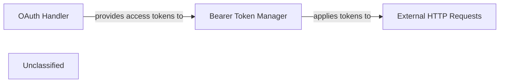
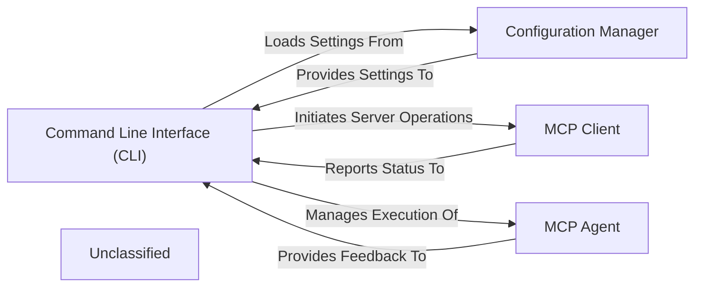
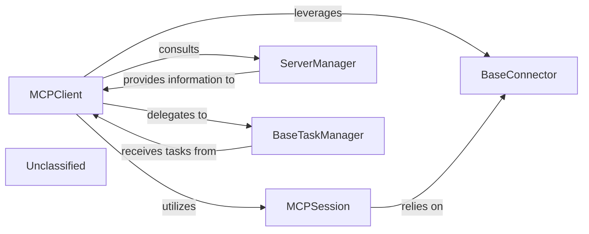
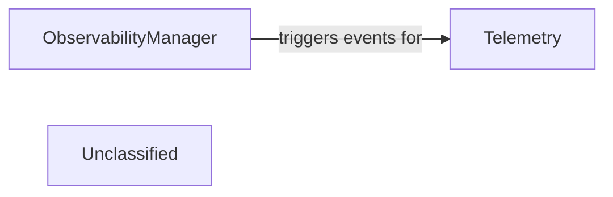
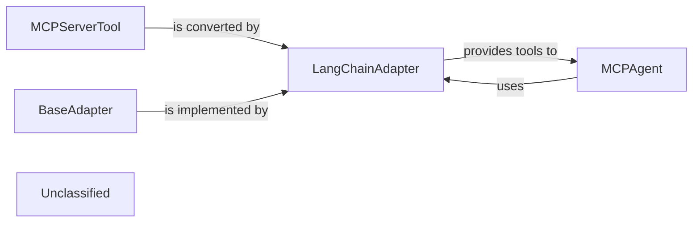
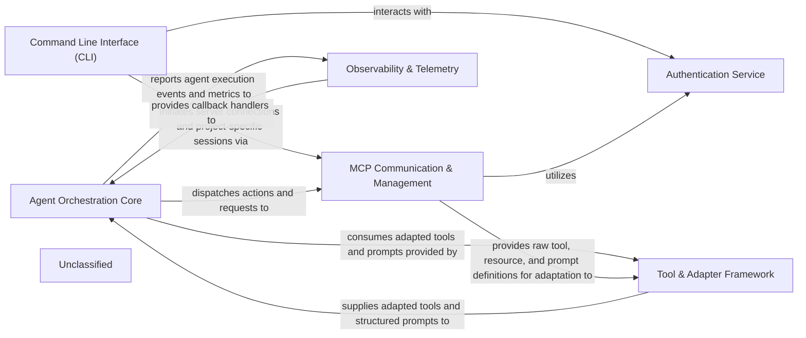

# Agent Orchestration Core

### Details

The `mcp-use` agent subsystem is designed around a central `Agent Core` that orchestrates interactions with various components to achieve its goals. It leverages a `Prompt Construction` module to dynamically generate context-rich prompts for the `LLM Interface`, which abstracts communication with large language models. For executing specific tasks, the `Agent Core` delegates to a `Tool Executor`, which manages the invocation of external capabilities. The `Conversational State Manager`, an intrinsic part of the `Agent Core`, maintains the dialogue history and context, ensuring coherent interactions. Additionally, a `Remote Execution Handler` allows the agent to offload tasks to remote MCP servers, extending its operational reach. This architecture emphasizes modularity, allowing for flexible integration of different LLMs and tools while maintaining a clear separation of concerns.

### Agent Core
The primary orchestrator and decision-making unit of the agent. It manages the overall flow, interprets LLM outputs, and decides on subsequent actions, including tool usage or further LLM interactions. It also encapsulates the conversational state management.

**Related Classes/Methods**:

- <a href="https://github.com/mcp-use/mcp-use/blob/main/mcp_use/agents/mcpagent.py#L48-L1145" target="_blank" rel="noopener noreferrer">QName:`mcp_use.agents.mcpagent.MCPAgent` FileRef: `mcp_use/agents/mcpagent.py`, Lines:(48:1145)</a>
- <a href="https://github.com/mcp-use/mcp-use/blob/main/mcp_use/agents/base.py#L13-L61" target="_blank" rel="noopener noreferrer">QName:`mcp_use.agents.base.BaseAgent` FileRef: `mcp_use/agents/base.py`, Lines:(13:61)</a>

### Prompt Construction
Responsible for dynamically generating and formatting prompts for the LLM, incorporating conversational context, available tools, and specific instructions to guide the LLM's behavior.

**Related Classes/Methods**:

- <a href="https://github.com/mcp-use/mcp-use/blob/main/mcp_use/agents/prompts/system_prompt_builder.py#L59-L103" target="_blank" rel="noopener noreferrer">QName:`mcp_use.agents.prompts.system_prompt_builder.create_system_message` FileRef: `mcp_use/agents/prompts/system_prompt_builder.py`, Lines:(59:103)</a>

### Remote Execution Handler
Manages the delegation and execution of tasks or tool calls on remote MCP (Multi-Component Platform) servers, handling the communication protocol and result retrieval.

**Related Classes/Methods**:

- <a href="https://github.com/mcp-use/mcp-use/blob/main/mcp_use/agents/remote.py#L34-L327" target="_blank" rel="noopener noreferrer">QName:`mcp_use.agents.remote.RemoteAgent` FileRef: `mcp_use/agents/remote.py`, Lines:(34:327)</a>

### LLM Interface
Provides a standardized abstraction layer for interacting with various Large Language Models, handling request formatting, sending prompts, and parsing responses.

**Related Classes/Methods**:

- <a href="https://github.com/mcp-use/mcp-use/blob/main/full/path/to/file.txt#L10-L25" target="_blank" rel="noopener noreferrer">QName:`langchain_core.language_models.BaseLanguageModel` FileRef: `full/path/to/file.txt`, Lines:(10:25)</a>

### Tool Executor
Manages the invocation and execution of external tools or internal functions that the agent decides to use to achieve its goals. It handles tool input, execution, and output processing.

**Related Classes/Methods**:

- QName:`langchain.agents.AgentExecutor` FileRef: ``

### Conversational State Manager
Responsible for maintaining and updating the ongoing conversational context, including message history, user inputs, and agent thoughts, ensuring coherent and context-aware interactions. This functionality is integrated within the `Agent Core`.

**Related Classes/Methods**:

- <a href="https://github.com/mcp-use/mcp-use/blob/main/mcp_use/agents/mcpagent.py#L48-L1145" target="_blank" rel="noopener noreferrer">QName:`mcp_use.agents.mcpagent.MCPAgent` FileRef: `mcp_use/agents/mcpagent.py`, Lines:(48:1145)</a>

### Unclassified
Component for all unclassified files and utility functions (Utility functions/External Libraries/Dependencies)

**Related Classes/Methods**: _None_

# Authentication Service

### Details

The authentication subsystem in `mcp_use.auth` is designed to handle OAuth 2.0 authentication flows and apply bearer tokens to outgoing HTTP requests. The `OAuth Handler` component, implemented by the `mcp_use.auth.oauth.OAuth` class, is responsible for orchestrating the OAuth process, including discovering server capabilities, dynamic client registration, and managing token storage. Once access tokens are acquired, the `Bearer Token Manager` component, implemented by `mcp_use.auth.bearer.BearerAuth`, takes these tokens and applies them as `Authorization: Bearer` headers to `External HTTP Requests`. This ensures secure communication with external services, such as MCP servers. The `OAuth Handler` provides the necessary access tokens to the `Bearer Token Manager`, which then uses them to authenticate `External HTTP Requests`.

### OAuth Handler
Manages the entire OAuth 2.0 protocol flow. This includes initiating authentication requests with external OAuth providers, handling redirects, and securely obtaining and storing access tokens. It acts as the primary interface for acquiring the necessary authentication credentials.

**Related Classes/Methods**:

- <a href="https://github.com/mcp-use/mcp-use/blob/main/mcp_use/auth/oauth.py#L167-L625" target="_blank" rel="noopener noreferrer">QName:`mcp_use.auth.oauth.OAuth` FileRef: `mcp_use/auth/oauth.py`, Lines:(167:625)</a>

### Bearer Token Manager
Responsible for taking an acquired access token (typically from the OAuth Handler) and correctly formatting it as a bearer token. It then integrates this token into the Authorization header of outgoing HTTP requests, ensuring secure and authenticated communication with MCP servers.

**Related Classes/Methods**:

- <a href="https://github.com/mcp-use/mcp-use/blob/main/mcp_use/auth/bearer.py#L9-L17" target="_blank" rel="noopener noreferrer">QName:`mcp_use.auth.bearer.BearerAuth` FileRef: `mcp_use/auth/bearer.py`, Lines:(9:17)</a>

### External HTTP Requests
Represents any HTTP requests made to external services or APIs, typically to MCP servers, that require authentication.

**Related Classes/Methods**:

- QName:`requests.request` FileRef: ``

### Unclassified
Component for all unclassified files and utility functions (Utility functions/External Libraries/Dependencies)

**Related Classes/Methods**: _None_

# Command Line Interface CLI

### Details

The `mcp-use` subsystem is orchestrated by the Command Line Interface (CLI), which serves as the primary user interaction point. The CLI is responsible for initiating various operations, including project setup and managing agent workflows. It interacts with the Configuration Manager to load and persist application and project-specific settings, ensuring consistent behavior across sessions. For interacting with external MCP servers, the CLI leverages the MCP Client, which handles communication, server command execution, and status reporting. The core intelligence of the system resides within the MCP Agent, which executes agentic workflows and integrates LLMs and tools. The CLI manages the execution of the MCP Agent and receives feedback on its operations. This architecture ensures a clear separation of concerns, with the CLI handling user input and orchestration, the Configuration Manager providing persistent settings, the MCP Client managing external server interactions, and the MCP Agent performing the core intelligent tasks.

### Command Line Interface (CLI)
The primary user interface for `mcp-use`, responsible for parsing command-line arguments, validating inputs, and dispatching commands to initiate project setup, manage server configurations, or execute agent workflows. It serves as the initial entry point for user interaction.

**Related Classes/Methods**:

- QName:`mcp_use.cli` FileRef: `mcp_use/cli.py`

### Configuration Manager
Manages the loading, saving, and access of all application and project-specific settings, including server endpoints, agent parameters, and tool configurations. It ensures persistent and consistent configuration across sessions. This component is crucial for any framework requiring customizable behavior.

**Related Classes/Methods**:

- QName:`mcp_use.config` FileRef: `mcp_use/config.py`

### MCP Client
Facilitates communication with external MCP (Multi-Agent Communication Protocol) servers. It handles connection establishment, sending requests (e.g., start server, get status), and processing responses, acting as the network interface for server interactions. This is essential for a framework that interacts with external services or agents.

**Related Classes/Methods**:

- <a href="https://github.com/mcp-use/mcp-use/blob/main/mcp_use/client.py#L21-L326" target="_blank" rel="noopener noreferrer">QName:`mcp_use.client.MCPClient` FileRef: `mcp_use/client.py`, Lines:(21:326)</a>

### MCP Agent
The core intelligent component responsible for executing agentic workflows, leveraging LLMs, and integrating various tools. The CLI can initiate, monitor, or configure aspects of its operation. This is the central "brain" of an LLM Agent Framework.

**Related Classes/Methods**:

- <a href="https://github.com/mcp-use/mcp-use/blob/main/mcp_use/agents/mcpagent.py#L48-L1145" target="_blank" rel="noopener noreferrer">QName:`mcp_use.agents.mcpagent.MCPAgent` FileRef: `mcp_use/agents/mcpagent.py`, Lines:(48:1145)</a>

### Unclassified
Component for all unclassified files and utility functions (Utility functions/External Libraries/Dependencies)

**Related Classes/Methods**: _None_

# MCP Communication Management

### Details

The mcp_use subsystem is designed to facilitate robust and flexible interaction with various MCP servers. At its core, the MCPClient acts as the central orchestrator, managing server configurations, session lifecycles, and task execution. It leverages the ServerManager to discover and manage available MCP servers and their associated tools, providing a centralized registry. For establishing and maintaining connections, MCPClient creates MCPSession instances, which in turn rely on BaseConnector to abstract the complexities of different communication protocols. Asynchronous or long-running operations are delegated to BaseTaskManager, ensuring efficient resource management and task completion. This architecture promotes modularity, allowing for easy integration of new server types and communication methods while maintaining a clear separation of concerns.

### MCPClient
Orchestrates direct communication with MCP servers, sending requests, and processing responses, acting as the agent's primary gateway to MCP services. It manages the overall interaction flow with the backend.

**Related Classes/Methods**:

- <a href="https://github.com/mcp-use/mcp-use/blob/main/mcp_use/client.py#L21-L326" target="_blank" rel="noopener noreferrer">QName:`mcp_use.client.MCPClient` FileRef: `mcp_use/client.py`, Lines:(21:326)</a>

### MCPSession
Manages the state and lifecycle of a connection to an MCP server, including authentication, session establishment, and graceful termination, ensuring reliable and secure communication channels.

**Related Classes/Methods**:

- <a href="https://github.com/mcp-use/mcp-use/blob/main/mcp_use/session.py#L17-L154" target="_blank" rel="noopener noreferrer">QName:`mcp_use.session.MCPSession` FileRef: `mcp_use/session.py`, Lines:(17:154)</a>

### BaseConnector
Provides an abstraction layer for connecting to diverse MCP server types, encapsulating the specifics of various communication protocols or APIs. This allows for flexible integration with different server implementations.

**Related Classes/Methods**:

- <a href="https://github.com/mcp-use/mcp-use/blob/main/mcp_use/connectors/base.py#L37-L453" target="_blank" rel="noopener noreferrer">QName:`mcp_use.connectors.base.BaseConnector` FileRef: `mcp_use/connectors/base.py`, Lines:(37:453)</a>

### ServerManager
Discovers, registers, and provides access to available MCP servers and their capabilities (e.g., tools), centralizing server configuration and lookup for the subsystem. It acts as a registry for available services.

**Related Classes/Methods**:

- <a href="https://github.com/mcp-use/mcp-use/blob/main/mcp_use/managers/server_manager.py#L11-L124" target="_blank" rel="noopener noreferrer">QName:`mcp_use.managers.server_manager.ServerManager` FileRef: `mcp_use/managers/server_manager.py`, Lines:(11:124)</a>

### BaseTaskManager
Manages the execution and lifecycle of tasks that involve interactions with MCP servers, particularly for asynchronous or long-running operations, ensuring proper handling, resource management, and result retrieval.

**Related Classes/Methods**:

- QName:`mcp_use.task_managers.base.BaseTaskManager` FileRef: `mcp_use/task_managers/base.py`

### Unclassified
Component for all unclassified files and utility functions (Utility functions/External Libraries/Dependencies)

**Related Classes/Methods**: _None_

# Observability Telemetry

### Details

The mcp_use project employs a modular architecture for observability and telemetry. The ObservabilityManager serves as a central point for handling various observability callbacks, facilitating flexible integration with platforms like Langfuse and Laminar, and enabling other components to register for event notifications. Concurrently, the Telemetry component is responsible for collecting and transmitting anonymized usage data, including agent execution details and package download information, to external services such as PostHog and Scarf. The ObservabilityManager generates events that the Telemetry component can consume, allowing for the capture of detailed operational metrics and insights, thereby ensuring robust, extensible, and maintainable observability and telemetry functionalities through a clear separation of concerns.

### Telemetry
This component is responsible for the collection, formatting, and potential transmission of various telemetry data types, including metrics, traces, and logs. It captures data pertaining to agent execution, tool utilization, and interactions with LLMs, providing insights into the system's operational health and performance.

**Related Classes/Methods**:

- <a href="https://github.com/mcp-use/mcp-use/blob/main/mcp_use/telemetry/telemetry.py#L52-L303" target="_blank" rel="noopener noreferrer">QName:`mcp_use.telemetry.telemetry.Telemetry` FileRef: `mcp_use/telemetry/telemetry.py`, Lines:(52:303)</a>

### ObservabilityManager
This component acts as a central hub for managing callbacks and event listeners. It allows other components within the agent framework, or external systems, to subscribe to and react to specific events that occur throughout the agent's lifecycle and execution flow. It effectively decouples event producers from event consumers.

**Related Classes/Methods**:

- <a href="https://github.com/mcp-use/mcp-use/blob/main/mcp_use/observability/callbacks_manager.py#L13-L132" target="_blank" rel="noopener noreferrer">QName:`mcp_use.observability.callbacks_manager.ObservabilityManager` FileRef: `mcp_use/observability/callbacks_manager.py`, Lines:(13:132)</a>

### Unclassified
Component for all unclassified files and utility functions (Utility functions/External Libraries/Dependencies)

**Related Classes/Methods**: _None_

# Tool Adapter Framework

### Details

The `mcp-use` system employs an adaptable architecture for tool integration, centered around the `BaseAdapter` and its `LangChainAdapter` implementation. `MCPServerTool` defines the standard for internal tools, which the `LangChainAdapter` then transforms into a format compatible with the LangChain framework. This allows the `MCPAgent` to seamlessly discover, manage, and execute these adapted tools, enabling flexible interaction with various external systems and functionalities.

### MCPServerTool
Defines the fundamental interface and common behavior for all tools that can be managed and utilized by the agent within the `mcp-use` system. It serves as the abstract contract for any actionable capability, inheriting from `langchain_core.tools.BaseTool`.

**Related Classes/Methods**:

- <a href="https://github.com/mcp-use/mcp-use/blob/main/mcp_use/managers/tools/base_tool.py#L6-L19" target="_blank" rel="noopener noreferrer">QName:`mcp_use.managers.tools.base_tool.MCPServerTool` FileRef: `mcp_use/managers/tools/base_tool.py`, Lines:(6:19)</a>

### BaseAdapter
Establishes the abstract contract for all adapters. It outlines the methods and properties required to transform MCP-specific tools, resources, or prompts into a format compatible with external frameworks.

**Related Classes/Methods**:

- <a href="https://github.com/mcp-use/mcp-use/blob/main/mcp_use/adapters/base.py#L20-L190" target="_blank" rel="noopener noreferrer">QName:`mcp_use.adapters.base.BaseAdapter` FileRef: `mcp_use/adapters/base.py`, Lines:(20:190)</a>

### LangChainAdapter
A concrete implementation of `BaseAdapter` specifically designed to convert `mcp-use` tools or resources into a format usable by the LangChain framework. This component ensures interoperability with LangChain agents.

**Related Classes/Methods**:

- <a href="https://github.com/mcp-use/mcp-use/blob/main/mcp_use/adapters/langchain_adapter.py#L29-L270" target="_blank" rel="noopener noreferrer">QName:`mcp_use.adapters.langchain_adapter.LangChainAdapter` FileRef: `mcp_use/adapters/langchain_adapter.py`, Lines:(29:270)</a>

### MCPAgent
Responsible for orchestrating and utilizing tools. It interacts with adapter implementations to ensure tool compatibility and makes them accessible for execution.

**Related Classes/Methods**:

- <a href="https://github.com/mcp-use/mcp-use/blob/main/mcp_use/agents/mcpagent.py#L48-L1145" target="_blank" rel="noopener noreferrer">QName:`mcp_use.agents.mcpagent.MCPAgent` FileRef: `mcp_use/agents/mcpagent.py`, Lines:(48:1145)</a>

### Unclassified
Component for all unclassified files and utility functions (Utility functions/External Libraries/Dependencies)

**Related Classes/Methods**: _None_

# overview

### Details

The `mcp-use` project is structured around a core `Agent Orchestration Core` that leverages external tools and services to interact with the Model Context Protocol (MCP). The `Command Line Interface (CLI)` serves as the primary entry point, allowing users to initiate and manage MCP projects. It interacts with the `MCP Communication & Management` component to establish and maintain connections with MCP servers, which in turn relies on the `Authentication Service` for secure access.

The `Agent Orchestration Core` is responsible for the intelligent orchestration of tasks, utilizing `Tool & Adapter Framework` to convert MCP-specific tools and resources into a format consumable by the agent (e.g., LangChain). This framework acts as an abstraction layer, ensuring interoperability. During its operation, the `Agent Orchestration Core` reports execution events and metrics to the `Observability & Telemetry` component, which provides insights into agent performance and behavior. Conversely, `Observability & Telemetry` also provides callback handlers to the `Agent Orchestration Core` for real-time event observation. The `MCP Communication & Management` component not only handles session management but also provides the raw tool, resource, and prompt definitions that the `Tool & Adapter Framework` then adapts for the agent's use. This architecture ensures a clear separation of concerns, enabling modular development and maintainability, while facilitating a robust and observable agent-server interaction.

### Agent Orchestration Core
The central intelligence unit, orchestrating LLM interactions, managing conversational state, and executing tools. It also handles dynamic prompt construction and remote execution.

**Related Classes/Methods**:

- QName:`mcp_use.agents.mcpagent.MCPAgent` FileRef: `mcp_use/agents/mcpagent.py`
- QName:`mcp_use.agents.base.BaseAgent` FileRef: `mcp_use/agents/base.py`
- QName:`mcp_use.agents.prompts.system_prompt_builder.create_system_message` FileRef: `mcp_use/agents/prompts/system_prompt_builder.py`
- QName:`mcp_use.agents.remote.RemoteAgent` FileRef: `mcp_use/agents/remote.py`

### MCP Communication & Management
Manages the establishment, maintenance, and termination of client sessions and connections to various MCP servers. It provides abstract and concrete implementations for different server types and handles server/tool discovery and management.

**Related Classes/Methods**:

- QName:`mcp_use.session.MCPSession` FileRef: `mcp_use/session.py`
- QName:`mcp_use.client.MCPClient` FileRef: `mcp_use/client.py`
- QName:`mcp_use.connectors.base.BaseConnector` FileRef: `mcp_use/connectors/base.py`
- QName:`mcp_use.managers.server_manager.ServerManager` FileRef: `mcp_use/managers/server_manager.py`
- QName:`mcp_use.task_managers.base.BaseTaskManager` FileRef: `mcp_use/task_managers/base.py`

### Tool & Adapter Framework
Provides an abstraction layer for adapting MCP-specific tools, resources, and prompts into a format usable by external frameworks (e.g., LangChain), ensuring interoperability.

**Related Classes/Methods**:

- QName:`mcp_use.adapters.base.BaseAdapter` FileRef: `mcp_use/adapters/base.py`
- QName:`mcp_use.adapters.langchain_adapter.LangChainAdapter` FileRef: `mcp_use/adapters/langchain_adapter.py`
- QName:`mcp_use.managers.tools.base_tool.BaseTool` FileRef: `mcp_use/managers/tools/base_tool.py`

### Authentication Service
Handles user authentication and authorization, primarily using OAuth, and manages bearer tokens for secure communication with MCP servers.

**Related Classes/Methods**:

- QName:`mcp_use.auth.oauth.OAuth` FileRef: `mcp_use/auth/oauth.py`
- QName:`mcp_use.auth.bearer.BearerAuth` FileRef: `mcp_use/auth/bearer.py`

### Command Line Interface (CLI)
Manages command-line interface operations for project setup, server configuration, and general utility commands, serving as the primary entry point for user interaction.

**Related Classes/Methods**:

- QName:`mcp_use.cli` FileRef: `mcp_use/cli.py`

### Observability & Telemetry
Provides mechanisms for collecting telemetry data, managing callbacks for observing agent events, and integrating with observability platforms.

**Related Classes/Methods**:

- QName:`mcp_use.telemetry.telemetry.Telemetry` FileRef: `mcp_use/telemetry/telemetry.py`
- QName:`mcp_use.observability.callbacks_manager.ObservabilityManager` FileRef: `mcp_use/observability/callbacks_manager.py`

### Unclassified
Component for all unclassified files and utility functions (Utility functions/External Libraries/Dependencies)

**Related Classes/Methods**: _None_

