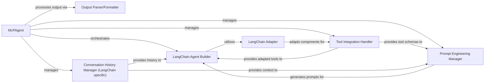
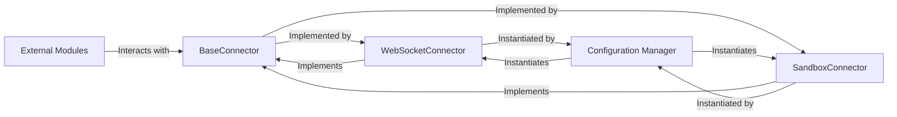
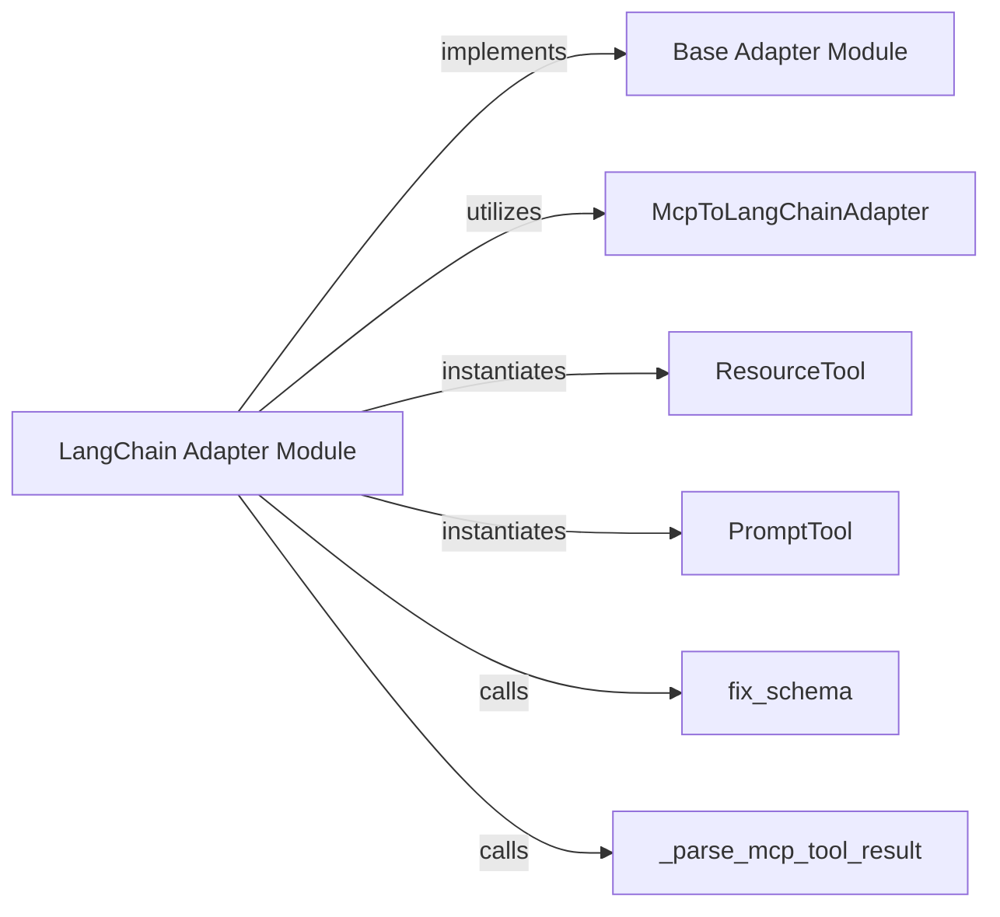
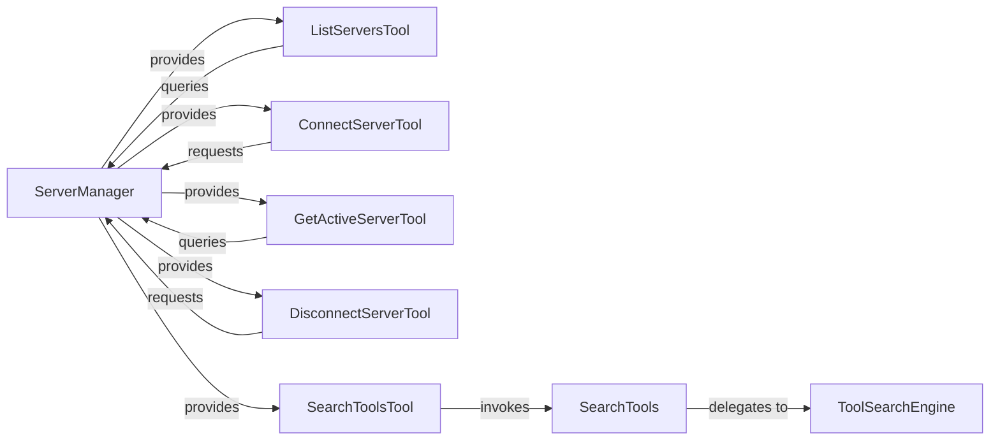

<Info>

```mermaid
graph LR
    Agent_Orchestration_Core["Agent Orchestration Core"]
    MCP_Client_Session_Manager["MCP Client & Session Manager"]
    MCP_Connectors["MCP Connectors"]
    Tool_Server_Manager["Tool & Server Manager"]
    Tool_Adapters["Tool Adapters"]
    LLM_Integration_Layer["LLM Integration Layer"]
    Configuration_Manager["Configuration Manager"]
    Agent_Orchestration_Core -- "requests_session_info" --> MCP_Client_Session_Manager
    Agent_Orchestration_Core -- "queries_available_tools" --> Tool_Server_Manager
    Agent_Orchestration_Core -- "receives_adapted_tools" --> Tool_Adapters
    Agent_Orchestration_Core -- "sends_prompts_for_execution" --> LLM_Integration_Layer
    Agent_Orchestration_Core -- "receives_execution_results" --> LLM_Integration_Layer
    MCP_Client_Session_Manager -- "establishes_connections" --> MCP_Connectors
    MCP_Client_Session_Manager -- "executes_tool_calls" --> MCP_Connectors
    MCP_Client_Session_Manager -- "receives_connection_configs" --> Configuration_Manager
    MCP_Connectors -- "provides_raw_tool_data" --> Tool_Server_Manager
    Tool_Server_Manager -- "requests_tool_definitions" --> MCP_Connectors
    Tool_Server_Manager -- "provides_raw_tool_definitions" --> Tool_Adapters
    Tool_Adapters -- "supplies_executable_tools" --> LLM_Integration_Layer
    LLM_Integration_Layer -- "invokes_adapted_tools" --> Tool_Adapters
    LLM_Integration_Layer -- "requests_tool_execution" --> MCP_Client_Session_Manager
    click Agent_Orchestration_Core href "/codeboarding/Agent_Orchestration_Core.md" "Details"
    click MCP_Client_Session_Manager href "/codeboarding/MCP_Client_Session_Manager.md" "Details"
    click MCP_Connectors href "/codeboarding/MCP_Connectors.md" "Details"
    click Tool_Server_Manager href "/codeboarding/Tool_Server_Manager.md" "Details"
    click Tool_Adapters href "/codeboarding/Tool_Adapters.md" "Details"
    click LLM_Integration_Layer href "/codeboarding/LLM_Integration_Layer.md" "Details"
```

This documentation was generated by [CodeBoarding](https://github.com/CodeBoarding/GeneratedOnBoardings) to provide comprehensive architectural insights into the mcp-agent framework.
</Info>

### Details

The `mcp-use` project implements an intelligent agent architecture designed for interacting with Multi-Cloud Platform (MCP) environments. At its core, the `Agent Orchestration Core` drives the decision-making process, leveraging an `LLM Integration Layer` built on LangChain for prompt execution and response generation. This core agent dynamically discovers and utilizes tools managed by the `Tool & Server Manager`, which in turn retrieves raw tool data from `MCP Connectors`. `Tool Adapters` play a crucial role in standardizing these raw tool definitions into a format consumable by the agent. All interactions with MCP environments, including tool execution and session management, are mediated by the `MCP Client & Session Manager`, which relies on `MCP Connectors` for low-level communication and receives its operational parameters from the `Configuration Manager`. This modular design ensures robust, scalable, and maintainable interactions with diverse MCP services.

### Agent Orchestration Core
The central intelligence, embodied by the MCP Agent (`mcpagent.py`), orchestrating LLM reasoning, conversation flow, tool selection, and response generation. It leverages the LLM Integration Layer for agent execution.

**Related Classes/Methods**:

- <a href="https://github.com/mcp-use/mcp-use/blob/main/mcp_use/agents/mcpagent.py#L1-L1" target="_blank" rel="noopener noreferrer">QName:`mcp_use/agents/mcpagent.py` FileRef: `/home/ubuntu/CodeBoarding/repo/mcp-use/mcp_use/agents/mcpagent.py`</a>
- <a href="https://github.com/mcp-use/mcp-use/blob/main/mcp_use/agents/prompts/system_prompt_builder.py#L1-L1" target="_blank" rel="noopener noreferrer">QName:`mcp_use/agents/prompts/system_prompt_builder.py` FileRef: `/home/ubuntu/CodeBoarding/repo/mcp-use/mcp_use/agents/prompts/system_prompt_builder.py`</a>

### MCP Client & Session Manager
Manages the lifecycle of connections and communication sessions with various MCP environments, acting as an intermediary for tool execution requests.

**Related Classes/Methods**:

- <a href="https://github.com/mcp-use/mcp-use/blob/main/mcp_use/session.py#L1-L1" target="_blank" rel="noopener noreferrer">QName:`mcp_use/session.py` FileRef: `/home/ubuntu/CodeBoarding/repo/mcp-use/mcp_use/session.py`</a>

### MCP Connectors
Provides concrete implementations for various communication protocols (e.g., WebSocket, Sandbox) to interact with MCP, handling the low-level communication.

**Related Classes/Methods**:

- <a href="https://github.com/mcp-use/mcp-use/blob/main/mcp_use/connectors/base.py#L1-L1" target="_blank" rel="noopener noreferrer">QName:`mcp_use/connectors/base.py` FileRef: `/home/ubuntu/CodeBoarding/repo/mcp-use/mcp_use/connectors/base.py`</a>
- <a href="https://github.com/mcp-use/mcp-use/blob/main/mcp_use/connectors/websocket.py#L1-L1" target="_blank" rel="noopener noreferrer">QName:`mcp_use/connectors/websocket.py` FileRef: `/home/ubuntu/CodeBoarding/repo/mcp-use/mcp_use/connectors/websocket.py`</a>
- <a href="https://github.com/mcp-use/mcp-use/blob/main/mcp_use/connectors/sandbox.py#L1-L1" target="_blank" rel="noopener noreferrer">QName:`mcp_use/connectors/sandbox.py` FileRef: `/home/ubuntu/CodeBoarding/repo/mcp-use/mcp_use/connectors/sandbox.py`</a>

### Tool & Server Manager
Manages the discovery, registration, and search of available tools across connected MCP servers.

**Related Classes/Methods**:

- <a href="https://github.com/mcp-use/mcp-use/blob/main/mcp_use/managers/server_manager.py#L1-L1" target="_blank" rel="noopener noreferrer">QName:`mcp_use/managers/server_manager.py` FileRef: `/home/ubuntu/CodeBoarding/repo/mcp-use/mcp_use/managers/server_manager.py`</a>
- <a href="https://github.com/mcp-use/mcp-use/blob/main/mcp_use/managers/tools/search_tools.py#L1-L1" target="_blank" rel="noopener noreferrer">QName:`mcp_use/managers/tools/search_tools.py` FileRef: `/home/ubuntu/CodeBoarding/repo/mcp-use/mcp_use/managers/tools/search_tools.py`</a>

### Tool Adapters
Receives raw tool definitions (e.g., from `Tool & Server Manager`) and standardizes them into a format consumable by the `Agent Orchestration Core` and `LLM Integration Layer`.

**Related Classes/Methods**:

- <a href="https://github.com/mcp-use/mcp-use/blob/main/mcp_use/adapters/langchain_adapter.py#L1-L1" target="_blank" rel="noopener noreferrer">QName:`mcp_use/adapters/langchain_adapter.py` FileRef: `/home/ubuntu/CodeBoarding/repo/mcp-use/mcp_use/adapters/langchain_adapter.py`</a>

### LLM Integration Layer
Encapsulates the underlying LangChain components, providing the framework and execution capabilities for the `Agent Orchestration Core` to build and run the LLM agent.

**Related Classes/Methods**:

- <a href="https://github.com/mcp-use/mcp-use/blob/main/mcp_use/agents/mcpagent.py#L1-L1" target="_blank" rel="noopener noreferrer">QName:`mcp_use/agents/mcpagent.py` FileRef: `/home/ubuntu/CodeBoarding/repo/mcp-use/mcp_use/agents/mcpagent.py`</a>

### Configuration Manager
Handles loading, parsing, and interpreting project-specific configurations, providing them to other components.

**Related Classes/Methods**:

- <a href="https://github.com/mcp-use/mcp-use/blob/main/mcp_use/config.py#L1-L1" target="_blank" rel="noopener noreferrer">QName:`mcp_use/config.py` FileRef: `/home/ubuntu/CodeBoarding/repo/mcp-use/mcp_use/config.py`</a>

# Agent Orchestration Core

### Details

The MCPAgent serves as the central control unit for the LLM agent, managing its lifecycle and interactions. A key aspect of its operation involves dynamically configuring the LLM's context through a system prompt. This is achieved by calling the `create_system_message` function, which acts as the `SystemPromptConstructor`. This function gathers tool descriptions, templates, and other contextual information to build a tailored system prompt. The `MCPAgent` then utilizes this constructed system prompt to initialize and guide its internal `AgentExecutor`, which is responsible for executing the LLM's reasoning and tool interactions. This clear separation of concerns ensures that prompt generation is modular and the `MCPAgent` remains focused on orchestration.

### MCPAgent
The MCPAgent is the core orchestrator of the LLM agent's lifecycle and execution. It manages the entire interaction flow, from processing user queries and maintaining conversation history to orchestrating LLM reasoning, selecting appropriate tools, and generating responses. It acts as the central decision-making unit, leveraging the `create_system_message` function to configure its LLM context and interacting with external layers for LLM execution and tool management.

**Related Classes/Methods**:

- <a href="https://github.com/mcp-use/mcp-use/blob/main/mcp_use/agents/mcpagent.py#L48-L1095" target="_blank" rel="noopener noreferrer">QName:`MCPAgent` FileRef: `/home/ubuntu/CodeBoarding/repo/mcp-use/mcp_use/agents/mcpagent.py`, Lines:(48:1095)</a>

### SystemPromptConstructor
The SystemPromptConstructor is a crucial utility function responsible for dynamically constructing the comprehensive system prompt that guides the `MCPAgent`'s behavior. This involves gathering and formatting tool descriptions, and integrating other contextual information to create an effective and well-structured prompt for the underlying LLM, ensuring the agent has the necessary context to perform its tasks.

**Related Classes/Methods**:

- <a href="https://github.com/mcp-use/mcp-use/blob/main/mcp_use/agents/prompts/system_prompt_builder.py#L59-L103" target="_blank" rel="noopener noreferrer">QName:`create_system_message` FileRef: `/home/ubuntu/CodeBoarding/repo/mcp-use/mcp_use/agents/prompts/system_prompt_builder.py`, Lines:(59:103)</a>

# LLM Integration Layer

### Details

The `mcp-use` agent subsystem is orchestrated by the `McPAgent`, which acts as the central control unit for building and managing LangChain-based conversational agents. It leverages a `LangChain Adapter` to seamlessly integrate various MCP-defined components (tools, resources, prompts) into the LangChain framework. The `McPAgent` interacts with a `LangChain Agent Builder` to construct the agent, a `Tool Integration Handler` for managing tool definitions, a `Prompt Engineering Manager` for dynamic prompt generation, and a `Conversation History Manager` to maintain context. Finally, an `Output Parser/Formatter` processes the agent's responses, ensuring structured and validated output. This architecture emphasizes modularity and adaptability, allowing for flexible agent configurations and interactions with diverse external capabilities.

### McPAgent
The central orchestrator of the agent's lifecycle, responsible for initialization, tool integration, prompt management, conversation history, and output processing. It coordinates interactions between various sub-components to create and manage the LangChain agent.

**Related Classes/Methods**:

- <a href="https://github.com/mcp-use/mcp-use/blob/main/mcp_use/agents/mcpagent.py#L48-L1095" target="_blank" rel="noopener noreferrer">QName:`mcp_use.agents.mcpagent.McPAgent` FileRef: `/home/ubuntu/CodeBoarding/repo/mcp-use/mcp_use/agents/mcpagent.py`, Lines:(48:1095)</a>
- <a href="https://github.com/mcp-use/mcp-use/blob/main/mcp_use/agents/mcpagent.py#L239-L275" target="_blank" rel="noopener noreferrer">QName:`mcp_use.agents.mcpagent.McPAgent:_create_agent` FileRef: `/home/ubuntu/CodeBoarding/repo/mcp-use/mcp_use/agents/mcpagent.py`, Lines:(239:275)</a>
- <a href="https://github.com/mcp-use/mcp-use/blob/main/mcp_use/agents/mcpagent.py#L216-L237" target="_blank" rel="noopener noreferrer">QName:`mcp_use.agents.mcpagent.McPAgent:_create_system_message_from_tools` FileRef: `/home/ubuntu/CodeBoarding/repo/mcp-use/mcp_use/agents/mcpagent.py`, Lines:(216:237)</a>
- <a href="https://github.com/mcp-use/mcp-use/blob/main/mcp_use/agents/mcpagent.py#L310-L330" target="_blank" rel="noopener noreferrer">QName:`mcp_use.agents.mcpagent.McPAgent:set_system_message` FileRef: `/home/ubuntu/CodeBoarding/repo/mcp-use/mcp_use/agents/mcpagent.py`, Lines:(310:330)</a>
- <a href="https://github.com/mcp-use/mcp-use/blob/main/mcp_use/agents/mcpagent.py#L871-L904" target="_blank" rel="noopener noreferrer">QName:`mcp_use.agents.mcpagent.McPAgent:_attempt_structured_output` FileRef: `/home/ubuntu/CodeBoarding/repo/mcp-use/mcp_use/agents/mcpagent.py`, Lines:(871:904)</a>
- <a href="https://github.com/mcp-use/mcp-use/blob/main/mcp_use/agents/mcpagent.py#L293-L300" target="_blank" rel="noopener noreferrer">QName:`mcp_use.agents.mcpagent.McPAgent:add_to_history` FileRef: `/home/ubuntu/CodeBoarding/repo/mcp-use/mcp_use/agents/mcpagent.py`, Lines:(293:300)</a>
- <a href="https://github.com/mcp-use/mcp-use/blob/main/mcp_use/agents/mcpagent.py#L906-L933" target="_blank" rel="noopener noreferrer">QName:`mcp_use.agents.mcpagent.McPAgent:_enhance_query_with_schema` FileRef: `/home/ubuntu/CodeBoarding/repo/mcp-use/mcp_use/agents/mcpagent.py`, Lines:(906:933)</a>

### LangChain Adapter
Adapts MCP tools, resources, and prompts into LangChain-compatible formats, enabling their seamless integration within the LangChain agent. It handles schema conversions and ensures proper execution of MCP components within the LangChain framework.

**Related Classes/Methods**:

- <a href="https://github.com/mcp-use/mcp-use/blob/main/mcp_use/adapters/langchain_adapter.py#L29-L268" target="_blank" rel="noopener noreferrer">QName:`mcp_use.adapters.langchain_adapter.LangChainAdapter` FileRef: `/home/ubuntu/CodeBoarding/repo/mcp-use/mcp_use/adapters/langchain_adapter.py`, Lines:(29:268)</a>

### LangChain Agent Builder
Responsible for constructing and configuring the core LangChain agent instance. This involves assembling the chosen LLM, integrated tools, dynamic prompt templates, and other LangChain runnables into a cohesive, executable agent.

**Related Classes/Methods**:

- <a href="https://github.com/mcp-use/mcp-use/blob/main/mcp_use/agents/mcpagent.py#L239-L275" target="_blank" rel="noopener noreferrer">QName:`mcp_use.agents.mcpagent.McPAgent:_create_agent` FileRef: `/home/ubuntu/CodeBoarding/repo/mcp-use/mcp_use/agents/mcpagent.py`, Lines:(239:275)</a>

### Tool Integration Handler
Manages the integration of external tools with the LangChain agent. This includes converting tool definitions into a format compatible with LangChain and generating structured tool schemas that can be incorporated into prompts for enhanced LLM reasoning.

**Related Classes/Methods**:

- <a href="https://github.com/mcp-use/mcp-use/blob/main/mcp_use/agents/mcpagent.py#L216-L237" target="_blank" rel="noopener noreferrer">QName:`mcp_use.agents.mcpagent.McPAgent:_create_system_message_from_tools` FileRef: `/home/ubuntu/CodeBoarding/repo/mcp-use/mcp_use/agents/mcpagent.py`, Lines:(216:237)</a>
- <a href="https://github.com/mcp-use/mcp-use/blob/main/mcp_use/agents/mcpagent.py#L906-L933" target="_blank" rel="noopener noreferrer">QName:`mcp_use.agents.mcpagent.McPAgent:_enhance_query_with_schema` FileRef: `/home/ubuntu/CodeBoarding/repo/mcp-use/mcp_use/agents/mcpagent.py`, Lines:(906:933)</a>

### Prompt Engineering Manager
Dynamically generates and manages the system prompts, few-shot examples, and other prompt elements required by the LLM. It incorporates tool schemas, conversation history, and specific instructions to guide the LLM's behavior and reasoning.

**Related Classes/Methods**:

- <a href="https://github.com/mcp-use/mcp-use/blob/main/mcp_use/agents/mcpagent.py#L310-L330" target="_blank" rel="noopener noreferrer">QName:`mcp_use.agents.mcpagent.McPAgent:set_system_message` FileRef: `/home/ubuntu/CodeBoarding/repo/mcp-use/mcp_use/agents/mcpagent.py`, Lines:(310:330)</a>
- <a href="https://github.com/mcp-use/mcp-use/blob/main/mcp_use/agents/mcpagent.py#L216-L237" target="_blank" rel="noopener noreferrer">QName:`mcp_use.agents.mcpagent.McPAgent:_create_system_message_from_tools` FileRef: `/home/ubuntu/CodeBoarding/repo/mcp-use/mcp_use/agents/mcpagent.py`, Lines:(216:237)</a>

### Output Parser/Formatter
Post-processes the raw output received from the LangChain agent. Its responsibilities include parsing the LLM's response into expected structured formats (e.g., JSON), performing validation, and handling potential errors or malformed outputs to ensure reliable data flow.

**Related Classes/Methods**:

- <a href="https://github.com/mcp-use/mcp-use/blob/main/mcp_use/agents/mcpagent.py#L871-L904" target="_blank" rel="noopener noreferrer">QName:`mcp_use.agents.mcpagent.McPAgent:_attempt_structured_output` FileRef: `/home/ubuntu/CodeBoarding/repo/mcp-use/mcp_use/agents/mcpagent.py`, Lines:(871:904)</a>

### Conversation History Manager (LangChain specific)
Manages the ongoing conversation history in a format compatible with LangChain's agent. It ensures that context is accurately maintained and provided to the LLM across multiple turns, facilitating coherent and stateful interactions.

**Related Classes/Methods**:

- <a href="https://github.com/mcp-use/mcp-use/blob/main/mcp_use/agents/mcpagent.py#L293-L300" target="_blank" rel="noopener noreferrer">QName:`mcp_use.agents.mcpagent.McPAgent:add_to_history` FileRef: `/home/ubuntu/CodeBoarding/repo/mcp-use/mcp_use/agents/mcpagent.py`, Lines:(293:300)</a>

# MCP Client Session Manager

### Details

The MCP subsystem is structured around two primary components: the `MCP Session Manager` and the `MCP Connection Handler`. The `MCP Session Manager` serves as the central orchestrator, managing the complete lifecycle of an MCP communication session. It is responsible for initiating, maintaining, and terminating sessions, providing a robust context for agent-tool interactions. This orchestration is achieved by interacting with the `MCP Connection Handler`, which is responsible for the low-level network connection. The `MCP Session Manager` initiates and terminates the physical connection through the `MCP Connection Handler` and also invokes or queries it for connection-related operations, ensuring a clear separation of concerns between session management and direct network communication.

### MCP Session Manager
This component orchestrates the complete lifecycle of an MCP communication session, from initial setup and connection establishment to graceful termination. It ensures that the session is properly initialized and closed, providing a reliable context for agent-tool interactions. It embodies the "Orchestration" pattern by coordinating the underlying connection.

**Related Classes/Methods**:

- <a href="https://github.com/mcp-use/mcp-use/blob/main/mcp_use/session.py#L39-L46" target="_blank" rel="noopener noreferrer">QName:`mcp_use.session.__aenter__` FileRef: `/home/ubuntu/CodeBoarding/repo/mcp-use/mcp_use/session.py`, Lines:(39:46)</a>
- <a href="https://github.com/mcp-use/mcp-use/blob/main/mcp_use/session.py#L48-L56" target="_blank" rel="noopener noreferrer">QName:`mcp_use.session.__aexit__` FileRef: `/home/ubuntu/CodeBoarding/repo/mcp-use/mcp_use/session.py`, Lines:(48:56)</a>
- <a href="https://github.com/mcp-use/mcp-use/blob/main/mcp_use/session.py#L66-L79" target="_blank" rel="noopener noreferrer">QName:`mcp_use.session.initialize` FileRef: `/home/ubuntu/CodeBoarding/repo/mcp-use/mcp_use/session.py`, Lines:(66:79)</a>

### MCP Connection Handler
This component manages the low-level network connection to a specific MCP environment. It provides the fundamental capabilities for establishing, maintaining, and closing the physical communication link, acting as the direct interface to the MCP server. It represents the "Client" aspect of the Client-Server Architecture.

**Related Classes/Methods**:

- <a href="https://github.com/mcp-use/mcp-use/blob/main/mcp_use/session.py#L58-L60" target="_blank" rel="noopener noreferrer">QName:`mcp_use.session.connect` FileRef: `/home/ubuntu/CodeBoarding/repo/mcp-use/mcp_use/session.py`, Lines:(58:60)</a>
- <a href="https://github.com/mcp-use/mcp-use/blob/main/mcp_use/session.py#L62-L64" target="_blank" rel="noopener noreferrer">QName:`mcp_use.session.disconnect` FileRef: `/home/ubuntu/CodeBoarding/repo/mcp-use/mcp_use/session.py`, Lines:(62:64)</a>
- <a href="https://github.com/mcp-use/mcp-use/blob/main/mcp_use/session.py#L81-L88" target="_blank" rel="noopener noreferrer">QName:`mcp_use.session.is_connected` FileRef: `/home/ubuntu/CodeBoarding/repo/mcp-use/mcp_use/session.py`, Lines:(81:88)</a>

# MCP Connectors

### Details

The MCP Connectors subsystem provides foundational interfaces and concrete implementations for various communication protocols used to interact with the Multi-Agent Communication Protocol (MCP).

### BaseConnector
An abstract base class that establishes the contract for all MCP communication. It defines a consistent interface for core operations such as connecting, disconnecting, initializing, calling tools, listing resources, and making general requests to the MCP. This component is crucial for enforcing a standardized interaction model across different communication protocols.

**Related Classes/Methods**:

- <a href="https://github.com/mcp-use/mcp-use/blob/main/mcp_use/connectors/base.py#L37-L453" target="_blank" rel="noopener noreferrer">QName:`BaseConnector` FileRef: `/home/ubuntu/CodeBoarding/repo/mcp-use/mcp_use/connectors/base.py`, Lines:(37:453)</a>

### WebSocketConnector
A concrete implementation of `BaseConnector` specifically designed for WebSocket-based communication with the MCP. It handles the low-level details of establishing and managing connections over the WebSocket protocol, translating abstract MCP operations into WebSocket messages.

**Related Classes/Methods**:

- <a href="https://github.com/mcp-use/mcp-use/blob/main/mcp_use/connectors/websocket.py#L21-L248" target="_blank" rel="noopener noreferrer">QName:`WebSocketConnector` FileRef: `/home/ubuntu/CodeBoarding/repo/mcp-use/mcp_use/connectors/websocket.py`, Lines:(21:248)</a>

### SandboxConnector
A concrete implementation of `BaseConnector` tailored for interacting with the MCP within a sandboxed environment. This connector abstracts the complexities of a sandboxed execution context, allowing agents to safely perform operations without direct system access.

**Related Classes/Methods**:

- <a href="https://github.com/mcp-use/mcp-use/blob/main/mcp_use/connectors/sandbox.py#L35-L302" target="_blank" rel="noopener noreferrer">QName:`SandboxConnector` FileRef: `/home/ubuntu/CodeBoarding/repo/mcp-use/mcp_use/connectors/sandbox.py`, Lines:(35:302)</a>

### Configuration Manager
Responsible for dynamically instantiating the appropriate concrete `BaseConnector` implementation (e.g., `WebSocketConnector`, `SandboxConnector`) based on the application's configuration. It acts as a factory for connectors, decoupling their creation from their usage.

**Related Classes/Methods**:

- <a href="https://github.com/mcp-use/mcp-use/blob/main/mcp_use/config.py#L31-L99" target="_blank" rel="noopener noreferrer">QName:`create_connector_from_config` FileRef: `/home/ubuntu/CodeBoarding/repo/mcp-use/mcp_use/config.py`, Lines:(31:99)</a>

### External Modules
Represents any module or component within the broader LLM Agent Framework that needs to interact with the MCP. These modules utilize the `BaseConnector` interface to perform operations like calling tools, listing resources, or sending requests, without needing to know the underlying communication protocol.

**Related Classes/Methods**:

- <a href="https://github.com/mcp-use/mcp-use/blob/main/mcp_use/adapters/base.py#L1-L1" target="_blank" rel="noopener noreferrer">QName:`mcp_use/adapters/base.py` FileRef: `/home/ubuntu/CodeBoarding/repo/mcp-use/mcp_use/adapters/base.py`</a>

# Tool Adapters

### Details

The `Tool Adapters` subsystem is responsible for standardizing raw tool definitions into a format consumable by the `Agent Orchestration Core` and `LLM Integration Layer`. It acts as a crucial intermediary, ensuring seamless integration of diverse tools within the LLM agent framework.

### Base Adapter Module
Defines the abstract interface (BaseAdapter) and common workflow for creating and loading tools from various connectors. It establishes the contract for how different tool types (generic tools, resources, prompts) should be converted, ensuring extensibility for future adapter implementations.

**Related Classes/Methods**:

- <a href="https://github.com/mcp-use/mcp-use/blob/main/mcp_use/adapters/base.py#L20-L190" target="_blank" rel="noopener noreferrer">QName:`BaseAdapter` FileRef: `/home/ubuntu/CodeBoarding/repo/mcp-use/mcp_use/adapters/base.py`, Lines:(20:190)</a>

### LangChain Adapter Module
Implements the concrete logic for adapting generic MCP tool definitions (including resources and prompts) into the LangChain framework's tool format. It orchestrates the conversion process, handles schema normalization, and manages result parsing specific to LangChain.

**Related Classes/Methods**:

- <a href="https://github.com/mcp-use/mcp-use/blob/main/mcp_use/adapters/langchain_adapter.py#L1-L1" target="_blank" rel="noopener noreferrer">QName:`LangChain Adapter Module` FileRef: `/home/ubuntu/CodeBoarding/repo/mcp-use/mcp_use/adapters/langchain_adapter.py`</a>

### McpToLangChainAdapter
Directly translates a raw MCP tool definition (containing name, description, and input schema) into a structured LangChain `Tool` object, making it compatible with LangChain agents and the LLM Integration Layer. It's the core translation engine.

**Related Classes/Methods**:

- <a href="https://github.com/mcp-use/mcp-use/blob/main/mcp_use/adapters/langchain_adapter.py#L119-L168" target="_blank" rel="noopener noreferrer">QName:`McpToLangChainAdapter` FileRef: `/home/ubuntu/CodeBoarding/repo/mcp-use/mcp_use/adapters/langchain_adapter.py`, Lines:(119:168)</a>

### ResourceTool
Represents and encapsulates an external resource (e.g., a file, a service endpoint) as a LangChain-compatible tool. This allows agents to interact with and leverage various resources through a standardized LangChain tool interface.

**Related Classes/Methods**:

- <a href="https://github.com/mcp-use/mcp-use/blob/main/mcp_use/adapters/langchain_adapter.py#L182-L209" target="_blank" rel="noopener noreferrer">QName:`ResourceTool` FileRef: `/home/ubuntu/CodeBoarding/repo/mcp-use/mcp_use/adapters/langchain_adapter.py`, Lines:(182:209)</a>

### PromptTool
Represents and encapsulates a dynamic prompt or prompt template as a LangChain-compatible tool. This enables agents to dynamically access, manage, and utilize prompts within the LangChain framework, supporting flexible prompt engineering.

**Related Classes/Methods**:

- <a href="https://github.com/mcp-use/mcp-use/blob/main/mcp_use/adapters/langchain_adapter.py#L247-L266" target="_blank" rel="noopener noreferrer">QName:`PromptTool` FileRef: `/home/ubuntu/CodeBoarding/repo/mcp-use/mcp_use/adapters/langchain_adapter.py`, Lines:(247:266)</a>

### fix_schema
A utility function that normalizes and adjusts the input schema of tool definitions. Its purpose is to resolve any discrepancies and ensure the schema is compatible with LangChain's expected format, preventing parsing errors during tool invocation.

**Related Classes/Methods**:

- <a href="https://github.com/mcp-use/mcp-use/blob/main/mcp_use/adapters/langchain_adapter.py#L41-L56" target="_blank" rel="noopener noreferrer">QName:`fix_schema` FileRef: `/home/ubuntu/CodeBoarding/repo/mcp-use/mcp_use/adapters/langchain_adapter.py`, Lines:(41:56)</a>

### _parse_mcp_tool_result
Processes and parses the raw output received from an adapted MCP tool after its execution. It converts this output into a structured and usable format suitable for consumption by the Agent Orchestration Core or the LLM Integration Layer.

**Related Classes/Methods**:

- <a href="https://github.com/mcp-use/mcp-use/blob/main/mcp_use/adapters/langchain_adapter.py#L58-L100" target="_blank" rel="noopener noreferrer">QName:`_parse_mcp_tool_result` FileRef: `/home/ubuntu/CodeBoarding/repo/mcp-use/mcp_use/adapters/langchain_adapter.py`, Lines:(58:100)</a>

# Tool Server Manager

### Details

The Server Management subsystem is orchestrated by the ServerManager, which serves as the central component for handling MCP server connections and dynamically providing a suite of tools. The ServerManager directly instantiates and offers essential Management Tools such as ListServersTool, ConnectServerTool, GetActiveServerTool, DisconnectServerTool, and SearchToolsTool. These tools enable agents to interact with and manage server states. For dynamic tool discovery, the ToolSearchEngine provides core indexing and semantic search capabilities, which are exposed through the SearchTools adapter. The SearchToolsTool, provided by the ServerManager, allows agents to leverage this search functionality. This architecture emphasizes a clear separation of concerns, with the ServerManager acting as a unified interface for server operations and tool provisioning, while the ToolSearchEngine handles the complexities of tool discovery.

### ServerManager
The central orchestrator for MCP server connections and dynamic tool provision. It manages server sessions, pre-fetches server-specific tools, and directly instantiates core server management tools. This component is crucial for the "Client-Server Architecture" and "Orchestration" patterns, managing the lifecycle and availability of server-centric functionalities.

**Related Classes/Methods**:

- <a href="https://github.com/mcp-use/mcp-use/blob/main/mcp_use/managers/server_manager.py#L11-L124" target="_blank" rel="noopener noreferrer">QName:`mcp_use.managers.server_manager.ServerManager` FileRef: `/home/ubuntu/CodeBoarding/repo/mcp-use/mcp_use/managers/server_manager.py`, Lines:(11:124)</a>

### ToolSearchEngine
Provides the core functionality for indexing and semantically searching tools, including embedding model loading and cosine similarity calculations. It is central to the "Tool-use/Function Calling" pattern, enabling dynamic tool discovery.

**Related Classes/Methods**:

- <a href="https://github.com/mcp-use/mcp-use/blob/main/mcp_use/managers/tools/search_tools.py#L58-L328" target="_blank" rel="noopener noreferrer">QName:`mcp_use.managers.tools.search_tools.ToolSearchEngine` FileRef: `/home/ubuntu/CodeBoarding/repo/mcp-use/mcp_use/managers/tools/search_tools.py`, Lines:(58:328)</a>

### SearchTools
A callable tool that acts as an adapter for the `ToolSearchEngine`, making tool discovery accessible within the agent framework. This component embodies the "Adapter Pattern".

**Related Classes/Methods**:

- <a href="https://github.com/mcp-use/mcp-use/blob/main/mcp_use/managers/tools/search_tools.py#L23-L55" target="_blank" rel="noopener noreferrer">QName:`mcp_use.managers.tools.search_tools.SearchTools` FileRef: `/home/ubuntu/CodeBoarding/repo/mcp-use/mcp_use/managers/tools/search_tools.py`, Lines:(23:55)</a>

### ListServersTool
A concrete management tool provided by `ServerManager` to list all currently connected MCP servers. It encapsulates the logic for interacting with the server registry to retrieve server information.

**Related Classes/Methods**:

- <a href="https://github.com/mcp-use/mcp-use/blob/main/mcp_use/managers/tools/list_servers_tool.py#L17-L54" target="_blank" rel="noopener noreferrer">QName:`mcp_use.managers.tools.list_servers_tool.ListServersTool` FileRef: `/home/ubuntu/CodeBoarding/repo/mcp-use/mcp_use/managers/tools/list_servers_tool.py`, Lines:(17:54)</a>

### ConnectServerTool
A concrete management tool provided by `ServerManager` to initiate a connection to a specified MCP server. This tool provides the functionality to manage server connections directly.

**Related Classes/Methods**:

### GetActiveServerTool
A concrete management tool provided by `ServerManager` for identifying and returning information about the currently active MCP server. This tool provides a focused capability for querying the active server's status.

**Related Classes/Methods**:

- <a href="https://github.com/mcp-use/mcp-use/blob/main/mcp_use/managers/tools/get_active_server.py#L14-L29" target="_blank" rel="noopener noreferrer">QName:`mcp_use.managers.tools.get_active_server.GetActiveServerTool` FileRef: `/home/ubuntu/CodeBoarding/repo/mcp-use/mcp_use/managers/tools/get_active_server.py`, Lines:(14:29)</a>

### DisconnectServerTool
A concrete management tool provided by `ServerManager` for initiating a disconnection from a specified MCP server. This tool provides the functionality to manage server connections directly.

**Related Classes/Methods**:

- <a href="https://github.com/mcp-use/mcp-use/blob/main/mcp_use/managers/tools/disconnect_server.py#L17-L44" target="_blank" rel="noopener noreferrer">QName:`mcp_use.managers.tools.disconnect_server.DisconnectServerTool` FileRef: `/home/ubuntu/CodeBoarding/repo/mcp-use/mcp_use/managers/tools/disconnect_server.py`, Lines:(17:44)</a>

### SearchToolsTool
A concrete management tool provided by `ServerManager` that exposes the `SearchTools` functionality, allowing agents to dynamically search for available tools.

**Related Classes/Methods**:

