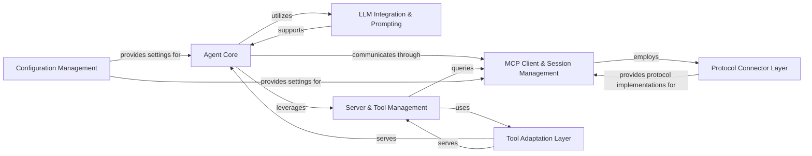
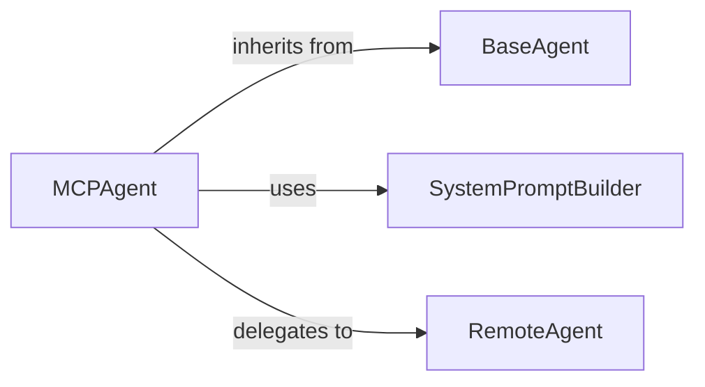
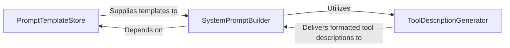
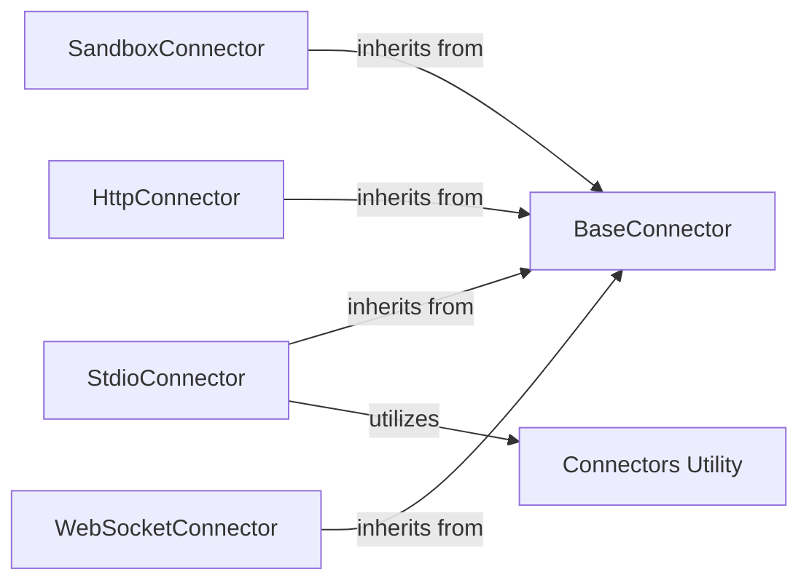
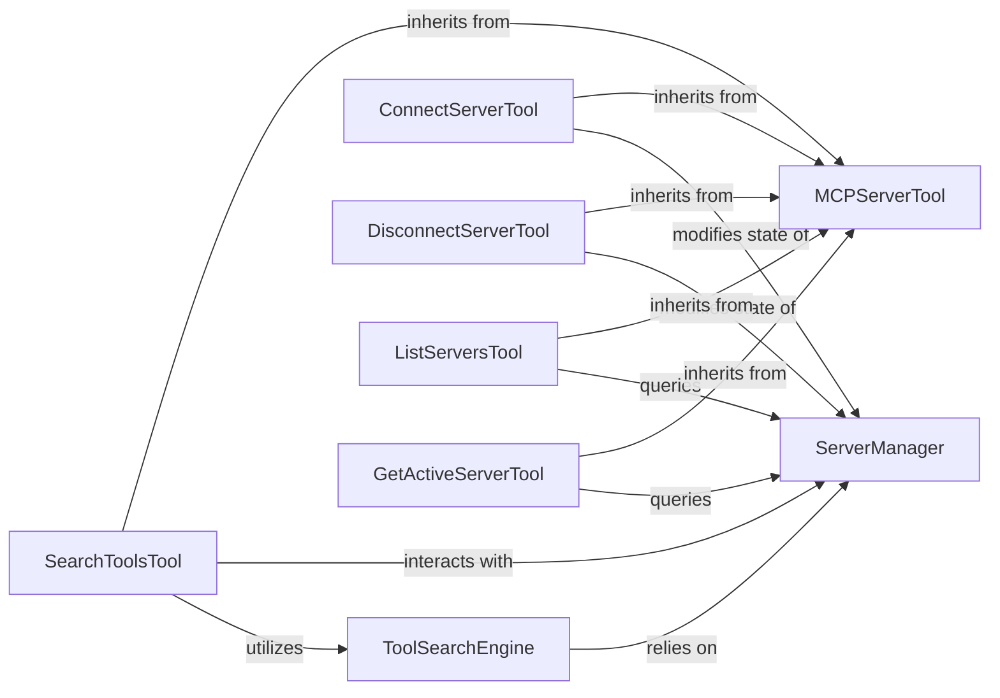
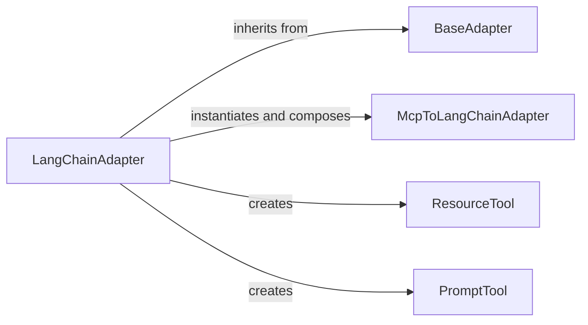

<Info>
This documentation was generated by [CodeBoarding](https://github.com/CodeBoarding/GeneratedOnBoardings) to provide comprehensive architectural insights into the mcp-agent framework.
</Info>

### Details

The `mcp-use` project serves as an AI agent framework, designed to orchestrate complex interactions with Large Language Models (LLMs) and external tools. Its core functionality revolves around an `Agent Core` that manages conversational flow and tool utilization. This core integrates with an `LLM Integration & Prompting` component for dynamic prompt generation and LLM communication. Communication with backend services and external tools is facilitated by the `MCP Client & Session Management` layer, which leverages a `Protocol Connector Layer` for various communication protocols. `Server & Tool Management` handles the discovery and organization of available tools, while a `Tool Adaptation Layer` ensures compatibility between generic MCP tool definitions and specific AI frameworks. Finally, `Configuration Management` provides essential system-wide settings, ensuring the framework operates with correct parameters.

### Agent Core
The central intelligence unit orchestrating AI agent behavior, conversation flow, and tool coordination.


**Related Classes/Methods**:

- <a href="https://github.com/mcp-use/mcp-use/blob/main/mcp_use/agents#L1-L1" target="_blank" rel="noopener noreferrer">QName:`mcp_use.agents` FileRef: `/home/ubuntu/CodeBoarding/repo/mcp-use/mcp_use/agents`</a>


### LLM Integration & Prompting
Manages interactions with Large Language Models, including dynamic prompt construction and response handling.


**Related Classes/Methods**:

- <a href="https://github.com/mcp-use/mcp-use/blob/main/mcp_use/agents/prompts#L1-L1" target="_blank" rel="noopener noreferrer">QName:`mcp_use.agents.prompts` FileRef: `/home/ubuntu/CodeBoarding/repo/mcp-use/mcp_use/agents/prompts`</a>


### MCP Client & Session Management
Handles the establishment, maintenance, and termination of connections and sessions with MCP backend servers, including low-level I/O.


**Related Classes/Methods**:

- <a href="https://github.com/mcp-use/mcp-use/blob/main/mcp_use/client.py#L28-L59" target="_blank" rel="noopener noreferrer">QName:`mcp_use.client` FileRef: `/home/ubuntu/CodeBoarding/repo/mcp-use/mcp_use/client.py`, Lines:(28:59)</a>
- <a href="https://github.com/mcp-use/mcp-use/blob/main/mcp_use/session.py#L20-L33" target="_blank" rel="noopener noreferrer">QName:`mcp_use.session` FileRef: `/home/ubuntu/CodeBoarding/repo/mcp-use/mcp_use/session.py`, Lines:(20:33)</a>
- <a href="https://github.com/mcp-use/mcp-use/blob/main/mcp_use/task_managers#L1-L1" target="_blank" rel="noopener noreferrer">QName:`mcp_use.task_managers` FileRef: `/home/ubuntu/CodeBoarding/repo/mcp-use/mcp_use/task_managers`</a>


### Protocol Connector Layer
Provides a standardized abstraction for various communication protocols (e.g., HTTP, WebSocket, Stdio, Sandbox).


**Related Classes/Methods**:

- <a href="https://github.com/mcp-use/mcp-use/blob/main/mcp_use/connectors#L1-L1" target="_blank" rel="noopener noreferrer">QName:`mcp_use.connectors` FileRef: `/home/ubuntu/CodeBoarding/repo/mcp-use/mcp_use/connectors`</a>


### Server & Tool Management
Responsible for discovering, organizing, and providing access to tools exposed by connected servers.


**Related Classes/Methods**:

- <a href="https://github.com/mcp-use/mcp-use/blob/main/mcp_use/managers/server_manager.py#L17-L28" target="_blank" rel="noopener noreferrer">QName:`mcp_use.managers.server_manager` FileRef: `/home/ubuntu/CodeBoarding/repo/mcp-use/mcp_use/managers/server_manager.py`, Lines:(17:28)</a>
- <a href="https://github.com/mcp-use/mcp-use/blob/main/mcp_use/managers/tools#L1-L1" target="_blank" rel="noopener noreferrer">QName:`mcp_use.managers.tools` FileRef: `/home/ubuntu/CodeBoarding/repo/mcp-use/mcp_use/managers/tools`</a>


### Tool Adaptation Layer
Acts as a bridge, converting generic MCP tool definitions into formats consumable by specific AI frameworks.


**Related Classes/Methods**:

- <a href="https://github.com/mcp-use/mcp-use/blob/main/mcp_use/adapters#L1-L1" target="_blank" rel="noopener noreferrer">QName:`mcp_use.adapters` FileRef: `/home/ubuntu/CodeBoarding/repo/mcp-use/mcp_use/adapters`</a>


### Configuration Management
Handles the loading, parsing, and validation of configuration files for system-wide parameters.


**Related Classes/Methods**:

- <a href="https://github.com/mcp-use/mcp-use/blob/main/mcp_use/config/__init__.py#L1-L1" target="_blank" rel="noopener noreferrer">QName:`mcp_use.config` FileRef: `/home/ubuntu/CodeBoarding/repo/mcp-use/mcp_use/config/__init__.py`</a>


# Agent Core


### Details

The Agent Core subsystem is the central intelligence unit responsible for orchestrating AI agent behavior, managing conversation flow, and coordinating tool usage within the mcp_use project. It is primarily encapsulated within the mcp_use.agents package.

### MCPAgent
The central orchestrator and concrete implementation of an AI agent. It manages the agent's reasoning loop, maintains conversation history, integrates with Large Language Models (LLMs), handles tool execution, and processes structured outputs. It embodies the core intelligence and operational flow of the agent.


**Related Classes/Methods**:

- <a href="https://github.com/mcp-use/mcp-use/blob/main/mcp_use/agents/mcpagent.py#L44-L1011" target="_blank" rel="noopener noreferrer">QName:`mcp_use.agents.mcpagent.MCPAgent` FileRef: `/home/ubuntu/CodeBoarding/repo/mcp-use/mcp_use/agents/mcpagent.py`, Lines:(44:1011)</a>


### BaseAgent
An abstract base class that defines the foundational interface and common behaviors for all agents within the framework. It establishes a contract for agent lifecycle management (e.g., initialization, execution, querying) and state tracking (e.g., maximum steps, previous steps).


**Related Classes/Methods**:

- <a href="https://github.com/mcp-use/mcp-use/blob/main/mcp_use/agents/base.py#L13-L61" target="_blank" rel="noopener noreferrer">QName:`mcp_use.agents.base.BaseAgent` FileRef: `/home/ubuntu/CodeBoarding/repo/mcp-use/mcp_use/agents/base.py`, Lines:(13:61)</a>


### SystemPromptBuilder
A utility component responsible for dynamically constructing the system prompt provided to the LLM. It incorporates descriptions of available tools, additional instructions, and selects appropriate prompt templates based on the agent's configuration.


**Related Classes/Methods**:

- <a href="https://github.com/mcp-use/mcp-use/blob/main/mcp_use/agents/prompts/system_prompt_builder.py#L1-L1000" target="_blank" rel="noopener noreferrer">QName:`mcp_use.agents.prompts.system_prompt_builder.SystemPromptBuilder` FileRef: `/home/ubuntu/CodeBoarding/repo/mcp-use/mcp_use/agents/prompts/system_prompt_builder.py`, Lines:(1:1000)</a>


### RemoteAgent
A specialized agent implementation or a component that facilitates communication with external, remotely hosted agent services. It handles the serialization of requests, deserialization of responses, and manages underlying network interactions (e.g., API keys, base URLs). It also includes logic for parsing structured output received from remote services.


**Related Classes/Methods**:

- <a href="https://github.com/mcp-use/mcp-use/blob/main/mcp_use/agents/remote.py#L18-L239" target="_blank" rel="noopener noreferrer">QName:`mcp_use.agents.remote.RemoteAgent` FileRef: `/home/ubuntu/CodeBoarding/repo/mcp-use/mcp_use/agents/remote.py`, Lines:(18:239)</a>


# LLM Integration Prompting


### Details

The LLM Integration & Prompting subsystem is responsible for constructing and managing the prompts sent to Large Language Models. Its boundaries encompass the storage of prompt templates, the dynamic generation of tool descriptions, and the final assembly of the system prompt.

### PromptTemplateStore
Manages and provides access to predefined system prompt templates, acting as a centralized repository for various prompt structures. This component ensures consistency and configurability in prompt generation, aligning with the "Configuration-Driven" and "Modular Design" architectural patterns.


**Related Classes/Methods**:

- <a href="https://github.com/mcp-use/mcp-use/blob/main/mcp_use/agents/prompts/templates.py#L1-L1" target="_blank" rel="noopener noreferrer">QName:`PromptTemplateStore` FileRef: `/home/ubuntu/CodeBoarding/repo/mcp-use/mcp_use/agents/prompts/templates.py`</a>


### ToolDescriptionGenerator
Dynamically generates and formats descriptions of the tools available to the agent, including logic for handling disallowed tools. This is critical for the "Tool Abstraction and Registry" pattern, enabling the LLM to accurately understand and utilize its capabilities.


**Related Classes/Methods**:

- <a href="https://github.com/mcp-use/mcp-use/blob/main/mcp_use/agents/prompts/system_prompt_builder.py#L5-L25" target="_blank" rel="noopener noreferrer">QName:`generate_tool_descriptions` FileRef: `/home/ubuntu/CodeBoarding/repo/mcp-use/mcp_use/agents/prompts/system_prompt_builder.py`, Lines:(5:25)</a>


### SystemPromptBuilder
The orchestrating component responsible for constructing the complete system prompt. It selects appropriate base templates, integrates dynamically generated tool descriptions, and incorporates additional instructions. This component directly embodies the "LLM Integration Layer" by preparing the final input for the AI model.


**Related Classes/Methods**:

- <a href="https://github.com/mcp-use/mcp-use/blob/main/mcp_use/agents/prompts/system_prompt_builder.py#L1-L1" target="_blank" rel="noopener noreferrer">QName:`SystemPromptBuilder` FileRef: `/home/ubuntu/CodeBoarding/repo/mcp-use/mcp_use/agents/prompts/system_prompt_builder.py`</a>


# MCP Client Session Management
```mermaid
graph LR
```

### Details

One paragraph explaining the functionality which is represented by this graph. What the main flow is and what is its purpose.


# Protocol Connector Layer


### Details

The `mcp_use.connectors` subsystem is designed to provide a flexible and extensible framework for various communication protocols. The core of this subsystem is the `BaseConnector` abstract class, which defines a unified interface for all connectors, ensuring consistent interaction patterns for operations like connecting, disconnecting, and handling agent requests (e.g., calling tools, listing resources, managing prompts). Concrete implementations like `SandboxConnector`, `StdioConnector`, `HttpConnector`, and `WebSocketConnector` extend this base, each specializing in a particular communication medium. The `Connectors Utility` module provides common helper functions that are leveraged by these concrete connectors, promoting code reuse and maintaining consistency across different protocol implementations.

Critical interaction pathways within this subsystem revolve around the `BaseConnector`'s defined interface. All concrete connectors implement methods such as `connect`, `disconnect`, `call_tool`, and `request`, allowing the higher-level agent components to interact with them uniformly, regardless of the underlying communication protocol. For instance, an agent can initiate a `call_tool` operation, and the specific connector (e.g., `SandboxConnector` for sandboxed execution or `WebSocketConnector` for real-time communication) will handle the protocol-specific details. The `Connectors Utility` module supports these interactions by providing shared functionalities that streamline the implementation of these protocol-specific behaviors.

The architecture of the `mcp_use.connectors` subsystem is centered around a clear abstraction-implementation pattern. The `BaseConnector` serves as the central abstract component, establishing the contract for all communication. Specialized connectors like `SandboxConnector`, `StdioConnector`, `HttpConnector`, and `WebSocketConnector` inherit from `BaseConnector`, providing concrete implementations for different communication protocols. This inheritance ensures that all connectors adhere to a common interface, simplifying their integration with other parts of the system. The `Connectors Utility` module acts as a supporting component, offering reusable functions that aid in the development and operation of these diverse connectors, thereby promoting modularity and maintainability within the subsystem.

### BaseConnector
The foundational abstract base class that defines the common interface and core functionalities expected from any protocol connector. It establishes the contract for connecting, disconnecting, checking connection status, and performing core agent operations like calling tools, listing resources, and handling prompts, ensuring a consistent API across different communication protocols.


**Related Classes/Methods**:

- <a href="https://github.com/mcp-use/mcp-use/blob/main/mcp_use/connectors/base.py" target="_blank" rel="noopener noreferrer">QName:`mcp_use.connectors.base.BaseConnector:connect` FileRef: `/home/ubuntu/CodeBoarding/repo/mcp-use/mcp_use/connectors/base.py`</a>
- <a href="https://github.com/mcp-use/mcp-use/blob/main/mcp_use/connectors/base.py" target="_blank" rel="noopener noreferrer">QName:`mcp_use.connectors.base.BaseConnector:disconnect` FileRef: `/home/ubuntu/CodeBoarding/repo/mcp-use/mcp_use/connectors/base.py`</a>
- <a href="https://github.com/mcp-use/mcp-use/blob/main/mcp_use/connectors/base.py" target="_blank" rel="noopener noreferrer">QName:`mcp_use.connectors.base.BaseConnector:is_connected` FileRef: `/home/ubuntu/CodeBoarding/repo/mcp-use/mcp_use/connectors/base.py`</a>
- <a href="https://github.com/mcp-use/mcp-use/blob/main/mcp_use/connectors/base.py" target="_blank" rel="noopener noreferrer">QName:`mcp_use.connectors.base.BaseConnector:call_tool` FileRef: `/home/ubuntu/CodeBoarding/repo/mcp-use/mcp_use/connectors/base.py`</a>
- <a href="https://github.com/mcp-use/mcp-use/blob/main/mcp_use/connectors/base.py" target="_blank" rel="noopener noreferrer">QName:`mcp_use.connectors.base.BaseConnector:list_tools` FileRef: `/home/ubuntu/CodeBoarding/repo/mcp-use/mcp_use/connectors/base.py`</a>
- <a href="https://github.com/mcp-use/mcp-use/blob/main/mcp_use/connectors/base.py" target="_blank" rel="noopener noreferrer">QName:`mcp_use.connectors.base.BaseConnector:list_resources` FileRef: `/home/ubuntu/CodeBoarding/repo/mcp-use/mcp_use/connectors/base.py`</a>
- <a href="https://github.com/mcp-use/mcp-use/blob/main/mcp_use/connectors/base.py" target="_blank" rel="noopener noreferrer">QName:`mcp_use.connectors.base.BaseConnector:read_resource` FileRef: `/home/ubuntu/CodeBoarding/repo/mcp-use/mcp_use/connectors/base.py`</a>
- <a href="https://github.com/mcp-use/mcp-use/blob/main/mcp_use/connectors/base.py" target="_blank" rel="noopener noreferrer">QName:`mcp_use.connectors.base.BaseConnector:list_prompts` FileRef: `/home/ubuntu/CodeBoarding/repo/mcp-use/mcp_use/connectors/base.py`</a>
- <a href="https://github.com/mcp-use/mcp-use/blob/main/mcp_use/connectors/base.py" target="_blank" rel="noopener noreferrer">QName:`mcp_use.connectors.base.BaseConnector:get_prompt` FileRef: `/home/ubuntu/CodeBoarding/repo/mcp-use/mcp_use/connectors/base.py`</a>
- <a href="https://github.com/mcp-use/mcp-use/blob/main/mcp_use/connectors/base.py" target="_blank" rel="noopener noreferrer">QName:`mcp_use.connectors.base.BaseConnector:request` FileRef: `/home/ubuntu/CodeBoarding/repo/mcp-use/mcp_use/connectors/base.py`</a>
- <a href="https://github.com/mcp-use/mcp-use/blob/main/mcp_use/connectors/base.py" target="_blank" rel="noopener noreferrer">QName:`mcp_use.connectors.base.BaseConnector:_ensure_connected` FileRef: `/home/ubuntu/CodeBoarding/repo/mcp-use/mcp_use/connectors/base.py`</a>
- <a href="https://github.com/mcp-use/mcp-use/blob/main/mcp_use/connectors/base.py" target="_blank" rel="noopener noreferrer">QName:`mcp_use.connectors.base.BaseConnector:_cleanup_resources` FileRef: `/home/ubuntu/CodeBoarding/repo/mcp-use/mcp_use/connectors/base.py`</a>


### SandboxConnector
A concrete implementation responsible for managing the lifecycle, input/output, and execution within a sandboxed environment. This is crucial for securely running untrusted code or processes.


**Related Classes/Methods**:

- <a href="https://github.com/mcp-use/mcp-use/blob/main/mcp_use/connectors/sandbox.py" target="_blank" rel="noopener noreferrer">QName:`mcp_use.connectors.sandbox.SandboxConnector:_handle_stderr` FileRef: `/home/ubuntu/CodeBoarding/repo/mcp-use/mcp_use/connectors/sandbox.py`</a>
- <a href="https://github.com/mcp-use/mcp-use/blob/main/mcp_use/connectors/sandbox.py" target="_blank" rel="noopener noreferrer">QName:`mcp_use.connectors.sandbox.SandboxConnector:_handle_stdout` FileRef: `/home/ubuntu/CodeBoarding/repo/mcp-use/mcp_use/connectors/sandbox.py`</a>
- <a href="https://github.com/mcp-use/mcp-use/blob/main/mcp_use/connectors/sandbox.py" target="_blank" rel="noopener noreferrer">QName:`mcp_use.connectors.sandbox.SandboxConnector:wait_for_server_response` FileRef: `/home/ubuntu/CodeBoarding/repo/mcp-use/mcp_use/connectors/sandbox.py`</a>


### StdioConnector
A concrete implementation handling communication over standard I/O streams (stdin, stdout, stderr), typically used for interacting with local processes or command-line applications.


**Related Classes/Methods**:

- <a href="https://github.com/mcp-use/mcp-use/blob/main/mcp_use/connectors/stdio.py" target="_blank" rel="noopener noreferrer">QName:`mcp_use.connectors.stdio.StdioConnector:read_stream` FileRef: `/home/ubuntu/CodeBoarding/repo/mcp-use/mcp_use/connectors/stdio.py`</a>
- <a href="https://github.com/mcp-use/mcp-use/blob/main/mcp_use/connectors/stdio.py" target="_blank" rel="noopener noreferrer">QName:`mcp_use.connectors.stdio.StdioConnector:write_stream` FileRef: `/home/ubuntu/CodeBoarding/repo/mcp-use/mcp_use/connectors/stdio.py`</a>


### HttpConnector
A concrete implementation designed for HTTP-based communication, supporting both traditional RESTful requests and Server-Sent Events (SSE) for streaming data. This is vital for interacting with web services and APIs.


**Related Classes/Methods**:

- <a href="https://github.com/mcp-use/mcp-use/blob/main/mcp_use/connectors/http.py" target="_blank" rel="noopener noreferrer">QName:`mcp_use.connectors.http.HttpConnector:read_stream` FileRef: `/home/ubuntu/CodeBoarding/repo/mcp-use/mcp_use/connectors/http.py`</a>
- <a href="https://github.com/mcp-use/mcp-use/blob/main/mcp_use/connectors/http.py" target="_blank" rel="noopener noreferrer">QName:`mcp_use.connectors.http.HttpConnector:write_stream` FileRef: `/home/ubuntu/CodeBoarding/repo/mcp-use/mcp_use/connectors/http.py`</a>


### WebSocketConnector
A concrete implementation facilitating real-time, bidirectional communication using the WebSocket protocol. This is essential for interactive and low-latency agent-server communication.


**Related Classes/Methods**:

- <a href="https://github.com/mcp-use/mcp-use/blob/main/mcp_use/connectors/websocket.py" target="_blank" rel="noopener noreferrer">QName:`mcp_use.connectors.websocket.WebSocketConnector:_receive_messages` FileRef: `/home/ubuntu/CodeBoarding/repo/mcp-use/mcp_use/connectors/websocket.py`</a>
- <a href="https://github.com/mcp-use/mcp-use/blob/main/mcp_use/connectors/websocket.py" target="_blank" rel="noopener noreferrer">QName:`mcp_use.connectors.websocket.WebSocketConnector:_send_request` FileRef: `/home/ubuntu/CodeBoarding/repo/mcp-use/mcp_use/connectors/websocket.py`</a>
- <a href="https://github.com/mcp-use/mcp-use/blob/main/mcp_use/connectors/websocket.py" target="_blank" rel="noopener noreferrer">QName:`mcp_use.connectors.websocket.WebSocketConnector:initialize` FileRef: `/home/ubuntu/CodeBoarding/repo/mcp-use/mcp_use/connectors/websocket.py`</a>
- <a href="https://github.com/mcp-use/mcp-use/blob/main/mcp_use/connectors/websocket.py" target="_blank" rel="noopener noreferrer">QName:`mcp_use.connectors.websocket.WebSocketConnector:list_tools` FileRef: `/home/ubuntu/CodeBoarding/repo/mcp-use/mcp_use/connectors/websocket.py`</a>
- <a href="https://github.com/mcp-use/mcp-use/blob/main/mcp_use/connectors/websocket.py" target="_blank" rel="noopener noreferrer">QName:`mcp_use.connectors.websocket.WebSocketConnector:call_tool` FileRef: `/home/ubuntu/CodeBoarding/repo/mcp-use/mcp_use/connectors/websocket.py`</a>
- <a href="https://github.com/mcp-use/mcp-use/blob/main/mcp_use/connectors/websocket.py" target="_blank" rel="noopener noreferrer">QName:`mcp_use.connectors.websocket.WebSocketConnector:list_resources` FileRef: `/home/ubuntu/CodeBoarding/repo/mcp-use/mcp_use/connectors/websocket.py`</a>
- <a href="https://github.com/mcp-use/mcp-use/blob/main/mcp_use/connectors/websocket.py" target="_blank" rel="noopener noreferrer">QName:`mcp_use.connectors.websocket.WebSocketConnector:read_resource` FileRef: `/home/ubuntu/CodeBoarding/repo/mcp-use/mcp_use/connectors/websocket.py`</a>
- <a href="https://github.com/mcp-use/mcp-use/blob/main/mcp_use/connectors/websocket.py" target="_blank" rel="noopener noreferrer">QName:`mcp_use.connectors.websocket.WebSocketConnector:request` FileRef: `/home/ubuntu/CodeBoarding/repo/mcp-use/mcp_use/connectors/websocket.py`</a>


### Connectors Utility
A module providing shared utility functions and helper methods that support the operations of various connector implementations, promoting code reuse and consistency.


**Related Classes/Methods**:

- <a href="https://github.com/mcp-use/mcp-use/blob/main/mcp_use/connectors/utils.py" target="_blank" rel="noopener noreferrer">QName:`mcp_use.connectors.utils` FileRef: `/home/ubuntu/CodeBoarding/repo/mcp-use/mcp_use/connectors/utils.py`</a>


# Server Tool Management


### Details

The `Server & Tool Management` subsystem is responsible for the discovery, organization, and provision of access to tools exposed by connected servers within the `mcp-use` project. It embodies the "Tool Abstraction and Registry" and "Client-Server Architecture" patterns, central to an AI Agent Framework.

### ServerManager
The core orchestrator for server connections and tool registration. It maintains the state of active servers and their exposed tools, acting as a central registry. This aligns with the "Tool Abstraction and Registry" and "Client-Server Architecture" patterns.


**Related Classes/Methods**:

- <a href="https://github.com/mcp-use/mcp-use/blob/main/mcp_use/managers/server_manager.py#L10-L123" target="_blank" rel="noopener noreferrer">QName:`mcp_use.managers.server_manager.ServerManager` FileRef: `/home/ubuntu/CodeBoarding/repo/mcp-use/mcp_use/managers/server_manager.py`, Lines:(10:123)</a>


### MCPServerTool
An abstract base class that defines the common interface and properties for all tools designed to interact with the ServerManager. This is fundamental to the "Tool Abstraction and Registry" pattern, ensuring extensibility and consistency.


**Related Classes/Methods**:

- <a href="https://github.com/mcp-use/mcp-use/blob/main/mcp_use/managers/tools/base_tool.py#L6-L19" target="_blank" rel="noopener noreferrer">QName:`mcp_use.managers.tools.base_tool.MCPServerTool` FileRef: `/home/ubuntu/CodeBoarding/repo/mcp-use/mcp_use/managers/tools/base_tool.py`, Lines:(6:19)</a>


### ToolSearchEngine
Responsible for indexing and semantically searching available tools, potentially leveraging embeddings for advanced discovery. This component is vital for an AI agent to intelligently find and utilize relevant tools, fitting the "Tool Abstraction and Registry" and "Configuration-Driven" patterns.


**Related Classes/Methods**:

- <a href="https://github.com/mcp-use/mcp-use/blob/main/mcp_use/managers/tools/search_tools.py#L58-L328" target="_blank" rel="noopener noreferrer">QName:`mcp_use.managers.tools.search_tools.ToolSearchEngine` FileRef: `/home/ubuntu/CodeBoarding/repo/mcp-use/mcp_use/managers/tools/search_tools.py`, Lines:(58:328)</a>


### ConnectServerTool
A concrete tool that enables the agent to establish a connection to a specified server, modifying the state of the ServerManager.


**Related Classes/Methods**:

- <a href="https://github.com/mcp-use/mcp-use/blob/main/mcp_use/managers/tools/connect_server.py#L17-L70" target="_blank" rel="noopener noreferrer">QName:`mcp_use.managers.tools.connect_server.ConnectServerTool` FileRef: `/home/ubuntu/CodeBoarding/repo/mcp-use/mcp_use/managers/tools/connect_server.py`, Lines:(17:70)</a>


### DisconnectServerTool
A concrete tool that allows the agent to terminate an existing server connection, modifying the state of the ServerManager.


**Related Classes/Methods**:

- <a href="https://github.com/mcp-use/mcp-use/blob/main/mcp_use/managers/tools/disconnect_server.py#L17-L44" target="_blank" rel="noopener noreferrer">QName:`mcp_use.managers.tools.disconnect_server.DisconnectServerTool` FileRef: `/home/ubuntu/CodeBoarding/repo/mcp-use/mcp_use/managers/tools/disconnect_server.py`, Lines:(17:44)</a>


### ListServersTool
A concrete tool that provides the agent with a list of all currently available and active servers, along with their associated tools, by querying the ServerManager.


**Related Classes/Methods**:

- <a href="https://github.com/mcp-use/mcp-use/blob/main/mcp_use/managers/tools/list_servers_tool.py#L17-L54" target="_blank" rel="noopener noreferrer">QName:`mcp_use.managers.tools.list_servers_tool.ListServersTool` FileRef: `/home/ubuntu/CodeBoarding/repo/mcp-use/mcp_use/managers/tools/list_servers_tool.py`, Lines:(17:54)</a>


### SearchToolsTool
A concrete tool that utilizes the ToolSearchEngine to perform searches for tools across connected servers based on a given query, interacting with the ServerManager for tool data.


**Related Classes/Methods**:

- <a href="https://github.com/mcp-use/mcp-use/blob/main/mcp_use/managers/tools/search_tools.py#L23-L55" target="_blank" rel="noopener noreferrer">QName:`mcp_use.managers.tools.search_tools.SearchToolsTool` FileRef: `/home/ubuntu/CodeBoarding/repo/mcp-use/mcp_use/managers/tools/search_tools.py`, Lines:(23:55)</a>


### GetActiveServerTool
A concrete tool that queries the ServerManager.


**Related Classes/Methods**:

- <a href="https://github.com/mcp-use/mcp-use/blob/main/mcp_use/managers/tools/get_active_server.py#L14-L29" target="_blank" rel="noopener noreferrer">QName:`mcp_use.managers.tools.get_active_server.GetActiveServerTool` FileRef: `/home/ubuntu/CodeBoarding/repo/mcp-use/mcp_use/managers/tools/get_active_server.py`, Lines:(14:29)</a>


# Tool Adaptation Layer


### Details

The `Tool Adaptation Layer` subsystem is primarily encapsulated within the `mcp_use.adapters` Python package. Its core responsibility is to provide a flexible and extensible mechanism for converting generic tool definitions from the MCP (Multi-Component Protocol) system into formats that can be directly consumed by various AI frameworks, such as LangChain.

### BaseAdapter
Serves as the foundational abstract interface for managing and converting generic tools, resources, and prompts from different "connectors" into a standardized, framework-agnostic format. It defines the common lifecycle and core methods for tool adaptation.


**Related Classes/Methods**:

- <a href="https://github.com/mcp-use/mcp-use/blob/main/mcp_use/adapters/base.py#L20-L190" target="_blank" rel="noopener noreferrer">QName:`mcp_use.adapters.base.BaseAdapter` FileRef: `/home/ubuntu/CodeBoarding/repo/mcp-use/mcp_use/adapters/base.py`, Lines:(20:190)</a>


### LangChainAdapter
A concrete implementation of `BaseAdapter` specifically designed to adapt MCP tools, resources, and and prompts for seamless consumption within the LangChain framework. It handles LangChain-specific schema transformations, result parsing, and orchestrates the adaptation of individual tools.


**Related Classes/Methods**:

- <a href="https://github.com/mcp-use/mcp-use/blob/main/mcp_use/adapters/langchain_adapter.py#L29-L268" target="_blank" rel="noopener noreferrer">QName:`mcp_use.adapters.langchain_adapter.LangChainAdapter` FileRef: `/home/ubuntu/CodeBoarding/repo/mcp-use/mcp_use/adapters/langchain_adapter.py`, Lines:(29:268)</a>


### McpToLangChainAdapter
Acts as a specialized wrapper for individual MCP tools, making them directly compatible with LangChain's `Tool` interface. It encapsulates the logic for defining the tool's arguments and its execution within the LangChain agent's context.


**Related Classes/Methods**:

- <a href="https://github.com/mcp-use/mcp-use/blob/main/mcp_use/adapters/langchain_adapter.py#L119-L168" target="_blank" rel="noopener noreferrer">QName:`mcp_use.adapters.langchain_adapter.McpToLangChainAdapter` FileRef: `/home/ubuntu/CodeBoarding/repo/mcp-use/mcp_use/adapters/langchain_adapter.py`, Lines:(119:168)</a>


### ResourceTool
A specialized LangChain `Tool` representation specifically for interacting with MCP resources. It provides a LangChain-compatible interface to access or manipulate data resources exposed by the MCP system.


**Related Classes/Methods**:

- <a href="https://github.com/mcp-use/mcp-use/blob/main/mcp_use/adapters/langchain_adapter.py#L182-L209" target="_blank" rel="noopener noreferrer">QName:`mcp_use.adapters.langchain_adapter.ResourceTool` FileRef: `/home/ubuntu/CodeBoarding/repo/mcp-use/mcp_use/adapters/langchain_adapter.py`, Lines:(182:209)</a>


### PromptTool
A specialized LangChain `Tool` representation for dynamically generating or retrieving prompts from the MCP system. It allows LangChain agents to interact with and utilize MCP-defined prompts as callable tools.


**Related Classes/Methods**:

- <a href="https://github.com/mcp-use/mcp-use/blob/main/mcp_use/adapters/langchain_adapter.py#L247-L266" target="_blank" rel="noopener noreferrer">QName:`mcp_use.adapters.langchain_adapter.PromptTool` FileRef: `/home/ubuntu/CodeBoarding/repo/mcp-use/mcp_use/adapters/langchain_adapter.py`, Lines:(247:266)</a>

