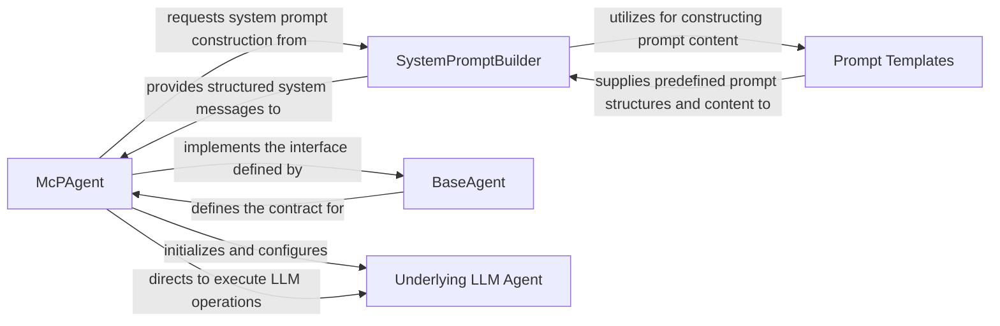
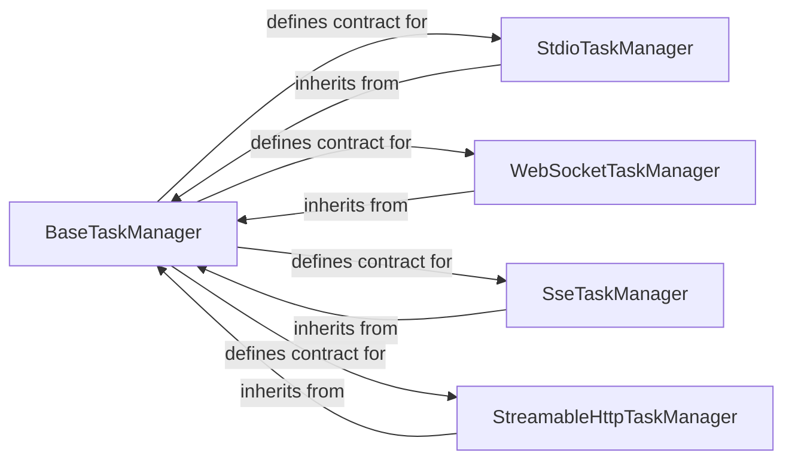
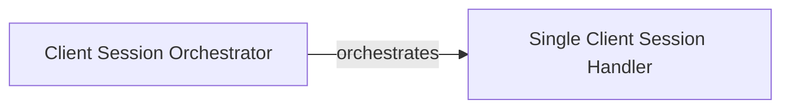
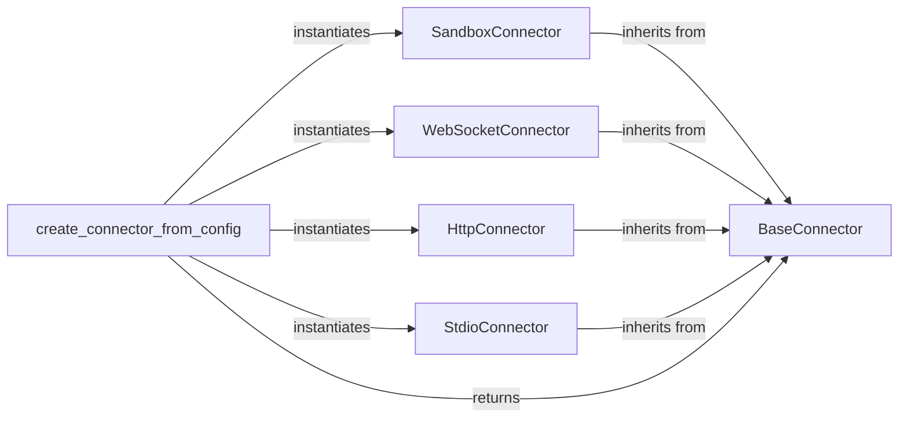
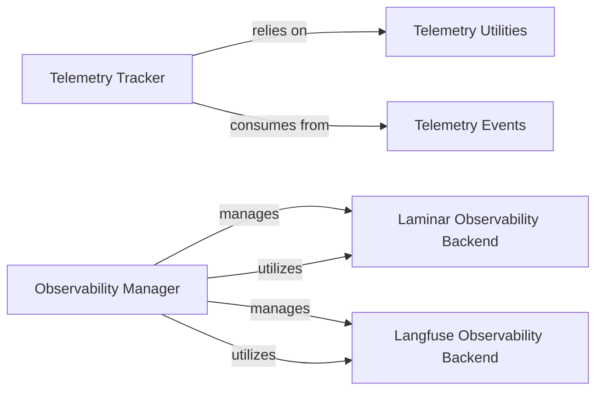
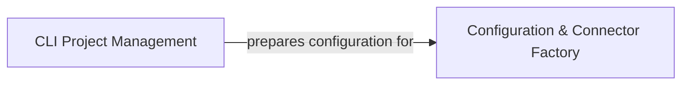
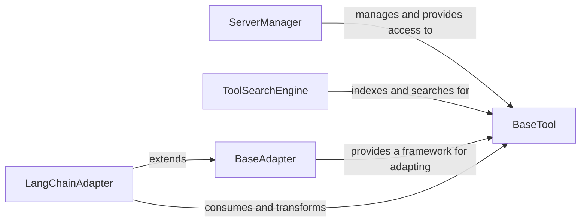
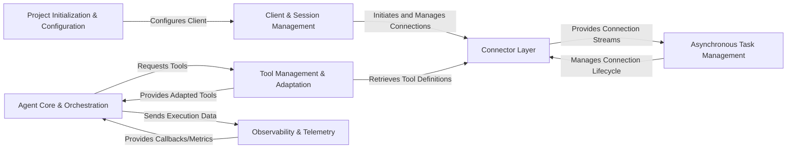

# Agent Core Orchestration

### Details

The `mcp-use` agent subsystem is orchestrated by the `McPAgent`, which acts as the core intelligence, managing interactions with an "Underlying LLM Agent" for reasoning and response generation. The `McPAgent` dynamically constructs system prompts using the `SystemPromptBuilder`, which in turn leverages `Prompt Templates` for modular and reusable prompt content. All agents within the system adhere to the `BaseAgent` interface, ensuring a consistent contract for agent behavior. The "Underlying LLM Agent" represents the actual LLM integration, either directly through a LangChain `BaseLanguageModel` or via a `RemoteAgent` for remote execution, abstracting the specifics of the LLM provider. This architecture promotes modularity, prompt engineering best practices, and flexible LLM integration.

### McPAgent
The central orchestrator of the agent's lifecycle, responsible for LLM interaction, reasoning, dynamic prompt construction, and coordinating external tool utilization. It embodies the "Agent Core" pattern.

**Related Classes/Methods**:

- <a href="https://github.com/mcp-use/mcp-use/blob/main/mcp_use/agents/mcpagent.py#L48-L1107" target="_blank" rel="noopener noreferrer">QName:`mcp_use.agents.mcpagent.McPAgent` FileRef: `/home/ubuntu/CodeBoarding/repo/mcp-use/mcp_use/agents/mcpagent.py`, Lines:(48:1107)</a>

### SystemPromptBuilder
Manages the dynamic construction of the comprehensive system prompt for the LLM, aligning with "Prompt Engineering" principles.

**Related Classes/Methods**:

- <a href="https://github.com/mcp-use/mcp-use/blob/main/mcp_use/agents/prompts/system_prompt_builder.py" target="_blank" rel="noopener noreferrer">QName:`mcp_use.agents.prompts.system_prompt_builder.SystemPromptBuilder` FileRef: `/home/ubuntu/CodeBoarding/repo/mcp-use/mcp_use/agents/prompts/system_prompt_builder.py`</a>

### Prompt Templates
Provides reusable, predefined structures and content for various parts of the system prompt, supporting "Prompt Engineering" and "Modular Design."

**Related Classes/Methods**:

- <a href="https://github.com/mcp-use/mcp-use/blob/main/mcp_use/agents/prompts/templates.py" target="_blank" rel="noopener noreferrer">QName:`mcp_use.agents.prompts.templates` FileRef: `/home/ubuntu/CodeBoarding/repo/mcp-use/mcp_use/agents/prompts/templates.py`</a>

### BaseAgent
Defines the foundational contract and common interface that all agents must adhere to, promoting "Modular Design" and the "Adapter Pattern."

**Related Classes/Methods**:

- <a href="https://github.com/mcp-use/mcp-use/blob/main/mcp_use/agents/base.py#L13-L61" target="_blank" rel="noopener noreferrer">QName:`mcp_use.agents.base.BaseAgent` FileRef: `/home/ubuntu/CodeBoarding/repo/mcp-use/mcp_use/agents/base.py`, Lines:(13:61)</a>

### Underlying LLM Agent
Represents the "LLM Integration Layer," abstracting the specifics of the LLM provider and focusing on core function calling and response generation. This is a conceptual component that `McPAgent` interacts with, either directly via a LangChain `BaseLanguageModel` instance or through a `RemoteAgent` for remote execution.

**Related Classes/Methods**:

- <a href="https://github.com/mcp-use/mcp-use/blob/main/" target="_blank" rel="noopener noreferrer">QName:`langchain_core.language_models.BaseLanguageModel` FileRef: `/home/ubuntu/CodeBoarding/repo/mcp-use/`</a>
- <a href="https://github.com/mcp-use/mcp-use/blob/main/mcp_use/agents/remote.py#L34-L327" target="_blank" rel="noopener noreferrer">QName:`mcp_use.agents.remote.RemoteAgent` FileRef: `/home/ubuntu/CodeBoarding/repo/mcp-use/mcp_use/agents/remote.py`, Lines:(34:327)</a>

# Asynchronous Task Management

### Details

The `Asynchronous Task Management` subsystem is critical for the `mcp-use` project, an LLM Agent Framework/Library, as it provides the foundational mechanisms for agents to interact with various communication channels asynchronously. This aligns with the project's architectural bias towards extensibility and modularity, allowing different transport layers to be plugged in seamlessly.

### BaseTaskManager
Defines the abstract interface and core lifecycle management for asynchronous connections and background tasks. It provides a common structure for establishing, maintaining, and closing connections, acting as the blueprint for all specific task managers.

**Related Classes/Methods**:

- <a href="https://github.com/mcp-use/mcp-use/blob/main/mcp_use/task_managers/base.py#L1-L1" target="_blank" rel="noopener noreferrer">QName:`mcp_use.task_managers.base.BaseTaskManager` FileRef: `/home/ubuntu/CodeBoarding/repo/mcp-use/mcp_use/task_managers/base.py`</a>

### StdioTaskManager
Manages asynchronous tasks specifically for standard input/output (stdio) streams, enabling console-based communication for agents. This is crucial for local development, debugging, and simple interactive agent sessions.

**Related Classes/Methods**:

- <a href="https://github.com/mcp-use/mcp-use/blob/main/mcp_use/task_managers/stdio.py#L1-L1" target="_blank" rel="noopener noreferrer">QName:`mcp_use.task_managers.stdio.StdioTaskManager` FileRef: `/home/ubuntu/CodeBoarding/repo/mcp-use/mcp_use/task_managers/stdio.py`</a>

### WebSocketTaskManager
Manages asynchronous tasks for WebSocket connections, facilitating persistent, full-duplex communication channels for agents. This is vital for real-time, interactive agent-to-agent or agent-to-client communication.

**Related Classes/Methods**:

- <a href="https://github.com/mcp-use/mcp-use/blob/main/mcp_use/task_managers/websocket.py#L1-L1" target="_blank" rel="noopener noreferrer">QName:`mcp_use.task_managers.websocket.WebSocketTaskManager` FileRef: `/home/ubuntu/CodeBoarding/repo/mcp-use/mcp_use/task_managers/websocket.py`</a>

### SseTaskManager
Manages asynchronous tasks for Server-Sent Events (SSE), enabling agents to receive continuous event streams from a server. This is useful for one-way, server-initiated updates or notifications to agents.

**Related Classes/Methods**:

- <a href="https://github.com/mcp-use/mcp-use/blob/main/mcp_use/task_managers/sse.py#L1-L1" target="_blank" rel="noopener noreferrer">QName:`mcp_use.task_managers.sse.SseTaskManager` FileRef: `/home/ubuntu/CodeBoarding/repo/mcp-use/mcp_use/task_managers/sse.py`</a>

### StreamableHttpTaskManager
Manages asynchronous tasks for streamable HTTP connections, allowing for long-lived HTTP requests that continuously stream data, potentially for agent communication or data ingestion. This supports scenarios requiring continuous data flow over HTTP without full-duplex WebSockets.

**Related Classes/Methods**:

- <a href="https://github.com/mcp-use/mcp-use/blob/main/mcp_use/task_managers/streamable_http.py#L1-L1" target="_blank" rel="noopener noreferrer">QName:`mcp_use.task_managers.streamable_http.StreamableHttpTaskManager` FileRef: `/home/ubuntu/CodeBoarding/repo/mcp-use/mcp_use/task_managers/streamable_http.py`</a>

# Client Session Management

### Details

The Client & Session Management subsystem, primarily defined by the `mcp_use.client` and `mcp_use.session` modules, encapsulates the logic for establishing, maintaining, and terminating connections to MCP servers. It manages the overall user session lifecycle within the `mcp-use` framework, providing the capability to manage multiple, potentially concurrent, connections to various MCP servers, which is essential for agents interacting with diverse services or other agents.

### Client Session Orchestrator
This component is responsible for the high-level orchestration and aggregation of multiple client sessions. It manages the creation, lifecycle, and termination of individual sessions, acting as a central point for managing the overall client-side connectivity to MCP servers. This aligns with the "Orchestration" pattern, enabling the framework to manage multiple concurrent agent interactions. Its role is crucial for scaling and managing complex multi-agent scenarios.

**Related Classes/Methods**:

- <a href="https://github.com/mcp-use/mcp-use/blob/main/mcp_use/client.py#L218-L244" target="_blank" rel="noopener noreferrer">QName:`mcp_use.client.create_all_sessions` FileRef: `/home/ubuntu/CodeBoarding/repo/mcp-use/mcp_use/client.py`, Lines:(218:244)</a>
- <a href="https://github.com/mcp-use/mcp-use/blob/main/mcp_use/client.py#L304-L326" target="_blank" rel="noopener noreferrer">QName:`mcp_use.client.close_all_sessions` FileRef: `/home/ubuntu/CodeBoarding/repo/mcp-use/mcp_use/client.py`, Lines:(304:326)</a>
- <a href="https://github.com/mcp-use/mcp-use/blob/main/mcp_use/client.py#L171-L216" target="_blank" rel="noopener noreferrer">QName:`mcp_use.client.create_session` FileRef: `/home/ubuntu/CodeBoarding/repo/mcp-use/mcp_use/client.py`, Lines:(171:216)</a>
- <a href="https://github.com/mcp-use/mcp-use/blob/main/mcp_use/client.py#L272-L302" target="_blank" rel="noopener noreferrer">QName:`mcp_use.client.close_session` FileRef: `/home/ubuntu/CodeBoarding/repo/mcp-use/mcp_use/client.py`, Lines:(272:302)</a>

### Single Client Session Handler
This component manages the complete lifecycle of a single, independent client connection to an MCP server. It handles the establishment, maintenance, and graceful termination of a connection, often leveraging asynchronous context management for reliable resource handling. This component embodies the "Client" aspect of a client-server architecture, providing the fundamental connection capabilities for an individual agent or service. It ensures robust and isolated session management.

**Related Classes/Methods**:

- <a href="https://github.com/mcp-use/mcp-use/blob/main/mcp_use/session.py#L39-L46" target="_blank" rel="noopener noreferrer">QName:`mcp_use.session.__aenter__` FileRef: `/home/ubuntu/CodeBoarding/repo/mcp-use/mcp_use/session.py`, Lines:(39:46)</a>
- <a href="https://github.com/mcp-use/mcp-use/blob/main/mcp_use/session.py#L48-L56" target="_blank" rel="noopener noreferrer">QName:`mcp_use.session.__aexit__` FileRef: `/home/ubuntu/CodeBoarding/repo/mcp-use/mcp_use/session.py`, Lines:(48:56)</a>
- <a href="https://github.com/mcp-use/mcp-use/blob/main/mcp_use/session.py#L66-L79" target="_blank" rel="noopener noreferrer">QName:`mcp_use.session.initialize` FileRef: `/home/ubuntu/CodeBoarding/repo/mcp-use/mcp_use/session.py`, Lines:(66:79)</a>
- <a href="https://github.com/mcp-use/mcp-use/blob/main/mcp_use/session.py#L58-L60" target="_blank" rel="noopener noreferrer">QName:`mcp_use.session.connect` FileRef: `/home/ubuntu/CodeBoarding/repo/mcp-use/mcp_use/session.py`, Lines:(58:60)</a>
- <a href="https://github.com/mcp-use/mcp-use/blob/main/mcp_use/session.py#L62-L64" target="_blank" rel="noopener noreferrer">QName:`mcp_use.session.disconnect` FileRef: `/home/ubuntu/CodeBoarding/repo/mcp-use/mcp_use/session.py`, Lines:(62:64)</a>
- <a href="https://github.com/mcp-use/mcp-use/blob/main/mcp_use/session.py#L81-L88" target="_blank" rel="noopener noreferrer">QName:`mcp_use.session.is_connected` FileRef: `/home/ubuntu/CodeBoarding/repo/mcp-use/mcp_use/session.py`, Lines:(81:88)</a>

# Connector Layer

### Details

The `Connector Layer` subsystem is crucial for abstracting how the system communicates with various MCP server implementations. It adheres to the Adapter Pattern, providing a unified interface for diverse communication protocols.

### BaseConnector
Defines the abstract interface and contract for all MCP server interactions. It provides a unified set of methods (`connect()`, `disconnect()`, `is_connected()`, `call_tool()`, `list_tools()`, `request()`, etc.) that concrete connectors must implement. This component embodies the Adapter Pattern, abstracting the underlying communication protocol from the agent core.

**Related Classes/Methods**:

- <a href="https://github.com/mcp-use/mcp-use/blob/main/mcp_use/connectors/base.py#L37-L453" target="_blank" rel="noopener noreferrer">QName:`BaseConnector` FileRef: `/home/ubuntu/CodeBoarding/repo/mcp-use/mcp_use/connectors/base.py`, Lines:(37:453)</a>

### SandboxConnector
Implements the `BaseConnector` interface specifically for interacting with MCP servers running in a sandboxed environment. It manages the lifecycle of the sandbox process, redirects standard I/O, and handles communication specific to the sandbox's execution context.

**Related Classes/Methods**:

- <a href="https://github.com/mcp-use/mcp-use/blob/main/mcp_use/connectors/sandbox.py#L35-L302" target="_blank" rel="noopener noreferrer">QName:`SandboxConnector` FileRef: `/home/ubuntu/CodeBoarding/repo/mcp-use/mcp_use/connectors/sandbox.py`, Lines:(35:302)</a>

### WebSocketConnector
Implements the `BaseConnector` interface for real-time, event-driven communication with MCP servers over WebSockets. It manages WebSocket connection establishment, message sending, and asynchronous message reception.

**Related Classes/Methods**:

- <a href="https://github.com/mcp-use/mcp-use/blob/main/mcp_use/connectors/websocket.py#L21-L248" target="_blank" rel="noopener noreferrer">QName:`WebSocketConnector` FileRef: `/home/ubuntu/CodeBoarding/repo/mcp-use/mcp_use/connectors/websocket.py`, Lines:(21:248)</a>

### HttpConnector
Implements the `BaseConnector` interface for standard HTTP-based communication with MCP servers. It handles HTTP request/response cycles, making it suitable for RESTful or RPC-style interactions.

**Related Classes/Methods**:

- <a href="https://github.com/mcp-use/mcp-use/blob/main/mcp_use/connectors/http.py#L18-L213" target="_blank" rel="noopener noreferrer">QName:`HttpConnector` FileRef: `/home/ubuntu/CodeBoarding/repo/mcp-use/mcp_use/connectors/http.py`, Lines:(18:213)</a>

### StdioConnector
Implements the `BaseConnector` interface for communication via standard input/output (stdio) streams. This is typically used for interacting with local processes or command-line tools that communicate over stdin/stdout.

**Related Classes/Methods**:

- <a href="https://github.com/mcp-use/mcp-use/blob/main/mcp_use/connectors/stdio.py#L18-L101" target="_blank" rel="noopener noreferrer">QName:`StdioConnector` FileRef: `/home/ubuntu/CodeBoarding/repo/mcp-use/mcp_use/connectors/stdio.py`, Lines:(18:101)</a>

### create_connector_from_config
Acts as a Simple Factory responsible for dynamically creating and returning the appropriate concrete `BaseConnector` instance based on the provided configuration. This decouples the client code from the specific connector implementation, promoting flexibility and extensibility.

**Related Classes/Methods**:

- <a href="https://github.com/mcp-use/mcp-use/blob/main/mcp_use/config.py#L31-L99" target="_blank" rel="noopener noreferrer">QName:`create_connector_from_config` FileRef: `/home/ubuntu/CodeBoarding/repo/mcp-use/mcp_use/config.py`, Lines:(31:99)</a>

# Observability Telemetry

### Details

The Observability & Telemetry subsystem, comprising `mcp_use.telemetry` and `mcp_use.observability` packages, is responsible for monitoring agent execution, collecting performance metrics, and managing callbacks for external integrations and debugging within the `mcp-use` project. Its main flow involves tracking operational events and providing a flexible mechanism for integrating with various observability backends.

### Telemetry Tracker
This component serves as the primary interface for recording various operational events within the LLM agent framework. It focuses on monitoring agent execution, identifying users, and tracking package usage, providing critical insights into the agent's runtime behavior.

**Related Classes/Methods**:

- <a href="https://github.com/mcp-use/mcp-use/blob/main/mcp_use/telemetry/telemetry.py#L1-L1" target="_blank" rel="noopener noreferrer">QName:`mcp_use.telemetry.telemetry` FileRef: `/home/ubuntu/CodeBoarding/repo/mcp-use/mcp_use/telemetry/telemetry.py`</a>

### Telemetry Events
Defines the standardized schema and types for all telemetry events that can be captured by the `Telemetry Tracker`. This ensures consistency, clarity, and ease of analysis for the collected data, which is crucial for reliable monitoring.

**Related Classes/Methods**:

- <a href="https://github.com/mcp-use/mcp-use/blob/main/mcp_use/telemetry/events.py#L1-L1" target="_blank" rel="noopener noreferrer">QName:`mcp_use.telemetry.events` FileRef: `/home/ubuntu/CodeBoarding/repo/mcp-use/mcp_use/telemetry/events.py`</a>

### Telemetry Utilities
Provides helper functions and utilities specifically designed to assist the `Telemetry Tracker` in extracting and formatting relevant information for tracking, such as details about the LLM model (provider, name).

**Related Classes/Methods**:

- <a href="https://github.com/mcp-use/mcp-use/blob/main/mcp_use/telemetry/utils.py#L1-L1" target="_blank" rel="noopener noreferrer">QName:`mcp_use.telemetry.utils` FileRef: `/home/ubuntu/CodeBoarding/repo/mcp-use/mcp_use/telemetry/utils.py`</a>

### Observability Manager
Acts as a central registry and factory for managing and providing access to various observability callback handlers. This component is critical for enabling flexible integration with different external observability backends, a common requirement in LLM development for tracing and debugging.

**Related Classes/Methods**:

- <a href="https://github.com/mcp-use/mcp-use/blob/main/mcp_use/observability/callbacks_manager.py#L1-L1" target="_blank" rel="noopener noreferrer">QName:`mcp_use.observability.callbacks_manager` FileRef: `/home/ubuntu/CodeBoarding/repo/mcp-use/mcp_use/observability/callbacks_manager.py`</a>

### Laminar Observability Backend
A concrete implementation of an observability backend that integrates with the Laminar platform. It encapsulates the specific logic for sending traces, logs, and other observability data to Laminar.

**Related Classes/Methods**:

- <a href="https://github.com/mcp-use/mcp-use/blob/main/mcp_use/observability/laminar.py#L1-L1" target="_blank" rel="noopener noreferrer">QName:`mcp_use.observability.laminar` FileRef: `/home/ubuntu/CodeBoarding/repo/mcp-use/mcp_use/observability/laminar.py`</a>

### Langfuse Observability Backend
A concrete implementation of an observability backend that integrates with the Langfuse platform. It handles the specific logic for sending traces, logs, and other observability data to Langfuse, a popular tool for LLM application monitoring.

**Related Classes/Methods**:

- <a href="https://github.com/mcp-use/mcp-use/blob/main/mcp_use/observability/langfuse.py#L1-L1" target="_blank" rel="noopener noreferrer">QName:`mcp_use.observability.langfuse` FileRef: `/home/ubuntu/CodeBoarding/repo/mcp-use/mcp_use/observability/langfuse.py`</a>

# Project Initialization Configuration

### Details

This graph describes the Project Initialization & Configuration subsystem of `mcp-use`. The main flow involves the `CLI Project Management` component handling command-line interactions, project scaffolding, and the creation of initial project structures, including configuration files. Subsequently, the `Configuration & Connector Factory` component loads and interprets these configurations to dynamically instantiate external connectors like LLMs and sandboxes, enabling flexible integration with various external services. The purpose of this subsystem is to provide a robust and extensible mechanism for setting up and configuring new `mcp-use` applications.

### CLI Project Management
This component serves as the primary command-line interface for `mcp-use`, orchestrating the entire project lifecycle from initial command parsing to interactive project creation and the generation of foundational project structures. It provides the user-facing mechanism for setting up new `mcp-use` applications.

**Related Classes/Methods**:

- <a href="https://github.com/mcp-use/mcp-use/blob/main/mcp_use/cli.py#L542-L577" target="_blank" rel="noopener noreferrer">QName:`mcp_use.cli.main` FileRef: `/home/ubuntu/CodeBoarding/repo/mcp-use/mcp_use/cli.py`, Lines:(542:577)</a>
- <a href="https://github.com/mcp-use/mcp-use/blob/main/mcp_use/cli.py#L481-L511" target="_blank" rel="noopener noreferrer">QName:`mcp_use.cli.handle_create` FileRef: `/home/ubuntu/CodeBoarding/repo/mcp-use/mcp_use/cli.py`, Lines:(481:511)</a>
- <a href="https://github.com/mcp-use/mcp-use/blob/main/mcp_use/cli.py#L399-L446" target="_blank" rel="noopener noreferrer">QName:`mcp_use.cli.create_project` FileRef: `/home/ubuntu/CodeBoarding/repo/mcp-use/mcp_use/cli.py`, Lines:(399:446)</a>
- <a href="https://github.com/mcp-use/mcp-use/blob/main/mcp_use/cli.py#L405-L405" target="_blank" rel="noopener noreferrer">QName:`mcp_use.cli.Spinner` FileRef: `/home/ubuntu/CodeBoarding/repo/mcp-use/mcp_use/cli.py`</a>

### Configuration & Connector Factory
Responsible for loading and interpreting project-specific configuration data, and dynamically instantiating various external connector objects (e.g., LLMs, sandboxes) based on these configurations. This component is vital for enabling flexible and extensible integration with diverse external services, aligning with the framework's modular design.

**Related Classes/Methods**:

- <a href="https://github.com/mcp-use/mcp-use/blob/main/mcp_use/config.py#L31-L99" target="_blank" rel="noopener noreferrer">QName:`mcp_use.config.create_connector_from_config` FileRef: `/home/ubuntu/CodeBoarding/repo/mcp-use/mcp_use/config.py`, Lines:(31:99)</a>
- <a href="https://github.com/mcp-use/mcp-use/blob/main/mcp_use/connectors/sandbox.py#L35-L302" target="_blank" rel="noopener noreferrer">QName:`mcp_use.connectors.sandbox.SandboxConnector` FileRef: `/home/ubuntu/CodeBoarding/repo/mcp-use/mcp_use/connectors/sandbox.py`, Lines:(35:302)</a>

# Tool Management Adaptation

### Details

The MCP (Multi-Component Platform) system is designed around a flexible tool management and adaptation architecture. At its core, the `BaseTool` defines a universal interface for all tools, ensuring consistency and interoperability. The `ServerManager` acts as a central registry, managing the lifecycle and accessibility of server-hosted tools, making them available to various agents within the system. For dynamic discovery, the `ToolSearchEngine` indexes and facilitates searching for these tools based on their capabilities. To enable integration with external frameworks, the `BaseAdapter` provides an abstract mechanism for transforming MCP entities. A concrete implementation, the `LangChainAdapter`, specifically adapts MCP tools for seamless consumption by the LangChain framework, highlighting the system's extensibility and focus on external framework compatibility. This architecture promotes modularity, discoverability, and adaptability, crucial for a robust multi-component platform.

### BaseTool
Defines the abstract interface and foundational structure for all tools within the MCP ecosystem. It establishes a consistent contract for tool execution, input/output, and metadata, ensuring interoperability across different tool implementations.

**Related Classes/Methods**:

- <a href="https://github.com/mcp-use/mcp-use/blob/main/mcp_use/managers/tools/base_tool.py#L1-L1" target="_blank" rel="noopener noreferrer">QName:`BaseTool` FileRef: `/home/ubuntu/CodeBoarding/repo/mcp-use/mcp_use/managers/tools/base_tool.py`</a>

### ServerManager
Manages the discovery, registration, and provision of server-managed tools. It acts as a central registry for tools hosted or controlled by an MCP server, making them accessible to agents.

**Related Classes/Methods**:

- <a href="https://github.com/mcp-use/mcp-use/blob/main/examples/simple_server_manager_use.py#L53-L74" target="_blank" rel="noopener noreferrer">QName:`ServerManager` FileRef: `/home/ubuntu/CodeBoarding/repo/mcp-use/examples/simple_server_manager_use.py`, Lines:(53:74)</a>

### ToolSearchEngine
Indexes available tools and facilitates their dynamic discovery through search queries. It enables agents to find relevant tools based on their capabilities or descriptions, supporting the "search-enabled" aspect of tool access.

**Related Classes/Methods**:

- <a href="https://github.com/mcp-use/mcp-use/blob/main/mcp_use/managers/tools/search_tools.py#L58-L328" target="_blank" rel="noopener noreferrer">QName:`ToolSearchEngine` FileRef: `/home/ubuntu/CodeBoarding/repo/mcp-use/mcp_use/managers/tools/search_tools.py`, Lines:(58:328)</a>

### BaseAdapter
Provides a generic, abstract framework for adapting MCP-defined entities (including tools) into formats compatible with external systems or frameworks. It defines the common interface for conversion logic, promoting extensibility.

**Related Classes/Methods**:

- <a href="https://github.com/mcp-use/mcp-use/blob/main/mcp_use/adapters/base.py#L20-L190" target="_blank" rel="noopener noreferrer">QName:`BaseAdapter` FileRef: `/home/ubuntu/CodeBoarding/repo/mcp-use/mcp_use/adapters/base.py`, Lines:(20:190)</a>

### LangChainAdapter
Specializes the BaseAdapter to specifically translate MCP-defined tools into a format consumable by the LangChain framework. This is crucial for integrating MCP tools with LangChain-based LLM agents, directly addressing the adaptation to "external frameworks like LangChain."

**Related Classes/Methods**:

- <a href="https://github.com/mcp-use/mcp-use/blob/main/mcp_use/adapters/langchain_adapter.py#L29-L268" target="_blank" rel="noopener noreferrer">QName:`LangChainAdapter` FileRef: `/home/ubuntu/CodeBoarding/repo/mcp-use/mcp_use/adapters/langchain_adapter.py`, Lines:(29:268)</a>

# overview

### Details

The `mcp-use` project is architected as a modular agent-based system for interacting with MCP servers. It begins with `Project Initialization & Configuration`, which sets up the environment and configures the `Client & Session Management` component. This client then establishes and manages connections through a flexible `Connector Layer`, which abstracts various MCP server implementations. Asynchronous operations, such as processing event streams and managing connection lifecycles, are handled by `Asynchronous Task Management`. The core intelligence resides in `Agent Core & Orchestration`, responsible for LLM interactions and coordinating external tools. `Tool Management & Adaptation` discovers, adapts, and provides these tools to the agent, often retrieving definitions via the `Connector Layer`. Throughout the system's operation, `Observability & Telemetry` monitors execution, collects metrics, and provides feedback, ensuring a robust and traceable agent experience.

### Project Initialization & Configuration
Manages the project lifecycle, including command-line interactions, project setup, and loading environmental and connector configurations.

**Related Classes/Methods**:

- <a href="https://github.com/mcp-use/mcp-use/blob/main/mcp_use/cli.py#L1-L1" target="_blank" rel="noopener noreferrer">QName:`mcp_use.cli` FileRef: `/home/ubuntu/CodeBoarding/repo/mcp-use/mcp_use/cli.py`</a>
- <a href="https://github.com/mcp-use/mcp-use/blob/main/mcp_use/config.py#L1-L1" target="_blank" rel="noopener noreferrer">QName:`mcp_use.config` FileRef: `/home/ubuntu/CodeBoarding/repo/mcp-use/mcp_use/config.py`</a>

### Client & Session Management
Oversees the establishment, maintenance, and termination of client connections to MCP servers, managing the overall user session.

**Related Classes/Methods**:

- <a href="https://github.com/mcp-use/mcp-use/blob/main/mcp_use/client.py#L1-L1" target="_blank" rel="noopener noreferrer">QName:`mcp_use.client` FileRef: `/home/ubuntu/CodeBoarding/repo/mcp-use/mcp_use/client.py`</a>
- <a href="https://github.com/mcp-use/mcp-use/blob/main/mcp_use/session.py#L1-L1" target="_blank" rel="noopener noreferrer">QName:`mcp_use.session` FileRef: `/home/ubuntu/CodeBoarding/repo/mcp-use/mcp_use/session.py`</a>

### Connector Layer
An abstract and concrete layer defining how the system interacts with different MCP server implementations (e.g., Sandbox, WebSocket, HTTP, Stdio).

**Related Classes/Methods**:

- <a href="https://github.com/mcp-use/mcp-use/blob/main/mcp_use/connectors/base.py#L1-L1" target="_blank" rel="noopener noreferrer">QName:`mcp_use.connectors.base` FileRef: `/home/ubuntu/CodeBoarding/repo/mcp-use/mcp_use/connectors/base.py`</a>
- <a href="https://github.com/mcp-use/mcp-use/blob/main/mcp_use/connectors/sandbox.py#L1-L1" target="_blank" rel="noopener noreferrer">QName:`mcp_use.connectors.sandbox` FileRef: `/home/ubuntu/CodeBoarding/repo/mcp-use/mcp_use/connectors/sandbox.py`</a>
- <a href="https://github.com/mcp-use/mcp-use/blob/main/mcp_use/connectors/websocket.py#L1-L1" target="_blank" rel="noopener noreferrer">QName:`mcp_use.connectors.websocket` FileRef: `/home/ubuntu/CodeBoarding/repo/mcp-use/mcp_use/connectors/websocket.py`</a>
- <a href="https://github.com/mcp-use/mcp-use/blob/main/mcp_use/connectors/http.py#L1-L1" target="_blank" rel="noopener noreferrer">QName:`mcp_use.connectors.http` FileRef: `/home/ubuntu/CodeBoarding/repo/mcp-use/mcp_use/connectors/http.py`</a>
- <a href="https://github.com/mcp-use/mcp-use/blob/main/mcp_use/connectors/stdio.py#L1-L1" target="_blank" rel="noopener noreferrer">QName:`mcp_use.connectors.stdio` FileRef: `/home/ubuntu/CodeBoarding/repo/mcp-use/mcp_use/connectors/stdio.py`</a>

### Agent Core & Orchestration
The central component responsible for LLM interaction, reasoning, dynamic prompt construction, and coordinating the utilization of external tools.

**Related Classes/Methods**:

- <a href="https://github.com/mcp-use/mcp-use/blob/main/mcp_use/agents/base.py#L1-L1" target="_blank" rel="noopener noreferrer">QName:`mcp_use.agents.base` FileRef: `/home/ubuntu/CodeBoarding/repo/mcp-use/mcp_use/agents/base.py`</a>
- <a href="https://github.com/mcp-use/mcp-use/blob/main/mcp_use/agents/mcpagent.py#L1-L1" target="_blank" rel="noopener noreferrer">QName:`mcp_use.agents.mcpagent` FileRef: `/home/ubuntu/CodeBoarding/repo/mcp-use/mcp_use/agents/mcpagent.py`</a>
- <a href="https://github.com/mcp-use/mcp-use/blob/main/mcp_use/agents/prompts/system_prompt_builder.py#L1-L1" target="_blank" rel="noopener noreferrer">QName:`mcp_use.agents.prompts.system_prompt_builder` FileRef: `/home/ubuntu/CodeBoarding/repo/mcp-use/mcp_use/agents/prompts/system_prompt_builder.py`</a>
- <a href="https://github.com/mcp-use/mcp-use/blob/main/mcp_use/agents/prompts/templates.py#L1-L1" target="_blank" rel="noopener noreferrer">QName:`mcp_use.agents.prompts.templates` FileRef: `/home/ubuntu/CodeBoarding/repo/mcp-use/mcp_use/agents/prompts/templates.py`</a>

### Tool Management & Adaptation
Discovers, indexes, and provides access to various tools (server-managed, search-enabled) and translates MCP-defined tools into formats compatible with external frameworks like LangChain.

**Related Classes/Methods**:

- <a href="https://github.com/mcp-use/mcp-use/blob/main/mcp_use/managers/server_manager.py#L1-L1" target="_blank" rel="noopener noreferrer">QName:`mcp_use.managers.server_manager` FileRef: `/home/ubuntu/CodeBoarding/repo/mcp-use/mcp_use/managers/server_manager.py`</a>
- <a href="https://github.com/mcp-use/mcp-use/blob/main/mcp_use/managers/tools/base_tool.py#L1-L1" target="_blank" rel="noopener noreferrer">QName:`mcp_use.managers.tools.base_tool` FileRef: `/home/ubuntu/CodeBoarding/repo/mcp-use/mcp_use/managers/tools/base_tool.py`</a>
- <a href="https://github.com/mcp-use/mcp-use/blob/main/mcp_use/adapters/base.py#L1-L1" target="_blank" rel="noopener noreferrer">QName:`mcp_use.adapters.base` FileRef: `/home/ubuntu/CodeBoarding/repo/mcp-use/mcp_use/adapters/base.py`</a>
- <a href="https://github.com/mcp-use/mcp-use/blob/main/mcp_use/adapters/langchain_adapter.py#L1-L1" target="_blank" rel="noopener noreferrer">QName:`mcp_use.adapters.langchain_adapter` FileRef: `/home/ubuntu/CodeBoarding/repo/mcp-use/mcp_use/adapters/langchain_adapter.py`</a>

### Asynchronous Task Management
Manages background tasks, particularly those related to maintaining persistent connections, processing event streams from connectors, and handling asynchronous operations.

**Related Classes/Methods**:

- <a href="https://github.com/mcp-use/mcp-use/blob/main/mcp_use/task_managers/base.py#L1-L1" target="_blank" rel="noopener noreferrer">QName:`mcp_use.task_managers.base` FileRef: `/home/ubuntu/CodeBoarding/repo/mcp-use/mcp_use/task_managers/base.py`</a>
- <a href="https://github.com/mcp-use/mcp-use/blob/main/mcp_use/task_managers/stdio.py#L1-L1" target="_blank" rel="noopener noreferrer">QName:`mcp_use.task_managers.stdio` FileRef: `/home/ubuntu/CodeBoarding/repo/mcp-use/mcp_use/task_managers/stdio.py`</a>
- <a href="https://github.com/mcp-use/mcp-use/blob/main/mcp_use/task_managers/websocket.py#L1-L1" target="_blank" rel="noopener noreferrer">QName:`mcp_use.task_managers.websocket` FileRef: `/home/ubuntu/CodeBoarding/repo/mcp-use/mcp_use/task_managers/websocket.py`</a>
- <a href="https://github.com/mcp-use/mcp-use/blob/main/mcp_use/task_managers/sse.py#L1-L1" target="_blank" rel="noopener noreferrer">QName:`mcp_use.task_managers.sse` FileRef: `/home/ubuntu/CodeBoarding/repo/mcp-use/mcp_use/task_managers/sse.py`</a>
- <a href="https://github.com/mcp-use/mcp-use/blob/main/mcp_use/task_managers/streamable_http.py#L1-L1" target="_blank" rel="noopener noreferrer">QName:`mcp_use.task_managers.streamable_http` FileRef: `/home/ubuntu/CodeBoarding/repo/mcp-use/mcp_use/task_managers/streamable_http.py`</a>

### Observability & Telemetry
Provides mechanisms for monitoring agent execution, collecting performance metrics, and managing callbacks for external integrations and debugging.

**Related Classes/Methods**:

- <a href="https://github.com/mcp-use/mcp-use/blob/main/mcp_use/telemetry/telemetry.py#L1-L1" target="_blank" rel="noopener noreferrer">QName:`mcp_use.telemetry.telemetry` FileRef: `/home/ubuntu/CodeBoarding/repo/mcp-use/mcp_use/telemetry/telemetry.py`</a>
- <a href="https://github.com/mcp-use/mcp-use/blob/main/mcp_use/telemetry/events.py#L1-L1" target="_blank" rel="noopener noreferrer">QName:`mcp_use.telemetry.events` FileRef: `/home/ubuntu/CodeBoarding/repo/mcp-use/mcp_use/telemetry/events.py`</a>
- <a href="https://github.com/mcp-use/mcp-use/blob/main/mcp_use/observability/callbacks_manager.py#L1-L1" target="_blank" rel="noopener noreferrer">QName:`mcp_use.observability.callbacks_manager` FileRef: `/home/ubuntu/CodeBoarding/repo/mcp-use/mcp_use/observability/callbacks_manager.py`</a>
- <a href="https://github.com/mcp-use/mcp-use/blob/main/mcp_use/observability/laminar.py#L1-L1" target="_blank" rel="noopener noreferrer">QName:`mcp_use.observability.laminar` FileRef: `/home/ubuntu/CodeBoarding/repo/mcp-use/mcp_use/observability/laminar.py`</a>
- <a href="https://github.com/mcp-use/mcp-use/blob/main/mcp_use/observability/langfuse.py#L1-L1" target="_blank" rel="noopener noreferrer">QName:`mcp_use.observability.langfuse` FileRef: `/home/ubuntu/CodeBoarding/repo/mcp-use/mcp_use/observability/langfuse.py`</a>

