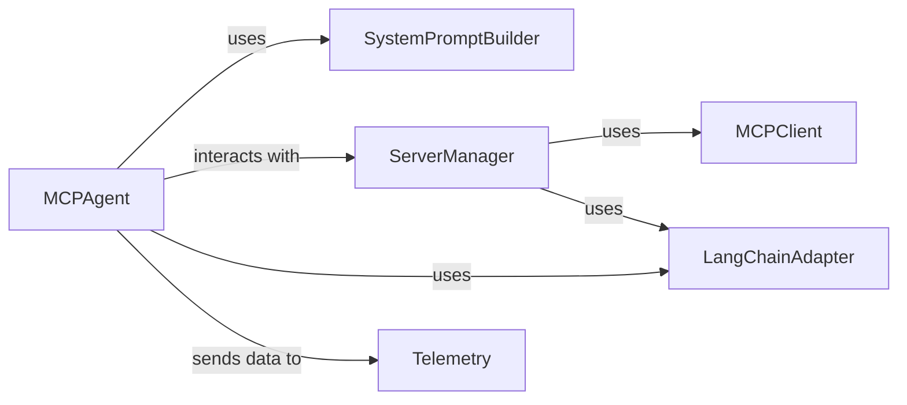
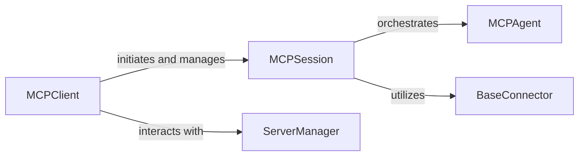
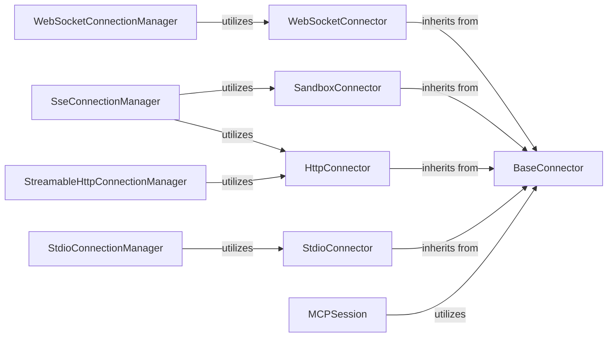
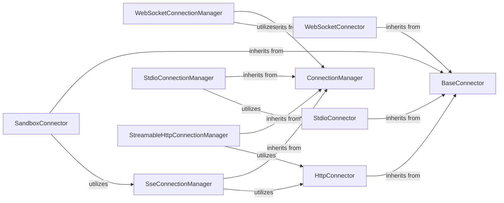
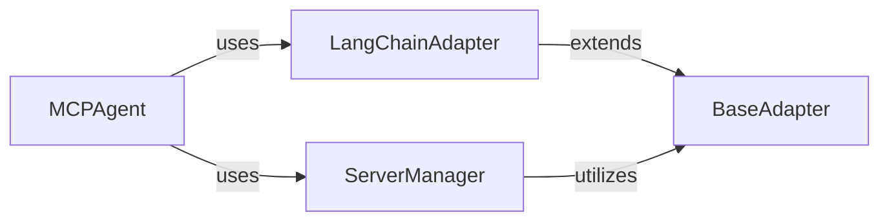
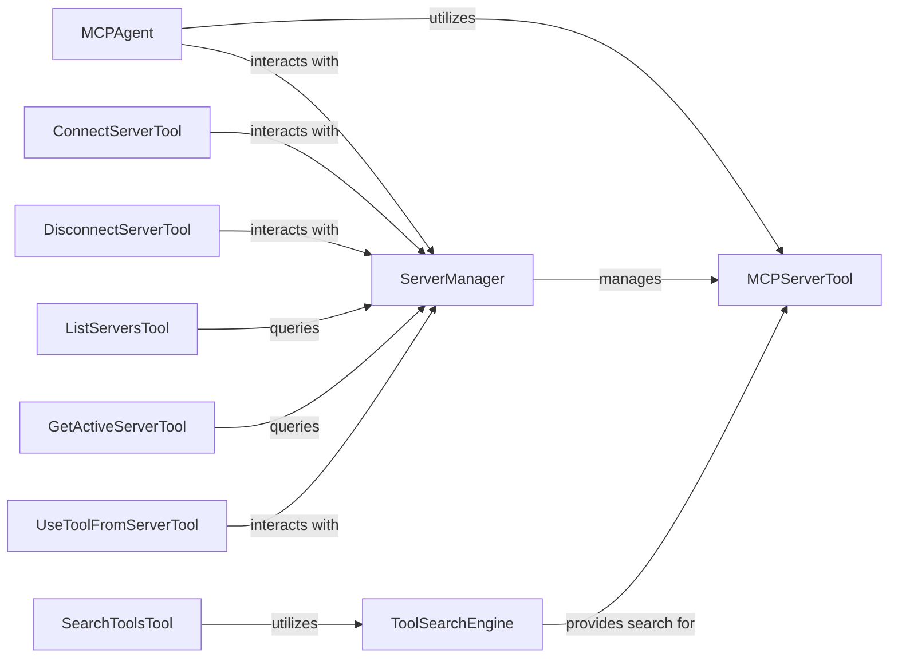

```mermaid
graph LR
    Agent_Core_Orchestration["Agent Core & Orchestration"]
    Client_Session_Management["Client & Session Management"]
    Communication_Connectors["Communication Connectors"]
    Connection_Management["Connection Management"]
    LLM_Integration_Adapters["LLM Integration & Adapters"]
    Resource_Tool_Management["Resource & Tool Management"]
    Agent_Core_Orchestration -- "interacts with" --> LLM_Integration_Adapters
    Agent_Core_Orchestration -- "queries" --> Resource_Tool_Management
    Client_Session_Management -- "initiates and manages" --> Agent_Core_Orchestration
    Client_Session_Management -- "utilizes" --> Communication_Connectors
    Client_Session_Management -- "interacts with" --> Resource_Tool_Management
    Communication_Connectors -- "provides communication mechanisms for" --> Client_Session_Management
    Communication_Connectors -- "managed and orchestrated by" --> Connection_Management
    Connection_Management -- "manages and orchestrates" --> Communication_Connectors
    LLM_Integration_Adapters -- "used by" --> Agent_Core_Orchestration
    Resource_Tool_Management -- "provides information to" --> Agent_Core_Orchestration
    Resource_Tool_Management -- "interacts with" --> Client_Session_Management
    click Agent_Core_Orchestration href "/codeboarding/Agent_Core_Orchestration.md" "Details"
    click Client_Session_Management href "/codeboarding/Client_Session_Management.md" "Details"
    click Communication_Connectors href "/codeboarding/Communication_Connectors.md" "Details"
    click Connection_Management href "/codeboarding/Connection_Management.md" "Details"
    click LLM_Integration_Adapters href "/codeboarding/LLM_Integration_Adapters.md" "Details"
    click Resource_Tool_Management href "/codeboarding/Resource_Tool_Management.md" "Details"
```

# Architecture Documentation

This document contains the complete architecture documentation generated from CodeBoarding analysis.

---
title: "Architecture Overview"
description: "Comprehensive architectural overview of the mcp-agent framework"
---

<Info>
This documentation was generated by [CodeBoarding](https://github.com/CodeBoarding/GeneratedOnBoardings) to provide comprehensive architectural insights into the mcp-agent framework.
</Info>

## Details

The `mcp-use` project functions as an LLM Agent Framework, enabling the creation, orchestration, and interaction of AI agents with various tools and services. At its core, it allows users to define agents that leverage large language models, integrate external tools (like LangChain), and communicate with diverse backend services (MCP servers) through a flexible, asynchronous communication layer. The framework manages the lifecycle of agent sessions, handles dynamic prompt generation, and provides mechanisms for discovering and utilizing available resources, all while abstracting away the complexities of underlying communication protocols and LLM integrations.

### Agent Core & Orchestration [[Expand]](./Agent_Core_Orchestration)
This is the central intelligence of the framework, responsible for orchestrating the LLM agent's behavior. It manages conversation flow, constructs dynamic prompts based on available tools and context, and decides on the next actions to be taken by the agent.

**Related Classes/Methods**:

- <a href="https://github.com/CodeBoarding/mcp-use/blob/main/mcp_use/agents/mcpagent.py#L1-L1" target="_blank" rel="noopener noreferrer">`mcp_use.agents.mcpagent.MCPAgent` (1:1)</a>
- <a href="https://github.com/CodeBoarding/mcp-use/blob/main/mcp_use/agents/prompts/system_prompt_builder.py#L1-L1" target="_blank" rel="noopener noreferrer">`mcp_use.agents.prompts.system_prompt_builder.SystemPromptBuilder` (1:1)</a>

### Client & Session Management [[Expand]](./Client_Session_Management)
Provides the primary interface for users to interact with the MCP framework. It manages the creation, lifecycle, and termination of individual MCP sessions, acting as the entry point for agent interactions and providing context to the core agent logic.

**Related Classes/Methods**:

- <a href="https://github.com/CodeBoarding/mcp-use/blob/main/mcp_use/client.py#L1-L1" target="_blank" rel="noopener noreferrer">`mcp_use.client.MCPClient` (1:1)</a>
- <a href="https://github.com/CodeBoarding/mcp-use/blob/main/mcp_use/session.py#L1-L1" target="_blank" rel="noopener noreferrer">`mcp_use.session.MCPSession` (1:1)</a>

### Communication Connectors [[Expand]](./Communication_Connectors)
Defines and implements abstract interfaces for various communication protocols (e.g., WebSocket, HTTP, Sandbox, Stdio) used to interact with MCP servers and execute tools securely. It provides the concrete means of data exchange between the client and the server.

**Related Classes/Methods**:

- <a href="https://github.com/CodeBoarding/mcp-use/blob/main/mcp_use/connectors/base.py#L1-L1" target="_blank" rel="noopener noreferrer">`mcp_use.connectors.base.BaseConnector` (1:1)</a>
- <a href="https://github.com/CodeBoarding/mcp-use/blob/main/mcp_use/connectors/websocket.py#L1-L1" target="_blank" rel="noopener noreferrer">`mcp_use.connectors.websocket.WebSocketConnector` (1:1)</a>
- <a href="https://github.com/CodeBoarding/mcp-use/blob/main/mcp_use/connectors/sandbox.py#L1-L1" target="_blank" rel="noopener noreferrer">`mcp_use.connectors.sandbox.SandboxConnector` (1:1)</a>
- <a href="https://github.com/CodeBoarding/mcp-use/blob/main/mcp_use/connectors/http.py#L1-L1" target="_blank" rel="noopener noreferrer">`mcp_use.connectors.http.HttpConnector` (1:1)</a>
- <a href="https://github.com/CodeBoarding/mcp-use/blob/main/mcp_use/connectors/stdio.py#L1-L1" target="_blank" rel="noopener noreferrer">`mcp_use.connectors.stdio.StdioConnector` (1:1)</a>

### Connection Management [[Expand]](./Connection_Management)
Manages the asynchronous tasks and lifecycle of establishing, maintaining, and closing connections with MCP servers across different communication protocols. It ensures robust and persistent communication channels for the framework.

**Related Classes/Methods**:

- <a href="https://github.com/CodeBoarding/mcp-use/blob/main/mcp_use/task_managers/base.py#L1-L1" target="_blank" rel="noopener noreferrer">`mcp_use.task_managers.base.ConnectionManager` (1:1)</a>
- <a href="https://github.com/CodeBoarding/mcp-use/blob/main/mcp_use/task_managers/websocket.py#L1-L1" target="_blank" rel="noopener noreferrer">`mcp_use.task_managers.websocket.WebSocketConnectionManager` (1:1)</a>
- <a href="https://github.com/CodeBoarding/mcp-use/blob/main/mcp_use/task_managers/sse.py#L1-L1" target="_blank" rel="noopener noreferrer">`mcp_use.task_managers.sse.SseConnectionManager` (1:1)</a>
- <a href="https://github.com/CodeBoarding/mcp-use/blob/main/mcp_use/task_managers/stdio.py#L1-L1" target="_blank" rel="noopener noreferrer">`mcp_use.task_managers.stdio.StdioConnectionManager` (1:1)</a>
- <a href="https://github.com/CodeBoarding/mcp-use/blob/main/mcp_use/task_managers/streamable_http.py#L1-L1" target="_blank" rel="noopener noreferrer">`mcp_use.task_managers.streamable_http.StreamableHttpConnectionManager` (1:1)</a>

### LLM Integration & Adapters [[Expand]](./LLM_Integration_Adapters)
Provides an abstract and concrete mechanism for integrating various external LLM frameworks (e.g., LangChain) and their components (tools, resources, prompts) into the MCP's internal representation. This ensures compatibility and extensibility with different LLM providers.

**Related Classes/Methods**:

- <a href="https://github.com/CodeBoarding/mcp-use/blob/main/mcp_use/adapters/base.py#L1-L1" target="_blank" rel="noopener noreferrer">`mcp_use.adapters.base.BaseAdapter` (1:1)</a>
- <a href="https://github.com/CodeBoarding/mcp-use/blob/main/mcp_use/adapters/langchain_adapter.py#L1-L1" target="_blank" rel="noopener noreferrer">`mcp_use.adapters.langchain_adapter.LangChainAdapter` (1:1)</a>

### Resource & Tool Management [[Expand]](./Resource_Tool_Management)
Manages the registration, discovery, and lifecycle of MCP servers and the tools they expose. This component enables the agent to find, list, and utilize available functionalities provided by various servers.

**Related Classes/Methods**:

- <a href="https://github.com/CodeBoarding/mcp-use/blob/main/mcp_use/managers/server_manager.py#L16-L89" target="_blank" rel="noopener noreferrer">`mcp_use.managers.server_manager.ServerManager` (16:89)</a>
- <a href="https://github.com/CodeBoarding/mcp-use/blob/main/mcp_use/managers/tools/search_tools.py#L57-L327" target="_blank" rel="noopener noreferrer">`mcp_use.managers.tools.search_tools.ToolSearchEngine` (57:327)</a>
- <a href="https://github.com/CodeBoarding/mcp-use/blob/main/mcp_use/managers/tools/base_tool.py#L5-L18" target="_blank" rel="noopener noreferrer">`mcp_use.managers.tools.base_tool.MCPServerTool` (5:18)</a>

### [FAQ](https://github.com/CodeBoarding/GeneratedOnBoardings/tree/main?tab=readme-ov-file#faq)

---
title: "Agent Core Orchestration"
description: "Agent Core Orchestration component details"
---

<Info>
This documentation was generated by [CodeBoarding](https://github.com/CodeBoarding/GeneratedOnBoardings) to provide comprehensive architectural insights into the mcp-agent framework.
</Info>

## Details

Abstract Components Overview

### MCPAgent
The primary class for the LLM agent, orchestrating its behavior, managing interactions with LLMs, and utilizing available tools. It is the core of the 'Agent Core & Orchestration' component, responsible for the overall decision-making and execution flow.

**Related Classes/Methods**:

### SystemPromptBuilder
This function is responsible for dynamically constructing the system prompt for the LLM agent. It incorporates tool descriptions, conversation history, and additional instructions, which are crucial for guiding the LLM's behavior and enabling it to effectively use available tools.

**Related Classes/Methods**:

### ServerManager
Manages the discovery, connection, and organization of tools from multiple MCP servers. It acts as a central registry for all available tools that the `MCPAgent` can potentially utilize, abstracting away the complexities of tool retrieval from various sources.

**Related Classes/Methods**:

- <a href="https://github.com/CodeBoarding/mcp-use/blob/main/mcp_use/managers/server_manager.py#L16-L89" target="_blank" rel="noopener noreferrer">`ServerManager` (16:89)</a>

### MCPClient
Handles the underlying communication and session management with MCP servers. It is responsible for establishing connections, authenticating, and retrieving raw tool definitions from remote servers, which are then processed by the `ServerManager`.

**Related Classes/Methods**:

### LangChainAdapter
This component is crucial for interoperability. It converts the generic MCP tool definitions into a format compatible with the LangChain framework, allowing the `MCPAgent` to seamlessly integrate and execute these tools within a LangChain-based agent executor.

**Related Classes/Methods**:

### Telemetry
Provides observability into the agent's execution. It tracks key events, performance metrics, and debugging information throughout the agent's lifecycle, which is essential for monitoring, analysis, and improving the agent's behavior.

**Related Classes/Methods**:

- <a href="https://github.com/CodeBoarding/mcp-use/blob/main/mcp_use/telemetry/telemetry.py#L55-L305" target="_blank" rel="noopener noreferrer">`Telemetry` (55:305)</a>

### [FAQ](https://github.com/CodeBoarding/GeneratedOnBoardings/tree/main?tab=readme-ov-file#faq)

---
title: "Client Session Management"
description: "Client Session Management component details"
---

<Info>
This documentation was generated by [CodeBoarding](https://github.com/CodeBoarding/GeneratedOnBoardings) to provide comprehensive architectural insights into the mcp-agent framework.
</Info>

## Details

This section details the Client & Session Management subsystem, which serves as the primary interface for users to interact with the MCP framework. It is responsible for initiating and managing user sessions, providing the necessary context for agent interactions. These components are fundamental because they establish the entry point for user interaction (MCPClient) and manage the entire lifecycle and context of that interaction (MCPSession). Without them, the MCP framework would lack a structured way for users to engage with the LLM agents and for the agents to maintain conversational state and continuity. They embody the core principles of a client-server architecture and session management, which are critical for any interactive system, especially one involving complex, multi-turn agent interactions.

### MCPClient
The MCPClient is the direct entry point for any user or application wishing to interact with the MCP framework. It embodies the "Client" aspect of the Client-Server Architectural Pattern, making it indispensable for external interaction. Its core responsibility is to initiate connections and manage the overall client-side interaction flow, including the creation and termination of individual MCP sessions. Without the MCPClient, there would be no standardized way to establish communication or send requests to the agents within the MCP system.

**Related Classes/Methods**:

- <a href="https://github.com/CodeBoarding/mcp-use/blob/main/mcp_use/client.py#L1-L1" target="_blank" rel="noopener noreferrer">`MCPClient` (1:1)</a>

### MCPSession
The MCPSession manages the state and context of an ongoing MCP interaction or session. In an LLM Agent Framework, conversations and task executions often span multiple turns, and the MCPSession is crucial for maintaining state and context across these interactions. It orchestrates the flow between agents, connectors, and managers, ensuring continuity by maintaining session-specific data. It acts as the orchestrator for a single user's interaction flow, connecting the client, the core agent logic (MCPAgent), and various communication mechanisms (BaseConnector implementations). This component is fundamental for managing the lifecycle of an agent's engagement with a user, ensuring coherent and continuous responses.

**Related Classes/Methods**:

- <a href="https://github.com/CodeBoarding/mcp-use/blob/main/mcp_use/session.py#L1-L1" target="_blank" rel="noopener noreferrer">`MCPSession` (1:1)</a>

### [FAQ](https://github.com/CodeBoarding/GeneratedOnBoardings/tree/main?tab=readme-ov-file#faq)

---
title: "Communication Connectors"
description: "Communication Connectors component details"
---

<Info>
This documentation was generated by [CodeBoarding](https://github.com/CodeBoarding/GeneratedOnBoardings) to provide comprehensive architectural insights into the mcp-agent framework.
</Info>

## Details

The `Communication Connectors` component is fundamental to the `LLM Agent Framework/Orchestration Library` because it provides the essential communication layer for the `MCPAgent` to interact with various MCP servers and execute tools. This component embodies the **Adapter Pattern**, abstracting the complexities of different communication protocols (WebSocket, HTTP, Sandbox, Stdio) behind a unified `BaseConnector` interface. This modular design allows for easy integration of new communication methods without altering the core agent logic, which is crucial for the framework's extensibility and adaptability in diverse deployment environments.

### BaseConnector
This is an abstract base class that defines the common interface for all communication protocols. It establishes the contract for how different connectors should operate, ensuring consistency across various communication methods.

**Related Classes/Methods**:

- <a href="https://github.com/CodeBoarding/mcp-use/blob/main/mcp_use/connectors/base.py#L1-L1" target="_blank" rel="noopener noreferrer">`BaseConnector` (1:1)</a>

### WebSocketConnector
A concrete implementation of `BaseConnector` specifically designed for WebSocket communication. It handles the establishment, maintenance, and termination of WebSocket connections, enabling real-time, bidirectional data exchange.

**Related Classes/Methods**:

- <a href="https://github.com/CodeBoarding/mcp-use/blob/main/mcp_use/connectors/websocket.py#L1-L1" target="_blank" rel="noopener noreferrer">`WebSocketConnector` (1:1)</a>

### HttpConnector
A concrete implementation of `BaseConnector` for HTTP-based communication. It manages standard HTTP requests and responses, supporting various RESTful interactions with MCP servers.

**Related Classes/Methods**:

- <a href="https://github.com/CodeBoarding/mcp-use/blob/main/mcp_use/connectors/http.py#L1-L1" target="_blank" rel="noopener noreferrer">`HttpConnector` (1:1)</a>

### SandboxConnector
A concrete implementation of `BaseConnector` tailored for secure, sandboxed environments. This connector facilitates communication with tools or agents running in isolated environments, ensuring security and preventing malicious code execution.

**Related Classes/Methods**:

- <a href="https://github.com/CodeBoarding/mcp-use/blob/main/mcp_use/connectors/sandbox.py#L1-L1" target="_blank" rel="noopener noreferrer">`SandboxConnector` (1:1)</a>

### StdioConnector
A concrete implementation of `BaseConnector` for standard input/output (Stdio) communication. This connector is typically used for local process communication, allowing the agent to interact with tools or scripts running as child processes.

**Related Classes/Methods**:

- <a href="https://github.com/CodeBoarding/mcp-use/blob/main/mcp_use/connectors/stdio.py#L1-L1" target="_blank" rel="noopener noreferrer">`StdioConnector` (1:1)</a>

### MCPSession
Manages the lifecycle of a communication session with an MCP server. It utilizes a `BaseConnector` to send and receive messages, abstracting the underlying communication details from the higher-level agent logic.

**Related Classes/Methods**:

- <a href="https://github.com/CodeBoarding/mcp-use/blob/main/mcp_use/session.py#L1-L1" target="_blank" rel="noopener noreferrer">`MCPSession` (1:1)</a>

### WebSocketConnectionManager
Manages the specific details of WebSocket connections, including connection pooling, error handling, and message routing for `WebSocketConnector`.

**Related Classes/Methods**:

- <a href="https://github.com/CodeBoarding/mcp-use/blob/main/mcp_use/task_managers/websocket.py#L1-L1" target="_blank" rel="noopener noreferrer">`WebSocketConnectionManager` (1:1)</a>

### SseConnectionManager
Manages Server-Sent Events (SSE) connections, often used for one-way communication from the server to the client. It utilizes `SandboxConnector` and `HttpConnector` for its operations.

**Related Classes/Methods**:

- <a href="https://github.com/CodeBoarding/mcp-use/blob/main/mcp_use/task_managers/sse.py#L1-L1" target="_blank" rel="noopener noreferrer">`SseConnectionManager` (1:1)</a>

### StdioConnectionManager
Manages the specifics of Stdio connections, handling input and output streams for the `StdioConnector`.

**Related Classes/Methods**:

- <a href="https://github.com/CodeBoarding/mcp-use/blob/main/mcp_use/task_managers/stdio.py#L1-L1" target="_blank" rel="noopener noreferrer">`StdioConnectionManager` (1:1)</a>

### StreamableHttpConnectionManager
Manages streamable HTTP connections, allowing for efficient handling of large data transfers or continuous streams of information over HTTP. It utilizes the `HttpConnector`.

**Related Classes/Methods**:

- <a href="https://github.com/CodeBoarding/mcp-use/blob/main/mcp_use/task_managers/streamable_http.py#L1-L1" target="_blank" rel="noopener noreferrer">`StreamableHttpConnectionManager` (1:1)</a>

### [FAQ](https://github.com/CodeBoarding/GeneratedOnBoardings/tree/main?tab=readme-ov-file#faq)

---
title: "Connection Management"
description: "Connection Management component details"
---

<Info>
This documentation was generated by [CodeBoarding](https://github.com/CodeBoarding/GeneratedOnBoardings) to provide comprehensive architectural insights into the mcp-agent framework.
</Info>

## Details

Abstract Components Overview

### ConnectionManager
This is the abstract base class (mcp_use.task_managers.base.ConnectionManager) that defines the core interface and lifecycle for managing connections. It provides a standardized way to establish, maintain, and close connections, ensuring consistency across different communication protocols. It's fundamental because it enforces a common contract for all connection types, promoting modularity and extensibility.

**Related Classes/Methods**:

- <a href="https://github.com/CodeBoarding/mcp-use/blob/main/mcp_use/task_managers/base.py" target="_blank" rel="noopener noreferrer">`mcp_use.task_managers.base.ConnectionManager`</a>

### BaseConnector
This abstract base class (mcp_use.connectors.base.BaseConnector) defines the low-level interface for interacting with various communication protocols. It abstracts away the specifics of network communication, allowing ConnectionManager implementations to focus on connection lifecycle management. It's fundamental as it provides the necessary abstraction for protocol-agnostic connection handling.

**Related Classes/Methods**:

- <a href="https://github.com/CodeBoarding/mcp-use/blob/main/mcp_use/connectors/base.py" target="_blank" rel="noopener noreferrer">`mcp_use.connectors.base.BaseConnector`</a>

### WebSocketConnectionManager
A concrete implementation of ConnectionManager specifically designed to manage real-time, bidirectional WebSocket connections. It handles the intricacies of WebSocket protocol for persistent communication. It's fundamental for applications requiring real-time interaction with MCP servers.

**Related Classes/Methods**:

- <a href="https://github.com/CodeBoarding/mcp-use/blob/main/mcp_use/task_managers/websocket.py" target="_blank" rel="noopener noreferrer">`mcp_use.task_managers.websocket.WebSocketConnectionManager`</a>

### WebSocketConnector
A concrete implementation of BaseConnector that handles the specifics of establishing and managing WebSocket connections at the protocol level. It provides the actual mechanism for sending and receiving data over WebSockets. It's fundamental as it provides the concrete implementation for WebSocket communication.

**Related Classes/Methods**:

- <a href="https://github.com/CodeBoarding/mcp-use/blob/main/mcp_use/connectors/websocket.py" target="_blank" rel="noopener noreferrer">`mcp_use.connectors.websocket.WebSocketConnector`</a>

### SseConnectionManager
A concrete implementation of ConnectionManager for managing Server-Sent Events (SSE) connections. This is crucial for scenarios where the server needs to push updates to the client over a persistent HTTP connection. It's fundamental for one-way, server-initiated communication.

**Related Classes/Methods**:

- <a href="https://github.com/CodeBoarding/mcp-use/blob/main/mcp_use/task_managers/sse.py" target="_blank" rel="noopener noreferrer">`mcp_use.task_managers.sse.SseConnectionManager`</a>

### StdioConnectionManager
A concrete implementation of ConnectionManager for managing connections over standard input/output (stdio). This is particularly useful for local or sandboxed environments where communication happens via console I/O. It's fundamental for local process communication.

**Related Classes/Methods**:

- <a href="https://github.com/CodeBoarding/mcp-use/blob/main/mcp_use/task_managers/stdio.py" target="_blank" rel="noopener noreferrer">`mcp_use.task_managers.stdio.StdioConnectionManager`</a>

### StdioConnector
A concrete implementation of BaseConnector that handles communication via standard input and output streams. It provides the low-level mechanism for reading from and writing to stdio. It's fundamental for local process communication.

**Related Classes/Methods**:

- <a href="https://github.com/CodeBoarding/mcp-use/blob/main/mcp_use/connectors/stdio.py" target="_blank" rel="noopener noreferrer">`mcp_use.connectors.stdio.StdioConnector`</a>

### StreamableHttpConnectionManager
A concrete implementation of ConnectionManager for managing streamable HTTP connections. This is important for handling large data transfers or continuous streams of data over HTTP. It's fundamental for flexible HTTP-based streaming.

**Related Classes/Methods**:

- <a href="https://github.com/CodeBoarding/mcp-use/blob/main/mcp_use/task_managers/streamable_http.py" target="_blank" rel="noopener noreferrer">`mcp_use.task_managers.streamable_http.StreamableHttpConnectionManager`</a>

### HttpConnector
A concrete implementation of BaseConnector that manages standard HTTP-based connections. This is a versatile connector used by various connection managers for general HTTP communication, including SSE and streamable HTTP. It's fundamental for all HTTP-based interactions.

**Related Classes/Methods**:

- <a href="https://github.com/CodeBoarding/mcp-use/blob/main/mcp_use/connectors/http.py" target="_blank" rel="noopener noreferrer">`mcp_use.connectors.http.HttpConnector`</a>

### SandboxConnector
A concrete implementation of BaseConnector likely designed to handle connections within a sandboxed environment. This is crucial for security and isolation in an LLM agent framework, ensuring that external code execution is contained. It's fundamental for secure and isolated execution.

**Related Classes/Methods**:

- <a href="https://github.com/CodeBoarding/mcp-use/blob/main/mcp_use/connectors/sandbox.py" target="_blank" rel="noopener noreferrer">`mcp_use.connectors.sandbox.SandboxConnector`</a>

### [FAQ](https://github.com/CodeBoarding/GeneratedOnBoardings/tree/main?tab=readme-ov-file#faq)

---
title: "LLM Integration Adapters"
description: "LLM Integration Adapters component details"
---

<Info>
This documentation was generated by [CodeBoarding](https://github.com/CodeBoarding/GeneratedOnBoardings) to provide comprehensive architectural insights into the mcp-agent framework.
</Info>

## Details

This component provides a standardized and extensible mechanism for integrating diverse external LLM frameworks, such as LangChain, and their associated components (tools, resources, prompts) into the MCP's internal operational model. It leverages the Adapter Pattern to ensure compatibility and facilitate seamless interaction with various LLM providers, abstracting away framework-specific complexities. This is fundamental for the "LLM Agent Framework/Orchestration Library" as it allows the agent to be agnostic to the underlying LLM framework.

### BaseAdapter
An abstract base class that defines the common interface for adapting external LLM framework components (tools, resources, prompts) into a format usable by the MCP system. It serves as the blueprint for all concrete adapters, ensuring a consistent integration approach. It is fundamental to the "Adapter Pattern" and enables the integration of various LLM providers by providing a standardized contract for conversion.

**Related Classes/Methods**: _None_

### LangChainAdapter
A concrete implementation of BaseAdapter specifically designed to convert LangChain-specific tools, resources, and prompts into the MCP's internal representation. This allows the MCP agent to seamlessly utilize functionalities and assets defined within the LangChain framework. It plays a crucial role in "LLM Integration" by bridging the gap between the MCP and LangChain, demonstrating the practical application of the "Adapter Pattern."

**Related Classes/Methods**: _None_

### ServerManager
Manages tools that originate from integrated LLM frameworks. It acts as a registry and orchestrator for these tools, making them available to the MCPAgent. This component is crucial for the "Tool/Service Abstraction" pattern, providing a unified way to access diverse tools regardless of their origin.

**Related Classes/Methods**: _None_

### MCPAgent
The central orchestrator of the MCP system. It interacts with and utilizes LLM-based tools and resources, which are made available through the LLM Integration & Adapters component. It embodies the "Orchestration Pattern" by coordinating various components to achieve complex tasks.

**Related Classes/Methods**: _None_

### [FAQ](https://github.com/CodeBoarding/GeneratedOnBoardings/tree/main?tab=readme-ov-file#faq)

---
title: "Resource Tool Management"
description: "Resource Tool Management component details"
---

<Info>
This documentation was generated by [CodeBoarding](https://github.com/CodeBoarding/GeneratedOnBoardings) to provide comprehensive architectural insights into the mcp-agent framework.
</Info>

## Details

Updated analysis of MCP components, correcting source code references for ServerManager and validating ToolSearchEngine interaction.

### ServerManager
The central registry and orchestrator for MCP servers. It manages the connection, registration, and overall lifecycle of external MCP servers, ensuring the agent can keep track of and interact with available services. It initializes with an `MCPClient` and a `BaseAdapter`, manages an `active_server`, and caches initialized servers and their tools. It provides a `tools` property that returns a list of server management tools.

**Related Classes/Methods**:

- <a href="https://github.com/CodeBoarding/mcp-use/blob/main/mcp_use/managers/server_manager.py#L16-L89" target="_blank" rel="noopener noreferrer">`mcp_use.managers.server_manager.ServerManager` (16:89)</a>

### ToolSearchEngine
Provides the mechanism for discovering and semantically searching for tools exposed by registered servers. It enables the agent to find the most relevant tool for a given task, which is crucial for dynamic tool selection in an LLM agent. It uses vector similarity for semantic search and can cache results. It interacts with `ServerManager` to get tools for indexing.

**Related Classes/Methods**:

- <a href="https://github.com/CodeBoarding/mcp-use/blob/main/mcp_use/managers/tools/search_tools.py#L57-L327" target="_blank" rel="noopener noreferrer">`mcp_use.managers.tools.search_tools.ToolSearchEngine` (57:327)</a>

### MCPServerTool
The abstract base class for all tools that are exposed by or interact with MCP servers. It defines the common interface and properties for these server-managed functionalities, ensuring a consistent way for the agent to interact with diverse tools.

**Related Classes/Methods**:

- <a href="https://github.com/CodeBoarding/mcp-use/blob/main/mcp_use/managers/tools/base_tool.py#L5-L18" target="_blank" rel="noopener noreferrer">`mcp_use.managers.tools.base_tool.MCPServerTool` (5:18)</a>

### ConnectServerTool
A concrete implementation of `MCPServerTool` that encapsulates the logic for establishing a connection to an MCP server. It allows the `MCPAgent` to programmatically connect to new services.

**Related Classes/Methods**:

- <a href="https://github.com/CodeBoarding/mcp-use/blob/main/mcp_use/managers/tools/connect_server.py#L15-L68" target="_blank" rel="noopener noreferrer">`mcp_use.managers.tools.connect_server.ConnectServerTool` (15:68)</a>

### DisconnectServerTool
A concrete implementation of `MCPServerTool` responsible for terminating a connection to an MCP server. This allows the `MCPAgent` to manage its active server connections.

**Related Classes/Methods**:

- <a href="https://github.com/CodeBoarding/mcp-use/blob/main/mcp_use/managers/tools/disconnect_server.py#L15-L42" target="_blank" rel="noopener noreferrer">`mcp_use.managers.tools.disconnect_server.DisconnectServerTool` (15:42)</a>

### ListServersTool
A concrete implementation of `MCPServerTool` that provides the `MCPAgent` with the ability to list all currently registered and active MCP servers.

**Related Classes/Methods**:

- <a href="https://github.com/CodeBoarding/mcp-use/blob/main/mcp_use/managers/tools/list_servers_tool.py#L15-L51" target="_blank" rel="noopener noreferrer">`mcp_use.managers.tools.list_servers_tool.ListServersTool` (15:51)</a>

### GetActiveServerTool
A concrete implementation of `MCPServerTool` that allows the `MCPAgent` to retrieve information about the currently active or primary MCP server.

**Related Classes/Methods**:

- <a href="https://github.com/CodeBoarding/mcp-use/blob/main/mcp_use/managers/tools/get_active_server.py#L13-L28" target="_blank" rel="noopener noreferrer">`mcp_use.managers.tools.get_active_server.GetActiveServerTool` (13:28)</a>

### UseToolFromServerTool
A concrete implementation of `MCPServerTool` that facilitates the invocation of a specific tool provided by a registered MCP server. This is the primary mechanism for the agent to utilize external functionalities.

**Related Classes/Methods**:

- <a href="https://github.com/CodeBoarding/mcp-use/blob/main/mcp_use/managers/tools/use_tool.py#L21-L153" target="_blank" rel="noopener noreferrer">`mcp_use.managers.tools.use_tool.UseToolFromServerTool` (21:153)</a>

### SearchToolsTool
A concrete implementation of `MCPServerTool` that exposes the `ToolSearchEngine`'s capabilities to the `MCPAgent`, allowing the agent to perform semantic searches for available tools.

**Related Classes/Methods**:

- <a href="https://github.com/CodeBoarding/mcp-use/blob/main/mcp_use/managers/tools/search_tools.py#L22-L54" target="_blank" rel="noopener noreferrer">`mcp_use.managers.tools.search_tools.SearchToolsTool` (22:54)</a>

### [FAQ](https://github.com/CodeBoarding/GeneratedOnBoardings/tree/main?tab=readme-ov-file#faq)

