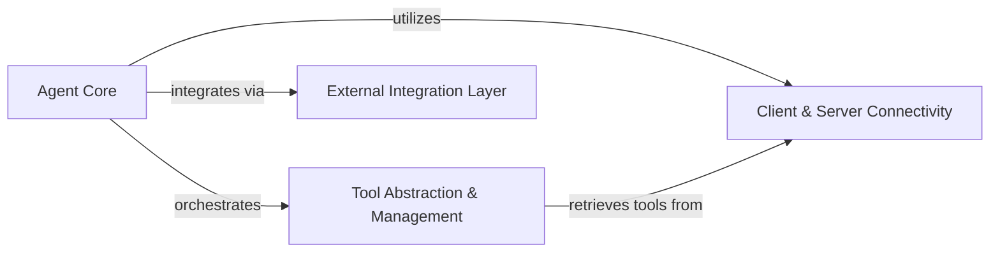
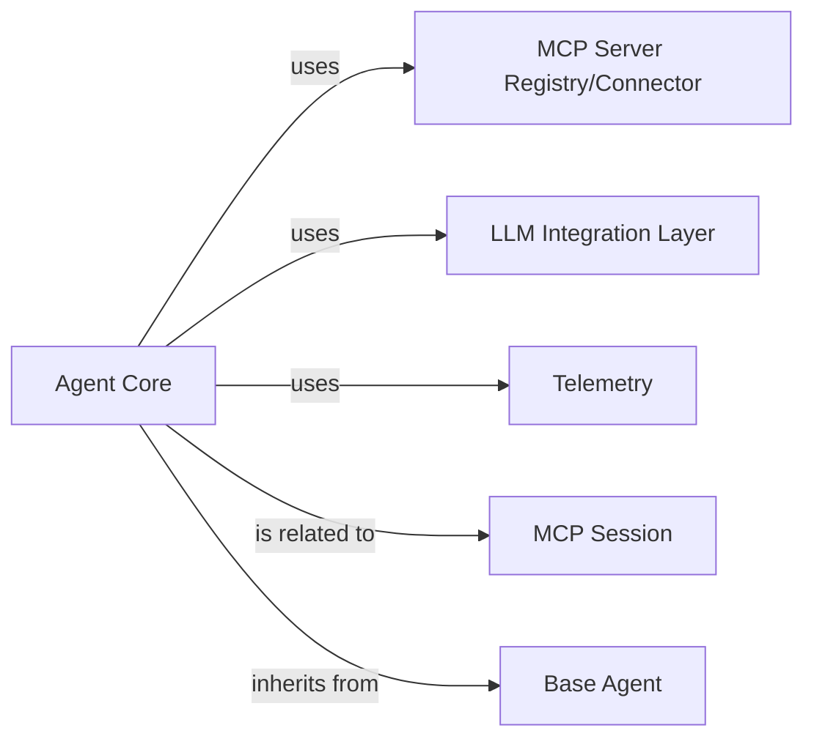
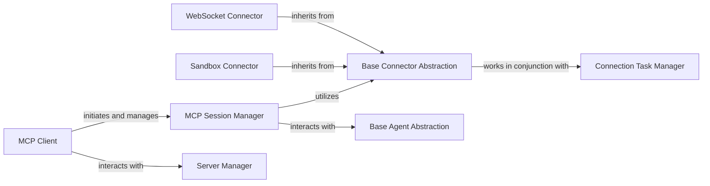
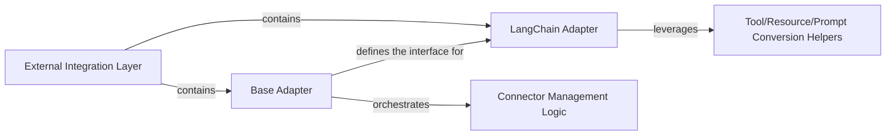

<Info>
This documentation was generated by [CodeBoarding](https://github.com/CodeBoarding/GeneratedOnBoardings) to provide comprehensive architectural insights into the mcp-agent framework.
</Info>

### Details

mcp-use is a Python library designed for building and orchestrating AI agents, primarily focusing on interaction with MCP servers. Its architecture is centered around the Agent Core, which serves as the central decision-making and execution unit. This core interacts with the Client & Server Connectivity component to manage connections and sessions with various MCP servers. The Tool Abstraction & Management component provides the agent with a unified way to discover and utilize tools exposed by these connected servers, relying on the connectivity layer to retrieve them. Furthermore, an External Integration Layer allows `mcp-use` to seamlessly adapt and integrate with other AI frameworks like LangChain, ensuring broad interoperability for agent development.

The central intelligence and orchestration unit, responsible for the agent's decision-making, lifecycle management, and overall execution flow. It leverages other components to interact with the external environment.

**Related Classes/Methods**:

- <a href="https://github.com/CodeBoarding/mcp-use/blob/main/mcp_use/agents/mcpagent.py#L1-L1" target="_blank" rel="noopener noreferrer">`mcp_use.agents.mcpagent.MCPAgent` (1:1)</a>

Manages all aspects of establishing, maintaining, and terminating connections with various MCP servers (e.g., WebSocket, Sandbox). It provides the foundational communication layer and handles session management.

**Related Classes/Methods**:

- <a href="https://github.com/CodeBoarding/mcp-use/blob/main/mcp_use/client.py#L1-L1" target="_blank" rel="noopener noreferrer">`mcp_use.client.MCPClient` (1:1)</a>
- <a href="https://github.com/CodeBoarding/mcp-use/blob/main/mcp_use/session.py#L1-L1" target="_blank" rel="noopener noreferrer">`mcp_use.session.MCPSession` (1:1)</a>
- <a href="https://github.com/CodeBoarding/mcp-use/blob/main/mcp_use/connectors/base.py#L1-L1" target="_blank" rel="noopener noreferrer">`mcp_use.connectors.base.BaseConnector` (1:1)</a>
- <a href="https://github.com/CodeBoarding/mcp-use/blob/main/mcp_use/connectors/sandbox.py#L1-L1" target="_blank" rel="noopener noreferrer">`mcp_use.connectors.sandbox.SandboxConnector` (1:1)</a>
- <a href="https://github.com/CodeBoarding/mcp-use/blob/main/mcp_use/connectors/websocket.py#L1-L1" target="_blank" rel="noopener noreferrer">`mcp_use.connectors.websocket.WebSocketConnector` (1:1)</a>
- <a href="https://github.com/CodeBoarding/mcp-use/blob/main/mcp_use/task_managers/base.py#L1-L1" target="_blank" rel="noopener noreferrer">`mcp_use.task_managers.base.ConnectionManager` (1:1)</a>

Provides a unified interface for agents to discover, list, search, and execute tools exposed by connected MCP servers. It abstracts the complexities of tool interaction and lifecycle.

**Related Classes/Methods**:

- <a href="https://github.com/CodeBoarding/mcp-use/blob/main/mcp_use/managers/tools/disconnect_server.py#L15-L42" target="_blank" rel="noopener noreferrer">`mcp_use.managers.tools.disconnect_server.DisconnectServerTool` (15:42)</a>
- <a href="https://github.com/CodeBoarding/mcp-use/blob/main/mcp_use/managers/tools/get_active_server.py#L13-L28" target="_blank" rel="noopener noreferrer">`mcp_use.managers.tools.get_active_server.GetActiveServerTool` (13:28)</a>
- <a href="https://github.com/CodeBoarding/mcp-use/blob/main/mcp_use/managers/tools/list_servers_tool.py#L15-L51" target="_blank" rel="noopener noreferrer">`mcp_use.managers.tools.list_servers_tool.ListServersTool` (15:51)</a>
- <a href="https://github.com/CodeBoarding/mcp-use/blob/main/mcp_use/managers/tools/search_tools.py#L22-L54" target="_blank" rel="noopener noreferrer">`mcp_use.managers.tools.search_tools.SearchToolsTool` (22:54)</a>
- <a href="https://github.com/CodeBoarding/mcp-use/blob/main/mcp_use/managers/tools/tool_search_engine.py#L1-L1" target="_blank" rel="noopener noreferrer">`mcp_use.managers.tools.ToolSearchEngine` (1:1)</a>
- <a href="https://github.com/CodeBoarding/mcp-use/blob/main/mcp_use/managers/tools/use_tool.py#L21-L153" target="_blank" rel="noopener noreferrer">`mcp_use.managers.tools.use_tool.UseToolFromServerTool` (21:153)</a>

Acts as an adapter, enabling `mcp-use` to seamlessly integrate with and leverage functionalities from external AI frameworks (e.g., LangChain) or other systems by translating interfaces and data structures.

**Related Classes/Methods**:

- <a href="https://github.com/CodeBoarding/mcp-use/blob/main/mcp_use/adapters/base.py#L1-L1" target="_blank" rel="noopener noreferrer">`mcp_use.adapters.base.BaseAdapter` (1:1)</a>
- <a href="https://github.com/CodeBoarding/mcp-use/blob/main/mcp_use/adapters/langchain_adapter.py#L1-L1" target="_blank" rel="noopener noreferrer">`mcp_use.adapters.langchain_adapter.LangChainAdapter` (1:1)</a>

# Agent Core

### Details

The `Agent Core` subsystem is the central orchestrator within the `mcp-use` framework, responsible for the agent's decision-making, lifecycle, and overall execution flow. It integrates various components to interact with the external environment and manage its operational state.

The primary intelligence and orchestration unit. It manages the agent's lifecycle, decision-making processes, and coordinates interactions with other components to execute tasks and communicate with external services.

**Related Classes/Methods**:

- <a href="https://github.com/CodeBoarding/mcp-use/blob/main/mcp_use/agents/mcpagent.py#L1-L1" target="_blank" rel="noopener noreferrer">`mcp_use.agents.mcpagent.MCPAgent` (1:1)</a>

Provides the foundational structure and common functionalities for all agents within the framework. It serves as an abstract base class that `Agent Core` extends.

**Related Classes/Methods**:

- <a href="https://github.com/CodeBoarding/mcp-use/blob/main/mcp_use/agents/base.py#L1-L1" target="_blank" rel="noopener noreferrer">`mcp_use.agents.base.BaseAgent` (1:1)</a>

Manages connections and interactions with various MCP (Multi-Agent Communication Protocol) servers. It acts as an interface for the `Agent Core` to discover and communicate with available services.

**Related Classes/Methods**:

- <a href="https://github.com/CodeBoarding/mcp-use/blob/main/mcp_use/managers/server_manager.py#L16-L89" target="_blank" rel="noopener noreferrer">`mcp_use.managers.server_manager.ServerManager` (16:89)</a>

Facilitates the processing of outputs from Large Language Models (LLMs) and integrates with LangChain-based tools. It acts as an adapter, translating agent requests into LLM-compatible formats and vice-versa.

**Related Classes/Methods**:

- <a href="https://github.com/CodeBoarding/mcp-use/blob/main/mcp_use/adapters/langchain_adapter.py#L1-L1" target="_blank" rel="noopener noreferrer">`mcp_use.adapters.langchain_adapter.LangChainAdapter` (1:1)</a>

Responsible for emitting telemetry events, providing insights into the agent's operational status, performance, and interactions. This component supports observability within the `Agent Core` subsystem.

**Related Classes/Methods**:

- <a href="https://github.com/CodeBoarding/mcp-use/blob/main/mcp_use/telemetry/telemetry.py#L55-L305" target="_blank" rel="noopener noreferrer">`mcp_use.telemetry.telemetry.Telemetry` (55:305)</a>

Manages the state and context of an agent's session. It encapsulates session-specific data and provides mechanisms for maintaining continuity across interactions.

**Related Classes/Methods**:

- <a href="https://github.com/CodeBoarding/mcp-use/blob/main/mcp_use/session.py#L1-L1" target="_blank" rel="noopener noreferrer">`mcp_use.session.MCPSession` (1:1)</a>

# Client Server Connectivity

### Details

One paragraph explaining the functionality which is represented by this graph. What the main flow is and what is its purpose.

Serves as the primary client-side interface for initiating and managing interactions with MCP servers. It orchestrates the creation and lifecycle of communication sessions.

**Related Classes/Methods**:

- <a href="https://github.com/CodeBoarding/mcp-use/blob/main/mcp_use/client.py" target="_blank" rel="noopener noreferrer">`mcp_use.client.MCPClient`</a>

Manages the state, lifecycle, and communication flow of an individual session with an MCP server. It acts as an intermediary, utilizing specific connectors for underlying communication.

**Related Classes/Methods**:

- <a href="https://github.com/CodeBoarding/mcp-use/blob/main/mcp_use/session.py" target="_blank" rel="noopener noreferrer">`mcp_use.session.MCPSession`</a>

Defines the abstract interface for all concrete connection types (e.g., WebSocket, Sandbox). It provides a unified contract for establishing and managing connections, enabling extensibility for new protocols.

**Related Classes/Methods**:

- <a href="https://github.com/CodeBoarding/mcp-use/blob/main/mcp_use/connectors/base.py" target="_blank" rel="noopener noreferrer">`mcp_use.connectors.base.BaseConnector`</a>

A concrete implementation of the Base Connector Abstraction, specifically designed to handle connections and communication with Sandbox MCP servers.

**Related Classes/Methods**:

- <a href="https://github.com/CodeBoarding/mcp-use/blob/main/mcp_use/connectors/sandbox.py" target="_blank" rel="noopener noreferrer">`mcp_use.connectors.sandbox.SandboxConnector`</a>

A concrete implementation of the Base Connector Abstraction, responsible for establishing and managing connections using the WebSocket protocol with MCP servers.

**Related Classes/Methods**:

- <a href="https://github.com/CodeBoarding/mcp-use/blob/main/mcp_use/connectors/websocket.py" target="_blank" rel="noopener noreferrer">`mcp_use.connectors.websocket.WebSocketConnector`</a>

Manages the asynchronous tasks and operational lifecycle associated with specific connector types, ensuring robust and efficient connection handling.

**Related Classes/Methods**:

- <a href="https://github.com/CodeBoarding/mcp-use/blob/main/mcp_use/task_managers/base.py" target="_blank" rel="noopener noreferrer">`mcp_use.task_managers.base.ConnectionManager`</a>

Manages the lifecycle and state of various MCP servers, providing an interface for clients to connect, disconnect, and retrieve server information. It orchestrates server-side operations and interacts with agents.

**Related Classes/Methods**:

- <a href="https://github.com/CodeBoarding/mcp-use/blob/main/mcp_use/managers/server_manager.py#L16-L89" target="_blank" rel="noopener noreferrer">`mcp_use.managers.server_manager.ServerManager` (16:89)</a>

Defines the abstract interface for all agent types within the MCP system. It provides a common contract for agents to interact with sessions and execute operations.

**Related Classes/Methods**:

- <a href="https://github.com/CodeBoarding/mcp-use/blob/main/mcp_use/agents/base.py" target="_blank" rel="noopener noreferrer">`mcp_use.agents.base.BaseAgent`</a>

# External Integration Layer

### Details

Abstract Components Overview

The overarching component responsible for abstracting and managing interactions with external AI frameworks and systems. It acts as the primary interface for `mcp-use` to leverage external functionalities, ensuring loose coupling and adaptability.

**Related Classes/Methods**:

- <a href="https://github.com/CodeBoarding/mcp-use/blob/main/mcp_use/adapters/base.py" target="_blank" rel="noopener noreferrer">`mcp_use.adapters.base.BaseAdapter`</a>
- <a href="https://github.com/CodeBoarding/mcp-use/blob/main/mcp_use/adapters/langchain_adapter.py" target="_blank" rel="noopener noreferrer">`mcp_use.adapters.langchain_adapter.LangChainAdapter`</a>

Defines the abstract interface and contract for all external integrations. It establishes the common methods and properties that any concrete adapter must implement, ensuring a consistent approach to integrating diverse external systems. It also orchestrates the lifecycle of connectors.

**Related Classes/Methods**:

- <a href="https://github.com/CodeBoarding/mcp-use/blob/main/mcp_use/adapters/base.py" target="_blank" rel="noopener noreferrer">`mcp_use.adapters.base.BaseAdapter`</a>

A concrete implementation of the `BaseAdapter` specifically tailored for integrating with the LangChain framework. It translates `mcp-use`'s internal requests and data structures into LangChain-compatible formats and vice-versa, enabling the use of LangChain's agents, tools, and chains.

**Related Classes/Methods**:

- <a href="https://github.com/CodeBoarding/mcp-use/blob/main/mcp_use/adapters/langchain_adapter.py" target="_blank" rel="noopener noreferrer">`mcp_use.adapters.langchain_adapter.LangChainAdapter`</a>

An internal helper component responsible for the initialization, configuration, and lifecycle management of connectors to external systems. It ensures that the necessary connections are established and maintained for adapters to function correctly.

**Related Classes/Methods**:

- <a href="https://github.com/CodeBoarding/mcp-use/blob/main/mcp_use/connectors/base.py" target="_blank" rel="noopener noreferrer">`mcp_use.connectors.base.BaseConnector`</a>
- <a href="https://github.com/CodeBoarding/mcp-use/blob/main/mcp_use/connectors/http.py" target="_blank" rel="noopener noreferrer">`mcp_use.connectors.http.HttpConnector`</a>
- <a href="https://github.com/CodeBoarding/mcp-use/blob/main/mcp_use/connectors/sandbox.py" target="_blank" rel="noopener noreferrer">`mcp_use.connectors.sandbox.SandboxConnector`</a>
- <a href="https://github.com/CodeBoarding/mcp-use/blob/main/mcp_use/connectors/stdio.py" target="_blank" rel="noopener noreferrer">`mcp_use.connectors.stdio.StdioConnector`</a>
- <a href="https://github.com/CodeBoarding/mcp-use/blob/main/mcp_use/connectors/websocket.py" target="_blank" rel="noopener noreferrer">`mcp_use.connectors.websocket.WebSocketConnector`</a>
- <a href="https://github.com/CodeBoarding/mcp-use/blob/main/mcp_use/session.py" target="_blank" rel="noopener noreferrer">`mcp_use.session.MCPSession`</a>

An internal helper component that performs specific data transformations, such as converting `mcp-use`'s internal tool definitions, resources, or prompt templates into formats compatible with external frameworks (e.g., LangChain's tool schema or prompt templates), and vice-versa.

**Related Classes/Methods**:

- <a href="https://github.com/CodeBoarding/mcp-use/blob/main/mcp_use/adapters/langchain_adapter.py" target="_blank" rel="noopener noreferrer">`mcp_use.adapters.langchain_adapter.LangChainAdapter._convert_prompt`</a>
- <a href="https://github.com/CodeBoarding/mcp-use/blob/main/mcp_use/adapters/langchain_adapter.py" target="_blank" rel="noopener noreferrer">`mcp_use.adapters.langchain_adapter.LangChainAdapter._convert_resource`</a>
- <a href="https://github.com/CodeBoarding/mcp-use/blob/main/mcp_use/adapters/langchain_adapter.py" target="_blank" rel="noopener noreferrer">`mcp_use.adapters.langchain_adapter.LangChainAdapter._convert_tool`</a>

# Tool Abstraction Management

```mermaid
graph LR
    Agent_Core["Agent Core"]
    LLM_Integration_Layer["LLM Integration Layer"]
    Tool_Abstraction_Management["Tool Abstraction & Management"]
    MCP_Server_Communication_Layer["MCP Server Communication Layer"]
    Configuration_Management["Configuration Management"]
    Asynchronous_Execution_Engine["Asynchronous Execution Engine"]
    Agent_Core -- "interacts with" --> LLM_Integration_Layer
    Agent_Core -- "interacts with" --> Tool_Abstraction_Management
    LLM_Integration_Layer -- "interacts with" --> Agent_Core
    LLM_Integration_Layer -- "relies on" --> Asynchronous_Execution_Engine
    Tool_Abstraction_Management -- "interacts with" --> Agent_Core
    Tool_Abstraction_Management -- "interacts with" --> MCP_Server_Communication_Layer
    Tool_Abstraction_Management -- "relies on" --> Configuration_Management
    MCP_Server_Communication_Layer -- "interacts with" --> Tool_Abstraction_Management
    MCP_Server_Communication_Layer -- "relies on" --> Asynchronous_Execution_Engine
    Configuration_Management -- "interacts with" --> Tool_Abstraction_Management
    Configuration_Management -- "interacts with" --> MCP_Server_Communication_Layer
    Asynchronous_Execution_Engine -- "supports" --> LLM_Integration_Layer
    Asynchronous_Execution_Engine -- "supports" --> MCP_Server_Communication_Layer
    click Agent_Core href "/codeboarding/Agent_Core.md" "Details"
    click Tool_Abstraction_Management href "/codeboarding/Tool_Abstraction_Management.md" "Details"
```

### Details

Abstract Components Overview

The central orchestrator of the AI agent framework. It interprets user requests, leverages the LLM Integration Layer for reasoning and decision-making, and utilizes the Tool Abstraction & Management component to dynamically select and execute appropriate tools to achieve its goals. This component embodies the "Agent-based Architecture" pattern.

**Related Classes/Methods**:

- <a href="https://github.com/CodeBoarding/mcp-use/blob/main/mcp_use/agents/mcpagent.py" target="_blank" rel="noopener noreferrer">`mcp_use.agents.mcpagent.MCPAgent`</a>

Provides a standardized, abstract interface for interacting with various Large Language Models. It encapsulates the specifics of different LLM APIs, allowing the Agent Core to communicate with them seamlessly for tasks such as natural language understanding, generation, and complex reasoning.

**Related Classes/Methods**:

- <a href="https://github.com/CodeBoarding/mcp-use/blob/main/mcp_use/adapters/langchain_adapter.py" target="_blank" rel="noopener noreferrer">`mcp_use.adapters.langchain_adapter.LangChainAdapter`</a>

This component serves as the central Tool/Server Abstraction Layer. It provides a unified, high-level interface for agents to discover, manage, and execute tools exposed by connected MCP servers. It abstracts the complexities of tool interaction, server lifecycle management, and tool execution, aligning with the "Adapter Pattern" and "Client-Server Architecture (Internal)" principles. It is crucial for the framework's extensibility and modularity.

**Related Classes/Methods**:

- <a href="https://github.com/CodeBoarding/mcp-use/blob/main/mcp_use/managers/tools/disconnect_server.py#L15-L42" target="_blank" rel="noopener noreferrer">`mcp_use.managers.tools.disconnect_server.DisconnectServerTool` (15:42)</a>
- <a href="https://github.com/CodeBoarding/mcp-use/blob/main/mcp_use/managers/tools/get_active_server.py#L13-L28" target="_blank" rel="noopener noreferrer">`mcp_use.managers.tools.get_active_server.GetActiveServerTool` (13:28)</a>
- <a href="https://github.com/CodeBoarding/mcp-use/blob/main/mcp_use/managers/tools/list_servers_tool.py#L15-L51" target="_blank" rel="noopener noreferrer">`mcp_use.managers.tools.list_servers_tool.ListServersTool` (15:51)</a>
- <a href="https://github.com/CodeBoarding/mcp-use/blob/main/mcp_use/managers/tools/search_tools.py#L22-L54" target="_blank" rel="noopener noreferrer">`mcp_use.managers.tools.search_tools.SearchToolsTool` (22:54)</a>
- <a href="https://github.com/CodeBoarding/mcp-use/blob/main/mcp_use/managers/tools/ToolSearchEngine.py" target="_blank" rel="noopener noreferrer">`mcp_use.managers.tools.ToolSearchEngine`</a>
- <a href="https://github.com/CodeBoarding/mcp-use/blob/main/mcp_use/managers/tools/use_tool.py#L21-L153" target="_blank" rel="noopener noreferrer">`mcp_use.managers.tools.use_tool.UseToolFromServerTool` (21:153)</a>
- <a href="https://github.com/CodeBoarding/mcp-use/blob/main/mcp_use/managers/server_manager.py#L16-L89" target="_blank" rel="noopener noreferrer">`mcp_use.managers.server_manager.ServerManager` (16:89)</a>

Responsible for the low-level, concrete communication with external MCP (Multi-Component Platform) servers. It handles network requests, data serialization/deserialization, and error handling specific to server interactions, translating abstract tool execution requests from the Tool Abstraction & Management component into concrete server API calls.

**Related Classes/Methods**:

- <a href="https://github.com/CodeBoarding/mcp-use/blob/main/mcp_use/connectors/http.py" target="_blank" rel="noopener noreferrer">`mcp_use.connectors.http.HttpConnector`</a>
- <a href="https://github.com/CodeBoarding/mcp-use/blob/main/mcp_use/connectors/sandbox.py" target="_blank" rel="noopener noreferrer">`mcp_use.connectors.sandbox.SandboxConnector`</a>
- <a href="https://github.com/CodeBoarding/mcp-use/blob/main/mcp_use/connectors/stdio.py" target="_blank" rel="noopener noreferrer">`mcp_use.connectors.stdio.StdioConnector`</a>
- <a href="https://github.com/CodeBoarding/mcp-use/blob/main/mcp_use/connectors/websocket.py" target="_blank" rel="noopener noreferrer">`mcp_use.connectors.websocket.WebSocketConnector`</a>

Manages the loading, parsing, and access of configuration settings for the entire framework. This includes details about registered MCP servers, API keys, and other operational parameters. It ensures that various components can dynamically retrieve necessary settings, supporting the "Configuration-Driven Design" pattern.

**Related Classes/Methods**:

- <a href="https://github.com/CodeBoarding/mcp-use/blob/main/mcp_use/config.py" target="_blank" rel="noopener noreferrer">`mcp_use.config.Config`</a>

Provides the core asynchronous capabilities for the framework, enabling non-blocking I/O operations and concurrent execution. It is fundamental for efficiently handling long-running tasks such as LLM API calls and external tool executions, leveraging asyncio throughout the system. This aligns with the "Asynchronous Processing" architectural pattern.

**Related Classes/Methods**:

- <a href="https://github.com/CodeBoarding/mcp-use/blob/main/mcp_use/task_managers/sse.py" target="_blank" rel="noopener noreferrer">`mcp_use.task_managers.sse.SseConnectionManager`</a>
- <a href="https://github.com/CodeBoarding/mcp-use/blob/main/mcp_use/task_managers/stdio.py" target="_blank" rel="noopener noreferrer">`mcp_use.task_managers.stdio.StdioConnectionManager`</a>
- <a href="https://github.com/CodeBoarding/mcp-use/blob/main/mcp_use/task_managers/streamable_http.py" target="_blank" rel="noopener noreferrer">`mcp_use.task_managers.streamable_http.StreamableHttpConnectionManager`</a>
- <a href="https://github.com/CodeBoarding/mcp-use/blob/main/mcp_use/task_managers/websocket.py" target="_blank" rel="noopener noreferrer">`mcp_use.task_managers.websocket.WebSocketConnectionManager`</a>

