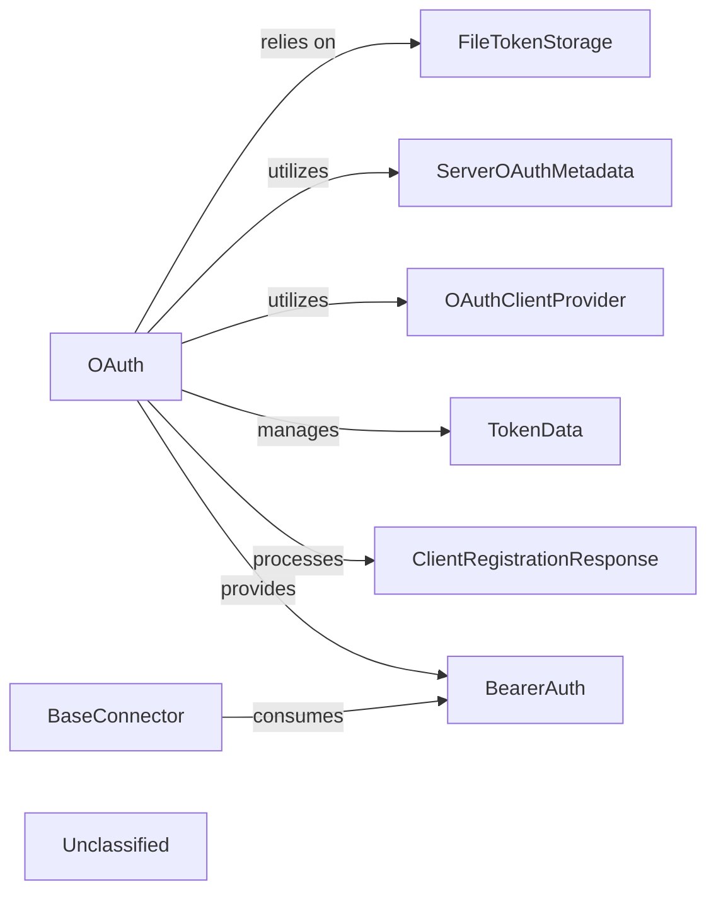
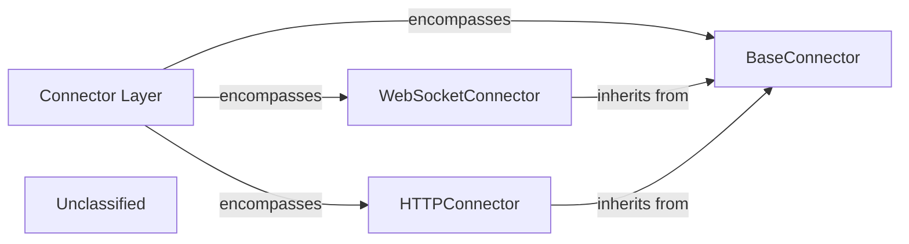
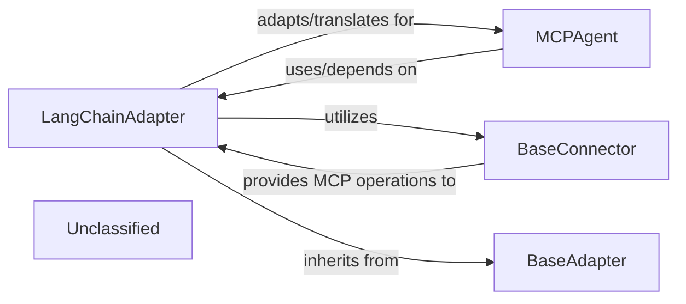
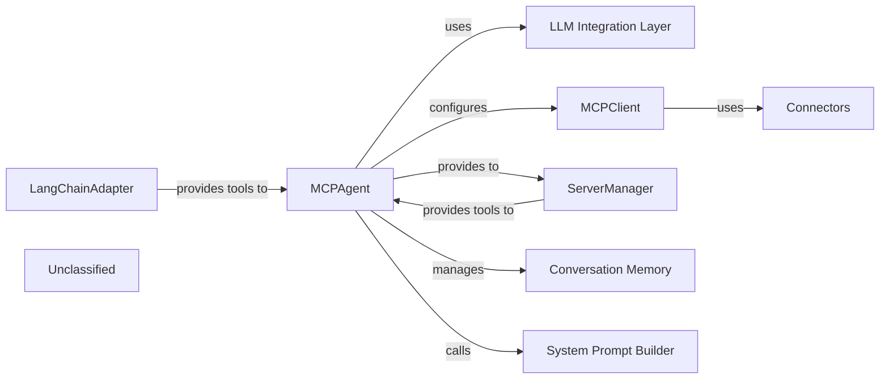
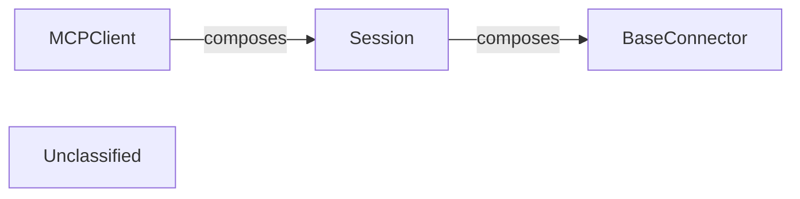
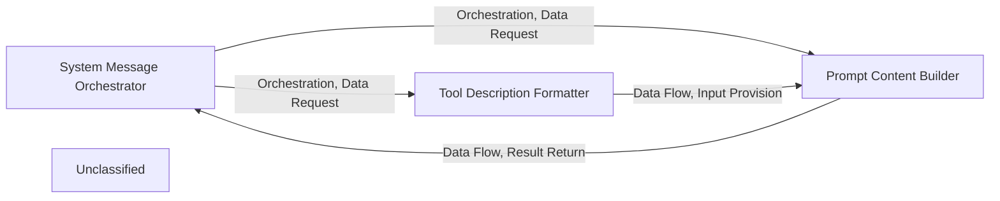
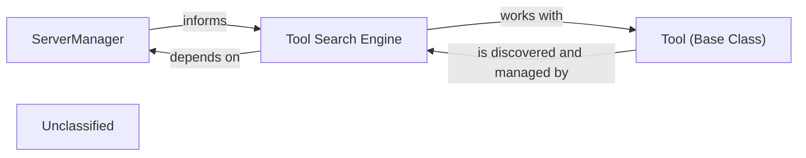
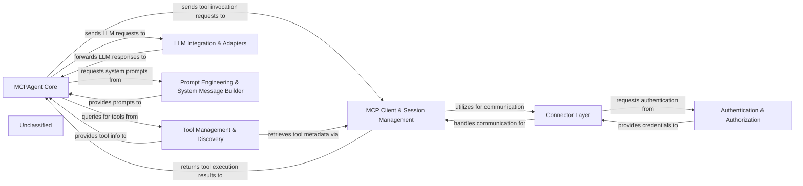

# Authentication Authorization

### Details

The `Authentication & Authorization` subsystem in `mcp-use` is designed to manage secure access to MCP servers using OAuth 2.0. The central `OAuth` component orchestrates the entire authentication flow, from server metadata discovery and dynamic client registration to the lifecycle management of access tokens. It relies on `FileTokenStorage` for persistent token storage and utilizes `ServerOAuthMetadata` and `OAuthClientProvider` for configuration and server capabilities. The subsystem produces `BearerAuth` tokens, which are then consumed by `BaseConnector` instances to make authenticated requests to MCP servers. This design ensures a clear separation of concerns, with dedicated components handling different aspects of the OAuth process and providing a robust mechanism for secure communication.

### OAuth
The central orchestrator for the entire OAuth authentication flow. It manages server metadata discovery, dynamic client registration, token lifecycle (loading, saving, refreshing, deleting), and facilitates authenticated requests to secure MCP servers. It acts as the primary interface for clients requiring OAuth-based authentication.

**Related Classes/Methods**:

- <a href="https://github.com/mcp-use/mcp-use/blob/main/mcp_use/connectors/http.py#L68-L68" target="_blank" rel="noopener noreferrer">QName:`OAuth` FileRef: `/home/ubuntu/CodeBoarding/repo/mcp-use/mcp_use/connectors/http.py`</a>

### FileTokenStorage
Provides a concrete mechanism for securely persisting and retrieving OAuth tokens on the local file system. This ensures token durability across application restarts and manages tokens based on the server URL.

**Related Classes/Methods**:

- <a href="https://github.com/mcp-use/mcp-use/blob/main/mcp_use/auth/oauth.py#L102-L164" target="_blank" rel="noopener noreferrer">QName:`FileTokenStorage` FileRef: `/home/ubuntu/CodeBoarding/repo/mcp-use/mcp_use/auth/oauth.py`, Lines:(102:164)</a>

### ServerOAuthMetadata
A data model that encapsulates the OAuth server's capabilities, endpoints, and other essential metadata required for initiating and managing the OAuth flow.

**Related Classes/Methods**:

- <a href="https://github.com/mcp-use/mcp-use/blob/main/mcp_use/auth/oauth.py#L22-L48" target="_blank" rel="noopener noreferrer">QName:`ServerOAuthMetadata` FileRef: `/home/ubuntu/CodeBoarding/repo/mcp-use/mcp_use/auth/oauth.py`, Lines:(22:48)</a>

### OAuthClientProvider
Responsible for providing the necessary OAuth client configuration and capabilities, including client ID and secrets, which are crucial for dynamic client registration and token requests.

**Related Classes/Methods**:

- <a href="https://github.com/mcp-use/mcp-use/blob/main/mcp_use/auth/oauth.py#L51-L66" target="_blank" rel="noopener noreferrer">QName:`OAuthClientProvider` FileRef: `/home/ubuntu/CodeBoarding/repo/mcp-use/mcp_use/auth/oauth.py`, Lines:(51:66)</a>

### TokenData
A data model representing the structure and content of an OAuth token, including access tokens, refresh tokens, expiration times, and scopes.

**Related Classes/Methods**:

- <a href="https://github.com/mcp-use/mcp-use/blob/main/mcp_use/auth/oauth.py#L69-L79" target="_blank" rel="noopener noreferrer">QName:`TokenData` FileRef: `/home/ubuntu/CodeBoarding/repo/mcp-use/mcp_use/auth/oauth.py`, Lines:(69:79)</a>

### ClientRegistrationResponse
A data model that captures the response received from an OAuth server during the dynamic client registration process, containing details like the registered client ID and client secret.

**Related Classes/Methods**:

- <a href="https://github.com/mcp-use/mcp-use/blob/main/mcp_use/auth/oauth.py#L82-L99" target="_blank" rel="noopener noreferrer">QName:`ClientRegistrationResponse` FileRef: `/home/ubuntu/CodeBoarding/repo/mcp-use/mcp_use/auth/oauth.py`, Lines:(82:99)</a>

### BearerAuth
An authentication object that provides the Bearer token, ready to be included in HTTP request headers for authenticating requests to secure MCP servers. It is the direct output of a successful authentication process.

**Related Classes/Methods**:

- <a href="https://github.com/mcp-use/mcp-use/blob/main/mcp_use/auth/bearer.py#L9-L17" target="_blank" rel="noopener noreferrer">QName:`BearerAuth` FileRef: `/home/ubuntu/CodeBoarding/repo/mcp-use/mcp_use/auth/bearer.py`, Lines:(9:17)</a>

### BaseConnector
A base class for connectors that interact with secure MCP servers. It defines the interface for consuming authentication credentials (like `BearerAuth`) to make authenticated requests. This component represents the external consumer of the `Authentication & Authorization` subsystem's output.

**Related Classes/Methods**:

- <a href="https://github.com/mcp-use/mcp-use/blob/main/mcp_use/connectors/base.py#L37-L453" target="_blank" rel="noopener noreferrer">QName:`BaseConnector` FileRef: `/home/ubuntu/CodeBoarding/repo/mcp-use/mcp_use/connectors/base.py`, Lines:(37:453)</a>

### Unclassified
Component for all unclassified files and utility functions (Utility functions/External Libraries/Dependencies)

**Related Classes/Methods**: _None_

# Connector Layer

### Details

The Connector Layer subsystem provides a robust and standardized mechanism for the MCPClient to interact with various external MCP servers and tools. It acts as a crucial abstraction layer, enabling protocol-agnostic communication. At its core, the BaseConnector defines a common interface for all communication protocols, ensuring consistency and extensibility. Concrete implementations, such as WebSocketConnector and HTTPConnector, extend this base to handle specific protocol intricacies, facilitating real-time and traditional request-response interactions for the MCPClient.

### Connector Layer
The overarching subsystem providing a standardized, protocol-agnostic mechanism for the `MCPClient` to communicate with diverse external `MCP servers` and tools. It acts as the entry point for establishing and managing connections.

**Related Classes/Methods**:

- <a href="https://github.com/mcp-use/mcp-use/blob/main/mcp_use/connectors/base.py#L37-L453" target="_blank" rel="noopener noreferrer">QName:`mcp_use.connectors.base.BaseConnector` FileRef: `/home/ubuntu/CodeBoarding/repo/mcp-use/mcp_use/connectors/base.py`, Lines:(37:453)</a>
- <a href="https://github.com/mcp-use/mcp-use/blob/main/mcp_use/connectors/websocket.py#L22-L257" target="_blank" rel="noopener noreferrer">QName:`mcp_use.connectors.websocket.WebSocketConnector` FileRef: `/home/ubuntu/CodeBoarding/repo/mcp-use/mcp_use/connectors/websocket.py`, Lines:(22:257)</a>
- <a href="https://github.com/mcp-use/mcp-use/blob/main/mcp_use/connectors/http.py#L24-L301" target="_blank" rel="noopener noreferrer">QName:`mcp_use.connectors.http.HTTPConnector` FileRef: `/home/ubuntu/CodeBoarding/repo/mcp-use/mcp_use/connectors/http.py`, Lines:(24:301)</a>

### BaseConnector
Defines the abstract interface and common contract for all concrete connectors. It establishes fundamental operations for connecting, sending requests, and receiving responses, ensuring a consistent API across different communication protocols. This component is crucial for extensibility and adherence to the Adapter Pattern.

**Related Classes/Methods**:

- <a href="https://github.com/mcp-use/mcp-use/blob/main/mcp_use/connectors/base.py#L37-L453" target="_blank" rel="noopener noreferrer">QName:`mcp_use.connectors.base.BaseConnector` FileRef: `/home/ubuntu/CodeBoarding/repo/mcp-use/mcp_use/connectors/base.py`, Lines:(37:453)</a>

### WebSocketConnector
Implements the `BaseConnector` interface specifically for WebSocket-based communication. It handles the intricacies of WebSocket connections, including establishing, maintaining, closing, and managing asynchronous message exchange, vital for real-time agent interactions.

**Related Classes/Methods**:

- <a href="https://github.com/mcp-use/mcp-use/blob/main/mcp_use/connectors/websocket.py#L22-L257" target="_blank" rel="noopener noreferrer">QName:`mcp_use.connectors.websocket.WebSocketConnector` FileRef: `/home/ubuntu/CodeBoarding/repo/mcp-use/mcp_use/connectors/websocket.py`, Lines:(22:257)</a>

### HTTPConnector
Implements the `BaseConnector` interface for HTTP-based communication. It manages the sending of HTTP requests and processing of HTTP responses, handling various HTTP methods and status codes, suitable for traditional request-response interactions with `MCP Servers`.

**Related Classes/Methods**:

- <a href="https://github.com/mcp-use/mcp-use/blob/main/mcp_use/connectors/http.py#L24-L301" target="_blank" rel="noopener noreferrer">QName:`mcp_use.connectors.http.HTTPConnector` FileRef: `/home/ubuntu/CodeBoarding/repo/mcp-use/mcp_use/connectors/http.py`, Lines:(24:301)</a>

### Unclassified
Component for all unclassified files and utility functions (Utility functions/External Libraries/Dependencies)

**Related Classes/Methods**: _None_

# LLM Integration Adapters

### Details

This subsystem is dedicated to enabling seamless communication and data translation between MCP's internal agent representations and external Large Language Model (LLM) frameworks, primarily LangChain. Its core responsibility is to adapt MCP's tools, resources, and prompts into a format consumable by LLMs, manage the execution of MCP operations within an LLM context, and ensure proper error handling and schema compatibility. It acts as the crucial bridge for MCP agents to leverage the capabilities of various LLM providers.

### LangChainAdapter
This is the central component of the subsystem. It acts as a translator and orchestrator, adapting MCP's internal tools, resources, and prompts into a LangChain-compatible format. It handles schema translation, manages asynchronous execution of MCP operations (via `BaseConnector`), and formats errors for effective LLM consumption. This component is crucial for enabling MCP agents to interact with LLMs through LangChain.

**Related Classes/Methods**:

- <a href="https://github.com/mcp-use/mcp-use/blob/main/mcp_use/adapters/langchain_adapter.py#L29-L268" target="_blank" rel="noopener noreferrer">QName:`LangChainAdapter` FileRef: `/home/ubuntu/CodeBoarding/repo/mcp-use/mcp_use/adapters/langchain_adapter.py`, Lines:(29:268)</a>

### BaseConnector
An abstract base class defining the interface for connecting to MCP servers. It provides methods for executing MCP tool calls, reading resources, and retrieving prompts. `LangChainAdapter` relies on concrete implementations of `BaseConnector` to perform actual MCP operations, abstracting the specifics of MCP server communication.

**Related Classes/Methods**:

- <a href="https://github.com/mcp-use/mcp-use/blob/main/mcp_use/connectors/base.py#L37-L453" target="_blank" rel="noopener noreferrer">QName:`BaseConnector` FileRef: `/home/ubuntu/CodeBoarding/repo/mcp-use/mcp_use/connectors/base.py`, Lines:(37:453)</a>

### MCPAgent
Represents the core agent component that integrates MCP functionalities into its workflow. It utilizes the `LangChainAdapter` to interact with external LLM frameworks, allowing it to leverage LLMs for decision-making and task execution based on MCP's tools and resources. It is the primary consumer of the `LLM Integration & Adapters` subsystem.

**Related Classes/Methods**:

- <a href="https://github.com/mcp-use/mcp-use/blob/main/mcp_use/agents/mcpagent.py#L48-L1107" target="_blank" rel="noopener noreferrer">QName:`MCPAgent` FileRef: `/home/ubuntu/CodeBoarding/repo/mcp-use/mcp_use/agents/mcpagent.py`, Lines:(48:1107)</a>

### BaseAdapter
An abstract base class that defines a common interface and contract for all adapter implementations within the project. `LangChainAdapter` inherits from this class, ensuring a consistent structure and adherence to the Adapter Pattern for different integration points.

**Related Classes/Methods**:

- <a href="https://github.com/mcp-use/mcp-use/blob/main/mcp_use/adapters/base.py#L20-L190" target="_blank" rel="noopener noreferrer">QName:`BaseAdapter` FileRef: `/home/ubuntu/CodeBoarding/repo/mcp-use/mcp_use/adapters/base.py`, Lines:(20:190)</a>

### Unclassified
Component for all unclassified files and utility functions (Utility functions/External Libraries/Dependencies)

**Related Classes/Methods**: _None_

# MCPAgent Core

### Details

The mcp-use project's core subsystem is centered around the MCPAgent, an intelligent orchestrator that leverages Large Language Models (LLMs) to interact with various MCP (Multi-Cloud Platform) services. The MCPAgent utilizes an LLM Integration Layer for its reasoning and decision-making, enabling it to interpret user requests and execute actions. It connects to MCP services through the MCPClient, which in turn manages Connectors for specific communication protocols. To ensure compatibility with the LLM framework, the LangChainAdapter translates MCP-specific tools into a standardized format. An optional ServerManager can dynamically discover and provision tools, enhancing the agent's capabilities. The MCPAgent maintains conversational context through its Conversation Memory and dynamically constructs its operational guidelines using the System Prompt Builder. This architecture allows the MCPAgent to provide a flexible and powerful interface for interacting with diverse MCP tools and services.

### MCPAgent
The central orchestrator, responsible for interpreting user requests, planning actions, interacting with tools, managing conversation flow, and formulating responses. It leverages LLMs for reasoning and integrates various components to achieve its goals.

**Related Classes/Methods**:

- <a href="https://github.com/mcp-use/mcp-use/blob/main/mcp_use/agents/mcpagent.py#L48-L1107" target="_blank" rel="noopener noreferrer">QName:`mcp_use.agents.mcpagent.MCPAgent` FileRef: `/home/ubuntu/CodeBoarding/repo/mcp-use/mcp_use/agents/mcpagent.py`, Lines:(48:1107)</a>

### LLM Integration Layer
This component encapsulates the interaction with Large Language Models. It includes the BaseLanguageModel (e.g., OpenAI, Anthropic, Groq) used by MCPAgent and the LangChain AgentExecutor and create_tool_calling_agent which facilitate the LLM's reasoning and tool-calling capabilities.

**Related Classes/Methods**:

- QName:`langchain_core.language_models.base.BaseLanguageModel` FileRef: `/home/ubuntu/CodeBoarding/repo/mcp-use/`
- QName:`langchain.agents.agent_executor.AgentExecutor` FileRef: `/home/ubuntu/CodeBoarding/repo/mcp-use/`
- QName:`langchain.agents.tool_calling_agent.create_tool_calling_agent` FileRef: `/home/ubuntu/CodeBoarding/repo/mcp-use/`

### MCPClient
Manages the creation, retrieval, and closure of multiple sessions with various MCP servers/connectors. It provides a high-level interface for connection management and tool aggregation from these sessions.

**Related Classes/Methods**:

- <a href="https://github.com/mcp-use/mcp-use/blob/main/mcp_use/client.py#L21-L326" target="_blank" rel="noopener noreferrer">QName:`mcp_use.client.MCPClient` FileRef: `/home/ubuntu/CodeBoarding/repo/mcp-use/mcp_use/client.py`, Lines:(21:326)</a>

### Connectors
Implement the concrete communication protocols (e.g., HTTP, WebSocket, Sandbox) for interacting with individual MCP servers. They handle low-level request/response mechanisms and resource management for specific server types.

**Related Classes/Methods**:

- <a href="https://github.com/mcp-use/mcp-use/blob/main/mcp_use/connectors/base.py#L37-L453" target="_blank" rel="noopener noreferrer">QName:`mcp_use.connectors.base.BaseConnector` FileRef: `/home/ubuntu/CodeBoarding/repo/mcp-use/mcp_use/connectors/base.py`, Lines:(37:453)</a>

### LangChainAdapter
Translates between the MCP's internal tool and resource formats and the LangChain framework's BaseTool format, ensuring compatibility and a unified interface for the MCPAgent to interact with diverse MCP tools.

**Related Classes/Methods**:

- <a href="https://github.com/mcp-use/mcp-use/blob/main/mcp_use/adapters/langchain_adapter.py#L29-L268" target="_blank" rel="noopener noreferrer">QName:`mcp_use.adapters.langchain_adapter.LangChainAdapter` FileRef: `/home/ubuntu/CodeBoarding/repo/mcp-use/mcp_use/adapters/langchain_adapter.py`, Lines:(29:268)</a>
- QName:`langchain_core.tools.base.BaseTool` FileRef: `/home/ubuntu/CodeBoarding/repo/mcp-use/`

### ServerManager
When enabled, dynamically discovers and provisions available MCP servers and their associated tools, including management tools like ListServersTool. It provides a layer of abstraction for tool discovery.

**Related Classes/Methods**:

- <a href="https://github.com/mcp-use/mcp-use/blob/main/mcp_use/managers/server_manager.py#L11-L124" target="_blank" rel="noopener noreferrer">QName:`mcp_use.managers.server_manager.ServerManager` FileRef: `/home/ubuntu/CodeBoarding/repo/mcp-use/mcp_use/managers/server_manager.py`, Lines:(11:124)</a>

### Conversation Memory
Managed internally by MCPAgent through _conversation_history (a list of BaseMessage objects). It stores the ongoing dialogue, including system messages, human queries, and AI responses, to provide context for subsequent interactions.

**Related Classes/Methods**:

- QName:`mcp_use.agents.mcpagent.MCPAgent._conversation_history` FileRef: `/home/ubuntu/CodeBoarding/repo/mcp-use/mcp_use/agents/mcpagent.py`
- QName:`langchain_core.messages.base.BaseMessage` FileRef: `/home/ubuntu/CodeBoarding/repo/mcp-use/`

### System Prompt Builder
An external utility (create_system_message function) used by MCPAgent to dynamically construct the agent's system prompt based on available tools, user-provided instructions, and server manager mode.

**Related Classes/Methods**:

- <a href="https://github.com/mcp-use/mcp-use/blob/main/mcp_use/agents/prompts/system_prompt_builder.py#L59-L103" target="_blank" rel="noopener noreferrer">QName:`mcp_use.agents.prompts.system_prompt_builder.create_system_message` FileRef: `/home/ubuntu/CodeBoarding/repo/mcp-use/mcp_use/agents/prompts/system_prompt_builder.py`, Lines:(59:103)</a>

### Unclassified
Component for all unclassified files and utility functions (Utility functions/External Libraries/Dependencies)

**Related Classes/Methods**: _None_

# MCP Client Session Management

### Details

The `mcp-use` project facilitates agent interaction with external services through a well-defined client-connector architecture. The `MCPClient` acts as the central orchestrator, managing multiple `Session` instances. Each `Session` represents a single, isolated connection to an MCP server, handling its lifecycle from establishment to termination. The `Session` relies on `BaseConnector` implementations to abstract the underlying communication protocols, allowing for flexible integration with various MCP server types. This design promotes modularity and extensibility, enabling the agent framework to adapt to diverse communication requirements without significant changes to its core logic.

### MCPClient
The high-level manager for all MCP server connections. It orchestrates the creation, management, and closing of multiple Session instances, providing a unified interface for the MCPAgent to interact with external services. This component is crucial for an agent framework as it centralizes the management of diverse external tool connections.

**Related Classes/Methods**:

- QName:`mcp_use.client.MCPClient` FileRef: `/home/ubuntu/CodeBoarding/repo/mcp-use/mcp_use/client.py`

### Session
Manages the lifecycle of a single, individual connection to an MCP server. This includes establishing the connection, ensuring its proper termination, and providing an asynchronous context for interaction. It encapsulates the state and operations related to a specific connection, which is fundamental for robust and isolated communication within an agent system.

**Related Classes/Methods**:

- QName:`mcp_use.session.Session` FileRef: `/home/ubuntu/CodeBoarding/repo/mcp-use/mcp_use/session.py`

### BaseConnector
An abstract base class that defines the interface for concrete communication mechanisms. Its implementations (e.g., WebSocketConnector, SandboxConnector) provide the actual underlying protocol for a Session to connect and exchange messages with an MCP server. This component embodies the Adapter Pattern, allowing the agent framework to support various communication protocols without altering the core Session logic.

**Related Classes/Methods**:

- <a href="https://github.com/mcp-use/mcp-use/blob/main/mcp_use/connectors/base.py#L37-L453" target="_blank" rel="noopener noreferrer">QName:`mcp_use.connectors.base.BaseConnector` FileRef: `/home/ubuntu/CodeBoarding/repo/mcp-use/mcp_use/connectors/base.py`, Lines:(37:453)</a>

### Unclassified
Component for all unclassified files and utility functions (Utility functions/External Libraries/Dependencies)

**Related Classes/Methods**: _None_

# Prompt Engineering System Message Builder

### Details

This subsystem is responsible for the dynamic construction of `SystemMessage` objects and prompts specifically tailored for the `MCPAgent`. Its scope includes gathering contextual information, formatting tool descriptions, and assembling these elements into a coherent and effective prompt for interaction with Large Language Models (LLMs). The core functionality is encapsulated within the `mcp_use/agents/prompts/system_prompt_builder.py` module, primarily centered around the `SystemPromptBuilder` concept.

### System Message Orchestrator
This component acts as the primary entry point and orchestrator for the entire system message construction process. It coordinates the generation of tool descriptions and the final assembly of the system prompt content, ensuring all necessary elements are integrated into the `SystemMessage` for the `MCPAgent`.

**Related Classes/Methods**:

- <a href="https://github.com/mcp-use/mcp-use/blob/main/mcp_use/agents/prompts/system_prompt_builder.py#L59-L103" target="_blank" rel="noopener noreferrer">QName:`mcp_use.agents.prompts.system_prompt_builder.create_system_message` FileRef: `/home/ubuntu/CodeBoarding/repo/mcp-use/mcp_use/agents/prompts/system_prompt_builder.py`, Lines:(59:103)</a>

### Tool Description Formatter
Responsible for transforming raw `BaseTool` objects into a structured, human-readable format suitable for inclusion in the system prompt. It also handles the logic for filtering out any tools that are explicitly disallowed, ensuring only relevant and permitted tools are described to the LLM.

**Related Classes/Methods**:

- <a href="https://github.com/mcp-use/mcp-use/blob/main/mcp_use/agents/prompts/system_prompt_builder.py#L5-L25" target="_blank" rel="noopener noreferrer">QName:`mcp_use.agents.prompts.system_prompt_builder.generate_tool_descriptions` FileRef: `/home/ubuntu/CodeBoarding/repo/mcp-use/mcp_use/agents/prompts/system_prompt_builder.py`, Lines:(5:25)</a>

### Prompt Content Builder
This component focuses on the templating and assembly of the actual system prompt content. It takes a base prompt template, injects the formatted tool descriptions provided by the `Tool Description Formatter`, and appends any additional instructions or contextual information, ensuring the final prompt adheres to a predefined structure and effectively guides the LLM.

**Related Classes/Methods**:

- <a href="https://github.com/mcp-use/mcp-use/blob/main/mcp_use/agents/prompts/system_prompt_builder.py#L28-L56" target="_blank" rel="noopener noreferrer">QName:`mcp_use.agents.prompts.system_prompt_builder.build_system_prompt_content` FileRef: `/home/ubuntu/CodeBoarding/repo/mcp-use/mcp_use/agents/prompts/system_prompt_builder.py`, Lines:(28:56)</a>

### Unclassified
Component for all unclassified files and utility functions (Utility functions/External Libraries/Dependencies)

**Related Classes/Methods**: _None_

# Tool Management Discovery

### Details

This subsystem, 'Tool Management & Discovery', is responsible for connecting to external MCP servers, discovering and indexing the tools they offer, and providing a standardized interface for these tools to be utilized by the `MCPAgent`. Its main purpose is to act as the bridge between the agent's need for functionality and the available external services, ensuring dynamic and reliable access to tools.

### ServerManager
Manages the lifecycle and state of connections to various MCP servers. It acts as the central registry for available servers, handling connection establishment, disconnection, and potentially monitoring server health. This component is crucial for maintaining a dynamic and reliable connection landscape for the agent.

**Related Classes/Methods**:

- QName:`mcp_use.managers.server_manager.ServerManager` FileRef: `/home/ubuntu/CodeBoarding/repo/mcp-use/mcp_use/managers/server_manager.py`

### Tool Search Engine
Provides the capability to dynamically discover, index, and search for tools available across connected MCP servers. This component enables the `MCPAgent` to find and utilize tools based on specific criteria without prior explicit configuration, embodying the dynamic nature of agentic systems.

**Related Classes/Methods**:

- QName:`mcp_use.managers.tools.search_tools:search_tools` FileRef: `/home/ubuntu/CodeBoarding/repo/mcp-use/mcp_use/managers/tools/search_tools.py`

### Tool (Base Class)
Defines the abstract interface and common properties for all tools within the MCP ecosystem. This standardization is crucial for the `MCPAgent` to interact uniformly with diverse tools, regardless of their underlying implementation. It encapsulates attributes like name, description, and input/output schemas, ensuring interoperability.

**Related Classes/Methods**:

- QName:`mcp_use.managers.tools.base_tool.Tool` FileRef: `/home/ubuntu/CodeBoarding/repo/mcp-use/mcp_use/managers/tools/base_tool.py`

### Unclassified
Component for all unclassified files and utility functions (Utility functions/External Libraries/Dependencies)

**Related Classes/Methods**: _None_

# overview

### Details

The MCP system is designed around a central `MCPAgent Core` that orchestrates interactions with external MCP servers and tools. It leverages `LLM Integration & Adapters` for reasoning and `Prompt Engineering & System Message Builder` for dynamic prompt generation. The `MCP Client & Session Management` component handles connections to MCP servers, relying on the `Connector Layer` for various communication protocols and `Authentication & Authorization` for secure access. `Tool Management & Discovery` provides the MCPAgent with access to available tools, which are then invoked through the `MCP Client & Session Management`. This modular design ensures clear separation of concerns, facilitating maintainability and scalability, and is optimized for clear data flow visualization in diagrams.

### MCPAgent Core
The central intelligence and orchestration unit. It interprets user requests, plans actions, interacts with tools, and formulates responses, leveraging LLMs for reasoning.

**Related Classes/Methods**:

- <a href="https://github.com/mcp-use/mcp-use/blob/main/mcp_use/agents/mcpagent.py#L48-L1107" target="_blank" rel="noopener noreferrer">QName:`MCPAgent` FileRef: `/home/ubuntu/CodeBoarding/repo/mcp-use/mcp_use/agents/mcpagent.py`, Lines:(48:1107)</a>

### MCP Client & Session Management
Manages the lifecycle of connections (sessions) to various MCP servers, acting as the primary interface for the MCPAgent to external services.

**Related Classes/Methods**:

- <a href="https://github.com/mcp-use/mcp-use/blob/main/mcp_use/client.py#L21-L326" target="_blank" rel="noopener noreferrer">QName:`MCPClient` FileRef: `/home/ubuntu/CodeBoarding/repo/mcp-use/mcp_use/client.py`, Lines:(21:326)</a>
- QName:`Session` FileRef: `/home/ubuntu/CodeBoarding/repo/mcp-use/mcp_use/session.py`

### Tool Management & Discovery
Responsible for identifying, indexing, and providing access to tools available across connected MCP servers, enabling dynamic utilization by the MCPAgent.

**Related Classes/Methods**:

- QName:`ServerManager` FileRef: `/home/ubuntu/CodeBoarding/repo/mcp-use/mcp_use/managers/server_manager.py`
- <a href="https://github.com/mcp-use/mcp-use/blob/main/mcp_use/managers/tools/search_tools.py#L229-L286" target="_blank" rel="noopener noreferrer">QName:`search_tools` FileRef: `/home/ubuntu/CodeBoarding/repo/mcp-use/mcp_use/managers/tools/search_tools.py`, Lines:(229:286)</a>
- QName:`Tool` FileRef: `/home/ubuntu/CodeBoarding/repo/mcp-use/mcp_use/managers/tools/base_tool.py`

### LLM Integration & Adapters
Facilitates seamless integration of MCP's internal representations with external LLM frameworks (e.g., LangChain), ensuring compatibility and schema translation.

**Related Classes/Methods**:

- <a href="https://github.com/mcp-use/mcp-use/blob/main/mcp_use/adapters/langchain_adapter.py#L29-L268" target="_blank" rel="noopener noreferrer">QName:`LangChainAdapter` FileRef: `/home/ubuntu/CodeBoarding/repo/mcp-use/mcp_use/adapters/langchain_adapter.py`, Lines:(29:268)</a>

### Connector Layer
Provides a standardized, protocol-agnostic mechanism for the MCP Client to communicate with diverse external MCP servers and tools.

**Related Classes/Methods**:

- <a href="https://github.com/mcp-use/mcp-use/blob/main/mcp_use/connectors/base.py#L37-L453" target="_blank" rel="noopener noreferrer">QName:`BaseConnector` FileRef: `/home/ubuntu/CodeBoarding/repo/mcp-use/mcp_use/connectors/base.py`, Lines:(37:453)</a>
- <a href="https://github.com/mcp-use/mcp-use/blob/main/mcp_use/connectors/websocket.py#L22-L257" target="_blank" rel="noopener noreferrer">QName:`WebSocketConnector` FileRef: `/home/ubuntu/CodeBoarding/repo/mcp-use/mcp_use/connectors/websocket.py`, Lines:(22:257)</a>
- <a href="https://github.com/mcp-use/mcp-use/blob/main/mcp_use/connectors/http.py#L24-L301" target="_blank" rel="noopener noreferrer">QName:`HTTPConnector` FileRef: `/home/ubuntu/CodeBoarding/repo/mcp-use/mcp_use/connectors/http.py`, Lines:(24:301)</a>

### Authentication & Authorization
Manages secure access to MCP servers and resources through OAuth, handling token management and client registration.

**Related Classes/Methods**:

- <a href="https://github.com/mcp-use/mcp-use/blob/main/mcp_use/auth/oauth.py#L51-L66" target="_blank" rel="noopener noreferrer">QName:`OAuthClient` FileRef: `/home/ubuntu/CodeBoarding/repo/mcp-use/mcp_use/auth/oauth.py`, Lines:(51:66)</a>

### Prompt Engineering & System Message Builder
Dynamically constructs system messages and prompts for the MCPAgent, incorporating tool descriptions and contextual information for effective LLM interaction.

**Related Classes/Methods**:

- QName:`SystemPromptBuilder` FileRef: `/home/ubuntu/CodeBoarding/repo/mcp-use/mcp_use/agents/prompts/system_prompt_builder.py`

### Unclassified
Component for all unclassified files and utility functions (Utility functions/External Libraries/Dependencies)

**Related Classes/Methods**: _None_

