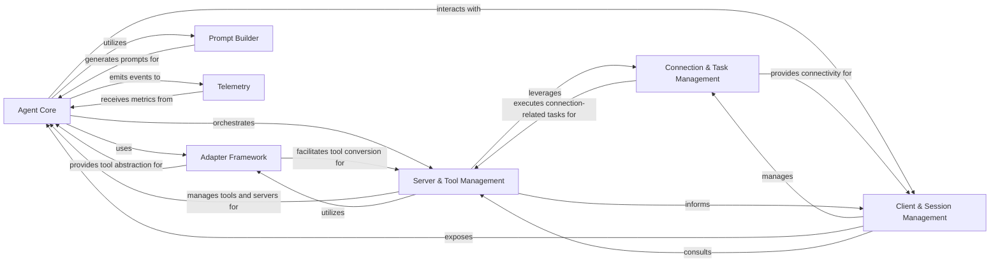
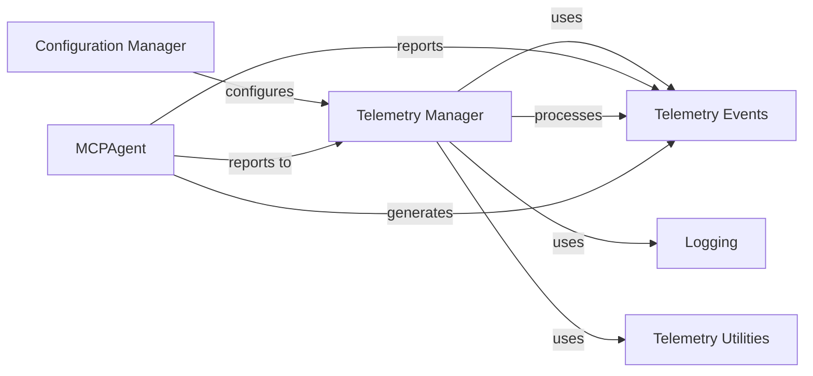

<Info>
This documentation was generated by [CodeBoarding](https://github.com/CodeBoarding/GeneratedOnBoardings) to provide comprehensive architectural insights into the mcp-agent framework.
</Info>

## Details

The `mcp-use` project is an AI Agent Framework/Library designed to enable agents to interact with various external environments and utilize diverse tools.

### Agent Core [[Expand]](./Agent_Core)
The central intelligence unit, embodied by `MCPAgent`, responsible for orchestrating interactions, processing inputs, generating responses, and utilizing available tools. It manages the agent's internal state, history, and integrates with LLMs.

**Related Classes/Methods**:

- <a href="https://github.com/CodeBoarding/mcp-use/blob/main/mcp_use/agents/mcpagent.py#L1-L1" target="_blank" rel="noopener noreferrer">`mcp_use.agents.mcpagent.MCPAgent` (1:1)</a>

### Client & Session Management
Manages the lifecycle of user interactions and individual `MCPSession` instances. `MCPClient` provides the primary interface for users to create, configure, and close sessions, while `MCPSession` represents a single, active connection or interaction session with an external environment or server, handling the establishment, maintenance, and termination of connections.

**Related Classes/Methods**:

- <a href="https://github.com/CodeBoarding/mcp-use/blob/main/mcp_use/client.py#L1-L1" target="_blank" rel="noopener noreferrer">`mcp_use.client.MCPClient` (1:1)</a>
- <a href="https://github.com/CodeBoarding/mcp-use/blob/main/mcp_use/session.py#L1-L1" target="_blank" rel="noopener noreferrer">`mcp_use.session.MCPSession` (1:1)</a>

### Connection & Task Management
Handles the low-level details of establishing, maintaining, and managing asynchronous tasks for persistent connections to various external environments (e.g., WebSocket servers, sandboxed environments, HTTP endpoints, standard I/O). `BaseConnector` defines the interface for specific communication protocols, while `ConnectionManager` subclasses manage the connection lifecycle.

**Related Classes/Methods**:

- <a href="https://github.com/CodeBoarding/mcp-use/blob/main/mcp_use/connectors/base.py#L1-L1" target="_blank" rel="noopener noreferrer">`mcp_use.connectors.base.BaseConnector` (1:1)</a>
- <a href="https://github.com/CodeBoarding/mcp-use/blob/main/mcp_use/connectors/websocket.py#L1-L1" target="_blank" rel="noopener noreferrer">`mcp_use.connectors.websocket` (1:1)</a>
- <a href="https://github.com/CodeBoarding/mcp-use/blob/main/mcp_use/connectors/sandbox.py#L1-L1" target="_blank" rel="noopener noreferrer">`mcp_use.connectors.sandbox` (1:1)</a>
- <a href="https://github.com/CodeBoarding/mcp-use/blob/main/mcp_use/connectors/http.py#L1-L1" target="_blank" rel="noopener noreferrer">`mcp_use.connectors.http` (1:1)</a>
- <a href="https://github.com/CodeBoarding/mcp-use/blob/main/mcp_use/connectors/stdio.py#L1-L1" target="_blank" rel="noopener noreferrer">`mcp_use.connectors.stdio` (1:1)</a>
- <a href="https://github.com/CodeBoarding/mcp-use/blob/main/mcp_use/task_managers/base.py#L1-L1" target="_blank" rel="noopener noreferrer">`mcp_use.task_managers.base` (1:1)</a>
- <a href="https://github.com/CodeBoarding/mcp-use/blob/main/mcp_use/task_managers/websocket.py#L1-L1" target="_blank" rel="noopener noreferrer">`mcp_use.task_managers.websocket` (1:1)</a>
- <a href="https://github.com/CodeBoarding/mcp-use/blob/main/mcp_use/task_managers/sse.py#L1-L1" target="_blank" rel="noopener noreferrer">`mcp_use.task_managers.sse` (1:1)</a>
- <a href="https://github.com/CodeBoarding/mcp-use/blob/main/mcp_use/task_managers/stdio.py#L1-L1" target="_blank" rel="noopener noreferrer">`mcp_use.task_managers.stdio` (1:1)</a>
- <a href="https://github.com/CodeBoarding/mcp-use/blob/main/mcp_use/task_managers/streamable_http.py#L1-L1" target="_blank" rel="noopener noreferrer">`mcp_use.task_managers.streamable_http` (1:1)</a>

### Adapter Framework [[Expand]](./Adapter_Framework)
Provides an abstraction layer for integrating with different AI frameworks (e.g., LangChain). It defines the `BaseAdapter` interface for converting and managing tools, resources, and prompts from external systems into a format usable by the `MCPAgent`. `LangChainAdapter` is a concrete implementation.

**Related Classes/Methods**:

- <a href="https://github.com/CodeBoarding/mcp-use/blob/main/mcp_use/adapters/base.py#L1-L1" target="_blank" rel="noopener noreferrer">`mcp_use.adapters.base.BaseAdapter` (1:1)</a>
- <a href="https://github.com/CodeBoarding/mcp-use/blob/main/mcp_use/adapters/langchain_adapter.py#L1-L1" target="_blank" rel="noopener noreferrer">`mcp_use.adapters.langchain_adapter.LangChainAdapter` (1:1)</a>

### Server & Tool Management [[Expand]](./Server_Tool_Management)
Manages the registration, activation, and disconnection of multiple external servers or environments, and facilitates the discovery, indexing, and execution of tools available across these connected servers. It includes a `ToolSearchEngine` for finding tools and base classes (`MCPServerTool`) for various server-related tools.

**Related Classes/Methods**:

- <a href="https://github.com/CodeBoarding/mcp-use/blob/main/mcp_use/managers/server_manager.py#L1-L1" target="_blank" rel="noopener noreferrer">`mcp_use.managers.server_manager` (1:1)</a>
- <a href="https://github.com/CodeBoarding/mcp-use/blob/main/mcp_use/managers/tools/search_tools.py#L57-L327" target="_blank" rel="noopener noreferrer">`mcp_use.managers.tools.search_tools.ToolSearchEngine` (57:327)</a>
- <a href="https://github.com/CodeBoarding/mcp-use/blob/main/mcp_use/managers/tools/base_tool.py#L5-L18" target="_blank" rel="noopener noreferrer">`mcp_use.managers.tools.base_tool.MCPServerTool` (5:18)</a>
- <a href="https://github.com/CodeBoarding/mcp-use/blob/main/mcp_use/managers/tools/use_tool.py#L1-L1" target="_blank" rel="noopener noreferrer">`mcp_use.managers.tools.use_tool` (1:1)</a>

### Prompt Builder [[Expand]](./Prompt_Builder)
Constructs and formats system messages and prompts for the LLM, incorporating tool descriptions and other contextual information to guide the agent's reasoning.

**Related Classes/Methods**:

- <a href="https://github.com/CodeBoarding/mcp-use/blob/main/mcp_use/agents/prompts/system_prompt_builder.py#L1-L1" target="_blank" rel="noopener noreferrer">`mcp_use.agents.prompts.system_prompt_builder` (1:1)</a>

### Telemetry [[Expand]](./Telemetry)
Collects and tracks usage data and agent execution metrics for observability and analytics purposes, providing insights into the framework's performance and behavior.

**Related Classes/Methods**:

- <a href="https://github.com/CodeBoarding/mcp-use/blob/main/mcp_use/telemetry/telemetry.py#L1-L1" target="_blank" rel="noopener noreferrer">`mcp_use.telemetry.telemetry` (1:1)</a>

### [FAQ](https://github.com/CodeBoarding/GeneratedOnBoardings/tree/main?tab=readme-ov-file#faq)

---
title: "Telemetry"
description: "Telemetry component details"
---

<Info>
This documentation was generated by [CodeBoarding](https://github.com/CodeBoarding/GeneratedOnBoardings) to provide comprehensive architectural insights into the mcp-agent framework.
</Info>

## Details

The `Telemetry` subsystem is designed to provide observability and analytics for the AI Agent Framework. It focuses on collecting and tracking usage data and agent execution metrics, offering insights into the framework's performance and behavior. This subsystem is crucial for monitoring the operational aspects of the system and understanding how agents perform in various scenarios.

### Telemetry Manager
This is the core component of the telemetry system. It is responsible for initializing the telemetry service, managing the collection of various events, and dispatching them for further processing or storage. It acts as the central hub for all telemetry-related operations within the framework.

**Related Classes/Methods**:

- <a href="https://github.com/CodeBoarding/mcp-use/blob/main/mcp_use/telemetry/telemetry.py#L1-L1" target="_blank" rel="noopener noreferrer">`Telemetry Manager` (1:1)</a>

### Telemetry Events
This component defines the structure and types of data that are collected by the telemetry system. It includes a base event class (`BaseTelemetryEvent`) and specific event implementations like `MCPAgentExecutionEvent`, which captures details about the agent's execution lifecycle. These events serve as the standardized data payloads for telemetry.

**Related Classes/Methods**:

- <a href="https://github.com/CodeBoarding/mcp-use/blob/main/mcp_use/telemetry/events.py#L1-L1" target="_blank" rel="noopener noreferrer">`Telemetry Events` (1:1)</a>

### MCPAgent
As the core AI agent of the framework, `MCPAgent` is a primary source of telemetry data. It generates and reports various execution-related events (e.g., start, end, tool usage) to the `Telemetry Manager`, enabling comprehensive monitoring of agent behavior and performance.

**Related Classes/Methods**:

- <a href="https://github.com/CodeBoarding/mcp-use/blob/main/mcp_use/agents/mcpagent.py#L1-L1" target="_blank" rel="noopener noreferrer">`MCPAgent` (1:1)</a>

### Configuration Manager
This component handles the overall configuration of the application, including settings specific to the telemetry system. It allows for enabling or disabling telemetry, defining reporting endpoints, and setting other operational parameters for the `Telemetry Manager`.

**Related Classes/Methods**:

- <a href="https://github.com/CodeBoarding/mcp-use/blob/main/config.py#L1-L1" target="_blank" rel="noopener noreferrer">`Configuration Manager` (1:1)</a>

### Logging
Provides a standardized logging mechanism for the entire framework. The `Telemetry Manager` utilizes this component for internal operational logging, debugging, and recording any issues related to telemetry data collection or dispatch.

**Related Classes/Methods**:

- <a href="https://github.com/CodeBoarding/mcp-use/blob/main/mcp_use/logging.py#L1-L1" target="_blank" rel="noopener noreferrer">`Logging` (1:1)</a>

### Telemetry Utilities
This component comprises helper functions and utility classes that support the `Telemetry Manager`. These utilities might include functionalities for data serialization, validation, or specific data transformations required before events are dispatched.

**Related Classes/Methods**:

- <a href="https://github.com/CodeBoarding/mcp-use/blob/main/mcp_use/telemetry/utils.py#L1-L1" target="_blank" rel="noopener noreferrer">`Telemetry Utilities` (1:1)</a>

### [FAQ](https://github.com/CodeBoarding/GeneratedOnBoardings/tree/main?tab=readme-ov-file#faq)
