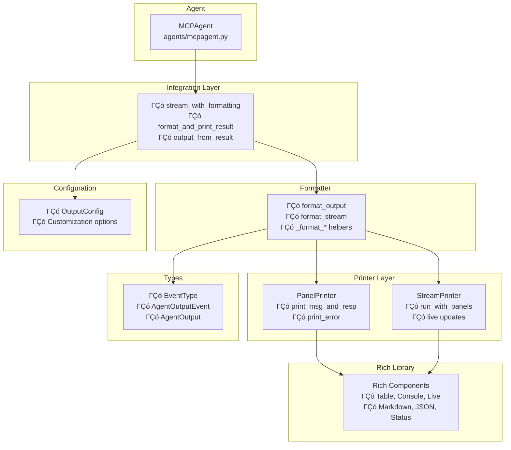

# Pretty Printing: Rich Terminal Output

Transform your agent output into visually stunning, professional terminal displays with rich panels, live updates, and beautiful formatting. The pretty printing system uses the Rich library to create engaging, informative output that enhances the developer experience.

<Note>
Pretty printing is enabled by default and works seamlessly with both `run()` and `stream()` methods.
</Note>

## Architecture Overview



## Quick Start

Pretty printing works out of the box with zero configuration:

```python
import asyncio
from langchain_openai import ChatOpenAI
from mcp_use import MCPAgent, MCPClient

async def basic_example():
    # Setup agent
    client = MCPClient.from_dict({
        "mcpServers": {
            "playwright": {
                "command": "npx",
                "args": ["@playwright/mcp@latest"]
            }
        }
    })
    
    llm = ChatOpenAI(model="gpt-4o")
    agent = MCPAgent(llm=llm, client=client)
    
    # Pretty printing is enabled by default
    await agent.run("What's the latest news on AI?")

asyncio.run(basic_example())
```

## Visual Output Features

<CardGroup cols={2}>
  <Card title="Panel Types" icon="layers">
    ΓÇó **Message Panel** - Shows your input query in cyan<br/>
    ΓÇó **Response Panel** - Displays the agent's final response in blue<br/>
    ΓÇó **Step Panels** - Optional reasoning steps in green (when enabled)<br/>
  </Card>
  <Card title="Content Formatting" icon="code">
    ΓÇó **Markdown rendering** for rich text output<br/>
    ΓÇó **JSON formatting** for structured data<br/>
    ΓÇó **Automatic truncation** of long intermediate results
  </Card>
</CardGroup>

## Configuration Options

Customize the pretty printing experience with the `OutputConfig` class:

```python
from mcp_use.output import OutputConfig
from mcp_use import MCPAgent, MCPClient
from langchain_openai import ChatOpenAI

# Create custom output configuration
output_config = OutputConfig(
    show_message=True,          # Display user query panel
    show_timing=True,           # Show execution time in titles
    show_steps=False,           # Hide intermediate reasoning steps
    max_step_display_length=200 # Truncate long step content
)

# Apply to agent
client = MCPClient.from_dict(config)
llm = ChatOpenAI(model="gpt-4o")
agent = MCPAgent(
    llm=llm, 
    client=client,
    output_config=output_config
)
```

<Tip>
**Pro Tip**: Pretty printing works best with modern terminals that support Unicode and 256-color mode.
</Tip>

## Usage Examples

### Basic Pretty Printing

```python
async def basic_pretty_printing():
    agent = MCPAgent(llm=llm, client=client)
    
    # Pretty printing enabled by default
    await agent.run("Analyze the current market trends")
```

### Disable Pretty Printing

```python
async def disable_pretty_printing():
    agent = MCPAgent(llm=llm, client=client)
    
    # Disable for this specific call
    result = await agent.run(
        "Get weather data", 
        pretty_print=False
    )
    
    # Or disable globally on the agent
    agent.pretty_print = False
    result = await agent.run("Another query")
```

### Streaming with Pretty Printing

```python
async def streaming_with_panels():
    agent = MCPAgent(llm=llm, client=client)
    
    async for item in agent.stream("Research the latest tech trends"):
        # Pretty printing handles the display automatically
        pass
```

## Additional Features

### Step-by-Step Reasoning Display

Enable detailed reasoning steps to see how the agent thinks:

```python
config = OutputConfig(
    show_steps=True,
    max_step_display_length=300  # Show more step content
)

agent = MCPAgent(llm=llm, client=client, output_config=config)
await agent.run("Solve this complex problem step by step")
```

### Structured Output Integration

Pretty printing works seamlessly with structured output:

```python
from pydantic import BaseModel, Field

class AnalysisResult(BaseModel):
    summary: str = Field(description="Brief summary")
    key_points: list[str] = Field(description="Key findings")
    confidence: float = Field(description="Confidence score")

# Pretty printing will format the structured result beautifully
await agent.run(
    "Analyze the market data",
    output_schema=AnalysisResult
)
```

**Structured Output Process:**


## Next Steps

<CardGroup cols={3}>
  <Card title="Agent Configuration" icon="gear" href="/agent/agent-configuration">
    Learn about other agent customization options
  </Card>
  <Card title="Streaming Output" icon="play" href="/agent/streaming">
    Combine pretty printing with streaming for real-time updates
  </Card>
  <Card title="Interactive Chat" icon="message-circle" href="/agent/interactive-chat-patterns">
    Build interactive applications with pretty printing
  </Card>
</CardGroup>