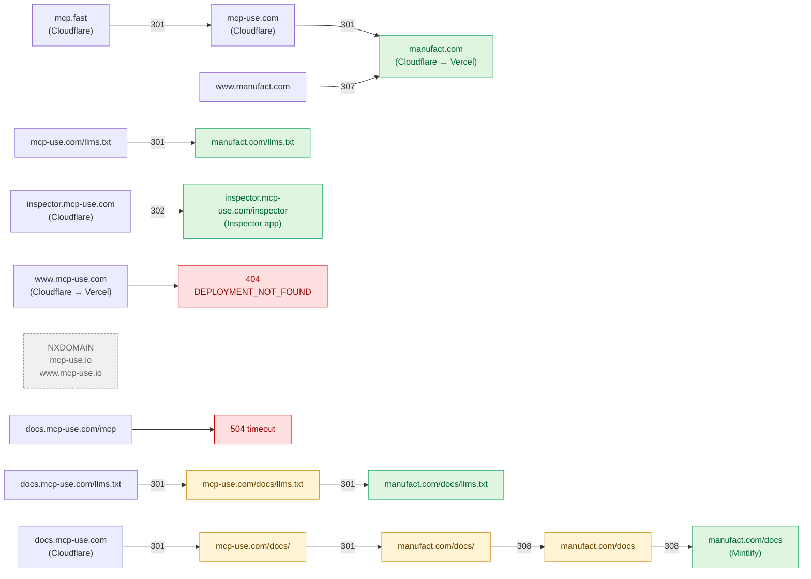

# Domain & Redirect Audit

_Snapshot taken 2026-04-27 from a non-Cloudflare client._

## TL;DR

The current setup forces almost every public URL through **2–5 cross-host hops** before reaching its destination. This is the root cause of the agent-readiness audit failures (LLMS TXT cross-host redirect, Page Size, MCP Server Discoverable) and is also bad for SEO link-equity and human latency.

The biggest concrete problems:

1. **`docs.mcp-use.com` is a CNAME-style chain to `manufact.com/docs/home` via 5 redirects**, with two of those hops being cross-host. Most LLM crawlers stop after 1 cross-host redirect.
2. **`www.mcp-use.com` is fully broken** (Vercel `DEPLOYMENT_NOT_FOUND`, HTTP 404).
3. **`docs.mcp-use.com/mcp` times out** (504) — the Mintlify MCP server endpoint can't survive the redirect chain, which is exactly why the audit reports "no MCP server discovered."
4. **`mcp-use.com` → `manufact.com` is a sitewide 301**, so `mcp-use.com` is effectively a parking redirect; the brand domain has no link-equity going to it.
5. **`mcp-use.io`** does not resolve (NXDOMAIN). If it's referenced anywhere (READMEs, social, npm), those links are dead.

## Live status of each host

| Host | DNS | Behavior | Verdict |
|------|-----|----------|---------|
| `manufact.com` | Cloudflare → Vercel | 200 | Canonical origin |
| `www.manufact.com` | Cloudflare | 307 → `manufact.com` (same-host equivalent) | OK |
| `mcp-use.com` | Cloudflare | 301 → `manufact.com` (sitewide) | Cross-host parking redirect |
| `www.mcp-use.com` | Cloudflare | **404 DEPLOYMENT_NOT_FOUND** | **Broken** |
| `docs.mcp-use.com` | Cloudflare | 301 → `mcp-use.com/docs/` → 301 → `manufact.com/docs/` → 308 → `/docs` → 308 → `/docs/home` | **5-hop chain** |
| `docs.mcp-use.com/llms.txt` | — | 301 → `mcp-use.com/docs/llms.txt` → 301 → `manufact.com/docs/llms.txt` | **2 cross-host hops** |
| `docs.mcp-use.com/mcp` | — | 504 timeout | **MCP endpoint broken** |
| `inspector.mcp-use.com` | Cloudflare | 302 → `/inspector` (same-host) | OK |
| `mcp.fast` | Cloudflare | 301 → `mcp-use.com/` → 301 → `manufact.com/` | 2 cross-host hops |
| `mcp-use.io` / `www.mcp-use.io` | NXDOMAIN | — | Doesn't exist |

## Redirect graph



## Why this hurts agent-readiness

Specific Mintlify Score checks this chain causes to fail:

- **LLMS TXT Exists (warning):** check tries `docs.mcp-use.com/llms.txt`, sees a cross-host hop to `mcp-use.com`, gives up before the second hop to `manufact.com`. Some agents follow same-host redirects only.
- **Redirect Behavior (warning):** the audit tagged "1 of 1 pages use cross-host redirects" — every `docs.mcp-use.com` URL does.
- **MCP Server Discoverable (fail, 0/100):** Mintlify auto-publishes the MCP server at `/mcp`. The redirect chain rewrites this to `manufact.com/docs/mcp`, which times out (the chain confuses the upstream rewrite). So no MCP endpoint is reachable from the canonical docs host.
- **Page Size HTML:** orthogonal to redirects, but worth noting that the audit measures the page _after_ following redirects, so any chain failure also makes this measurement noisy.

## Recommended cleanup (in priority order)

1. **Make `docs.mcp-use.com` point straight at the Mintlify deployment.** Remove the chain. This single change fixes 3 of the agent-readiness items above and the broken `/mcp` endpoint. (Mintlify supports adding `docs.mcp-use.com` as a custom CNAME directly.)
2. **Decide what `mcp-use.com` should be.** Either:
   - (a) Park-style 301 to `manufact.com` (current behavior) — keep, but accept the brand domain has no SEO value, _or_
   - (b) Serve the same Vercel app at both apexes (rewrite, not redirect) so `mcp-use.com` keeps its link-equity. Most npm/PyPI/GitHub references point to `mcp-use.com`, so option (b) is probably worth doing.
3. **Fix or remove `www.mcp-use.com`.** Currently a hard 404. Either point it at the same target as the apex or remove the DNS record so it NXDOMAINs cleanly.
4. **Audit references to dead domains.** `mcp-use.io`, `blog.mcp-use.com`, `mcpfast.com`, `mcp-fast.com` don't resolve. Grep the repo, READMEs, social profiles, and npm metadata; replace with live URLs.
5. **`mcp.fast` is currently a 2-hop cross-host vanity redirect.** If you want it to be a real shortlink, point it directly at `manufact.com` (one same-host-final hop) instead of bouncing through `mcp-use.com`.

## Verification commands

```bash
# Full chain (count hops)
curl -sILo /dev/null -w "%{num_redirects} hops -> %{url_effective}\n" \
  https://docs.mcp-use.com

# Per-hop inspection
curl -sIL --max-redirs 10 https://docs.mcp-use.com/llms.txt | grep -iE "^(HTTP|location)"

# DNS sanity
for d in mcp-use.com docs.mcp-use.com www.mcp-use.com manufact.com mcp.fast; do
  echo "$d -> $(dig +short A $d | head -2 | tr '\n' ' ')"
done
```
