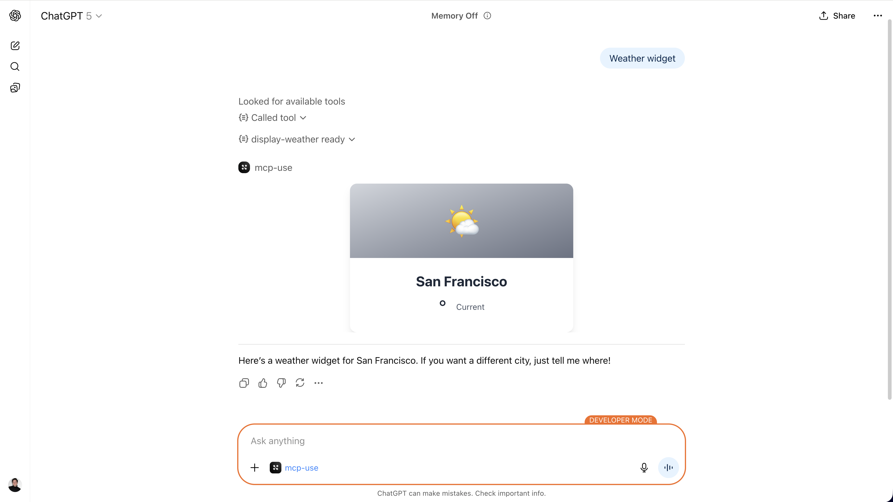

# MCP Server

**mcp-use** has a complete MCP server framework implementation for TypeScript. 
It improves the official Model Context Protocol SDK with many developer friendly features. In addition, it supports all official MCP features and achieves a conformance score of 100% based on the official MCP Conformance Tests.

## Key Features

- **Full MCP compatibility**: MCP servers built with mcp-use are 100% compatible with the MCP specs.
- **MCP Apps support**: UI widgets are compatible with MCP Apps for all compatible clients (ChatGPT, Claude, etc.). [UI Widgets](/typescript/server/ui-widgets).
- **Edge runtime support**: Built-in Edge runtime support
- **Built-in Inspector**: An handy MCP inspector is launched for you to test you MCP server. See [MCP Inspector](/inspector) for more details.
- **Hot Module Reloading**: Add, remove, or update tools, prompts, and resources without restarting the server or dropping connections.
- **One command to get started**: Use `npx create-mcp-use-app` command to scaffold a complete MCP server.

## Installation

### Using create-mcp-use-app (recommended)

The easiest way to get started is to use the `create-mcp-use-app` command, which scaffolds a complete MCP server project with all necessary configuration:

```bash
npx create-mcp-use-app my-mcp-server
cd my-mcp-server
npm run dev
```

### Project Structure

After creation, your project will have this structure:

```
my-mcp-server/
├── resources/                    # React widgets for Apps SDK and MCP-UI
│   ├── product-search-result/   # Example widget (folder name = widget name)
│   │   ├── widget.tsx            # Main widget component
│   │   ├── types.ts              # Props and types
│   │   ├── components/           # Optional subcomponents
│   │   └── hooks/                # Optional hooks
│   └── styles.css               # Shared styles
├── public/                       # Static assets (icons, favicon, etc.)
│   ├── icon.svg                  # Server icon (mcp-use branding by default)
│   └── favicon.ico               # Browser favicon
├── index.ts                      # MCP server entry point
├── package.json
├── tsconfig.json
└── README.md
```

### Running Your MCP Server

Commands:

```bash
npm run dev   # start the development server
npm run build # build the server
npm run start # start the production server
npm run deploy # deploy the server to Manufact Cloud
```

When you run your MCP server, it will be available at:
- **MCP Endpoint**: `http://localhost:3000/mcp` - For MCP client connections
- **MCP Inspector**: `http://localhost:3000/inspector` 

### Hot Module Reloading (HMR)

The development server supports Hot Module Reloading for tools, prompts, and resources. When you modify your server file, changes are applied instantly without restarting the server or dropping client connections.

```bash
# HMR is enabled by default
npm run dev
```

**What HMR does:**
- **Add tools/prompts/resources**: New registrations appear immediately
- **Update existing ones**: Changes to descriptions, schemas, or handlers are applied in-place
- **Remove registrations**: Deleted tools/prompts/resources are removed from the server
- **Notify clients**: Connected clients (like the Inspector) receive `list_changed` notifications and auto-refresh

This means you can keep the Inspector open, modify your server code, and see your changes reflected immediately without losing your session.

### Deploy Your MCP Server
You can deploy your MCP server on any platform. Build your MCP server with `npm run build` and start the production server with `npm run start`.
Or you can deploy it on [Manufact Cloud](https://manufact.com).
For detailed instructions, see the [Deploy Your Server](/typescript/server/deployment/mcp-use) guide.


### Next Steps

- [Core features](/typescript/server/tools): Learn how to create MCP tools, prompts and resources.
- [UI Widgets](/typescript/server/ui-widgets): Expose UI components to chat clients compatible with ChatGPT Apps SDK and MCP-UI.
- [Configuration](/typescript/server/configuration): Advanced configuration and deployment options.
- [Deploy Your Server](/typescript/server/deployment/mcp-use) - Deploy to production with one command


### Manual Installation

If you prefer to set up manually or add mcp-use to an existing project, install the package via npm:


```bash
npm install mcp-use
```


## Architecture Overview

The mcp-use server framework is designed around a modular architecture that seamlessly integrates MCP protocol features with Hono's flexibility. Understanding this architecture helps you build powerful, production-ready MCP servers.

The framework is built on six fundamental components that work together:

### **Server Instance**
The main `MCPServer` class created via `new MCPServer()`. It orchestrates all MCP functionality, manages the Hono application, and handles client connections.

**Learn more**: See [Configuration](/typescript/server/configuration) for server setup options.

### **Tools**
Executable functions that MCP clients can invoke with typed parameters. Tools perform actions, fetch data, or trigger operations and return structured results.

**Learn more**: [Tools Guide →](/typescript/server/tools)

### **Resources**
Static or dynamic content accessible via URIs. Resources can be configuration files, documentation, data feeds, or any content that clients need to read.

**Learn more**: [Resources Guide →](/typescript/server/resources)

### **Prompts**
Reusable, parameterized templates for AI model interactions. Prompts standardize how your server generates context for LLM conversations.

**Learn more**: [Prompts Guide →](/typescript/server/prompts)

### **UI Widgets (MCP Apps)**
Rich, interactive React components that render in chat clients. Widgets are automatically registered from your `resources/` folder and work with all compatible clients (ChatGPT, Claude, etc.).



**Key features:**
- **Automatic Registration**: Drop `.tsx` files in `resources/` and they become MCP tools
- **Zero Boilerplate**: No manual `server.tool()` or `server.uiResource()` calls needed
- **Hot Module Replacement**: Changes reflect instantly during development
- **Type-Safe Props**: Zod schemas provide full TypeScript type safety
- **Interactive**: Widgets can call tools, manage state, and respond to user actions

**Learn more**: [UI Widgets Guide →](/typescript/server/ui-widgets)

### **Custom Endpoints Integration**
Full Hono functionality for custom routes, middleware, authentication, static file serving, and more. The server instance is also a Hono app.

```typescript
// Add custom routes
server.get('/api/mango', (c) => {
  return c.json({ fruit: 'mango' })
})
```

**Learn more**: [API Reference →](/typescript/server/api-reference)


## McpServer API

The `McpServer` class provides a clean, chainable API:

```typescript
class McpServer {
  // MCP Protocol Methods
  tool(definition: ToolDefinition): this
  resource(definition: ResourceDefinition): this
  resourceTemplate(definition: ResourceTemplateDefinition): this
  prompt(definition: PromptDefinition): this
  uiResource(definition: UIResourceDefinition): this
  
  listen(port?: number): Promise<void>

  // Hono proxy - all HTTP methods available
  // Examples: get(), post(), use(), route()
}
```

**Additional Features:**
- **[OAuth Authentication](/typescript/server/authentication)**: Configure OAuth providers for secure authentication
- **[Sampling](/typescript/client/sampling)**: Request LLM completions from the client during tool execution
- **[Notifications](/typescript/server/notifications)**: Send real-time notifications to connected clients
- **[Inspector UI](/inspector)**: Interactive debugging interface automatically served at `/inspector` endpoint

## Next Steps

<CardGroup cols={3}>
  <Card title="Tools" icon="wrench" href="/typescript/server/tools">
    Build executable functions with parameters and validation
  </Card>
  <Card title="Resources" icon="folder-open" href="/typescript/server/resources">
    Expose static and dynamic content via URI-based resources
  </Card>
  <Card title="Prompts" icon="message-square" href="/typescript/server/prompts">
    Create reusable prompt templates for AI interactions
  </Card>
  <Card title="UI Widgets" icon="palette" href="/typescript/server/ui-widgets">
    Build interactive React components with auto-registration
  </Card>
  <Card title="Configuration" icon="cog" href="/typescript/server/configuration">
    Configure your server for production deployment
  </Card>
  <Card title="Deploy to Production" icon="rocket" href="/typescript/server/deployment/mcp-use">
    Deploy your server to Manufact Cloud with one command
  </Card>
</CardGroup>

