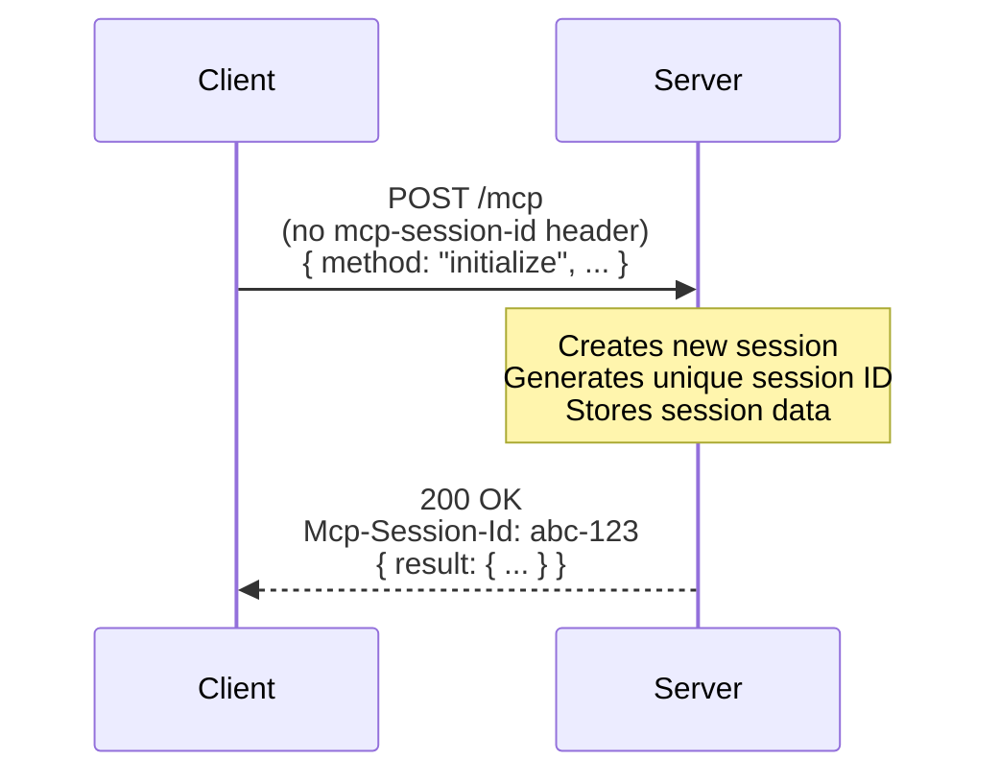
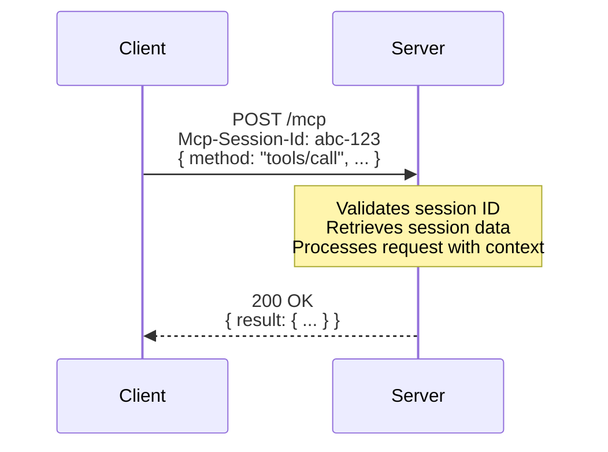
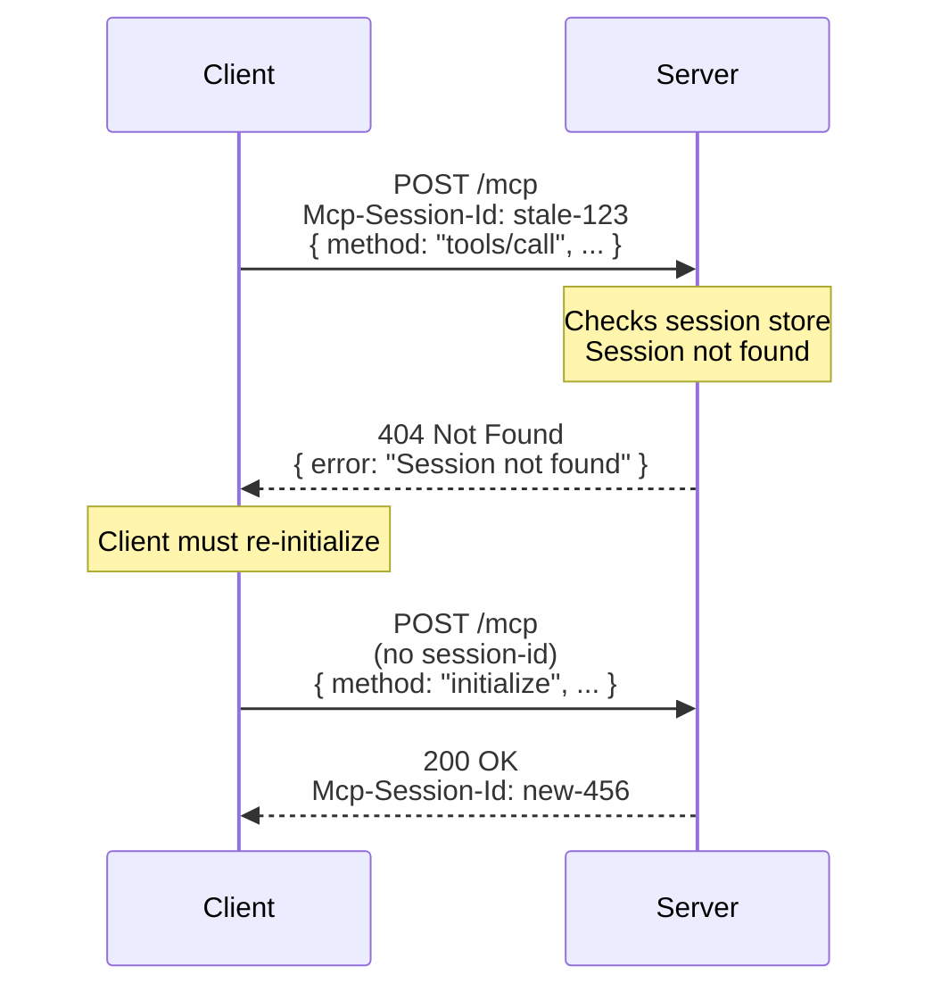
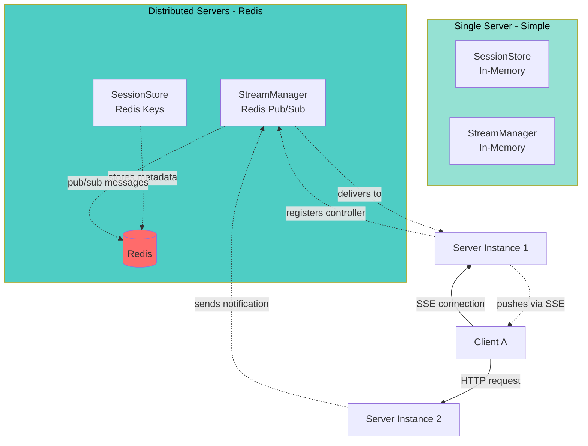
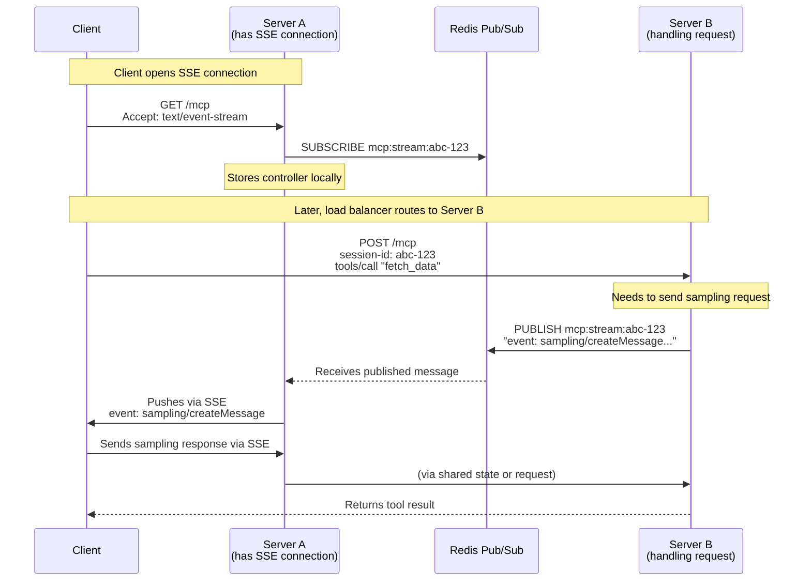

MCP servers can operate in two modes: **stateful** (with session tracking) and **stateless** (no session tracking).

## Session Lifecycle

### 1. Session Initialization

A session begins when a client sends an `initialize` request:



### 2. Subsequent Requests

After initialization, the client includes the session ID in all requests:



### 3. Session Termination

Sessions can end in several ways:

- **Client closes**: Client sends DELETE request to `/mcp`
- **Idle timeout**: Session expires after inactivity (default: 5 minutes)
- **Server restart**: In-memory sessions are lost (see [Storage Providers](/typescript/server/session-management/memory-storage))

### 4. Session Not Found (404)

**Per the [MCP specification](https://modelcontextprotocol.io/specification/2025-11-25/basic/transports#session-management)**, when a client sends a request with an invalid or expired session ID, the server **MUST** return HTTP 404:



Modern MCP clients (like [mcp-use client](/typescript/client)) automatically handle 404 responses by sending a new `initialize` request.

## Stateful vs Stateless Modes

### Stateful Mode (Default for Node.js)

In stateful mode, the server tracks sessions across requests:

```typescript
import { MCPServer } from 'mcp-use/server';

const server = new MCPServer({
  name: 'my-server',
  version: '1.0.0',
  stateless: false  // Explicitly enable stateful mode
});

server.start({ port: 3000 });
```

**Auto-detection:** When `stateless` is not explicitly set, the server automatically detects mode per-request:
- Client sends `Accept: application/json, text/event-stream` → Stateful mode
- Client sends `Accept: application/json` only → Stateless mode

This enables compatibility with k6, curl, and other HTTP-only clients while maintaining full SSE support for capable clients.

**Features:**
- Session tracking with unique IDs
- Client capability storage (sampling, elicitation, roots)
- SSE streaming with resumability
- Resource subscriptions and notifications
- Idle session cleanup

**Use cases:**
- Development and debugging
- Single-instance deployments
- Applications requiring persistent client context
- Servers using sampling, elicitation, or notifications

### Stateless Mode (Default for Deno)

In stateless mode, each request is independent:

```typescript
import { MCPServer } from 'mcp-use/server';

const server = new MCPServer({
  name: 'my-server',
  version: '1.0.0',
  stateless: true  // Force stateless mode
});

server.start({ port: 3000 });
```

**Features:**
- No session tracking
- New server instance per request
- No memory of previous requests
- Horizontal scaling friendly

**Use cases:**
- Edge functions (Cloudflare Workers, Deno Deploy)
- Serverless deployments (AWS Lambda, Vercel)
- Load-balanced distributed systems
- Simple, stateless APIs

**Auto-detection:**
```typescript
// Auto-detects based on runtime
const server = new MCPServer({
  name: 'my-server',
  version: '1.0.0'
  // stateless: true on Deno/edge runtimes
  // stateless: false on Node.js
});
```

## Registration Replay Pattern

When a new session is created, mcp-use uses a "registration replay" pattern to initialize the server instance:

```typescript
// During server setup, registrations are stored
server.tool('greet', { name: z.string() }, async ({ name }) => {
  return `Hello, ${name}!`;
});

server.resource('/data', async () => {
  return { contents: [{ uri: '/data', text: 'Data' }] };
});

// On each new session initialization:
// 1. Create fresh McpServer instance
// 2. Replay all registrations (tools, prompts, resources)
// 3. Connect to transport
```

**Why this pattern?**

The official MCP SDK's `McpServer` is designed to be per-session. Rather than creating a new server from scratch each time, mcp-use:

1. **Stores registrations once** when you call `server.tool()`, `server.prompt()`, etc.
2. **Replays them automatically** when creating new session instances
3. **Provides isolation** - each session has its own server instance

## Split Architecture: Metadata vs Streams

mcp-use separates session management into two distinct concerns:

### 1. Session Metadata Storage (`SessionStore`)

Stores **serializable** session metadata:
- Client capabilities
- Client info (name, version)
- Protocol version
- Log level
- Last access timestamp

This data can be stored in Redis or any persistent storage.

### 2. Active Stream Management (`StreamManager`)

Manages **live** SSE connections:
- ReadableStreamDefaultController instances
- Active WebSocket connections
- Server-to-client push channels

These connections **cannot be serialized** and must use message buses (Redis Pub/Sub) for distributed deployments.

### Why This Split?



**The Problem:** You can't serialize a `ReadableStreamDefaultController`!

```typescript
// ❌ This doesn't work - controllers can't be stored in Redis
await redis.set('session:abc', JSON.stringify({
  controller: mySSEController  // TypeError: Converting circular structure
}));
```

**The Solution:** Use Redis Pub/Sub as a message bus between servers.

### Distributed Notifications Flow



## Storage Providers

mcp-use supports multiple storage providers for session management:

- **[In-Memory Storage](/typescript/server/session-management/memory-storage)** - Fast, but sessions lost on restart
- **[File System Storage](/typescript/server/session-management/filesystem-storage)** - Default in development, persists to disk, sessions survive hot reloads
- **[Redis Storage](/typescript/server/session-management/redis-storage)** - Persistent, distributed, supports full MCP features

## Session Configuration

### Idle Timeout

Configure how long sessions remain active without requests:

```typescript
const server = new MCPServer({
  name: 'my-server',
  version: '1.0.0',
  sessionIdleTimeoutMs: 600000  // 10 minutes (default: 5 minutes)
});
```

## Deployment Patterns

### Pattern 1: Single Server (Default)

Simple development/single-instance deployment:

```typescript
import { MCPServer } from 'mcp-use/server';

const server = new MCPServer({
  name: 'my-server',
  version: '1.0.0'
  // Uses InMemorySessionStore + InMemoryStreamManager (defaults)
});
```

**Characteristics:**
- ✅ All features work (notifications, sampling, subscriptions)
- ✅ No external dependencies
- ❌ Sessions lost on restart
- ❌ Can't scale horizontally

**Use for:**
- Development
- Internal tools
- Single-user deployments

### Pattern 2: Persistent Sessions (Single Server)

Session metadata survives restarts, but still single server:

```typescript
import { MCPServer, RedisSessionStore } from 'mcp-use/server';

const server = new MCPServer({
  name: 'my-server',
  version: '1.0.0',
  sessionStore: new RedisSessionStore({ client: redis })
  // streamManager defaults to InMemoryStreamManager
});
```

**Characteristics:**
- ✅ Session metadata persists across restarts
- ✅ Notifications work (single server)
- ❌ Can't distribute across multiple instances
- ⚠️ Active SSE connections still lost on restart

**Use for:**
- Production single-instance deployments
- Services that restart frequently
- Cost-sensitive deployments (no Redis Pub/Sub overhead)

### Pattern 3: Full Distributed (Recommended for Production)

Complete horizontal scaling with all MCP features:

```typescript
import { 
  MCPServer, 
  RedisSessionStore, 
  RedisStreamManager 
} from 'mcp-use/server';

const server = new MCPServer({
  name: 'my-server',
  version: '1.0.0',
  sessionStore: new RedisSessionStore({ client: redis }),
  streamManager: new RedisStreamManager({ client: redis, pubSubClient: pubSubRedis })
});
```

**Characteristics:**
- ✅ Full horizontal scaling
- ✅ Notifications work across ALL servers
- ✅ Sampling works across instances
- ✅ Resource subscriptions work distributed
- ✅ Load balancer can route requests anywhere
- ✅ Session metadata persists

**Use for:**
- Production load-balanced deployments
- High-availability systems
- Multi-region deployments
- Services using notifications/sampling

### Pattern 4: Stateless (Edge Functions)

No sessions, no state:

```typescript
const server = new MCPServer({
  name: 'my-server',
  version: '1.0.0',
  stateless: true
  // No session or stream managers needed
});
```

**Characteristics:**
- ✅ Infinite horizontal scaling
- ✅ No Redis needed
- ❌ No notifications
- ❌ No sampling
- ❌ No resource subscriptions
- ❌ No SSE streaming

**Use for:**
- Cloudflare Workers
- AWS Lambda
- Vercel Edge Functions
- Simple stateless APIs

## Best Practices

### 1. Choose the Right Pattern

| Requirement | Pattern |
|-------------|---------|
| Development/testing | Pattern 1 (In-memory) |
| Single server + restart persistence | Pattern 2 (Redis metadata only) |
| Load balanced + notifications | Pattern 3 (Redis full) |
| Edge functions/serverless | Pattern 4 (Stateless) |

### 2. Handle 404 Gracefully

Compliant clients automatically re-initialize on 404. This is handled automatically by mcp-use.

### 3. Clean Up on Shutdown

```typescript
process.on('SIGTERM', async () => {
  await streamManager.close();  // Close SSE connections
  await sessionStore.close();    // Close Redis connection
  process.exit(0);
});
```

### 4. Use Two Redis Clients for Pub/Sub

Redis Pub/Sub requires a dedicated client. Use separate clients:

```typescript
const redis = createClient({ ... });
const pubSubRedis = redis.duplicate();
```

## Troubleshooting

### Sessions Lost on Restart

**Problem**: Clients get 404 after server restart.

**Solution**: Use persistent session storage (Redis):

```typescript
const server = new MCPServer({
  name: 'my-server',
  version: '1.0.0',
  sessionStore: new RedisSessionStore({ ... })
});
```

### Client Not Re-initializing

**Problem**: Client fails to reconnect after 404.

**Solution**: Use a compliant MCP client (Claude Desktop, official SDK) or use persistent storage to avoid 404s.

### Memory Leaks

**Problem**: Memory usage grows over time.

**Solution**: Configure idle timeout:

```typescript
const server = new MCPServer({
  name: 'my-server',
  version: '1.0.0',
  sessionIdleTimeoutMs: 300000  // 5 minutes
});
```

### Distributed Session Issues

**Problem**: Sessions not shared across multiple server instances.

**Solution**: Use `RedisSessionStore` (see [Redis Storage](/typescript/server/session-management/redis-storage)).

## Related Documentation

- [MCP Specification - Session Management](https://modelcontextprotocol.io/specification/2025-11-25/basic/transports#session-management)
- [Server Configuration](/typescript/server/configuration)
- [Deployment Guide](/typescript/server/deployment-mcp-use)
- [In-Memory Storage](/typescript/server/session-management/memory-storage)
- [File System Storage](/typescript/server/session-management/filesystem-storage)
- [Redis Storage](/typescript/server/session-management/redis-storage)
