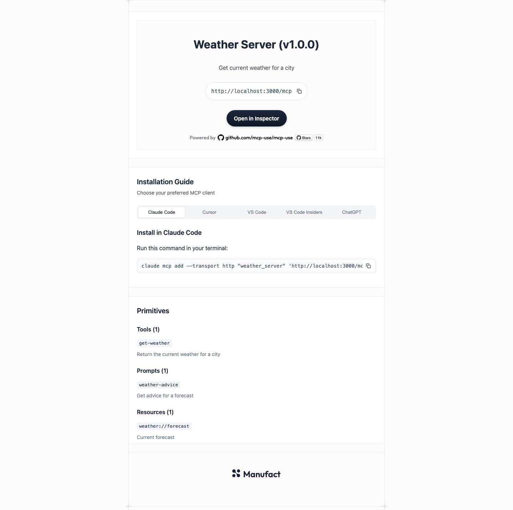

When a browser opens an MCP endpoint, mcp-use shows a page with connection instructions and the server's registered capabilities. Place `landing.tsx` in your MCP root to replace that page. The CLI discovers it in `mcp-use dev` and `mcp-use build`; `mcp-use start` serves the built version. If the file is absent, the built-in page remains.

The screenshot below is a full-page capture of the **built-in page**, generated with `generateLandingPage()` for a sample Weather Server at a 1440 × 1000 browser viewport. It has a tool, prompt, and resource so every section is visible. The copyable files later on this page reproduce its layout and controls.

<Frame>
  
</Frame>

## Add a custom page

Create these two files beside your MCP server entry:

```text
my-server/
├── index.ts
├── landing.tsx
└── landing.css
```

If you started from the `mcp-server` template, install React and its TypeScript declarations. The `mcp-apps` template already includes them:

```bash
npm install react react-dom
npm install --save-dev @types/react @types/react-dom
```

The default export of `landing.tsx` must be a React component. Import `LandingPageProps` from `mcp-use/landing` for the server data. Return the page's **body content**; mcp-use supplies the HTML document, metadata, favicon, React mount point, and hydration script.

```tsx
import type { LandingPageProps } from "mcp-use/landing";
import "./landing.css";

export default function LandingPage({ title, name, url, tools }: LandingPageProps) {
  return (
    <main>
      <h1>{title ?? name}</h1>
      <p>Connect an MCP client to {url}</p>
      <p>{tools.length} tools available</p>
    </main>
  );
}
```

Run `mcp-use dev` and open your MCP endpoint, usually `http://localhost:3000/mcp`. Editing the component preserves React state through Fast Refresh, and CSS imports update immediately. Creating or removing `landing.tsx` while dev is running switches between your page and the built-in page. That switch may reload the tab.

If your server entry is in another directory, select it with `--mcp-dir`. Discovery follows that directory:

```bash
mcp-use dev --mcp-dir src/mcp
mcp-use build --mcp-dir src/mcp
mcp-use start
```

In this example, the custom file is `src/mcp/landing.tsx`. `start` uses the build output and does not rediscover source files.

## Component data

`LandingPageProps` includes:

| Prop | Meaning |
| --- | --- |
| `url` | Resolved absolute URL of the MCP endpoint, including its configured path. |
| `name`, `title?`, `version`, `description?` | Protocol name and optional human-readable branding. Use `title ?? name` for the heading. |
| `iconUrl?`, `iconType?`, `websiteUrl?` | Resolved icon and website branding when configured. The document shell also uses the icon as its favicon. |
| `publicBaseUrl` | Absolute URL prefix for the project's `public/` files, including the configured CDN asset prefix. It ends in `/`. |
| `tools`, `prompts`, `resources` | Registered capability summaries. Tools and prompts have `name`, optional `title`, and optional `description`; resources have `uri` and optional `name`, `title`, and `description`. |

The initial render runs synchronously on the server. Keep browser-only code such as `window`, clipboard access, and event listeners in effects or event handlers. The component hydrates in the browser so tabs, copy buttons, and other React interactions work. In production, mcp-use caches rendered HTML for each resolved MCP URL and asset origin while retaining the endpoint's existing response headers. MCP protocol requests and OAuth routing still use their normal handlers.

You can import CSS from `landing.tsx`. Vite bundles it with the component in development and production. For a project-root `public/logo.svg`, use `` in your component. When deploying behind a CDN, configure `MCP_ASSETS_URL` for the published asset prefix; both `publicBaseUrl` and the generated landing bundle use that setting.

## Copy the current page

These complete files recreate the built-in page in React: animated hero, connection links, client tabs, URL and command copy buttons, public-chat readiness check, and registered capability lists. Paste both files into your MCP root, then edit the content or styles. The initial render requires no browser globals.

### `landing.tsx`

```tsx
import { useEffect, useRef, useState } from "react";
import type { LandingPageProps } from "mcp-use/landing";
import "./landing.css";

const vertexShader = `#version 300 es
in vec4 a_position;
out vec2 v_objectUV;
void main(){
  gl_Position=a_position;
  v_objectUV=a_position.xy*0.5;
}`;

// The same animated mesh used by the built-in landing page.
const fragmentShader = `#version 300 es
precision mediump float;
uniform float u_time;
uniform vec4 u_colors[4];
uniform float u_colorsCount;
uniform float u_distortion;
uniform float u_swirl;
uniform float u_grainMixer;
uniform float u_grainOverlay;
in vec2 v_objectUV;
out vec4 fragColor;
#define PI 3.14159265359
vec2 rotate(vec2 uv,float th){return mat2(cos(th),sin(th),-sin(th),cos(th))*uv;}
float hash21(vec2 p){
  p=fract(p*vec2(0.3183099,0.3678794))+0.1;
  p+=dot(p,p+19.19);
  return fract(p.x*p.y);
}
float valueNoise(vec2 st){
  vec2 i=floor(st);vec2 f=fract(st);
  float a=hash21(i),b=hash21(i+vec2(1.,0.)),c=hash21(i+vec2(0.,1.)),d=hash21(i+vec2(1.,1.));
  vec2 u=f*f*(3.-2.*f);
  return mix(mix(a,b,u.x),mix(c,d,u.x),u.y);
}
vec2 getPosition(int i,float t){
  float a=float(i)*.37,b=.6+fract(float(i)/3.)*.9,c=.8+fract(float(i+1)/4.);
  float x=sin(t*b+a),y=cos(t*c+a*1.5);
  return .5+.5*vec2(x,y);
}
void main(){
  vec2 uv=v_objectUV;uv+=.5;
  vec2 grainUV=uv*1000.;
  float grain=valueNoise(grainUV);
  float mixerGrain=.4*u_grainMixer*(grain-.5);
  float t=.5*(u_time+41.5);
  float radius=smoothstep(0.,1.,length(uv-.5));
  float center=1.-radius;
  for(float i=1.;i<=2.;i++){
    uv.x+=u_distortion*center/i*sin(t+i*.4*smoothstep(0.,1.,uv.y))*cos(.2*t+i*2.4*smoothstep(0.,1.,uv.y));
    uv.y+=u_distortion*center/i*cos(t+i*2.*smoothstep(0.,1.,uv.x));
  }
  vec2 uvR=uv-vec2(.5);
  float angle=3.*u_swirl*radius;
  uvR=rotate(uvR,-angle);uvR+=vec2(.5);
  vec3 color=vec3(0.);float opacity=0.,totalWeight=0.;
  for(int i=0;i<4;i++){
    if(i>=int(u_colorsCount))break;
    vec2 pos=getPosition(i,t)+mixerGrain;
    vec3 cf=u_colors[i].rgb*u_colors[i].a;
    float opacityF=u_colors[i].a;
    float dist=length(uvR-pos);
    dist=pow(dist,3.5);
    float w=1./(dist+1e-3);
    color+=cf*w;opacity+=opacityF*w;totalWeight+=w;
  }
  color/=max(1e-4,totalWeight);
  opacity/=max(1e-4,totalWeight);
  float grainO=valueNoise(rotate(grainUV,1.)+vec2(3.));
  grainO=mix(grainO,valueNoise(rotate(grainUV,2.)+vec2(-1.)),.5);
  grainO=pow(grainO,1.3);
  float grainOV=grainO*2.-1.;
  vec3 grainOC=vec3(step(0.,grainOV));
  float grainOS=u_grainOverlay*abs(grainOV);
  grainOS=pow(grainOS,.8);
  color=mix(color,grainOC,.35*grainOS);
  opacity+=.5*grainOS;
  fragColor=vec4(color,clamp(opacity,0.,1.));
}`;

function MeshGradient() {
  const canvasRef = useRef<HTMLCanvasElement>(null);

  useEffect(() => {
    const canvas = canvasRef.current;
    const wrap = canvas?.parentElement;
    const gl = canvas?.getContext("webgl2");
    if (!canvas || !wrap || !gl) return;

    function compile(type: number, source: string) {
      const shader = gl!.createShader(type);
      if (!shader) return null;
      gl!.shaderSource(shader, source);
      gl!.compileShader(shader);
      if (gl!.getShaderParameter(shader, gl!.COMPILE_STATUS)) return shader;
      console.error(gl!.getShaderInfoLog(shader));
      gl!.deleteShader(shader);
      return null;
    }

    const vertex = compile(gl.VERTEX_SHADER, vertexShader);
    const fragment = compile(gl.FRAGMENT_SHADER, fragmentShader);
    if (!vertex || !fragment) return;
    const program = gl.createProgram();
    if (!program) return;
    gl.attachShader(program, vertex);
    gl.attachShader(program, fragment);
    gl.linkProgram(program);
    if (!gl.getProgramParameter(program, gl.LINK_STATUS)) {
      console.error(gl.getProgramInfoLog(program));
      return;
    }
    gl.useProgram(program);
    const position = gl.getAttribLocation(program, "a_position");
    const buffer = gl.createBuffer();
    gl.bindBuffer(gl.ARRAY_BUFFER, buffer);
    gl.bufferData(
      gl.ARRAY_BUFFER,
      new Float32Array([-1, -1, 1, -1, -1, 1, -1, 1, 1, -1, 1, 1]),
      gl.STATIC_DRAW,
    );
    gl.enableVertexAttribArray(position);
    gl.vertexAttribPointer(position, 2, gl.FLOAT, false, 0, 0);

    const colors = ["#e0eaff", "#f9ffbd", "#dedede", "#ffffff"].map(
      (hex) =>
        new Float32Array([
          parseInt(hex.slice(1, 3), 16) / 255,
          parseInt(hex.slice(3, 5), 16) / 255,
          parseInt(hex.slice(5, 7), 16) / 255,
          1,
        ]),
    );
    const uniform = (name: string) => gl.getUniformLocation(program, name);
    const timeUniform = uniform("u_time");
    const colorUniforms = colors.map((_, index) =>
      uniform(`u_colors[${index}]`),
    );
    const colorCountUniform = uniform("u_colorsCount");
    const distortionUniform = uniform("u_distortion");
    const swirlUniform = uniform("u_swirl");
    const grainMixerUniform = uniform("u_grainMixer");
    const grainOverlayUniform = uniform("u_grainOverlay");
    let time = 0;
    let frame = 0;

    function resize() {
      const ratio = Math.min(2, window.devicePixelRatio || 1);
      canvas!.width = Math.floor(wrap!.clientWidth * ratio);
      canvas!.height = Math.floor(wrap!.clientHeight * ratio);
      gl!.viewport(0, 0, canvas!.width, canvas!.height);
    }

    function draw() {
      if (!document.hidden) {
        time += 0.016;
        gl!.uniform1f(timeUniform, time);
        colors.forEach((color, index) =>
          gl!.uniform4fv(colorUniforms[index], color),
        );
        gl!.uniform1f(colorCountUniform, 4);
        gl!.uniform1f(distortionUniform, 0.8);
        gl!.uniform1f(swirlUniform, 0.1);
        gl!.uniform1f(grainMixerUniform, 0);
        gl!.uniform1f(grainOverlayUniform, 0.3);
        gl!.drawArrays(gl!.TRIANGLES, 0, 6);
      }
      frame = requestAnimationFrame(draw);
    }

    resize();
    const observer = new ResizeObserver(resize);
    observer.observe(wrap);
    draw();
    return () => {
      observer.disconnect();
      cancelAnimationFrame(frame);
      gl.deleteBuffer(buffer);
      gl.deleteProgram(program);
      gl.deleteShader(vertex);
      gl.deleteShader(fragment);
    };
  }, []);

  return <canvas ref={canvasRef} aria-hidden="true" />;
}

const copyIcon = (
  <svg
    xmlns="http://www.w3.org/2000/svg"
    viewBox="0 0 24 24"
    fill="none"
    stroke="currentColor"
    strokeWidth="2"
  >
    <rect width="14" height="14" x="8" y="8" rx="2" />
    <path d="M4 16c-1.1 0-2-.9-2-2V4c0-1.1.9-2 2-2h10c1.1 0 2 .9 2 2" />
  </svg>
);

const checkIcon = (
  <svg
    xmlns="http://www.w3.org/2000/svg"
    viewBox="0 0 24 24"
    fill="none"
    stroke="currentColor"
    strokeWidth="2"
    strokeLinecap="round"
    strokeLinejoin="round"
  >
    <path d="M20 6L9 17l-5-5" />
  </svg>
);

function CopyButton({
  text,
  label = "Copy",
}: {
  text: string;
  label?: string;
}) {
  const [copied, setCopied] = useState(false);

  async function copy() {
    try {
      await navigator.clipboard.writeText(text);
      setCopied(true);
      window.setTimeout(() => setCopied(false), 2000);
    } catch {
      // Clipboard access may be unavailable outside a secure browser context.
    }
  }

  return (
    <button
      type="button"
      className={`copy-btn${copied ? " copied" : ""}`}
      aria-label={label}
      onClick={copy}
    >
      {copied ? checkIcon : copyIcon}
    </button>
  );
}

function sanitizeName(name: string) {
  return name.replace(/[^a-zA-Z0-9-_]/g, "_").toLowerCase();
}

function base64Utf8(value: string) {
  const bytes = new TextEncoder().encode(value);
  let binary = "";
  for (const byte of bytes) binary += String.fromCharCode(byte);
  return btoa(binary);
}

const logoPath =
  "M105.933 0C164.437 0.000115889 211.865 47.607 211.865 106.333C211.865 131.828 210.494 158.401 221.068 181.6L228.976 198.947C243.585 230.997 269.266 256.7 301.304 271.336L316.156 278.121C340.143 289.079 367.695 287.335 394.067 287.335C452.572 287.335 500 334.942 500 393.668C500 452.394 452.572 500.001 394.067 500.001C335.563 500.001 288.135 452.394 288.135 393.668C288.135 368.974 289.241 343.275 278.992 320.807L270.587 302.38C255.949 270.289 230.214 244.565 198.118 229.939L180.164 221.758C157.282 211.331 131.078 212.666 105.933 212.666C47.4278 212.666 4.92992e-05 165.059 0 106.333C0 47.607 47.4278 0 105.933 0Z";
const logoCircle = { cx: 100.426, cy: 399.575, r: 100.426 };
const logoPath2 =
  "M500 100.426C500 155.889 455.037 200.851 399.574 200.851C344.11 200.851 299.148 155.889 299.148 100.426C299.148 44.962 344.11 0 399.574 0C455.037 0 500 44.962 500 100.426Z";
const cornerPath =
  "M10.5 4C10.5 7.31371 7.81371 10 4.5 10H0.5V11H4.5C7.81371 11 10.5 13.6863 10.5 17V21H11.5V17C11.5 13.6863 14.1863 11 17.5 11H21.5V10H17.5C14.1863 10 11.5 7.31371 11.5 4V0H10.5V4Z";

function Logo() {
  return (
    <span className="logo-symbol">
      <svg
        viewBox="0 0 500 500"
        xmlns="http://www.w3.org/2000/svg"
        aria-hidden="true"
      >
        <g className="logo-fill" fill="currentColor" fillRule="nonzero">
          <path d={logoPath} />
          <circle {...logoCircle} />
          <path d={logoPath2} />
        </g>
        <g className="logo-stroke">
          <path d={logoPath} />
          <circle {...logoCircle} />
          <path d={logoPath2} />
        </g>
      </svg>
    </span>
  );
}

const tabs = [
  "Claude Code",
  "Cursor",
  "VS Code",
  "VS Code Insiders",
  "ChatGPT",
] as const;
type Tab = (typeof tabs)[number];

export default function LandingPage({
  name,
  title,
  version,
  url,
  description,
  iconUrl,
  tools,
  prompts,
  resources,
}: LandingPageProps) {
  const displayName = title ?? name;
  const safeName = sanitizeName(displayName);
  const [activeTab, setActiveTab] = useState<Tab>("Claude Code");
  const [chatReady, setChatReady] = useState(false);
  const origin = new URL(url).origin;
  const chatUrl = new URL("/chat", origin).href;
  const readyUrl = new URL("/chat/ready", origin).href;
  const inspectorUrl = `https://inspector.manufact.com/inspector?${new URLSearchParams({ autoConnect: url, tab: "chat" })}`;
  const cursorConfig = encodeURIComponent(base64Utf8(JSON.stringify({ url })));
  const cursorUrl = `cursor://anysphere.cursor-deeplink/mcp/install?config=${cursorConfig}&name=${encodeURIComponent(safeName)}`;
  const vscodeConfig = encodeURIComponent(
    JSON.stringify({ url, name: safeName, type: "http" }),
  );
  const claudeCommand = `claude mcp add --transport http "${safeName}" '${url.replace(/'/g, "'\\''")}'`;

  useEffect(() => {
    const controller = new AbortController();
    fetch(readyUrl, {
      cache: "no-store",
      credentials: "omit",
      signal: controller.signal,
    })
      .then((response) => {
        if (response.ok) setChatReady(true);
      })
      .catch(() => {});
    return () => controller.abort();
  }, [readyUrl]);

  return (
    <div className="layout">
      <div className="rail-left" />
      <div className="rail-right" />
      <div className="rail-top" />
      <div className="rail-bottom" />
      {["tl", "tr", "bl", "br"].map((corner) => (
        <svg
          key={corner}
          className={`corner corner-${corner}`}
          viewBox="0 0 22 21"
          fill="none"
          aria-hidden="true"
        >
          <path d={cornerPath} fill="currentColor" />
        </svg>
      ))}

      <div className="card hero-card">
        <div className="hero-gradient-wrap">
          <MeshGradient />
          <div className="hero-inner">
            <div className={`card-header${iconUrl ? " has-icon" : ""}`}>
              {iconUrl && (
                
              )}
              <div className="hero-row">
                <h1>
                  {displayName} <span className="version">(v{version})</span>
                </h1>
              </div>
              {description && <p className="hero-description">{description}</p>}
              <div className="hero-url-block">
                <div className="url-block">
                  <div className="url-box">{url}</div>
                  <CopyButton text={url} label="Copy URL" />
                </div>
              </div>
              <div className="hero-cta-row">
                {chatReady && (
                  <a
                    href={chatUrl}
                    className="hero-primary-btn"
                    target="_blank"
                    rel="noopener noreferrer"
                  >
                    Go to chat
                  </a>
                )}
                <a
                  href={inspectorUrl}
                  className={
                    chatReady ? "hero-secondary-btn" : "hero-primary-btn"
                  }
                  target="_blank"
                  rel="noopener noreferrer"
                >
                  Open in Inspector
                </a>
              </div>
              <div className="hero-powered">
                <span>Powered by</span>
                <a
                  href="https://github.com/mcp-use/mcp-use"
                  target="_blank"
                  rel="noopener noreferrer"
                >
                  <svg
                    className="gh-icon"
                    viewBox="0 0 16 16"
                    fill="currentColor"
                    aria-hidden="true"
                  >
                    <path d="M8 0C3.58 0 0 3.58 0 8c0 3.54 2.29 6.53 5.47 7.59.4.07.55-.17.55-.38 0-.19-.01-.82-.01-1.49-2.01.37-2.53-.49-2.69-.94-.09-.23-.48-.94-.82-1.13-.28-.15-.68-.52-.01-.53.63-.01 1.08.58 1.23.82.72 1.21 1.87.87 2.33.66.07-.52.28-.87.51-1.07-1.78-.2-3.64-.89-3.64-3.95 0-.87.31-1.59.82-2.15-.08-.2-.36-1.02.08-2.12 0 0 .67-.21 2.2.82.64-.18 1.32-.27 2-.27.68 0 1.36.09 2 .27 1.53-1.04 2.2-.82 2.2-.82.44 1.1.16 1.92.08 2.12.51.56.82 1.27.82 2.15 0 3.07-1.87 3.75-3.65 3.95.29.25.54.73.54 1.48 0 1.07-.01 1.93-.01 2.2 0 .21.15.46.55.38A8.013 8.013 0 0016 8c0-4.42-3.58-8-8-8z" />
                  </svg>
                  github.com/mcp-use/mcp-use
                  
                </a>
              </div>
            </div>
          </div>
        </div>
      </div>

      <div className="card">
        <div className="card-header">
          <h2 className="card-title">Installation Guide</h2>
          <p className="card-desc">Choose your preferred MCP client</p>
        </div>
        <div className="card-content">
          <div className="tabs-row" role="tablist">
            {tabs.map((tab) => (
              <button
                key={tab}
                type="button"
                className={`tab${activeTab === tab ? " active" : ""}`}
                role="tab"
                aria-selected={activeTab === tab}
                onClick={() => setActiveTab(tab)}
              >
                {tab}
              </button>
            ))}
          </div>
          <div className="tab-panel active" role="tabpanel">
            {activeTab === "Claude Code" && (
              <>
                <h3>Install in Claude Code</h3>
                <p>Run this command in your terminal:</p>
                <div className="code-block">
                  <pre>{claudeCommand}</pre>
                  <CopyButton text={claudeCommand} />
                </div>
              </>
            )}
            {activeTab === "Cursor" && (
              <>
                <h3>Install in Cursor</h3>
                <p>Click the button below to add this MCP server to Cursor:</p>
                <a href={cursorUrl} className="install-btn">
                  Open in Cursor
                </a>
                <p>Or add manually: Settings → MCP → Add server</p>
              </>
            )}
            {activeTab === "VS Code" && (
              <>
                <h3>Install in VS Code</h3>
                <p>Click the button below to add this MCP server to VS Code:</p>
                <a
                  href={`vscode:mcp/install?${vscodeConfig}`}
                  className="install-btn"
                >
                  Open in VS Code
                </a>
                <p>Or add manually: Settings → MCP → Add server</p>
              </>
            )}
            {activeTab === "VS Code Insiders" && (
              <>
                <h3>Install in VS Code Insiders</h3>
                <p>
                  Click the button below to add this MCP server to VS Code
                  Insiders:
                </p>
                <a
                  href={`vscode-insiders:mcp/install?${vscodeConfig}`}
                  className="install-btn"
                >
                  Open in VS Code Insiders
                </a>
                <p>Or add manually: Settings → MCP → Add server</p>
              </>
            )}
            {activeTab === "ChatGPT" && (
              <>
                <h3>Connect with ChatGPT</h3>
                <ol className="steps">
                  <li>
                    <strong>Enable Developer Mode:</strong> Settings →
                    Connectors → Advanced → Developer mode
                  </li>
                  <li>
                    <strong>Import this MCP server:</strong> Go to Connectors
                    tab and add: {url}
                  </li>
                  <li>
                    <strong>Use in conversations:</strong> Choose the MCP server
                    from the Plus menu
                  </li>
                </ol>
              </>
            )}
          </div>
        </div>
      </div>

      {(tools.length > 0 || prompts.length > 0 || resources.length > 0) && (
        <div className="card">
          <div className="card-header">
            <h2 className="card-title">Primitives</h2>
            {tools.length > 0 && (
              <div className="spec-section">
                <h3>Tools ({tools.length})</h3>
                {tools.map((tool) => (
                  <div className="spec-item" key={tool.name}>
                    <code className="spec-name">{tool.title ?? tool.name}</code>
                    {tool.description && (
                      <p className="spec-desc">{tool.description}</p>
                    )}
                  </div>
                ))}
              </div>
            )}
            {prompts.length > 0 && (
              <div className="spec-section">
                <h3>Prompts ({prompts.length})</h3>
                {prompts.map((prompt) => (
                  <div className="spec-item" key={prompt.name}>
                    <code className="spec-name">
                      {prompt.title ?? prompt.name}
                    </code>
                    {prompt.description && (
                      <p className="spec-desc">{prompt.description}</p>
                    )}
                  </div>
                ))}
              </div>
            )}
            {resources.length > 0 && (
              <div className="spec-section">
                <h3>Resources ({resources.length})</h3>
                {resources.map((resource) => (
                  <div className="spec-item" key={resource.uri}>
                    <code className="spec-uri">{resource.uri}</code>
                    {resource.description && (
                      <p className="spec-desc">{resource.description}</p>
                    )}
                  </div>
                ))}
              </div>
            )}
          </div>
        </div>
      )}

      <footer className="footer-content">
        <a
          href="https://manufact.com"
          target="_blank"
          rel="noopener noreferrer"
          className="footer-brand-link"
          aria-label="Manufact"
        >
          <Logo />
          <span>Manufact</span>
        </a>
      </footer>
    </div>
  );
}
```

### `landing.css`

```css
@import url("https://fonts.googleapis.com/css2?family=Outfit:wght@400;500;600;700&display=swap");
* { box-sizing: border-box; }
body {
  margin: 0;
  font-family: -apple-system, BlinkMacSystemFont, "Segoe UI", Roboto, Helvetica, Arial, sans-serif;
  font-size: 16px;
  line-height: 1.6;
  color: #1e293b;
  background-color: #fdfcfc;
  min-height: 100vh;
}
.layout {
  max-width: 48rem;
  margin: 0 auto;
  padding: 2rem 1.5rem;
  position: relative;
}
.rail-left, .rail-right {
  position: absolute;
  top: 0;
  bottom: 0;
  width: 1px;
  background: rgba(0,0,0,0.08);
}
.rail-left { left: 1.5rem; }
.rail-right { right: 1.5rem; }
.rail-top, .rail-bottom {
  height: 1px;
  background: rgba(0,0,0,0.08);
  position: absolute;
  left: 1.5rem;
  right: 1.5rem;
}
.rail-top { top: 0; }
.rail-bottom { bottom: 0; }
.corner {
  position: absolute;
  width: 22px;
  height: 21px;
  color: rgba(0,0,0,0.08);
}
.corner-tl { left: 1.5rem; top: 0; transform: translate(-50%, -50%); }
.corner-tr { right: 1.5rem; top: 0; transform: translate(50%, -50%); left: auto; }
.corner-bl { left: 1.5rem; bottom: 0; transform: translate(-50%, 50%); top: auto; }
.corner-br { right: 1.5rem; bottom: 0; transform: translate(50%, 50%); left: auto; top: auto; }
.card {
  background: #fff;
  border-top: 1px solid rgba(0,0,0,0.08);
  border-bottom: 1px solid rgba(0,0,0,0.08);
  margin-bottom: 1.5rem;
  overflow: hidden;
}
.card-header {
  padding: 1.5rem 1.5rem 0.5rem;
}
.card-content { padding: 0 1.5rem 1.5rem; }
.hero-card .card-header {
  text-align: center;
  padding: 0 1.5rem 1.25rem;
}
.hero-card .card-header.has-icon {
  padding-top: 1.5rem;
}
.hero-icon {
  width: 64px;
  height: 64px;
  border-radius: 14px;
  object-fit: contain;
  margin-bottom: 0.75rem;
}
.hero-row {
  display: flex;
  align-items: center;
  justify-content: center;
  gap: 0.75rem;
  margin-bottom: 0.35rem;
}
.hero h1 {
  font-size: 1.75rem;
  font-weight: 700;
  color: #172037;
  margin: 0.75rem 0 0;
}
.hero-card .card-header.has-icon .hero h1 { margin-top: 0; }
.hero .version { font-size: 0.95rem; color: #64748b; font-weight: 500; }
.hero-description {
  color: rgba(23,32,55,0.8);
  font-size: 1rem;
  margin: 0.35rem 0 0;
  max-width: 36rem;
  margin-left: auto;
  margin-right: auto;
}
.logo-symbol {
  display: inline-block;
  cursor: default;
  flex-shrink: 0;
}
.logo-symbol svg {
  width: 32px;
  height: 32px;
  color: #172037;
}
.logo-fill { transition: opacity 0.2s ease; }
.logo-stroke path,
.logo-stroke circle {
  fill: none;
  stroke: currentColor;
  stroke-width: 6;
  stroke-linecap: round;
  stroke-linejoin: round;
  stroke-dasharray: 2000;
  stroke-dashoffset: 2000;
  opacity: 0;
}
.logo-symbol:hover .logo-fill {
  animation: logo-fill-out 0.2s forwards, logo-fill-in 0.6s 0.9s forwards;
}
.logo-symbol:hover .logo-stroke path,
.logo-symbol:hover .logo-stroke circle {
  opacity: 1;
  animation: logo-draw 0.7s 0.2s ease-in-out forwards;
}
@keyframes logo-fill-out { to { opacity: 0; } }
@keyframes logo-fill-in { to { opacity: 1; } }
@keyframes logo-draw { to { stroke-dashoffset: 0; } }
.footer-content { text-align: center; padding: 2.5rem 1.5rem; border-top: 1px solid rgba(0,0,0,0.08); display: flex; justify-content: center; align-items: center; }
.footer-brand-link { justify-content: center; }
.footer-brand-link .logo-symbol svg { width: 22px; height: 22px; }
.hero-powered { display: inline-flex; align-items: center; justify-content: center; gap: 0.35rem; margin-top: 0.75rem; font-family: "Outfit", -apple-system, BlinkMacSystemFont, sans-serif; font-size: 0.875rem; font-weight: 500; color: rgba(23,32,55,0.6); }
.hero-powered a { color: #000; text-decoration: none; display: inline-flex; align-items: center; }
.hero-powered a:hover { text-decoration: underline; }
.footer-brand-link { display: inline-flex; align-items: center; gap: 0.5rem; font-family: "Outfit", -apple-system, BlinkMacSystemFont, sans-serif; font-size: 1.5rem; font-weight: 600; color: #172037; text-decoration: none; }
.footer-brand-link:hover { color: #0f172a; }
.hero-url-block { display: flex; justify-content: center; margin: 0.75rem 0; }
.hero-cta-row {
  display: flex;
  justify-content: center;
  gap: 0.5rem;
  flex-wrap: wrap;
  margin: 0.35rem 0 0.5rem;
}
.hero-primary-btn {
  display: inline-block;
  padding: 0.625rem 1.25rem;
  background: linear-gradient(180deg, #1e293b 0%, #0f172a 100%);
  color: #fff;
  border-radius: 9999px;
  text-decoration: none;
  font-weight: 600;
  font-size: 0.9375rem;
  box-shadow: 0 1px 2px rgba(0,0,0,0.12), 0 2px 8px rgba(15,23,42,0.15);
  transition: background 0.15s;
  border: 1px solid rgba(0,0,0,0.12);
}
.hero-primary-btn:hover {
  background: linear-gradient(180deg, #334155 0%, #1e293b 100%);
  text-decoration: none;
  color: #fff;
}
.hero-secondary-btn {
  display: inline-block;
  padding: 0.625rem 1.25rem;
  background: rgba(255,255,255,0.72);
  color: #172037;
  border: 1px solid rgba(23,32,55,0.2);
  border-radius: 9999px;
  text-decoration: none;
  font-weight: 600;
  font-size: 0.9375rem;
  transition: background 0.15s;
}
.hero-secondary-btn:hover {
  background: #fff;
  text-decoration: none;
  color: #172037;
}
.hero-url-block .url-block { max-width: 100%; }
.hero-url-block .url-box {
  font-size: 0.938rem;
  background: #fff;
  border: 1px solid rgba(0,0,0,0.12);
  border-radius: 9999px;
  padding: 0.75rem 3rem 0.75rem 1rem;
  margin: 1rem 0;
  overflow: hidden;
  text-overflow: ellipsis;
  white-space: nowrap;
}
.hero-powered .gh-icon { width: 18px; height: 18px; margin-right: 0.25rem; vertical-align: -0.2em; }
.hero-powered .gh-shield { height: 18px; width: auto; margin-left: 0.4rem; vertical-align: -0.2em; }
.card-title { font-size: 1.25rem; font-weight: 600; color: #172037; margin: 0 0 0.25rem; }
.card-desc { font-size: 0.875rem; color: rgba(23,32,55,0.8); margin: 0 0 1rem; }
.url-block {
  position: relative;
  margin: 1rem 0;
}
.url-block .url-box {
  margin: 0;
  padding-right: 2.75rem;
}
.url-block .copy-btn { top: 50%; right: 0.5rem; transform: translateY(-50%); }
.url-box {
  font-family: ui-monospace, monospace;
  font-size: 0.813rem;
  background: #f8fafc;
  padding: 0.5rem 0.75rem;
  border-radius: 6px;
  color: #475569;
  margin: 1rem 0;
}
.spec-section { margin-top: 1.5rem; }
.spec-section h3 { font-size: 1rem; font-weight: 600; color: #172037; margin: 0 0 0.75rem; }
.spec-item { margin-bottom: 1rem; padding-bottom: 1rem; border-bottom: 1px solid #f1f5f9; }
.spec-item:last-child { margin-bottom: 0; padding-bottom: 0; border-bottom: none; }
.spec-name, .spec-uri { font-family: ui-monospace, monospace; font-size: 0.813rem; background: #f1f5f9; padding: 0.2rem 0.4rem; border-radius: 4px; }
.spec-uri { word-break: break-all; }
.spec-desc { margin: 0.5rem 0 0; font-size: 0.875rem; color: #64748b; line-height: 1.5; }
.tabs-row {
  display: flex;
  gap: 2px;
  background: rgba(23,32,55,0.05);
  padding: 3px;
  border-radius: 8px;
  margin-bottom: 1.5rem;
  flex-wrap: wrap;
}
.tab {
  flex: 1;
  min-width: 80px;
  padding: 0.5rem 0.75rem;
  font-size: 0.813rem;
  font-weight: 500;
  border: none;
  border-radius: 6px;
  background: transparent;
  color: #64748b;
  cursor: pointer;
  transition: background 0.15s, color 0.15s;
}
.tab:hover { color: #172037; background: rgba(255,255,255,0.6); }
.tab.active { background: #fff; color: #172037; border: 1px solid rgba(0,0,0,0.1); box-shadow: 0 1px 2px rgba(0,0,0,0.04); }
.tab-panel { display: none; }
.tab-panel.active { display: block; }
.tab-panel h3 { font-size: 1.125rem; font-weight: 600; color: #172037; margin: 0 0 1rem; }
.install-btn {
  display: inline-block;
  padding: 0.375rem 0.875rem;
  background: #0f172a;
  color: #fff;
  border-radius: 9999px;
  text-decoration: none;
  font-weight: 500;
  font-size: 0.813rem;
  margin-bottom: 1rem;
  transition: background 0.15s;
}
.install-btn:hover { background: #1e293b; }
.code-block {
  position: relative;
  margin: 1rem 0;
}
.code-block pre {
  margin: 0;
  padding: 0.5rem 0.75rem;
  background: #f8fafc;
  color: #475569;
  border-radius: 8px;
  font-family: ui-monospace, monospace;
  font-size: 0.875rem;
  overflow-x: auto;
  border: 1px solid rgba(0,0,0,0.08);
}
.code-block .copy-btn { top: 50%; right: 0.375rem; transform: translateY(-50%); }
.copy-btn {
  position: absolute;
  top: 0.5rem;
  right: 0.5rem;
  width: 2rem;
  height: 2rem;
  padding: 0;
  border: none;
  border-radius: 6px;
  background: #fff;
  color: #172037;
  cursor: pointer;
  display: flex;
  align-items: center;
  justify-content: center;
  transition: background 0.15s;
}
.copy-btn:hover { background: #f1f5f9; }
.copy-btn.copied { background: #fff; color: #172037; }
.copy-btn svg { width: 14px; height: 14px; }
ol.steps { margin: 0; padding-left: 1.25rem; }
ol.steps li { margin: 0.5rem 0; color: #475569; }
a { color: #0522a5; text-decoration: none; }
a:hover { text-decoration: underline; }
.hero-gradient-wrap {
  position: relative;
  padding: 1.5rem;
  overflow: hidden;
}
.hero-gradient-wrap canvas {
  position: absolute;
  inset: 0;
  width: 100%;
  height: 100%;
  display: block;
}
.hero-inner {
  position: relative;
  z-index: 1;
  background: rgba(253,252,252,0.9);
  -webkit-backdrop-filter: blur(12px);
  backdrop-filter: blur(12px);
  padding: 1.25rem 1.5rem;
  border: 1px solid rgba(0,0,0,0.06);
}
.hero-inner .card-header { padding: 0; }
.hero-inner .card-header.has-icon { padding-top: 0.5rem; }
```
