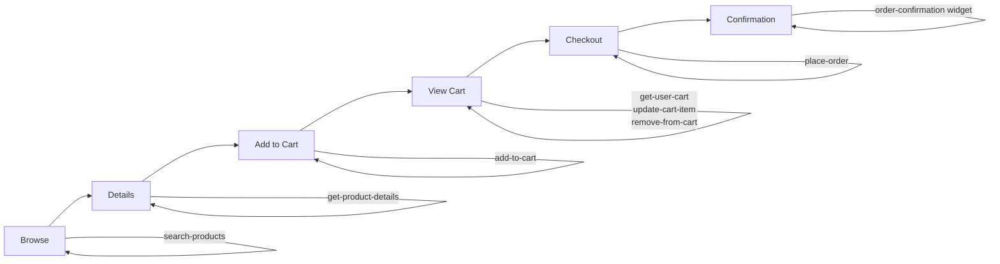

# Lovely Little Fruit Shop - ChatGPT App Template

[](https://mcp-use.com/deploy/start?repository-url=https%3A%2F%2Fgithub.com%2Fmcp-use%2Fmcp-use%2Ftree%2Fmain%2Flibraries%2Ftypescript%2Fpackages%2Fcreate-mcp-use-app%2Fsrc%2Ftemplates%2Fapps-sdk&branch=main&project-name=apps-sdk-template&build-command=npm+install&start-command=npm+run+build+%26%26+npm+run+start&port=3000&runtime=node&base-image=node%3A18)

> A complete ChatGPT app template demonstrating best practices from [OpenAI's ChatGPT App Guidelines](https://developers.openai.com/blog/what-makes-a-great-chatgpt-app). Learn how to build apps that **Know**, **Do**, and **Show** by example.

## What This Template Teaches

This isn't just another template - it's a **teaching tool** that shows you how to build great ChatGPT apps by following OpenAI's design principles. You'll learn:

- ✅ How to give ChatGPT new **knowledge** it doesn't have
- ✅ How to let ChatGPT **take actions** on behalf of users  
- ✅ How to **show information** in beautiful, actionable UIs
- ✅ How to design for conversation flow and user intent
- ✅ How to build tools that compose into complete user journeys

**Job-to-Be-Done**: Help users discover and purchase fresh fruits with a delightful shopping experience.

## Features

- **🍎 Complete Ecommerce Example**: Full fruit shop with product browsing, cart management, and checkout
- **🧠 Know/Do/Show Patterns**: All three value dimensions demonstrated with real examples
- **💬 Conversation Design**: Examples of handling vague, specific, and action intents
- **🎨 Beautiful UI Widgets**: 4 polished widgets using official OpenAI Apps SDK UI components
- **🔧 9 MCP Tools**: Search, inventory, cart management, checkout - everything you need
- **📚 In-Code Documentation**: Comments explaining design decisions and patterns
- **🎯 Production Ready**: TypeScript, Zod validation, proper error handling

---

## Quick Start

```bash
# Create a new project
npx create-mcp-use-app my-fruit-shop --template apps-sdk

# Start developing
cd my-fruit-shop
npm install
npm run dev
```

Visit `http://localhost:3000/inspector` to test your app!

---

## Designing ChatGPT Apps: The Know/Do/Show Framework

Great ChatGPT apps provide value in **three ways**. This template demonstrates all three:

### 1. **Know** - Give ChatGPT New Context

These tools provide data ChatGPT doesn't have access to:

| Tool | What It Knows | When to Use |
|------|---------------|-------------|
| `search-products` | Available fruits, prices, colors, stock levels | User wants to browse or filter products |
| `get-product-details` | Detailed info, nutrition facts, descriptions | User asks about a specific fruit |
| `get-product-inventory` | Real-time stock counts | User checks availability |
| `get-user-cart` | Current cart contents and totals | User wants to see their cart |

**Example Flow**:
```
User: "Do you have any mangos?"
→ ChatGPT calls: get-product-inventory({ productId: "mango" })
→ Response: { inStock: true, stockCount: 24 }
→ ChatGPT: "Yes! We have 24 fresh mangos in stock at $3.99 each."
```

### 2. **Do** - Let ChatGPT Take Actions

These tools let ChatGPT do things on behalf of the user:

| Tool | What It Does | When to Use |
|------|--------------|-------------|
| `add-to-cart` | Adds items to shopping cart | User wants to purchase something |
| `update-cart-item` | Changes item quantities | User wants to modify cart |
| `remove-from-cart` | Removes items from cart | User changed their mind |
| `clear-cart` | Empties the entire cart | User wants to start over |
| `place-order` | Processes checkout and creates order | User is ready to buy |

**Example Flow**:
```
User: "Add 3 mangos and 2 apples to my cart"
→ ChatGPT calls: add-to-cart({ productId: "mango", quantity: 3 })
→ ChatGPT calls: add-to-cart({ productId: "apple", quantity: 2 })
→ ChatGPT calls: get-user-cart()
→ Shows: cart-view widget with updated items
→ ChatGPT: "Added to your cart! Your total is $15.95. Ready to checkout?"
```

### 3. **Show** - Better Ways to Display Info

These widgets present information in rich, actionable UIs:

| Widget | What It Shows | Why It's Better Than Text |
|--------|---------------|---------------------------|
| `product-search-result` | Browse fruits with images, prices, stock badges | Visual shopping > text lists |
| `product-details` | Large product image, nutrition, add-to-cart | All info in one glanceable view |
| `cart-view` | Cart items with quantity controls, totals | Interactive > static summary |
| `order-confirmation` | Order summary with delivery date, tracking | Scannable confirmation > JSON |

**Example**:
```
User: "Show me red fruits under $5"
→ ChatGPT calls: search-products({ color: "red", maxPrice: 5 })
→ Shows: product-search-result widget
```

Instead of:
```
"I found 3 red fruits under $5:
- Apple: $1.99 (67 in stock)
- Cherries: $4.99 (32 in stock)  
- Strawberry: $3.99 (52 in stock)"
```

You see a beautiful carousel with images, prices, stock badges, and "Add to Cart" buttons.

---

## Conversation Flow Patterns

This template demonstrates how to handle different user intents. See `index.ts` for the full examples.

### Pattern 1: Vague Intent

**User**: "I want to buy some fruit"

**What NOT to do**:
```
❌ "What color fruit? What price range? How many? What's your address?"
(Don't interrogate with 5 questions before showing anything)
```

**What to do**:
```
✅ Call: search-products() // No filters
✅ Show: product-search-result with ALL fruits
✅ Say: "Here are our fresh fruits! Would you like to filter by color or price?"
```

**Principle**: Show something concrete immediately. Make filters optional refinements.

### Pattern 2: Specific Intent

**User**: "Show me red fruits under $5"

**What NOT to do**:
```
❌ "What kind of red fruit? Apples? Strawberries? How many do you want?"
(Don't ask them to repeat information they already gave)
```

**What to do**:
```
✅ Call: search-products({ color: "red", maxPrice: 5 })
✅ Show: product-search-result with filtered results
✅ Say: "Found 3 red fruits under $5!" (then show widget)
```

**Principle**: Parse the request and deliver focused results immediately.

### Pattern 3: Action Intent

**User**: "Add 3 mangos to my cart"

**What NOT to do**:
```
❌ "Are you sure? Would you like to add anything else first?"
(Don't add friction to clear actions)
```

**What to do**:
```
✅ Call: add-to-cart({ productId: "mango", quantity: 3 })
✅ Show: cart-view widget
✅ Say: "Added 3 mangos to your cart! Total: $11.97. Ready to checkout?"
```

**Principle**: Execute the action, confirm it happened, suggest the logical next step.

### Pattern 4: Cold Start / No Brand Awareness

**User's first message**: "Help me buy fruit"

**Your first response should**:
1. Introduce who you are in one line
2. Deliver something useful immediately
3. Suggest a clear next step

```
✅ "Welcome to Lovely Little Fruit Shop - fresh fruits delivered in 3-5 days!

Here are our most popular fruits: (shows product-search-result)

I can help you browse by color, price, or specific fruits. What sounds good?"
```

---

## Building for the Model

Your tool descriptions are **teaching the model** when and how to use your app. Make them conversational and context-rich.

### Good vs Bad Tool Descriptions

**❌ Bad** (too vague):
```typescript
description: "Search products"
```

**❌ Bad** (too technical):
```typescript
description: "Queries the product database using filter parameters and returns matching records"
```

**✅ Good** (conversational, contextual):
```typescript
description: "Search and filter fruits in the shop. Use this to help users discover products based on their preferences like color, price range, or specific keywords. Returns a list of matching products that can be displayed with the product-search-result widget. Great for both vague requests ('show me some fruits') and specific ones ('red fruits under $5')."
```

**Why it's good**:
- Says WHAT it does (search and filter fruits)
- Says WHEN to use it (help users discover products, handle preferences)
- Says WHAT it returns (list of products)
- Mentions RELATED widgets (product-search-result)
- Gives EXAMPLES of use cases (vague vs specific)

### Parameter Description Best Practices

```typescript
// ❌ Bad - not descriptive
productId: z.string()

// ✅ Good - clear with examples
productId: z.string().describe(
  "The unique identifier of the fruit (e.g., 'mango', 'apple', 'strawberry')"
)

// ❌ Bad - units unclear
maxPrice: z.number()

// ✅ Good - units and format specified
maxPrice: z.number().describe("Maximum price in dollars (e.g., 5.99)")
```

---

## Ecosystem Design: How Tools Compose

Great apps work as part of an ecosystem, not walled gardens. Tools should compose into complete journeys.

### The Complete Shopping Journey



### How This Template Composes

1. **Discovery Flow**:
   ```
   search-products → product-search-result widget → get-product-details → product-details widget
   ```

2. **Purchase Flow**:
   ```
   add-to-cart → get-user-cart → cart-view widget → place-order → order-confirmation widget
   ```

3. **Widgets Call Tools**:
   ```
   product-search-result → (user clicks "Add to Cart") → calls add-to-cart tool
   cart-view → (user clicks "+") → calls update-cart-item tool
   ```

4. **Tools Reference Widgets**:
   ```
   add-to-cart → "Returns cart summary that can be displayed with cart-view widget"
   search-products → "Returns products that can be displayed with product-search-result widget"
   ```

**Key Principles**:
- Keep operations small and focused
- Make outputs easy to pass along (stable IDs, clear structures)
- Let the model decide which tool should handle the next step
- Design widgets to call tools for interactivity

---

## Project Structure

```
apps-sdk/
├── src/
│   ├── data/                    # Mock data layer
│   │   ├── products.ts          # Fruit products with prices, descriptions, stock
│   │   ├── cart.ts              # In-memory cart management
│   │   └── orders.ts            # Order processing
│   └── types/                   # TypeScript definitions
│       ├── product.ts           # Product interfaces
│       ├── cart.ts              # Cart and CartItem interfaces
│       └── order.ts             # Order interfaces
├── resources/                   # UI Widgets (auto-registered)
│   ├── product-search-result/  # Browse fruits with carousel
│   ├── product-details/        # Detailed fruit view
│   ├── cart-view/              # Shopping cart with controls
│   └── order-confirmation/     # Order success page
├── public/
│   └── fruits/                 # Product images (16 fruits)
├── index.ts                    # MCP server with all tools
└── README.md                   # This file
```

---

## All Tools and Widgets

### KNOW Tools (4)

| Tool | Purpose | Returns |
|------|---------|---------|
| `search-products` | Find fruits by color, price, stock status, keywords | Matching products list |
| `get-product-details` | Get full info about a specific fruit | Complete product data + nutrition |
| `get-product-inventory` | Check stock levels | Stock count and availability |
| `get-user-cart` | Retrieve current cart contents | Cart items and totals |

### DO Tools (5)

| Tool | Purpose | Effect |
|------|---------|--------|
| `add-to-cart` | Add fruit to cart | Updates cart, returns new total |
| `update-cart-item` | Change quantity of cart item | Modifies cart, returns new state |
| `remove-from-cart` | Delete item from cart | Removes item, returns updated cart |
| `clear-cart` | Empty entire cart | Clears all items |
| `place-order` | Process checkout | Creates order, clears cart, returns confirmation |

### SHOW Widgets (4)

| Widget | Displays | Interactive Features |
|--------|----------|---------------------|
| `product-search-result` | Fruit carousel with prices, stock badges | Add to cart, view details |
| `product-details` | Large image, description, nutrition, price | Quantity selector, add to cart |
| `cart-view` | Cart items with quantities and totals | Update quantity, remove items, checkout |
| `order-confirmation` | Order summary, delivery date, status | Track order, continue shopping |

### Brand Info

| Tool | Purpose |
|------|---------|
| `get-brand-info` | About the shop, mission, values |

---

## How Automatic Widget Registration Works

All React components in `resources/` are automatically registered when they export `widgetMetadata`:

```typescript
// resources/cart-view/widget.tsx
import { z } from 'zod';
import type { WidgetMetadata } from 'mcp-use/react';

const propSchema = z.object({
  items: z.array(z.object({
    productName: z.string(),
    quantity: z.number(),
    price: z.number(),
  })),
  subtotal: z.number(),
});

export const widgetMetadata: WidgetMetadata = {
  description: 'Display shopping cart with items and totals',
  inputs: propSchema,
};

const CartView: React.FC = () => {
  const { props, callTool, sendFollowUpMessage } = useWidget();
  // Your widget implementation
};

export default CartView;
```

This automatically creates:
- **Tool**: `cart-view` - Callable by ChatGPT with validated inputs
- **Resource**: `ui://widget/cart-view` - Static resource access

---

## Widget Capabilities

Widgets can do more than display - they can interact with your MCP server:

### 1. Call Other Tools

```typescript
const { callTool } = useWidget();

const handleAddToCart = async () => {
  await callTool('add-to-cart', {
    productId: 'mango',
    quantity: 3
  });
};
```

### 2. Send Follow-Up Messages

```typescript
const { sendFollowUpMessage } = useWidget();

await sendFollowUpMessage(
  'Added mango to cart! Ready to checkout?'
);
```

### 3. Maintain Persistent State

```typescript
const { setState, state } = useWidget();

// Save state
await setState({ cart: [...cart, newItem] });

// Read state
const savedCart = state?.cart || [];
```

---

## Using Official OpenAI Apps SDK UI Components

This template uses the [OpenAI Apps SDK UI component library](https://openai.github.io/apps-sdk-ui/):

```typescript
import { Button } from '@openai/apps-sdk-ui/components/Button';
import { Icon } from '@openai/apps-sdk-ui/components/Icon';
import { AppsSDKUIProvider } from '@openai/apps-sdk-ui/components/AppsSDKUIProvider';

<AppsSDKUIProvider>
  <Button variant="primary" onClick={handleClick}>
    <Icon name="plus" />
    Add to Cart
  </Button>
</AppsSDKUIProvider>
```

**Available Components**:
- `Button` - Primary, outline, ghost variants
- `Icon` - Consistent iconography
- `Card` - Container components
- `Input` - Form inputs
- `Transition` - Smooth animations

Note: Icon names should match the IconName type from the SDK.

---

## Testing Your App

### Via Inspector (Development)

```bash
npm run dev
# Open http://localhost:3000/inspector
```

Test tools interactively, see outputs, and debug.

### Via ChatGPT (Production)

1. Deploy your server (see deployment section)
2. Register your app in ChatGPT app settings
3. Test the full conversation flow

### Example Test Scenarios

**Discovery Path**:
```
"Show me all fruits" 
→ "Tell me more about mangos" 
→ "Add 2 mangos to cart"
```

**Purchase Path**:
```
"Add 3 apples to my cart"
→ "Show my cart"
→ "I want to checkout"
```

**Vague Intent**:
```
"I need some healthy snacks"
→ App should show fruit options immediately
```

---

## Mock Data Architecture

This template uses in-memory mock data for demonstration. In production, replace with:

- **Database**: Replace `src/data/*.ts` with database queries
- **API calls**: Connect to your backend services
- **Session management**: Use real session/auth instead of hardcoded IDs

**Current mock structure**:
```typescript
// src/data/products.ts
export const products: Product[] = [ /* 16 fruits */ ];

// src/data/cart.ts
const carts = new Map<string, CartItem[]>(); // In-memory storage

// src/data/orders.ts  
const orders = new Map<string, Order>(); // In-memory orders
```

**What to replace for production**:
```typescript
// Example: Real database
import { db } from './database';

export async function getProductById(id: string) {
  return await db.products.findUnique({ where: { id } });
}

export async function addToCart(userId: string, productId: string, quantity: number) {
  return await db.cartItems.create({
    data: { userId, productId, quantity }
  });
}
```

---

## Customization Guide

### Adding a New Product

Edit `src/data/products.ts`:

```typescript
{
  id: "kiwi",
  name: "Kiwi",
  price: 2.49,
  color: "green",
  colorClass: "bg-[#e8f5e8] dark:bg-[#e8f5e8]/10",
  inStock: true,
  stockCount: 38,
  description: "Tangy kiwi fruit packed with vitamin C...",
  nutritionalInfo: {
    calories: 61,
    vitaminC: "154% DV",
    fiber: "3g",
  },
  image: "/fruits/kiwi.png",
}
```

Add image to `public/fruits/kiwi.png` and it automatically appears!

### Adding a New Tool

```typescript
// In index.ts
server.tool(
  {
    name: "recommend-fruits",
    description: "Recommend fruits based on user preferences or dietary needs. Use this when users ask for suggestions or have specific health goals.",
    inputs: z.object({
      dietaryGoal: z.string().describe("e.g., 'high vitamin C', 'low sugar', 'high fiber'"),
    }),
  },
  async ({ dietaryGoal }) => {
    // Your recommendation logic
    return { content: [{ type: "text", text: JSON.stringify(recommendations) }] };
  }
);
```

### Adding a New Widget

Create `resources/recommendations/widget.tsx`:

```typescript
import { z } from 'zod';
import type { WidgetMetadata } from 'mcp-use/react';

const propSchema = z.object({
  recommendations: z.array(z.object({
    fruit: z.string(),
    reason: z.string(),
  })),
});

export const widgetMetadata: WidgetMetadata = {
  description: 'Display personalized fruit recommendations',
  inputs: propSchema,
};

const Recommendations: React.FC = () => {
  const { props } = useWidget();
  // Your widget UI
};

export default Recommendations;
```

It's automatically registered as the `recommendations` tool!

---

## Deployment

### Option 1: Deploy to Railway

```bash
npm run build
# Push to GitHub
# Connect to Railway
# Railway auto-deploys
```

### Option 2: Deploy to Any Node.js Host

```bash
npm run build
npm start
# Runs on PORT environment variable (default 3000)
```

### Option 3: Use mcp-use Deployment

Click the deploy button at the top of this README!

---

## Learn More

### Key Resources

- [OpenAI ChatGPT App Guidelines](https://developers.openai.com/blog/what-makes-a-great-chatgpt-app) - Design principles this template follows
- [mcp-use Documentation](https://docs.mcp-use.com) - Framework docs
- [OpenAI Apps SDK](https://platform.openai.com/docs/apps) - Apps SDK reference
- [Apps SDK UI Components](https://openai.github.io/apps-sdk-ui/) - Component library

### Related Examples

- **Starter Template**: Demonstrates all MCP features (tools, resources, prompts)
- **MCP-UI Template**: Shows alternative UI rendering approaches
- **Custom Server**: Build from scratch without templates

---

## Design Checklist

Use this to evaluate your own ChatGPT app:

### Know/Do/Show Framework
- [ ] Does your app give ChatGPT new data it doesn't have? (KNOW)
- [ ] Does your app let ChatGPT take real actions? (DO)  
- [ ] Does your app show information in better UIs than text? (SHOW)

### Conversation Design
- [ ] Can your app handle vague intent gracefully?
- [ ] Does it respond immediately to specific requests?
- [ ] Does your first response introduce your role?
- [ ] Do you show something useful on the first turn?

### Building for the Model
- [ ] Are your tool descriptions conversational and context-rich?
- [ ] Do parameter descriptions include examples?
- [ ] Are outputs structured and consistent?
- [ ] Do tools reference related widgets?

### Ecosystem Fit
- [ ] Are your operations small and focused?
- [ ] Can tools compose into complete journeys?
- [ ] Can widgets call tools for interactivity?
- [ ] Can other apps build on your outputs?

---

## FAQ

**Q: Why a fruit shop example?**  
A: It's simple enough to understand quickly but complete enough to demonstrate all patterns: browsing (Know), purchasing (Do), and beautiful UIs (Show).

**Q: Can I use this for a real ecommerce site?**  
A: Yes! Replace the mock data layer with your database, add authentication, and you're good to go.

**Q: Do I need all these tools?**  
A: No. This template shows comprehensive examples. Start with 2-3 core tools that solve your job-to-be-done.

**Q: How do I handle authentication?**  
A: The framework supports OAuth. See the [OAuth examples](https://docs.mcp-use.com/typescript/server/oauth) in the docs.

**Q: Can I use different UI libraries?**  
A: Yes! The OpenAI SDK UI is optional. You can use any React components.

**Q: Where's the AI/LLM code?**  
A: ChatGPT itself is the AI. Your app provides tools and data. The model orchestrates everything.

---

## Contributing

Found a way to make this template even better? PRs welcome!

1. Fork the repository
2. Create a feature branch
3. Make your changes  
4. Submit a pull request

---

## License

MIT © [mcp-use](https://github.com/mcp-use/mcp-use)

---

**Happy building! 🍎🍊🍋**

Remember: Great ChatGPT apps give the model new powers (Know/Do/Show), design for conversation, build for composability, and teach by example. This template shows you how.
