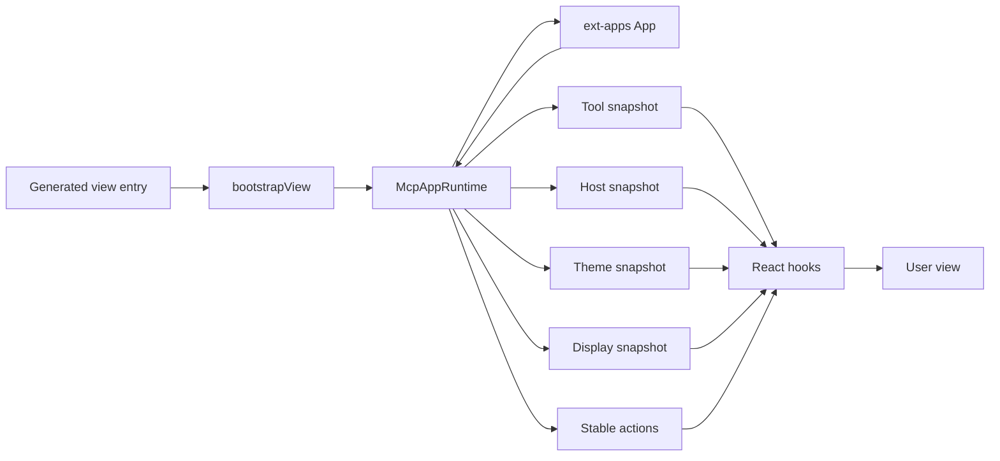

# React view runtime refactor plan

## Goal

Refactor the `@mcp-use/server/react` runtime so each concern has one clear owner:

- The official ext-apps `App` owns MCP Apps protocol behavior.
- `McpAppRuntime` owns connection, retry, capabilities, snapshots, and disposal.
- React hooks subscribe to narrow external-store channels.
- Each bound tool has one view, and each bound view has one tool.
- Each view declares immutable runtime configuration through an optional `viewConfig` export.
- Users compose optional presentation components directly instead of using `McpUseProvider`.

This plan intentionally removes the custom tool-name result stamp and the many-tools-to-one-view feature. The simpler one-to-one binding removes a runtime type discriminant that the MCP Apps result notification does not provide.

## Decisions

### Keep one App per iframe document

An MCP App runs in one iframe document. The runtime creates one ext-apps `App`, one transport, one React root, and one set of stores for that document.

Repeated bootstrap calls for the same root reuse the mounted runtime for HMR. A second root in the same document throws. After disposal, bootstrap may create a fresh runtime.

### Always advertise App tools

Every mcp-use view runtime supports `useViewTool`, even if a particular view has not registered a tool yet. The runtime will therefore always advertise:

```ts
{
  tools: {
    listChanged: true,
  },
}
```

Advertising the capability means the App implements `tools/list` and `tools/call`. It does not mean the current tool list must be non-empty.

Before the React tree mounts, the runtime installs handlers with these behaviors:

```ts
app.onlisttools = async () => ({ tools: [] });

app.oncalltool = async ({ name }) => {
  throw new Error(`View tool "${name}" is not registered`);
};
```

When `useViewTool` registers the first tool, the runtime performs a synchronous handoff:

1. Clear the temporary `onlisttools` and `oncalltool` handlers by assigning `undefined`.
2. Call `app.registerTool()` before returning control to the event loop.
3. Let ext-apps install its registry-backed handlers.

Clearing the handlers first avoids ext-apps' "handler replaced" warning. The clear-and-register sequence is synchronous, so the host cannot observe a handler gap. The App then sends `notifications/tools/list_changed`.

This fixes the current mismatch where the App advertises tool support before it has valid list and call handlers. It also avoids a `viewTools` configuration flag that users could forget to set.

### Configure runtime behavior before React renders

A view may export an immutable `viewConfig` value:

```tsx
import type { ViewConfig } from "@mcp-use/server/react";

export const viewConfig = {
  autoResize: false,
  displayModes: ["inline", "fullscreen"],
} satisfies ViewConfig;

export default function CanvasView() {
  return <Canvas />;
}
```

The first version of `ViewConfig` is:

```ts
export interface ViewConfig {
  /**
   * Let ext-apps observe the document and report size changes.
   *
   * @defaultValue true
   */
  autoResize?: boolean;

  /**
   * Display modes this view can render correctly.
   *
   * Must contain "inline".
   *
   * @defaultValue ["inline", "fullscreen", "pip"]
   */
  displayModes?: readonly DisplayMode[];
}
```

`ViewConfig` contains settings required before the App connects. React presentation settings do not belong in this object.

### Remove `McpUseProvider`

`McpUseProvider` currently combines:

- Global App configuration
- `ThemeProvider`
- `ViewControls`
- A nested `ErrorBoundary`
- `StrictMode`

These concerns have different lifecycles. The refactor deletes `McpUseProvider`.

Bootstrap continues to provide the required top-level error boundary. Users compose optional presentation behavior directly:

```tsx
export default function View() {
  return (
    <ThemeProvider>
      <ViewControls debugger>
        <Dashboard />
      </ViewControls>
    </ThemeProvider>
  );
}
```

Users may add `StrictMode` or another error boundary if their application needs one.

### Enforce one-to-one tool and view binding

A tool already accepts one `view.name`. This refactor also limits each view to one bound tool.

The following becomes a registration error:

```ts
server.tool({
  name: "draw",
  view: { name: "canvas" },
  // ...
});

server.tool({
  name: "refresh",
  view: { name: "canvas" },
  // Error: "canvas" is already bound to "draw".
});
```

Use a separate view resource when another tool needs a rendered result. App-only helper tools remain viewless and are called from the view through `useCallTool`.

### Latch the rendering invocation

A valid MCP tool error may set `isError: true` without returning `structuredContent`. This must not become a typed `"ready"` result.

A lifecycle result notification contains no tool name or request id. A content-only success may therefore belong to a later schema-less server or View tool and cannot be classified as an invalid rendering result. Ignore it.

While pending, partial and complete inputs replace one progressive snapshot. The first structured success or tool error is assumed to belong to the rendering invocation and is latched permanently. Cancellation leaves the context pending.

The error branch has this shape:

```ts
interface ErrorToolContext<Name extends keyof RegisteredTools> {
  status: "error";
  toolInput: RegisteredTools[Name]["input"] | undefined;
  toolOutput: undefined;
  content: ContentBlock[] | undefined;
  meta: Record<string, unknown> | undefined;
  error: ToolError;
}
```

`PendingToolContext.toolInput` is `DeepPartial<Input> | undefined`; complete
and partial notifications replace the same last-write-wins snapshot without a
separate streaming state.

The full lifecycle becomes:

```ts
type ToolContextHandle<Name extends keyof RegisteredTools> =
  | PendingToolContext<Name>
  | ReadyToolContext<Name>
  | ErrorToolContext<Name>;
```

The ready branch is available only for a non-error result with `structuredContent`.

## Target architecture



## Public API after the refactor

### View module

```tsx
import {
  ThemeProvider,
  useSendSizeChanged,
  type ViewConfig,
} from "@mcp-use/server/react";
import { useEffect, useRef } from "react";

export const viewConfig = {
  autoResize: false,
  displayModes: ["inline", "fullscreen"],
} satisfies ViewConfig;

export default function AspectRatioView() {
  return (
    <ThemeProvider>
      <AspectRatioContent />
    </ThemeProvider>
  );
}

function AspectRatioContent() {
  const ref = useRef<HTMLDivElement>(null);
  const sendSizeChanged = useSendSizeChanged();

  useEffect(() => {
    const element = ref.current;
    if (!element) return;

    const observer = new ResizeObserver(([entry]) => {
      if (!entry) return;
      const { width, height } = entry.contentRect;
      void sendSizeChanged({ width, height });
    });

    observer.observe(element);
    return () => observer.disconnect();
  }, [sendSizeChanged]);

  return <div ref={ref} style={{ width: "100%", aspectRatio: "4 / 3" }} />;
}
```

### Tool lifecycle

```tsx
export default function ProductSearchView() {
  const view = useToolContext<"search-products">();

  if (view.status === "error") {
    return <ToolError message={view.error.message} />;
  }

  if (view.status === "pending") {
    return <SearchSkeleton query={view.toolInput?.query} />;
  }

  return <ProductGrid products={view.toolOutput.products} />;
}
```

The handle no longer contains `toolName`. The view has one bound tool, so a runtime tool-name discriminant is unnecessary.

### Calling server tools

`useCallTool` preserves its current state fields:

```ts
interface CallToolHandle<Args, Result> {
  callTool(args: Args): Promise<CallToolData<Result>>;
  data: CallToolData<Result> | undefined;
  error: Error | undefined;
  isPending: boolean;
}
```

The result is a discriminated union:

```ts
type CallToolData<Result> =
  | (CallToolResult & {
      isError?: false;
      structuredContent: Result;
    })
  | (CallToolResult & {
      isError: true;
      structuredContent?: unknown;
    });
```

Usage:

```tsx
const details = useCallTool("get-product-details");

async function loadDetails(id: string) {
  const result = await details.callTool({ id });

  if (result.isError) {
    showToolError(result.content);
    return;
  }

  showDetails(result.structuredContent);
}
```

Valid tool errors resolve and populate `data`. Transport failures, RPC failures, capability failures, and malformed non-error results reject and populate `error`.

The hook preserves the previous successful `data` while another request is pending or fails.

### Registering view tools

No configuration flag is required:

```tsx
function SelectableMap() {
  const [selectedId, setSelectedId] = useState<string>();

  useViewTool(
    {
      name: "select-location",
      description: "Select a location visible on the map",
      inputSchema: z.object({ id: z.string() }),
    },
    async ({ id }) => {
      setSelectedId(id);
      return {
        content: [{ type: "text", text: `Selected ${id}` }],
      };
    }
  );

  return <Map selectedId={selectedId} />;
}
```

Before this effect runs, `tools/list` returns an empty list. The hook registers through the runtime, which performs the temporary-handler handoff before calling ext-apps. After registration, the host receives `notifications/tools/list_changed`.

### Display modes

```tsx
function ExpandButton() {
  const {
    displayMode,
    availableDisplayModes,
    requestDisplayMode,
  } = useDisplayMode();

  if (!availableDisplayModes.includes("fullscreen")) {
    return null;
  }

  return (
    <button
      type="button"
      disabled={displayMode === "fullscreen"}
      onClick={() => {
        void requestDisplayMode({ mode: "fullscreen" });
      }}
    >
      Expand
    </button>
  );
}
```

`availableDisplayModes` is the intersection of:

- Modes declared by `viewConfig.displayModes`
- Modes reported by `hostContext.availableDisplayModes`

`"inline"` is always included in normalized view configuration. If the host does not report available modes, only `"inline"` is requestable.

## Phase 1: Rewrite the views contract

Update `specs/VIEWS_SPEC.md` before changing behavior.

### Replace these decisions

- Many tools may bind one view.
- Tool results carry `mcp-use/toolName`.
- `toolName` discriminates `useToolContext` output.
- `McpUseProvider` configures auto-resize.
- The provider owns bridge connection.
- The App advertises tools without guaranteeing list and call handlers.
- The server serves view documents and bundle assets over HTTP.

### Add these decisions

- A view has zero or one bound tool.
- A bound tool has exactly one view.
- Unbound views remain valid and produce a warning.
- `viewConfig` contains immutable pre-render runtime configuration.
- Every view runtime advertises App tools and serves an empty list before registration.
- Bootstrap creates and connects the runtime.
- React mounts immediately after connection starts.
- Tool errors and invalid results are separate from ready output.
- HMR reuses the mounted runtime.
- Disposal unmounts React before closing the App.
- Hosts obtain the view document only through `resources/read`; the
  production document inlines the bundle, and the only HTTP surfaces are
  the public-asset route and dev-mode Vite middleware.

### Update these sections

- Decisions at a glance
- File-based view exports
- Binding a tool to a view
- Component lifecycle
- Streaming
- View tools
- React API reference
- Providers and components
- Complete example
- v1-to-v2 hook mapping
- Testing contract
- Deltas from v1

## Phase 2: Simplify server-side view binding

### Files

- `src/server.ts`
- `src/views/constants.ts`
- `src/views/wire.ts`
- `src/views/index.ts`
- `tests/views.test.ts`

### Changes

1. Replace the many-binder record:

   ```ts
   {
     toolNames: string[];
     factsOwner?: {
       toolName: string;
       config: ToolViewConfig;
     };
   }
   ```

   with:

   ```ts
   {
     toolName: string;
     config: ToolViewConfig;
   }
   ```

2. Reject a second binder during `server.tool()` registration:

   ```text
   View "canvas" is already bound to tool "draw"; tool "refresh" cannot bind the same view.
   Each view may be bound to one tool.
   ```

3. Remove `#viewConfigDeclaresFacts`. The only binder owns all resource facts.

4. Read resource facts directly from the binding configuration.

5. Delete `TOOL_NAME_META_KEY`.

6. Remove the `toolName` parameter and metadata field from `buildToolResultUiMeta`.

7. Preserve nested and legacy resource URI metadata for successful view-bound results.

8. Keep error results unstamped with resource URI metadata so an error does not create a new rendered view through legacy host behavior.

### Tests

- Replace the test that allows multiple tools to share a view with a duplicate-binding error test.
- Delete facts-owner ordering tests.
- Remove `mcp-use/toolName` assertions.
- Preserve tests for resource facts, missing views, unbound views, and required output schemas.

## Phase 3: Remove dead view-serving HTTP routes

The MCP Apps specification (2026-01-26, stable) requires hosts to fetch a
view's document with `resources/read` and load the raw HTML into the
sandboxed iframe. URL-based delivery (`externalUrl`, `text/uri-list`) is
explicitly deferred from the MVP, and no host — including the inspector,
which renders through `srcdoc` — navigates an iframe to a server URL.
Production builds inline the view JS and CSS into the synthesized document,
so the bundle never travels over HTTP.

Two routes therefore have no consumer and are removed:

- `GET ${basePath}/_mcp-use/assets/<file>` — dead. The build writes per-view
  scratch output to `views/<name>/assets/`, not the shared `views/assets/`
  directory this route reads, and no manifest path can emit a URL that
  resolves to it: dev manifests produce only `/`-prefixed Vite module paths,
  and inline manifests never reference URLs.
- `GET ${basePath}/_mcp-use/views/<name>.html` — the document route. It
  duplicates the `resources/read` body for a host flow the MCP Apps spec
  does not define.

The public route `GET ${basePath}/_mcp-use/public/<path>` stays: public
assets are not inlined, and the generated document fetches them over HTTP
through the injected `publicBase`. Dev-mode Vite middleware also stays; it
serves the view module graph for HMR.

### Files

- `src/views/routes.ts`
- `src/views/document.ts`
- `src/views/index.ts`
- `src/cli/dev.ts`
- `specs/VIEWS_SPEC.md`
- `tests/views.test.ts`
- `tests/cli/build.test.ts`
- `tests/cli/dev.test.ts`
- `examples/views/basic/README.md`
- `examples/views/story-writer/README.md`

### Changes

1. Delete the assets route, `ASSETS_DIR`, and the asset content-type table
   from `mountViewRoutes`.

2. Delete the document route and `viewsPrefix`.

3. Simplify `resolveAssetUrl`: external manifest entries are origin-absolute
   `/`-prefixed paths by contract (`ExternalViewManifestEntry` already
   documents this). Remove the fallback branch that synthesized
   `/_mcp-use/assets/` URLs for bare filenames; reject non-`/`-prefixed
   paths instead.

4. Remove the `isViewDocument` special case in `src/cli/dev.ts` that steered
   `/_mcp-use/views/*.html` requests to Hono instead of Vite.

5. Keep the public route, its `Access-Control-Allow-Origin: *` posture, and
   the CSP serving-origin append in `wire.ts` — those exist for public
   assets and the dev HMR websocket, not for the removed routes.

6. Rewrite the Serving section of `specs/VIEWS_SPEC.md`: drop the assets and
   document route rows, drop the claim that the HTML route exists "for hosts
   that navigate an iframe to a URL, for the inspector, and for humans
   debugging" (the MCP Apps spec defines no such host flow and the inspector
   reads the resource), and state that unbound views are previewed through
   `resources/read`.

### Tests

- Delete the document-route and assets-route tests, including the
  path-traversal and immutable-cache assertions for the assets route.
- Rewrite the Origin and CORS tests to cover only the public route.
- Rewrite `tests/cli/build.test.ts` and `tests/cli/dev.test.ts` document
  assertions to read the view through `resources/read` instead of fetching
  `/_mcp-use/views/<name>.html`; dev HMR coverage keeps asserting that the
  returned document references `/@vite/client` and that the virtual entry is
  fetchable through Vite.
- Replace the debug URLs in the two example READMEs with
  inspector-based preview instructions.

## Phase 4: Add `viewConfig` and remove `McpUseProvider`

### Files

- `src/react/bridge/bootstrap-view.tsx`
- `src/react/components/mcp-use-provider.tsx`
- `src/react/index.ts`
- `src/react/hooks/use-send-size-changed.ts`
- `examples/views/excalidraw/resources/excalidraw/view.tsx`
- `tests/react-bridge.test.tsx`
- `tests/cli/build.test.ts`
- `tests/cli/dev.test.ts`

### Changes

1. Export `ViewConfig`.

2. Add `viewConfig?: ViewConfig` to `ViewModule`.

3. Normalize and validate configuration before constructing the App or runtime.

4. Default `autoResize` to `true`.

5. Default `displayModes` to `["inline", "fullscreen", "pip"]` so every view supports all standard modes unless it explicitly narrows the list.

6. Reject invalid, empty, duplicated, or non-inline display-mode declarations.

7. Delete `McpUseProvider`.

8. Remove its public export.

9. Replace provider documentation in `useSendSizeChanged` with a named-export example.

10. Move Excalidraw to:

    ```ts
    export const viewConfig = {
      autoResize: false,
    } satisfies ViewConfig;
    ```

11. Keep the generated entry:

    ```ts
    import { bootstrapView } from "@mcp-use/server/react";
    import * as viewModule from "/absolute/path/to/view.tsx";

    bootstrapView(viewModule);
    ```

## Phase 5: Create `McpAppRuntime`

### Proposed internal files

- Rename `src/react/bridge/view-bridge-store.ts` to `src/react/runtime/view-runtime.ts`.
- Rename `src/react/bridge/view-bridge.tsx` to `src/react/runtime/view-runtime-context.tsx`.
- Move `bootstrap-view.tsx` into `src/react/runtime/`.
- Move `model-context-store.ts` into `src/react/runtime/`.

### Runtime responsibilities

```ts
interface McpAppRuntime {
  readonly config: NormalizedViewConfig;

  connect(): Promise<App>;
  dispose(): Promise<void>;

  subscribeTool(listener: () => void): () => void;
  getToolSnapshot(): ToolSnapshot;

  subscribeHost(listener: () => void): () => void;
  getHostSnapshot(): HostSnapshot;

  subscribeTheme(listener: () => void): () => void;
  getThemeSnapshot(): "light" | "dark";

  subscribeDisplay(listener: () => void): () => void;
  getDisplaySnapshot(): DisplaySnapshot;

  callServerTool(params: CallToolParams): Promise<CallToolResult>;
  sendMessage(params: SendMessageParams): Promise<void>;
  openLink(params: OpenLinkParams): Promise<void>;
  requestDisplayMode(params: RequestDisplayModeParams): Promise<void>;
  sendSizeChanged(params: SizeChangedParams): Promise<void>;
  registerViewTool(
    name: string,
    config: ViewToolConfig,
    callback: ViewToolCallback
  ): RegisteredAppTool;
}
```

The exact internal shape may use a class or a factory-returned object. The ownership contract matters more than the syntax.

### App creation

Create and configure a fresh App inside a generation:

```ts
function createAppGeneration() {
  const app = new App(
    {
      name: "mcp-use-view",
      version: PACKAGE_VERSION,
    },
    {
      tools: {
        listChanged: true,
      },
      availableDisplayModes: config.displayModes,
    },
    {
      autoResize: config.autoResize,
    }
  );

  installEmptyToolHandlers(app);
  installRuntimeEventHandlers(app);

  return app;
}
```

Do not construct the App during React render.

### First view-tool registration

The runtime owns the transition from temporary empty handlers to ext-apps' tool registry:

```ts
function registerViewTool(
  name: string,
  config: ViewToolConfig,
  callback: ViewToolCallback
): RegisteredAppTool {
  if (toolRegistryActivated) {
    return app.registerTool(name, config, callback);
  }

  app.onlisttools = undefined;
  app.oncalltool = undefined;

  try {
    const registration = app.registerTool(name, config, callback);
    toolRegistryActivated = true;
    return registration;
  } catch (error) {
    installEmptyToolHandlers(app);
    throw error;
  }
}
```

This operation must remain synchronous. Do not clear temporary handlers in one task and register the first tool in another task.

### Connection retry

The runtime uses a monotonically increasing generation number:

```ts
async function connect(): Promise<App> {
  if (connectedApp) return connectedApp;
  if (connectPromise) return connectPromise;

  const generation = ++currentGeneration;
  const app = createAppGeneration();

  connectPromise = connectGeneration(app, generation);
  return connectPromise;
}
```

On failure:

1. Await App cleanup.
2. Discard the App only if its generation is still current.
3. Clear the rejected promise only if it is still current.
4. Preserve the connection error in the connection snapshot.
5. Let the next `connect()` create a fresh App and transport.

Late completion from an older generation must never replace or close the current App.

## Phase 6: Make bootstrap and disposal deterministic

### Mount record

Store one mounted record on the iframe document through an internal symbol:

```ts
interface MountedView {
  rootId: string;
  root: Root;
  runtime: McpAppRuntime;
  config: NormalizedViewConfig;
}
```

### First bootstrap

1. Validate the browser environment.
2. Read and normalize `viewModule.viewConfig`.
3. Create the runtime.
4. Install App event and empty tool handlers.
5. Start `runtime.connect()` and attach a rejection handler immediately.
6. Create the React root.
7. Render:

   ```tsx
   <ErrorBoundary>
     <ViewRuntimeProvider runtime={runtime}>
       <View />
     </ViewRuntimeProvider>
   </ErrorBoundary>
   ```

The user view mounts in pending state while the handshake is in progress.

### Repeated bootstrap

When bootstrap runs again for the same root:

- Reuse the root and runtime.
- Render the new module component.
- Do not reconnect.
- Warn if normalized configuration changed.
- Require a full iframe reload for configuration changes.

When bootstrap targets another root while one is mounted, throw.

### Disposal

```ts
export async function disposeView(): Promise<void> {
  const mounted = readMountedView();
  if (!mounted) return;

  mounted.root.unmount();
  await mounted.runtime.dispose();
  clearMountedView();
}
```

Runtime disposal:

- Invalidates the active generation.
- Prevents late event delivery.
- Unbinds model-context flushing.
- Clears listeners.
- Closes the App and transport.
- Clears snapshots.

Unmount React before closing the App so hook cleanup can remove view tools while the connection still exists.

## Phase 7: Split external-store channels

### Files

- `src/react/runtime/view-runtime.ts`
- `src/react/runtime/view-runtime-context.tsx`
- `src/react/hooks/use-tool-context.ts`
- `src/react/hooks/use-host-context.ts`
- `src/react/hooks/use-view-theme.ts`
- `src/react/hooks/use-display-mode.ts`
- `src/react/components/theme-provider.tsx`

### Changes

1. Create cached snapshots for tool, host, display, and connection state.

2. Return the same snapshot reference until that channel changes.

3. Use a primitive theme snapshot so locale, dimensions, and display changes do not rerender theme-only consumers.

4. Let `ThemeProvider` subscribe to the host style channel because it consumes theme, variables, and fonts.

5. Remove the Context default singleton:

   ```ts
   const ViewRuntimeContext = createContext<McpAppRuntime | null>(null);
   ```

6. Throw clearly outside bootstrap:

   ```ts
   function useViewRuntime(): McpAppRuntime {
     const runtime = use(ViewRuntimeContext);

     if (!runtime) {
       throw new Error(
         "@mcp-use/server/react hooks require a browser view mounted by bootstrapView"
       );
     }

     return runtime;
   }
   ```

7. Keep the package browser-only. Do not imply SSR support through fabricated server snapshots.

8. Remove `useViewActions`. Individual action hooks return stable methods owned by the runtime.

## Phase 8: Fix tool-result state and typing

### Files

- `src/react/runtime/view-runtime.ts`
- `src/react/hooks/use-tool-context.ts`
- `src/react/types/result-types.ts`
- `src/react/hooks/use-call-tool.ts`
- `tests/react-type-level-register.test.ts`
- `tests/react-type-level-empty.test.ts`

### Inbound tool results

Handle results in this order:

```ts
if (result.isError === true) {
  setToolError({
    kind: "tool",
    result,
  });
  return;
}

if (result.structuredContent === undefined) {
  setToolError({
    kind: "invalid-result",
    message: "View-bound tool returned a non-error result without structuredContent",
    result,
  });
  return;
}

setToolReady(result);
```

Remove:

- `toolName` from `ViewBridgeSnapshot`
- `toolName` from every `ToolContextHandle` branch
- Tool-name seeding from host context
- Tool-name result parsing
- Multi-name ready-branch distribution

The generic `Name` continues to select the registered input and output types for the view's single bound tool.

### `useCallTool`

Before calling:

- Clear the previous transport error.
- Set `isPending`.
- Preserve previous `data`.
- Verify `hostCapabilities.serverTools`.

After receiving a result:

- Reject `isError: true` results with `ToolError`.
- Resolve every non-error result, including content-only schema-less results.
- Preserve previous successful data across pending or failed calls.
- Let only the latest direct call update hook state; ambient lifecycle delivery is handled separately by the terminal View-context latch.

## Phase 9: Centralize capability checks

### Server tools

`callServerTool` rejects before sending when the host does not declare `serverTools`.

### Messages

`sendFollowUp` rejects before sending when the host does not declare message support.

### External links

`openExternal` rejects before sending when the host does not declare `openLinks`.

Change its hook signature:

```ts
function useOpenExternal(): (args: { url: string }) => Promise<void>;
```

### Display modes

The runtime stores normalized view modes and reads host modes from host context.

```ts
const availableDisplayModes = viewModes.filter((mode) =>
  hostModes.includes(mode)
);
```

If the host omits available modes, expose only `"inline"`.

Reject a request that is not in the negotiated intersection.

### Size notifications

Do not add a capability guard. The MCP Apps draft does not define one for size notifications.

## Phase 10: Make `useViewTool` lifecycle-safe

### Files

- `src/react/hooks/use-view-tool.ts`
- `tests/react-bridge.test.tsx`

### Registration

- Continue waiting for runtime connection.
- Abort when the component unmounts before connection.
- Catch and report registration failures.
- Keep the handler in a ref so it sees current React state.
- Keep input and output schemas fixed for the registered name.
- Register through `runtime.registerViewTool()` rather than calling `app.registerTool()` directly.
- Let the runtime perform the temporary-handler handoff on the first registration.

### Metadata updates

Pass explicit `undefined` values so metadata can be removed:

```ts
registered.update({
  title: definition.title,
  description: definition.description,
  annotations: definition.annotations,
});
```

### Cleanup

Capture the registered handle inside the effect:

```ts
useEffect(() => {
  let cancelled = false;
  let registration: RegisteredAppTool | undefined;

  void runtime.connect().then((app) => {
    if (cancelled) return;
    registration = register(app);
  });

  return () => {
    cancelled = true;
    registration?.remove();
  };
}, [runtime, name]);
```

Do not let an old cleanup remove a newer registration stored in a shared ref.

## Phase 11: Make model-context delivery reliable

### Files

- `src/react/runtime/model-context-store.ts`
- `src/react/components/model-context.tsx`
- `src/react/runtime/view-runtime.ts`
- `tests/react-bridge.test.tsx`

### Runtime ownership

Each `McpAppRuntime` owns one `ModelContextStore`.

React components obtain the store from runtime context. The imperative `modelContext` API delegates to the active document runtime and throws when no view runtime is mounted.

### Empty context scopes

An empty parent must not orphan children:

```tsx
function ModelContext({ content, children }: ModelContextProps) {
  const parentId = useContext(ParentIdContext);
  const id = useId();
  const hasContent = content.trim().length > 0;
  const childParentId = hasContent ? id : parentId;

  // Register only when hasContent is true.

  return children == null ? null : (
    <ParentIdContext.Provider value={childParentId}>
      {children}
    </ParentIdContext.Provider>
  );
}
```

### Async flush pump

Track:

- Desired serialized payload
- Acknowledged serialized payload
- Current in-flight send
- Runtime generation
- Dirty state

Rules:

1. A change updates desired state and schedules the pump.
2. Only one request runs at a time.
3. Success marks that exact payload acknowledged.
4. If desired state changed while sending, immediately send the latest state.
5. Failure leaves the payload dirty.
6. The next mutation or successful reconnect retries the latest desired state.
7. Capability absence does not mark the payload acknowledged.
8. Disposal invalidates in-flight completion.

## Phase 12: Update examples and API documentation

### Examples

Update:

- `examples/views/excalidraw/resources/excalidraw/view.tsx`
- `examples/views/basic/resources/product-search-result/view.tsx`
- `examples/views/story-writer/resources/story-writer/view.tsx`
- Relevant example README files

Examples should demonstrate:

- Default configuration with no `viewConfig`
- Manual resizing through `viewConfig.autoResize`
- Display-mode declaration
- Tool-error handling
- `useViewTool` without an opt-in flag
- Explicit theme and control composition

### Documentation

Remove or replace references to:

- `McpUseProvider`
- `autoSize`
- Many tools sharing one view
- `mcp-use/toolName`
- `toolName` as a type discriminant
- Tool output always being present on `"ready"` without an error branch

Do not silently rewrite v1 documentation as v2 documentation. Keep package and version scope explicit.

## Phase 13: Verification

### Runtime tests

Expand `tests/react-bridge.test.tsx` with:

- Default `autoResize: true`
- `viewConfig.autoResize: false`
- Invalid view configuration
- App tools list is valid and empty before registration
- First `useViewTool` registration emits list changed
- View-tool metadata can be cleared
- Unmount before connection
- Unmount during registration
- Failed connection followed by a successful retry
- Old connection generation cannot affect a newer connection
- Same-root HMR bootstrap reuses runtime
- Changed HMR configuration warns
- A second root throws
- Disposal unmounts and closes transport
- Rebootstrap after disposal creates a fresh runtime
- Host changes do not rerender tool-only consumers
- Tool changes do not rerender host, theme, display, or action-only consumers
- Valid tool errors produce `status: "error"`
- Missing structured content produces `invalid-result`
- `useCallTool` distinguishes tool errors from rejected calls
- Capability checks prevent outbound requests
- Empty model-context parent preserves children
- Failed model-context send remains dirty
- In-flight model-context updates coalesce
- Reconnect retries dirty model context
- Disposal cancels stale model-context completion

### Server tests

Update `tests/views.test.ts` with:

- Duplicate view binding rejection
- Error identifies both tools
- One binder owns all resource facts
- Successful results preserve standard resource URI metadata
- Custom tool-name metadata is absent
- Unbound views still warn and mount
- The document and assets routes are gone; the public route still serves

### Type-level tests

Update:

- `tests/react-type-level-register.test.ts`
- `tests/react-type-level-empty.test.ts`

Assert:

- `ToolContextHandle` has no `toolName`
- Ready output uses the registered output type
- Tool errors expose no typed output
- Invalid results expose no typed output
- `CallToolData` narrows success and error results
- String, `ToolRef`, and explicit generic overloads share the same result contract

### Build and browser tests

Update:

- `tests/cli/build.test.ts`
- `tests/cli/dev.test.ts`
- `tests/browser-react-no-node-deps.test.ts`
- `packages/inspector/tests/e2e/hmr.test.ts`

Verify:

- The complete module import carries `viewConfig` into bootstrap
- Production and development builds accept the named export
- The React runtime remains browser-only
- No Node-only dependency enters the view bundle
- Fast Refresh preserves the root, runtime, local React state, and App connection

### Commands

Run from `libraries/typescript`:

```bash
pnpm --filter @mcp-use/server typecheck
pnpm --filter @mcp-use/server vitest run tests/views.test.ts
pnpm --filter @mcp-use/server vitest run tests/react-bridge.test.tsx
pnpm --filter @mcp-use/server vitest run \
  tests/react-type-level-empty.test.ts \
  tests/react-type-level-register.test.ts
pnpm --filter @mcp-use/server vitest run \
  tests/cli/build.test.ts \
  tests/cli/dev.test.ts
pnpm --filter @mcp-use/server test:run
pnpm --filter @mcp-use/server build
pnpm eslint packages/server/src/react packages/server/tests
```

Run the inspector HMR test after the package tests.

### Manual smoke tests

Verify these flows in a real MCP Apps host:

1. A default auto-resizing view.
2. Excalidraw with manual size reporting.
3. Inline to fullscreen and back.
4. A view whose tool list starts empty and later registers a view tool.
5. A valid tool error rendered through `useToolContext`.
6. A server-tool call rejected because the host lacks `serverTools`.
7. A connection failure followed by a successful retry.

## Acceptance criteria

The refactor is complete when:

- No v2 runtime code or example imports `McpUseProvider`.
- No render path mutates App configuration.
- `viewConfig` is read before App construction.
- Every App that advertises tools can answer `tools/list` immediately.
- Duplicate tool-to-view binding fails at registration.
- No custom tool-name metadata is emitted or consumed.
- No error or malformed result is cast to typed output.
- A failed connection does not permanently poison the runtime.
- Runtime disposal closes the App and permits clean rebootstrap.
- Hook rerenders are isolated by channel.
- Model-context sends are acknowledged only after success.
- The server exposes no view-document or bundle-asset HTTP routes; hosts
  obtain the view only through `resources/read`, and the remaining HTTP
  surfaces are the public-asset route and dev-mode Vite middleware.
- Specs, examples, public types, and tests describe the same behavior.

## Non-goals

- Supporting multiple tools bound to one view.
- Adding multiple views per tool. The current API already has one `view` field, and this refactor keeps that constraint.
- Supporting multiple independent MCP Apps in one iframe document.
- Supporting React server rendering.
- Adding host-persisted view state.
- Replacing the official ext-apps `App` or transport.
- Modifying the legacy v1 `packages/mcp-use` React runtime during this refactor.
